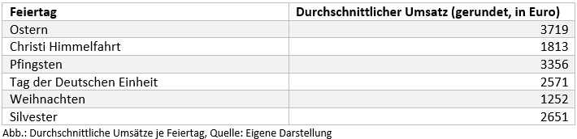
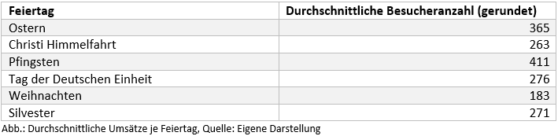

```{r echo=FALSE, message=FALSE, error=FALSE, warning=FALSE, message=FALSE}
rm(list=ls()) # Lösche alle Variablen
library(tibble)
library(tidyverse) # Datenaufbereitung und ggplot
library(lubridate) # Umgang mit Datum und Zeit
library(GGally) # Wird benötigt für die Erstellung des correlograms
library(e1071) # Wird für Support Vector Machines benötigt
```

# Management Summary

...

# 1 Allgemeine Projektinformationen

## 1.1 Ausgangslage

Dieses R Projekt ist ein Teil des Projektes „Künstliche Intelligenz in Einrichtungen der kulturellen Infrastruktur“. Das Projekt wird von der Fachhochschule Kiel zur Digitalisierung von Kulturinstitutionen und besonders zur Forschung zum Einsatz von künstlicher Intelligenz in Kulturinstitutionen im Marketing, der Verwaltung und zur Verbesserung des Angebotes durchgeführt. Gefördert wird das Vorhaben durch die Staatskanzlei des Landes Schleswig-Holstein. Zu den Kooperationspartnern zählen die schleswig-holsteinische Landesbibliothek (SHLB), das Europäische Hansemuseum Lübeck (EHM) und das Nordkolleg Rendsburg. Weitere Informationen zu dem Projekt finden Sie unter:

* https://www.fh-kiel-gmbh.de/de/leistungen/drittmittelprojekte/landesministerien-sh/ki-in-kultur.html
* https://www.schleswig-holstein.de/DE/Landesregierung/I/_startseite/Artikel2020/I/200211_CDS_Foerderbescheid-landesbibliothek.html

Ein Teilaspekt das Europäische Hansemuseum betreffend ist die Prognose der Besucherzahlen.

Die Prognose von Umsätzen (/Besucherzahlen) des [Europäischen Hansemuseums](https://www.hansemuseum.eu/) (EHM) ist bislang seitens der Institution nicht behandelt worden. Eine systematische Planung unter Einbeziehung von Mustern findet nicht statt, wenngleich das EHM daran sehr interessiert ist. 

## 1.2 Zielsetzung 
Es werden verschiedene einfache und komplexe Modelle getestet, dabei werden auch Techniken aus den Bereichen Machine Learning und Deep Learning angewendet. 

**Lösungsansatz**

Mit Hilfe von verschiedenen Daten und Einflussfaktoren sollen die Umsätze des EHM prognostiziert werden. Einbezogen werden dabei Umsatzdaten, Wetterdaten, Veranstaltungsdaten sowie weitere Einflussfaktoren wie beispielsweise die Wochentage, Feiertage, Ferientage.


## 1.3 Datenbasis

Seitens des EHM wurden Daten aus ihrem Kassensystem für die Jahre 2015 bis 2020 zur Verfügung gestellt. Das EHM arbeitet an dieser Stelle mit dem Unternehmen [Beckerbillet](https://www.beckerbillett.de/de/Museen_und_Science_Center.html) zusammen, dessen "Kompetenz sich aus der Kombination einer modernen Ticketdruckerei mit einem spezialisierten Softwarehaus und dem durchdachten Hardware-Angebot ergibt". Es stehen sowohl Umsatzdaten als auch Besucherzahlen vor.

Weiterhin wurden folgende Daten für die Analyse potentieller Einflussfaktoren recherchiert bzw. erhoben und jeweils ein Datensatz erstellt: 

* Wetterdaten
  + maximale Temperatur
  + minimale Temperatur
  + Durchschnittstemperatur
  + Niederschlag (mm)
  + Sonnenstunden
  + Windstärke (Beaufort)
* Daten zur Kieler Woche
* Daten zu Ferientagen in den Bundesländern
  + Baden-Württemberg
  + Bayern
  + Hessen
  + Niedersachsen
  + Nordrhein-Westfalen
  + Schleswig-Holstein
* Daten zu Feiertagen
  + Ostern
  + Christi Himmelfahrt
  + Pfingsten
  + Tag der Deutschen Einheit
  + Weihnachten
* Daten zu Silvester
* Daten zu den Jahreszeiten.

Im weiteren Verlauf werden all diese Datensätze zusammengefügt und dieser Datensatz wiederum um die Variablen Wochentag, Monat und Jahr ergänzt, was nicht zuletzt der Aufteilung in Trainings- und Testdatensatz dient.

# 2 Datenexploration

## 2.1 Einlesen der Daten

Im ersten Schritt müssen die Daten zunächst eingelesen werden um sie bearbeiten zu können:
```{r message=FALSE}
# mit read_csv einlesen um eine Veränderung der Datentypen (bzw. eine Faktorisierung) zu verhindern!
library(readxl)
Umsatz <- read_excel("Daten/Umsatz.xlsx")
Tickets <- read_excel("Daten/Tickets.xlsx")

```

## 2.2 Überprüfung der Datenstrukturen

* Datensatz **Beispieldaten**
```{r}
str(Umsatz)
glimpse(Umsatz)
range(Umsatz$Umsatz)
```

Der Datensatz **Umsatz** ist ein Dataframe, enthält 1747 Zeilen und 3 Variablen:

* Datum (`dttm`)
* Wochentag (`chr`)
* Umsatz (`dbl`) mit Werten zwischen 0 und 8728 €.

* Datensatz **Tickets**
```{r}
str(Tickets)
glimpse(Tickets)
range(Tickets$Tickets)
```

Der Datensatz **Tickets** enthält ebenfalls 1747 Zeilen und die Variablen Datum (`dttm`), Wochentag (`chr`) und Tickets (`dbl`) mit Werten zwischen 0 und 1108.

## 2.3 Überprüfung des Anfangs- und Endzeitpunkt der Datumsattribute in den Datensätzen
```{r}
range(Umsatz$Datum)
range(Tickets$Datum)
```

Die Daten beider Datensätze reichen vom 29.05.2015 bis 14.03.2020.

## 2.4 Überprüfung der Datensätze auf fehlende Werte

### Überprüfung auf "klassische" fehlende Werte (NA)
Zunächst einmal wird geprüft, welche klassischen fehlenden Werte (NA) in den einzelnen Datensätzen vorhanden sind:
```{r}
sum(is.na(Umsatz))   
sum(is.na(Tickets))  
```

Die Datensätze sind vollständig.

> Anmerkung: Vollständig im Sinne von es gibt keine fehlenden Werte in der Tabelle. Es gibt einen Tag, an dem das Museum nicht geöffnet hat und der dementsprechend fehlt (24.12. Heiligabend).

## 2.5 Überprüfung der Datensätze auf Ausreißer

Ein Ausreißer ist ein Wert, der außerhalb der üblichen Struktur einer Verteilung liegt. Zunächst wird in einem ersten Schritt mittels einer Visualisierung in Form von `boxplots` überprüft, ob die einzelnen Datensätze überhaupt Ausreißer enthalten.

Ein Boxplot zeigt uns den Median (dicke Linie) sowie das untere und obere Quartil (als Box). Der Abstand von unterem zu oberem Quartil (interquartile range: IQR) wird standardmäßig mit 1.5 multipliziert. Und genau über die auf diese Art ermittelte Spannweite erstrecken sich die sogenannten whiskers maximal, wobei die whiskers unten und oben an der Box ansetzen. Gibt es darüber hinaus noch Werte, die weiter außerhalb liegen, werden diese als Ausreißer durch Punkte gekennzeichnet.

Die Überprüfung wird begonnen mit dem Datensatz **Umsatz**: 

```{r}
# Überprüfung der Variable Umsatz
summary(Umsatz$Umsatz)
boxplot(Umsatz$Umsatz)
hist(Umsatz$Umsatz)

# Visualisierung
Umsatz %>% 
  dplyr::select(Umsatz) %>% 
  ggplot(aes(Umsatz)) +
  geom_density()
```

Das Attribut `Umsatz` enthält zahlreiche Ausreißer. Mit bloßem Auge ist nicht zu erkennen, wie viele Ausreißer es genau sind. Die Ausreißer werden also in einem 2. Schritt genauer betrachtet, um die genaue Anzahl der Ausreißer zu ermitteln. Statistiker haben viele Verfahren entwickelt, um auseinanderzuhalten, was man als Ausreißer bezeichnen sollte, und was nicht. 

Wir verwenden - wie bereits erwähnt - die Standardeinstellung, die aus einer Definition von John W. Tukey stammt: Sie definiert einen Ausreißer als einen Punkt, der mehr als $$1,5 * IQR$$ vom unteren bzw. oberen Quartil abweicht. Anders gesagt liegen untere Ausreißer unterhalb

$$Q_1 - 1,5 * IQR$$
und obere Ausreißer oberhalb 

$$Q_3 + 1.5 * IQR$$

Vereinfachend untersuchen wir nun die Umsatzvariable insgesamt auf Ausreißer:

```{r}
g_oben <- quantile(Umsatz$Umsatz, probs=0.75) + (1.5*IQR(Umsatz$Umsatz)) #Obere Grenze fuer Ausreißer
g_oben

Umsatz %>%
  dplyr::select(Umsatz) %>%
  filter(Umsatz > g_oben) %>%
  summarise(n = n())
```
Die obere Grenze für Ausreißer liegt demzufolge bei 4413,19€ (gerundet). Es gibt insgesamt 41 Ausreißer in der Variable `Umsatz`. 

In einem 3. Schritt betrachten wir, an welchen Daten diese Ausreißer auftreten und ob Muster erkennbar sind (z. B. überproportional hohe Umsätze an Ostern oder anderen Feiertagen, in den Ferien, während der Kieler Woche o. Ä.):

```{r}
Umsatz %>%
  dplyr::select(Datum, Umsatz) %>%
  filter(Umsatz > g_oben) 
```

Eine erste Auswertung der genaueren Betrachtung der Ausreißer ergibt:

* Die 10 höchsten Ausreißer gab es im Jahr 2015, davon 8 Ende Juli und 2 im August. Eventuell hat an diesen Tagen eine Sonderaktion / Eröffnungsrabattierung stattgefunden. 
* Mit Abstand der höchste Umsatz wurde erzielt am 20.07.2015 mit einem Wert von 8728 Euro.
* Die Ausreißer Nr. 11 bis 20 liegen allesamt in 2016, wobei die Verteilung über das Jahr deutlich von den Ausreißern im Jahr 2015 abweicht:
  + 2 Ausreißer fallen auf Anfang und Ende Januar, also den Beginn des Jahres.
  + Der nächste Ausreißer fällt auf das Osterwochende, den "Karsamstag" (26.03.2016)
  + Einen weiteren Ausreißer gab es am Pfingstmontag des Jahres (16.05.)
  + Die verbliebenen 6 Ausreißer verteilen sich gleichmäßig auf die Monate Juni, August, September und Oktober, ohne dass eine genauere Erklärung hierfür auf den ersten Blick plausibel erscheint. 
* Die Ausreißer 21 bis 30 fallen allesamt in das Jahr 2017:
  + Wieder ist der Umsatz an Ostern stark; im Jahr 2017 fallen zwei Ausreißer auf dieses Wochenende, nämlich den Ostersonntag (16.04.) und den Ostermontag (17.04)
  + Auch Pfingsten ist erneut bei den Ausreißern dabei, wobei dieser Ausreißer auch in diesem Jahr wieder auf den Pfingsmontag fällt.
  + Als weiterer "Feiertags-Ausreißer" lässt sich der Tag der deutschen Einheit ausmachen.
  + Die verbleibenden 6 Ausreißer verteilen sich wiederum auf die Monate Juli, August und September, ohne dass ein exakter plausibler Grund angegeben werden kann. Eine Überlegung wäre, dass die Sommerferien in SH und anderen Bundesländern hier einen Einfluss hatten.
* Für die Jahre 2018 und 2019 lassen sich 5 bzw. 6 Ausreißer ausmachen:
  + In 2018 fallen die Ausreißer auf Feiertage (Ostersonntag, Ostermontag und Tag der Deutschen Einheit), ein Ausreißer liegt im August und der verbliebene fällt auf den 30.12.2018.
  + Im Jahr 2019 lassen sich bis auf eine Häufung der Ausreißer im monat August keine Muster ausmachen. Eine mögliche Begründung wäre Ferienzeit.
  
**Fazit**

Einen besonderen Stellenwert scheinen die Feiertage Ostern und Pfingsten zu haben. Auch am Tag der Deutschen Einheit scheinen die Umsätze generell tendenziell hoch zu sein. Ansonsten sieht man einen relativ klaren "Sommer-Effekt". 

Da die meisten Ausreißer planbar und plausibel erscheinen, werden diese zunächst in der Auswertung belassen. Zu überlegen ist jedoch, ob der "Eröffnungseffekt" nicht eliminiert werden sollte, da dieser schon starken Einfluss übt.


\


Die Überprüfung wird weitergeführt mit dem Datensatz **Tickets**: 

```{r}
# Überprüfung der Variable Umsatz
summary(Tickets$Tickets)
boxplot(Tickets$Tickets)
hist(Tickets$Tickets)

# Visualisierung
Tickets %>% 
  dplyr::select(Tickets) %>% 
  ggplot(aes(Tickets)) +
  geom_density()
```
Das Attribut `Tickets` enthält erwartungsgemäß ebenfalls zahlreiche Ausreißer. Mit bloßem Auge ist nicht zu erkennen, wie viele Ausreißer es genau sind. Die Ausreißer werden also in einem 2. Schritt genauer betrachtet, um die genaue Anzahl der Ausreißer zu ermitteln. Statistiker haben viele Verfahren entwickelt, um auseinanderzuhalten, was man als Ausreißer bezeichnen sollte, und was nicht. 

Wir verwenden - wie bereits erwähnt - die Standardeinstellung, die aus einer Definition von John W. Tukey stammt: Sie definiert einen Ausreißer als einen Punkt, der mehr als $$1,5 * IQR$$ vom unteren bzw. oberen Quartil abweicht. Anders gesagt liegen untere Ausreißer unterhalb

$$Q_1 - 1,5 * IQR$$
und obere Ausreißer oberhalb 

$$Q_3 + 1.5 * IQR$$

Vereinfachend untersuchen wir nun die Umsatzvariable insgesamt auf Ausreißer:

```{r}
g_oben <- (quantile(Tickets$Tickets, probs=0.75) + (1.5*IQR(Tickets$Tickets))) #Obere Grenze fuer Ausreißer
g_oben

Tickets %>%
  dplyr::select(Tickets) %>%
  filter(Tickets > g_oben) %>%
  summarise(n = n())
```
Die obere Grenze für Ausreißer liegt demzufolge bei 520 Tickets. Es gibt insgesamt 46 Ausreißer in der Variable `Tickets`, also 5 mehr als bei der Variable `Umsatz`. 

In einem 3. Schritt betrachten wir, an welchen Daten diese Ausreißer auftreten und ob Muster erkennbar sind (z. B. überproportional hohe Umsätze an Ostern oder anderen Feiertagen, in den Ferien, während der Kieler Woche o. Ä.):

```{r}
Tickets %>%
  dplyr::select(Datum, Tickets) %>%
  filter(Tickets > g_oben) 
```

Eine erste Auswertung der genaueren Betrachtung der Ausreißer ergibt:

* Die 9 (Umsatz: 10) höchsten Ausreißer gab es im Jahr 2015, davon 8 Ende Juli und einen im August. Eventuell hat an diesen Tagen eine Sonderaktion / Eröffnungsrabattierung stattgefunden. Zudem ist generell auf einen "Neueröffnungseffekt" zu schließen.
* Die Ausreißer Nr. 10 bis 19 liegen allesamt in 2016, wobei die Verteilung über das Jahr von den Ausreißern im Jahr 2015 abweicht:
  + 2 Ausreißer fallen auf den Januar, also den Beginn des Jahres.
  + Der nächste Ausreißer fällt auf den "Karfreitag" (25.03.2016, *(Umsatzausreißer an "Karsamstag")*
  + Einen weiteren Ausreißer gab es am Pfingstsonntag des Jahres 2016 (15.05., *Umsatzausreißer: Ostermontag des Jahres (16.05.)*)
  + Drei Ausreißer fallen in den August, einer in den Oktober. 
* Die Ausreißer 20 bis 28 fallen allesamt in das Jahr 2017:
  + Wieder ist der Umsatz am Osterwochende, genauer an Karsamstag, stark. *(Umsatzausreißer: "Karsamstag" (15.04.) und Ostersonntag (16.04.))*
  + Auch Pfingsten ist erneut bei den Ausreißern dabei, wobei der Ticket-Ausreißer wieder auf den Pfingstsonntag fällt (04.06., *Umsatzausreißer: "Pfingstmontag" (05.06)*)
  + Weitere Ticketausreißer liegen im Juli, August und oktober.
* Die Ausreißer 29 bis 35 fallen in das Jahr 2018:
  + Der erste Ausreißer dieses Jahres fällt auf den Karsamstag (31.03.), der zweite auf den Ostersonntag (01.04.), das Osterwochenende ist also abermals stark vertreten.
  + Die verbleibenden Ausreißer liegen gleichmäßig verteilt in den Monaten Juli, August, September, Oktober und Dezember, wobei hier kein klares Muster zu erkennen ist.
* Die verbleibenden 11 Ausreißer liegen im Jahr 2019:
  + Der ersten drei Ausreißer fallen in diesem Jahr auf den 15.03., den 22.03. und den 29.03., was auf den ersten Blick lediglich auf den Wochentag (Freitag) zurückzuführen ist. Eine Möglichkeit wäre, sich das Wetter an diesen Tagen noch einmal genauer anzuschauen oder zu prüfen, ob eine größere Veranstaltung in diesen Tagen in Lübeck stattgefunden hat.
  + Der nächste Ausreißer fällt auf den 19.05., ein Sonntag.
  + Der nächste Ausreißer, der Montag, 22.07., erscheint bezüglich des Wochentags einerseits ungewöhnlich. Andererseits liegt der Tag in der Sommerferienzeit. Falls das Wetter an diesem Tag schlecht war, könnte das eine gewisse Erklärung sein.
  + Die verbleibenden Ausreißer liegen in den Monaten Juli und August.
  
  
**Fazit**

Einen besonderen Einfluss scheint es abermals bei den Feiertagen rund um Ostern und Pfingsten zu geben, wenngleich der Effekt teilweise hinsichtlich des konkreten Tages anders ist als beim Umsatz. Weiterhin sieht man wie bei der Analyse der Umsatzdaten einen "Sommereffekt".

# 3 Datenaufbereitung, Erstellung von Rohdatensatz und Analysedatensätzen

## 3.1 Vereinigung der Datensätze

Maßgeblich ist in diesem Projekt der Zeitraum, in dem Umsatzdaten bzw. Besucherzahlen seitens des Hansemuseums vorliegen. Diese Daten liegen für den Zeitraum 29.05.2015 bis 14.03.2020 vor (vgl. Kap. 2.3.). Über`left_join`-Operationen werden nun weitere erhobene Daten an den Umsatzdatensatz sowie den Ticketdatensatz angefügt.

```{r}
# Importieren aller weiteren vorliegenden Daten:
library(readr)
ChristiHimmelfahrt <- read_csv2("Daten/ChristiHimmelfahrt.csv")
ChristiHimmelfahrt_ext <- read_excel("Daten/ChristiHimmelfahrt_ext.xlsx")
Feiertage <- read_csv2("Daten/Feiertage.csv")
Fruehling <- read_csv2("Daten/Fruehling.csv")
Herbst <- read_csv2("Daten/Herbst.csv")
Jahreszeiten <- read_csv2("Daten/Jahreszeiten.csv")
KiWo <- read_csv("Daten/KiWo.csv")
Ostern <- read_csv2("Daten/Ostern.csv")
Ostern_ext <- read_csv2("Daten/Ostern_extended.csv")
Pfingsten <- read_csv2("Daten/Pfingsten.csv")
Pfingsten_ext <- read_csv2("Daten/Pfingsten_ext.csv")
Silvester <- read_csv2("Daten/Silvester.csv")
Silvester_ext <- read_csv2("Daten/Silvester_ext.csv")
SoFe_BW <- read_csv2("Daten/SoFe_BW.csv")
SoFe_BY <- read_csv2("Daten/SoFe_BY.csv")
SoFe_HE <- read_csv2("Daten/SoFe_HE.csv")
SoFe_NDS <- read_csv2("Daten/SoFe_NDS.csv")
SoFe_NRW <- read_csv2("Daten/SoFe_NRW.csv")
SoFe_SH <- read_csv2("Daten/SoFe_SH.csv")
Sommer <- read_csv2("Daten/Sommer.csv")
TDE <- read_csv2("Daten/TdDE.csv")
Weihnachten <- read_csv2("Daten/Weihnachten.csv")
Winter <- read_csv2("Daten/Winter.csv")
Wetter <- read_csv2("Daten/Wetterdaten.csv")
```
 Da die Wetterdaten 

```{r}
# Um eine Doppelung der Wochentage zu vermeiden, wird sie aus dem Datensatz "Tickets" entfernt

Tickets2 <- Tickets %>%
  select(Tickets, Datum)

# Vereinigung der Datensätze
df_complete <- left_join(Umsatz, Tickets2, by = "Datum")
df_complete <- left_join(df_complete, ChristiHimmelfahrt, by = "Datum")
df_complete <- left_join(df_complete, ChristiHimmelfahrt_ext, by = "Datum")
df_complete <- left_join(df_complete, Feiertage, by = "Datum")
df_complete <- left_join(df_complete, Fruehling, by = "Datum")
df_complete <- left_join(df_complete, Herbst, by = "Datum")
df_complete <- left_join(df_complete, Jahreszeiten, by = "Datum")
df_complete <- left_join(df_complete, KiWo, by = "Datum")
df_complete <- left_join(df_complete, Ostern, by = "Datum")
df_complete <- left_join(df_complete, Ostern_ext, by = "Datum")
df_complete <- left_join(df_complete, Pfingsten, by = "Datum")
df_complete <- left_join(df_complete, Pfingsten_ext, by = "Datum")
df_complete <- left_join(df_complete, Silvester, by = "Datum")
df_complete <- left_join(df_complete, Silvester_ext, by = "Datum")
df_complete <- left_join(df_complete, SoFe_BW, by = "Datum")
df_complete <- left_join(df_complete, SoFe_BY, by = "Datum")
df_complete <- left_join(df_complete, SoFe_HE, by = "Datum")
df_complete <- left_join(df_complete, SoFe_NDS, by = "Datum")
df_complete <- left_join(df_complete, SoFe_NRW, by = "Datum")
df_complete <- left_join(df_complete, SoFe_SH, by = "Datum")
df_complete <- left_join(df_complete, Sommer, by = "Datum")
df_complete <- left_join(df_complete, TDE, by = "Datum")
df_complete <- left_join(df_complete, Weihnachten, by = "Datum")
df_complete <- left_join(df_complete, Winter, by = "Datum")
df_complete <- left_join(df_complete, Wetter, by = "Datum")
head(df_complete)
```

## 3.6 Umgang mit fehlenden Werten

Die Datensätze enthalten "naturimmanent" viele fehlende Werte, die beim Import automatisch erzeugt wurden. Beispielsweise enthält der Datensatz **KiWo** nur 72 Datensätze: für jedes Jahr wurde den Tagen, an denen die KiWo stattfindet, eine 1 zugeordnet. Diese Werte wurden Bei der Vereinigung der Datensätze entsprechend korrekt gemerged. Für alle anderen Daten, an denen keine KiWo ist, wurde bei der Vereinigung ein fehlender Wert (NA) automatisch erzeugt. Diese fehlenden Werte sind für die weitergehenden Analysen durch "0" zu ersetzen, sodass eine binäre (0/1)-Variable entsteht. Genauso wird bei den anderen Variablen, die auf Basis der eigens recherchierten Daten erstellt wurden, vorgegangen:

```{r}

df_complete <- df_complete %>%
  mutate(ChristiHimmelfahrt = replace_na(ChristiHimmelfahrt, 0)) %>%
  mutate(ChristiHimmelfahrt_ext = replace_na(ChristiHimmelfahrt_ext, 0)) %>%
  mutate(Feiertag = replace_na(Feiertag, 0)) %>%
  mutate(Fruehling = replace_na(Fruehling, 0)) %>%
  mutate(Herbst = replace_na(Herbst, 0)) %>%
  mutate(KielerWoche = replace_na(KielerWoche, 0)) %>%
  mutate(Ostern = replace_na(Ostern, 0)) %>%
  mutate(Ostern_ext = replace_na(Ostern_ext, 0)) %>%
  mutate(Pfingsten = replace_na(Pfingsten, 0)) %>%
  mutate(Pfingsten_ext = replace_na(Pfingsten_ext, 0)) %>%
  mutate(Silvester = replace_na(Silvester, 0)) %>%
  mutate(Silvester_ext = replace_na(Silvester_ext, 0)) %>%
  mutate(SommerferienBaW = replace_na(SommerferienBaW, 0)) %>%
  mutate(SommerferienBY = replace_na(SommerferienBY, 0)) %>%
  mutate(SommerferienHE = replace_na(SommerferienHE, 0)) %>%
  mutate(SommerferienNDS = replace_na(SommerferienNDS, 0)) %>%
  mutate(SommerferienNRW = replace_na(SommerferienNRW, 0)) %>%
  mutate(SommerferienSH = replace_na(SommerferienSH, 0)) %>%
  mutate(Sommer = replace_na(Sommer, 0)) %>%
  mutate(TDE = replace_na(TDE, 0)) %>%
  mutate(Weihnachten = replace_na(Weihnachten, 0)) %>%
  mutate(Winter = replace_na(Winter, 0))

head(df_complete)
```

## 3.7 Ergänzung um die Variablen Wochentag, Monat und Jahr

Ein wesentlicher Einflussfaktor für die Prognose der Besucherzahlen wird der Wochentag sein. Diese Spalten werden in einem weiteren Schritt hinzugefügt. Es wird also der Wochentag als eigene Spalte hinzugefügt: Sonntag (1), Montag (2), ... , Samstag (7); und für die spätere Aufteilung der Daten in Training- und Testset wird das Jahr als weitere Spalte ergänzt und der Monat.

Damit die Wochentage adäquat in die späteren Modelle einfließen können, wird der Wochentag überdies als `character`-Variable abgespeichert.

Bsp.:
Soll der `Wochentag` ein lineare Regressionsmodell aufgenommen werden, würde eine numerische Variable zu falschen Ergebnissen führen (wird der Wochentag um eins erhöht, erhöht sich der Umsatz um xy%). Bei einer `character`-Variable würde diese "dummyfiziert". Ein Wochentag würde als Referenztag abgebildet werden und die anderen 6 Wochentage in Form von Dummyvariablen.

```{r}
df_complete <- df_complete %>% mutate(Wochentag = wday(Datum))
df_complete <- df_complete %>% mutate(Jahr = year(Datum))
df_complete <- df_complete %>% mutate(Monat = month(Datum))

# Wochentag als character-Variable
df_complete <- df_complete %>% mutate(Wochentag_c = recode(Wochentag, "1" = "Sonntag", "2" = "Montag", "3" = "Dienstag", "4" = "Mittwoch", "5" = "Donnerstag", "6" = "Freitag", "7" = "Samstag"))

# Monat als character-Variable
df_complete <- df_complete %>% mutate(Monat_c = recode(Monat, "1" = "Januar", "2" = "Februar", "3" = "März", "4" = "April", "5" = "Mai", "6" = "Juni", "7" = "Juli", "8" = "August", "9" = "September", "10" = "Oktober", "11" = "November", "12" = "Dezember"))
```

Es besteht die Möglichkeit, dass es unterhalb der Wochentag keine großen Unterschiede gibt, wohl aber zwischen Wochentagen und Wochenendtagen. Insofern wird eine weitere Variable `Wochenende` erstellt, die nur die beiden Ausprägungen 1 = "Wochenende" und 0 = "kein Wochenende" ("Wochentag") hat.

```{r}
df_complete <- df_complete %>% mutate(Wochenende = recode(Wochentag, "1" = "1", "2" = "0", "3" = "0", "4" = "0", "5" = "0", "6" = "0", "7" = "1"))

df_complete <- df_complete %>% mutate(Wochenende = as.numeric(Wochenende))

library(writexl)
write.csv(df_complete, "Daten/Datensatz_komplett.csv")
write_xlsx(df_complete, "Daten/Datensatz_komplett.xlsx")
```

# 4 Deskriptive Analysen

## 4.1 Analyse des Umsatzes

### Die 20 umsatzstärksten Tage im betrachteten Zeitraum (Gesamtumsatz pro Tag)

```{r}
Umsatz %>%
  dplyr::select(Datum, Umsatz) %>%
  group_by(Datum) %>%
  summarise(Gesamtumsatz = sum(Umsatz)) %>%
  arrange(desc(Gesamtumsatz)) %>%
  top_n(20)
```

### Die 20 besucherstärksten Tage im betrachteten Zeitraum (Gesamtumsatz pro Tag)


```{r}
Tickets %>%
  dplyr::select(Datum, Tickets) %>%
  group_by(Datum) %>%
  summarise(Besucheranzahl = sum(Tickets)) %>%
  arrange(desc(Besucheranzahl)) %>%
  top_n(20)
```

### Gesamtumsatz und Umsatz je Wochentag

Zunächst wird der Umsatz je Wochentag in den Daten untersucht. Als Basis verwenden wir die zunächst den vollständigen Datensatz `df_complete`.

```{r}
df_complete %>% summarise(Umsatz_sum = sum(Umsatz))
df_complete %>% group_by(Wochentag_c) %>% summarise(Umsatz_sum = sum(Umsatz)) %>% arrange(desc(Umsatz_sum))
df_complete %>% group_by(Wochenende) %>% summarise(Umsatz_sum = sum(Umsatz)) %>% arrange(desc(Umsatz_sum))
df_complete %>% group_by(Wochentag_c) %>% summarise(Umsatz_mean = mean(Umsatz)) %>% arrange(desc(Umsatz_mean))
df_complete %>% group_by(Wochenende) %>% summarise(Umsatz_mean = mean(Umsatz)) %>% arrange(desc(Umsatz_mean))
```

```{r}
library(viridis)

# Visualisierung der Umsätze je Wochentag
Umsatz <- Umsatz %>% 
  group_by(Wochentag) %>% 
  mutate(Umsatz_sum = sum(Umsatz)) %>% 
  mutate(Umsatz_mean = mean(Umsatz))

Umsatz2 <- Umsatz %>%
  select(Wochentag, Umsatz_sum) %>%
  distinct(Wochentag, Umsatz_sum)

Umsatz2 %>% 
  arrange(-Umsatz_sum) %>% 
  ggplot() + 
  aes(x = reorder(Wochentag, -Umsatz_sum), y = Umsatz_sum, fill = Umsatz_sum) +
  geom_col() +
  scale_fill_viridis(direction = -1) +
  xlab("Wochentag") + ylab("Kumulierter Umsatz") + 
  theme_classic() +
  ggtitle("Kumulierter Umsatz je Wochentag (gesamter Zeitraum 2015 - 2020)")
```


```{r}
Umsatz2 <- Umsatz %>%
  select(Wochentag, Umsatz_mean) %>%
  distinct(Wochentag, Umsatz_mean)

Umsatz2 %>% 
  arrange(-Umsatz_mean) %>% 
  ggplot() + 
  aes(x = reorder(Wochentag, -Umsatz_mean), y = Umsatz_mean, fill = Umsatz_mean) +
  geom_col() +
  scale_fill_viridis(direction = -1) +
  xlab("Wochentag") + ylab("Durchschnittlicher Umsatz") + 
  theme_classic() +
  ggtitle("Durchschnittlicher Umsatz je Wochentag")

```
* In dem betrachteten Zeitraum hat das EHM insgesamt einen Umsatz in Höhe von 3.152.010 Euro generiert.
* Die umsatzstärksten Wochentage im gesamten betrachteten Zeitraum sind Sonntag (601.301 Euro) und Montag (509.619 Euro), der umsatzschwächste Tag ist Dienstag (336.145 Euro); die anderen Wochentage unterscheiden sich nur marginal, die Umsätze schwanken hier zwischen 410.000 - 440.000 Euro.
* Der durchschnittliche Tagesumsatz an einem Sonntag beträgt 2414 Euro, an einem Montag 2046 Euro, der an Dienstagen 1349 Euro. 
* Summiert sind die Umsätze der Wochentage doppelt so hoch wie am Wochenende, mit anderen Worten wurden 2/3 der Umsätze an Wochentagen erzielt, 1/3 an Wochenendtagen. Berücksichtigt man, dass es in Summe 2.5 mal so viele Wochentage wie Wochenendtage im betrachteten Zeitraum gab, ergibt sich ein etwas anderes Bild: An den Wochenendtagen wurde im Schnitt ein Umsatz von 2089 Euro erzielt, an den Wochentagen 1690 Euro.

Nicht unberücksichtigt bleiben sollte, dass manche Feiertage immer auf den Montag fallen (Ostermontag, Pfingstmontag) und manche jahresabhängig auf einen Montag fallen können und dies auch einen gewissen Einfluss haben könnte. In einem nächsten Schritt werden insofern die durchschnittlichen Umsätze an den Feiertagen betrachtet.

### Gesamtbesucheranzahl und Besucheranzahl je Wochentag

Zunächst wird die Besucheranzahl je Wochentag in den Daten untersucht. Als Basis verwenden wir die zunächst den vollständigen Datensatz `df_complete`.

```{r}
df_complete %>% summarise(Besucheranzahl_ges = sum(Tickets))
df_complete %>% group_by(Wochentag_c) %>% summarise(Besucheranzahl_ges = sum(Tickets)) %>% arrange(desc(Besucheranzahl_ges))
df_complete %>% group_by(Wochenende) %>% summarise(Besucheranzahl_ges = sum(Tickets)) %>% arrange(desc(Besucheranzahl_ges))
df_complete %>% group_by(Wochentag_c) %>% summarise(Besucheranzahl_Durchschnitt = mean(Tickets)) %>% arrange(desc(Besucheranzahl_Durchschnitt))
df_complete %>% group_by(Wochenende) %>% summarise(Besucheranzahl_Durchschnitt = mean(Tickets)) %>% arrange(desc(Besucheranzahl_Durchschnitt))
```

* Im betrachteten Zeitraum haben 374.231 Menschen das EHM besucht.
* Die besucherstärksten Wochentage im gesamten betrachteten Zeitraum sind Samstag (66.958 Besucher) und Sonntag (60.511 Besucher), der "besucherärmste" Tag ist Montag (40.995 Besucher); die anderen Wochentage unterscheiden sich nur unwesentlich. Die Besucherzahlen schwanken hier zwischen 50.478 - 52.899.
* Die Anzahl der durchschnittlichen Besucher pro Wochentag beträgt an einem Samstag 268, an einem Sonntag 243, der an Montagen 165. 
* Kumuliert man die Besucherzahlen der Wochentage, so leigen diese ~ 30% höher als an den Wochenendtagen. Der Unterschied zwischen Wochentagen und Wochenendtagen fällt mit Blick auf die Anzahl der Besucher insofern geringer aus als beim Umsatz. An den Wochentagen haben 56% aller Besucher das Hansemuseum besucht, an den Wochenendtagen entsprechend 44%.

```{r}
library(viridis)

# Visualisierung der Umsätze je Wochentag
Tickets <- Tickets %>% 
  group_by(Wochentag) %>% 
  mutate(Besucheranzahl_ges = sum(Tickets)) %>% 
  mutate(Besucheranzahl_Durchschnitt = mean(Tickets))

Tickets2 <- Tickets %>%
  select(Wochentag, Besucheranzahl_ges) %>%
  distinct(Wochentag, Besucheranzahl_ges)

Tickets2 %>% 
  arrange(-Besucheranzahl_ges) %>% 
  ggplot() + 
  aes(x = reorder(Wochentag, -Besucheranzahl_ges), y = Besucheranzahl_ges, fill = Besucheranzahl_ges) +
  geom_col() +
  scale_fill_viridis(direction = -1) +
  xlab("Wochentag") + ylab("Kumulierte Besucherzahlen") + 
  theme_classic() +
  ggtitle("Kumulierte Besucherzahlen je Wochentag (Zeitraum 2015 - 2020)")
```


```{r}
Tickets3 <- Tickets %>%
  select(Wochentag, Besucheranzahl_Durchschnitt) %>%
  distinct(Wochentag, Besucheranzahl_Durchschnitt)

Tickets3 %>% 
  arrange(-Besucheranzahl_Durchschnitt) %>% 
  ggplot() + 
  aes(x = reorder(Wochentag, -Besucheranzahl_Durchschnitt), y = Besucheranzahl_Durchschnitt, fill = Besucheranzahl_Durchschnitt) +
  geom_col() +
  scale_fill_viridis(direction = -1) +
  xlab("Wochentag") + ylab("Durchschnittliche Besucheranzahl") + 
  theme_classic() +
  ggtitle("Durchschnittliche Besucheranzahl je Wochentag")

```

### Durchschnittlicher Umsatz und durchschnittliche Besucheranzahl je Feiertag

Da zu vermuten ist, dass Feiertage einen starken Effekt auf den Umsatz haben könnten, wird nun der Umsatz je Feiertag in den Daten untersucht. Als Basis verwenden wir wieder den vollständigen Datensatz `df_complete`.

```{r}
df_complete %>% filter(Ostern == 1) %>% summarise(Umsatz_mean = mean(Umsatz)) 
df_complete %>% filter(ChristiHimmelfahrt == 1) %>% summarise(Umsatz_mean = mean(Umsatz)) 
df_complete %>% filter(Pfingsten == 1) %>% summarise(Umsatz_mean = mean(Umsatz)) 
df_complete %>% filter(TDE == 1) %>% summarise(Umsatz_mean = mean(Umsatz)) 
df_complete %>% filter(Weihnachten == 1) %>% summarise(Umsatz_mean = mean(Umsatz)) 
df_complete %>% filter(Silvester == 1) %>% summarise(Umsatz_mean = mean(Umsatz)) 
```



Verglichen mit den Umsätzen je Wochentag und hierbei insbesondere mit dem umsatzstärksten Sonntag (Umsatz im Durchschnitt 2414 Euro) werden an einzelnen Feiertagen außergewöhnlich hohe Umsätze erzielt. Besonders stark hervor treten Ostern und Pfingsten, doch auch die Umsätze am Tag der Deutschen Einheit und Silvester sind überdurchschnittlich stark. Nicht so erfolgreich schneiden Christi Himmelfahrt und Weihnachten ab. An Weihnachten sind die Umsätze sogar niedriger als am umsatzschwächsten Wochentag Dienstag. Es wäre hier zu überlegen, ob eine Öffnung an Weihnachten wenigstens kostendeckend ist.

```{r}
df_complete %>% filter(Ostern == 1) %>% summarise(Besucheranzahl_Durchschnitt = mean(Tickets)) 
df_complete %>% filter(ChristiHimmelfahrt == 1) %>% summarise(Besucheranzahl_Durchschnitt = mean(Tickets)) 
df_complete %>% filter(Pfingsten == 1) %>% summarise(Besucheranzahl_Durchschnitt = mean(Tickets)) 
df_complete %>% filter(TDE == 1) %>% summarise(Besucheranzahl_Durchschnitt = mean(Tickets)) 
df_complete %>% filter(Weihnachten == 1) %>% summarise(Besucheranzahl_Durchschnitt = mean(Tickets)) 
df_complete %>% filter(Silvester == 1) %>% summarise(Besucheranzahl_Durchschnitt = mean(Tickets)) 
```



### Umsatz und Besucherzahlen je Monat

In einem weiteren Schritt werden die Umsätze je Monat untersucht, um eine differenziertere Verteilung der Umsätze im Jahresverlauf zu erhalten. 

```{r}
df_complete %>% group_by(Monat_c) %>% summarise(Umsatz_sum = sum(Umsatz)) %>% arrange(desc(Umsatz_sum))
df_complete %>% group_by(Monat_c) %>% summarise(Umsatz_mean = mean(Umsatz)) %>% arrange(desc(Umsatz_mean))
```

* Es gibt erkennbare Unterschiede zwischen den Umsätzen pro Monat:
  + Die Sommermonate Juli und August sind die umsatzstärksten. Eine mögliche Begründung könnte sein, dass in den Sommermonaten sehr viele Touristen (im Verhältnis zu den Einwohner) in Schleswig-Holstein sind. Dies wäre zu überprüfen.
  + Auch einige Frühlingsmonate schneiden gut ab: Mai, April, März. Vielleicht ist dies unter anderem auch auf die Feiertage Ostern, Christi Himmelfahrt und Pfingsten sowie auf die umgebenden Brückentage zurückzuführen. 
  + Halb Sommer, halb Herbst, teilweise in den Sommerferien liegend, schneidet auch der September gut ab.
  + Schlechter sind die Umsätze in den Herbst- und Wintermonaten, was bei der vorangegangenen Analyse schon sichtbar wurde. Im Juli beispielsweise sind die Umsätze fast doppelt so hoch wie im November, der den umsatzschwächsten Monat darstellt.

Als nächstes werden die Besucherzahlen je Monat betrachtet, um auch hier einen differenzierteren Überblick zu erhalten. 

```{r}
df_complete %>% group_by(Monat_c) %>% summarise(Besucherzahl_ges = sum(Tickets)) %>% arrange(desc(Besucherzahl_ges))
df_complete %>% group_by(Monat_c) %>% summarise(Besucherzahl_Durchschnitt = mean(Tickets)) %>% arrange(desc(Besucherzahl_Durchschnitt))
```
* Es gibt erkennbare Unterschiede zwischen den Besucherzahlen pro Monat:
  + Die Sommermonate Juli und August sind die Monate, in denen am meisten Besucher im EHM zu verzeichnen sind. Eine mögliche Begründung könnte auch hier sein, dass in den Sommermonaten sehr viele Touristen (im Verhältnis zu den Einwohner) in Schleswig-Holstein sind. Dies wäre zu überprüfen.
  + Mit dem oktober landet ein Herbstmonat auf dem dritten Platz, jedoch mit deutlichem Abstand zu den genannten Sommermonaten.
  + Die besucherärmsten Monate sind Januar und November. Im November kommen 35% weniger Besucher als im Juli.


### Umsatz und Besucheranzahl je Jahreszeit

Gespräche mit Mitarbeitern des Hansemuseums lassen darauf schließen, dass die Jahreszeiten einen Einfluss auf die Höhe des Umsatzes haben. Insofern wird auch für diese Variable eine detailliertere Betrachtung durchgeführt.

```{r}
df_complete %>% group_by(Jahreszeit) %>% summarise(Umsatz_sum = sum(Umsatz)) %>% arrange(desc(Umsatz_sum))
df_complete %>% group_by(Jahreszeit) %>% summarise(Umsatz_mean = mean(Umsatz)) %>% arrange(desc(Umsatz_mean))
```
Im Sommer und im Frühling werden deutlich höhere Umsätze generiert als in den Jahreszeiten Herbst und Winter. Im Sommer liegt der Umsatz durchschnittlich 40% höher verglichen mit Herbst und Winter, gegenüber dem Frühling ist der Umsatz im Sommer um 10% höher. Es ist insofern ein klarer Effekt der Jahreszeiten sichtbar. 


```{r}
df_complete %>% group_by(Jahreszeit) %>% summarise(Besucheranzahl_ges = sum(Tickets)) %>% arrange(desc(Besucheranzahl_ges))
df_complete %>% group_by(Jahreszeit) %>% summarise(Besucheranzahl_Durchschnitt = mean(Tickets)) %>% arrange(desc(Besucheranzahl_Durchschnitt))
```

Im Sommer werden deutlich höhere Besucherzahlen erreicht als in den übrigen Jahreszeiten. Der Frühling ist zwar auch (deutlich) stärker als Herbst und Winter, aber der Unterschied ist geringer als beim Umsatz. Im Sommer liegen die Besucherzahlen durchschnittlich knapp bzw. gut 50% höher verglichen mit Winter und Herbst und Winter, gegenüber dem Frühling ist der Umsatz im Sommer um 35% höher. Auch was die Besucherzahlen angeht, ist also ein klarer Effekt der Jahreszeiten sichtbar. 

## 4.3 Umsatz und Besucherzahlen im Zeitverlauf

Von Interesse ist nun die Entwicklung der Umsätze im Zeitverlauf.Es soll geprüft werden, ob eine Trendentwicklung zu beobachten ist und ob es strukturelle Brüche in den Zeitreihen gibt. Wir betrachten dafür zunächst die Entwicklung des Gesamtumsatzes pro Jahr. Als Datenbasis verwenden wir abermals den kompletten datensatz `df_complete`.

```{r}
umsatz_jahr <- df_complete %>% group_by(Jahr) %>% summarise(Umsatz=sum(Umsatz))
umsatz_jahr
```

Zu beobachten ist, dass der Jahresumsatz von 2014 bis 2016 sukzessive sinkt und dann 2017 stabil bleibt. Um diese Beobachtung besser zu verstehen, betrachten wir den Umsatz nun auf Monatsebene, immer noch aggregiert über alle Warengruppen.

```{r}
umsatz_jahr_monat <- df_complete %>% mutate(Jahr=as.character(Jahr)) %>% group_by(Jahr, Monat) %>% summarise(Umsatz=sum(Umsatz)) # Variable Jahr in character umgewandelt, damit im folgenden Plot eine diskrete Farbskala in der Legende gezeigt werden kann

p_umsatz_jahr_monat <- ggplot(data = umsatz_jahr_monat, aes(x = Monat, y = Umsatz)) +
  geom_point(aes(color = Jahr), size = 3, alpha = 0.5) +
  geom_line(aes(group = Jahr, color = Jahr)) + 
  scale_x_discrete(limits=c("1","2","3","4","5","6","7","8","9","10","11","12")) +
  xlab("Monat") + ylab("Umsatz") + 
  labs(color = "Jahr") +
  theme_classic() +
  ggtitle("Gesamtumsatz je Monat")

p_umsatz_jahr_monat
```

Beobachtungen:

* Die Jahre 2016 bis 2019 sind weitestgehend ähnlich im Jahresverlauf. 
* Die Umsätze im Jahr 2015 erscheinen ungewöhnlich. Während in der Eröffnungsphase (Eröffnung 27.05.2015) im Mai / Juni fast keine Umsätze zu verzeichnen sind, schießen sie im Juli buchstäblich durch die Decke, um dann wieder schlagartig abzusinken. In den monaten September bis Dezember sind nahezu keinerlei Umsätze zu verzeichnen, was unrealistisch erscheint. Hier ist zum einen Rücksprache mit dem hansemuseum zu halten sowie zu überlegen, ob diese Daten nicht aus den weiteren Analysen ausgeschlossen werden sollten.
* Der Verlauf für 2020 ist zu Beginn, d. h. im Januar und Februar, ähnlich zu den Umsätzen in den Vorjahren. Im März sinken die Umsatzzahlen rapide, was sehr wahrscheinlich auf den Beginn der sogenannten Coronakrise und damit einhergehenden Schließungen von öffentlichen Einrichtungen zurückzuführen ist. Da das Jahr 2020 ein sehr ungewöhnliches ist, ist zu überlegen, ob diese Daten nicht ebenfalls von der Analyse ausgeschlossen werden sollten.

**Fazit**

Aufgrund der Datenlage wäre es anzuraten, die Daten aus den Jahren 2016 - 2018 als Trainingsdaten und die Daten aus dem Jahr 2019 als Testdaten zu nutzen.

```{r}
Besucher_jahr <- df_complete %>% group_by(Jahr) %>% summarise(Besucher_Jahr = sum(Tickets))
Besucher_jahr
```

Zu beobachten ist, dass der Jahresumsatz von 2014 bis 2016 sukzessive sinkt und dann 2017 stabil bleibt. Um diese Beobachtung besser zu verstehen, betrachten wir den Umsatz nun auf Monatsebene, immer noch aggregiert über alle Warengruppen.

```{r}
Besucher_jahr_monat <- df_complete %>% mutate(Jahr=as.character(Jahr)) %>% group_by(Jahr, Monat) %>% summarise(Besucher=sum(Tickets)) # Variable Jahr in character umgewandelt, damit im folgenden Plot eine diskrete Farbskala in der Legende gezeigt werden kann

p_Besucher_jahr_monat <- ggplot(data = Besucher_jahr_monat, aes(x = Monat, y = Besucher)) +
  geom_point(aes(color = Jahr), size = 3, alpha = 0.5) +
  geom_line(aes(group = Jahr, color = Jahr)) + 
  scale_x_discrete(limits=c("1","2","3","4","5","6","7","8","9","10","11","12")) +
  xlab("Monat") + ylab("Besucherzahl") + 
  labs(color = "Jahr") +
  theme_classic() +
  ggtitle("Gesamtbesucherzahlen je Monat")

p_Besucher_jahr_monat
```

```{r}
Besucher_jahr_monat <- df_complete %>% mutate(Jahr=as.character(Jahr)) %>% group_by(Jahr, Monat) %>% summarise(Besucher=mean(Tickets)) # Variable Jahr in character umgewandelt, damit im folgenden Plot eine diskrete Farbskala in der Legende gezeigt werden kann

p_Besucher_jahr_monat <- ggplot(data = Besucher_jahr_monat, aes(x = Monat, y = Besucher)) +
  geom_point(aes(color = Jahr), size = 3, alpha = 0.5) +
  geom_line(aes(group = Jahr, color = Jahr)) + 
  scale_x_discrete(limits=c("1","2","3","4","5","6","7","8","9","10","11","12")) +
  xlab("Monat") + ylab("Besucherzahl") + 
  labs(color = "Jahr") +
  theme_classic() +
  ggtitle("Durchschnittliche Besucherzahlen je Monat")

p_Besucher_jahr_monat
```

# 5. Anwendung naiver Modelle

# 6. Anwendung statistischer Modelle: Lineare Regression

# 7. Anwendung von Machine Learning Verfahren: Decision Trees

# 8. Anwendung von Machine Learning Verfahren: Support Vector Machines

# 9. Anwendung von Deep Learning Verfahren: Multilayer Perceptron

# 10. Modellvergleich

# 11. Ensemble-Methoden

# 12. Fazit und Ausblick


