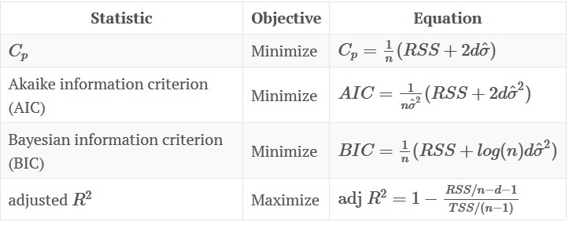

```{r echo=FALSE, message=FALSE, error=FALSE, warning=FALSE, message=FALSE}
rm(list=ls()) # Lösche alle Variablen
library(tibble)
library(tidyverse) # Datenaufbereitung und ggplot
library(lubridate) # Umgang mit Datum und Zeit
library(GGally) # Wird benötigt für die Erstellung des correlograms
library(e1071) # Wird für Support Vector Machines benötigt
```

# Management Summary

...

# 1 Allgemeine Projektinformationen

## 1.1 Ausgangslage

Dieses R Projekt ist ein Teil des Projektes „Künstliche Intelligenz in Einrichtungen der kulturellen Infrastruktur“. Das Projekt wird von der Fachhochschule Kiel zur Digitalisierung von Kulturinstitutionen und besonders zur Forschung zum Einsatz von künstlicher Intelligenz in Kulturinstitutionen im Marketing, der Verwaltung und zur Verbesserung des Angebotes durchgeführt. Gefördert wird das Vorhaben durch die Staatskanzlei des Landes Schleswig-Holstein. Zu den Kooperationspartnern zählen die schleswig-holsteinische Landesbibliothek (SHLB), das Europäische Hansemuseum Lübeck (EHM) und das Nordkolleg Rendsburg. Weitere Informationen zu dem Projekt finden Sie unter:

* https://www.fh-kiel-gmbh.de/de/leistungen/drittmittelprojekte/landesministerien-sh/ki-in-kultur.html
* https://www.schleswig-holstein.de/DE/Landesregierung/I/_startseite/Artikel2020/I/200211_CDS_Foerderbescheid-landesbibliothek.html

Ein Teilaspekt das Europäische Hansemuseum betreffend ist die Prognose der Besucherzahlen.

Die Prognose von Umsätzen (/Besucherzahlen) des [Europäischen Hansemuseums](https://www.hansemuseum.eu/) (EHM) ist bislang seitens der Institution nicht behandelt worden. Eine systematische Planung unter Einbeziehung von Mustern findet nicht statt, wenngleich das EHM daran sehr interessiert ist. 

## 1.2 Zielsetzung 
Es werden verschiedene einfache und komplexe Modelle getestet, dabei werden auch Techniken aus den Bereichen Machine Learning und Deep Learning angewendet. 

**Lösungsansatz**

Mit Hilfe von verschiedenen Daten und Einflussfaktoren sollen die Umsätze des EHM prognostiziert werden. Einbezogen werden dabei Umsatzdaten, Wetterdaten, Veranstaltungsdaten sowie weitere Einflussfaktoren wie beispielsweise die Wochentage, Feiertage, Ferientage.


## 1.3 Datenbasis

Seitens des EHM wurden Daten aus ihrem Kassensystem für die Jahre 2015 bis 2020 zur Verfügung gestellt. Das EHM arbeitet an dieser Stelle mit dem Unternehmen [Beckerbillet](https://www.beckerbillett.de/de/Museen_und_Science_Center.html) zusammen, dessen "Kompetenz sich aus der Kombination einer modernen Ticketdruckerei mit einem spezialisierten Softwarehaus und dem durchdachten Hardware-Angebot ergibt". Es stehen sowohl Umsatzdaten als auch Besucherzahlen vor.

Weiterhin wurden folgende Daten für die Analyse potentieller Einflussfaktoren recherchiert bzw. erhoben und jeweils ein Datensatz erstellt: 

* [Wetterdaten](https://server.wettermail.de/opendata-dwd/cgi-bin/klima2.pl?action=showStationComplete&stationId=3086)
  + maximale Temperatur
  + minimale Temperatur
  + Durchschnittstemperatur
  + Niederschlag (mm)
  + Sonnenstunden
  + Windstärke (Beaufort)
* Daten zur Kieler Woche
* Daten zu sommerferientagen in den Bundesländern
  + Baden-Württemberg
  + Bayern
  + Hessen
  + Niedersachsen
  + Nordrhein-Westfalen
  + Schleswig-Holstein
* Daten zu Feiertagen
  + Ostern
  + Christi Himmelfahrt
  + Pfingsten
  + Tag der Deutschen Einheit
  + Weihnachten
* Daten zu Silvester
* Daten zu den Jahreszeiten.

Im weiteren Verlauf werden all diese Datensätze zusammengefügt und dieser Datensatz wiederum um die Variablen Wochentag, Monat und Jahr ergänzt, was nicht zuletzt der Aufteilung in Trainings- und Testdatensatz dient.

# 2 Datenexploration

## 2.1 Einlesen der Daten

Im ersten Schritt müssen die Daten zunächst eingelesen werden um sie bearbeiten zu können:
```{r message=FALSE}
# mit read_csv einlesen um eine Veränderung der Datentypen (bzw. eine Faktorisierung) zu verhindern!
library(readxl)
Umsatz <- read_excel("Daten/Umsatz.xlsx")
Tickets <- read_excel("Daten/Tickets.xlsx")

```

## 2.2 Überprüfung der Datenstrukturen

* Datensatz **Beispieldaten**
```{r}
str(Umsatz)
glimpse(Umsatz)
range(Umsatz$Umsatz)
```

Der Datensatz **Umsatz** ist ein Dataframe, enthält 1747 Zeilen und 3 Variablen:

* Datum (`dttm`)
* Wochentag (`chr`)
* Umsatz (`dbl`) mit Werten zwischen 0 und 8728 €.

* Datensatz **Tickets**
```{r}
str(Tickets)
glimpse(Tickets)
range(Tickets$Tickets)
```

Der Datensatz **Tickets** enthält ebenfalls 1747 Zeilen und die Variablen Datum (`dttm`), Wochentag (`chr`) und Tickets (`dbl`) mit Werten zwischen 0 und 1108.

## 2.3 Überprüfung des Anfangs- und Endzeitpunkt der Datumsattribute in den Datensätzen
```{r}
range(Umsatz$Datum)
range(Tickets$Datum)
```

Die Daten beider Datensätze reichen vom 29.05.2015 bis 14.03.2020.

## 2.4 Überprüfung der Datensätze auf fehlende Werte

### Überprüfung auf "klassische" fehlende Werte (NA)
Zunächst einmal wird geprüft, welche klassischen fehlenden Werte (NA) in den einzelnen Datensätzen vorhanden sind:
```{r}
sum(is.na(Umsatz))   
sum(is.na(Tickets))  
#sum(is.na(df_complete))

#which(is.na(df_complete$Windmax_BF))
#which(is.na(df_complete$Niederschlag))
```

Die Datensätze sind vollständig.

> Anmerkung: Vollständig im Sinne von es gibt keine fehlenden Werte in der Tabelle. Es gibt einen Tag, an dem das Museum nicht geöffnet hat und der dementsprechend fehlt (24.12. Heiligabend).

## 2.5 Überprüfung der Datensätze auf Ausreißer

Ein Ausreißer ist ein Wert, der außerhalb der üblichen Struktur einer Verteilung liegt. Zunächst wird in einem ersten Schritt mittels einer Visualisierung in Form von `boxplots` überprüft, ob die einzelnen Datensätze überhaupt Ausreißer enthalten.

Ein Boxplot zeigt uns den Median (dicke Linie) sowie das untere und obere Quartil (als Box). Der Abstand von unterem zu oberem Quartil (interquartile range: IQR) wird standardmäßig mit 1.5 multipliziert. Und genau über die auf diese Art ermittelte Spannweite erstrecken sich die sogenannten whiskers maximal, wobei die whiskers unten und oben an der Box ansetzen. Gibt es darüber hinaus noch Werte, die weiter außerhalb liegen, werden diese als Ausreißer durch Punkte gekennzeichnet.

Die Überprüfung wird begonnen mit dem Datensatz **Umsatz**: 

```{r}
# Überprüfung der Variable Umsatz
summary(Umsatz$Umsatz)
boxplot(Umsatz$Umsatz)
hist(Umsatz$Umsatz)

# Visualisierung
Umsatz %>% 
  dplyr::select(Umsatz) %>% 
  ggplot(aes(Umsatz)) +
  geom_density()
```

Das Attribut `Umsatz` enthält zahlreiche Ausreißer. Mit bloßem Auge ist nicht zu erkennen, wie viele Ausreißer es genau sind. Die Ausreißer werden also in einem 2. Schritt genauer betrachtet, um die genaue Anzahl der Ausreißer zu ermitteln. Statistiker haben viele Verfahren entwickelt, um auseinanderzuhalten, was man als Ausreißer bezeichnen sollte, und was nicht. 

Wir verwenden - wie bereits erwähnt - die Standardeinstellung, die aus einer Definition von John W. Tukey stammt: Sie definiert einen Ausreißer als einen Punkt, der mehr als $$1,5 * IQR$$ vom unteren bzw. oberen Quartil abweicht. Anders gesagt liegen untere Ausreißer unterhalb

$$Q_1 - 1,5 * IQR$$
und obere Ausreißer oberhalb 

$$Q_3 + 1.5 * IQR$$

Vereinfachend untersuchen wir nun die Umsatzvariable insgesamt auf Ausreißer:

```{r}
g_oben <- quantile(Umsatz$Umsatz, probs=0.75) + (1.5*IQR(Umsatz$Umsatz)) #Obere Grenze fuer Ausreißer
g_oben

Umsatz %>%
  dplyr::select(Umsatz) %>%
  filter(Umsatz > g_oben) %>%
  summarise(n = n())
```
Die obere Grenze für Ausreißer liegt demzufolge bei 4413,19€ (gerundet). Es gibt insgesamt 41 Ausreißer in der Variable `Umsatz`. 

In einem 3. Schritt betrachten wir, an welchen Daten diese Ausreißer auftreten und ob Muster erkennbar sind (z. B. überproportional hohe Umsätze an Ostern oder anderen Feiertagen, in den Ferien, während der Kieler Woche o. Ä.):

```{r}
Umsatz %>%
  dplyr::select(Datum, Umsatz) %>%
  filter(Umsatz > g_oben) 
```

Eine erste Auswertung der genaueren Betrachtung der Ausreißer ergibt:

* Die 10 höchsten Ausreißer gab es im Jahr 2015, davon 8 Ende Juli und 2 im August. Eventuell hat an diesen Tagen eine Sonderaktion / Eröffnungsrabattierung stattgefunden. 
* Mit Abstand der höchste Umsatz wurde erzielt am 20.07.2015 mit einem Wert von 8728 Euro.
* Die Ausreißer Nr. 11 bis 20 liegen allesamt in 2016, wobei die Verteilung über das Jahr deutlich von den Ausreißern im Jahr 2015 abweicht:
  + 2 Ausreißer fallen auf Anfang und Ende Januar, also den Beginn des Jahres.
  + Der nächste Ausreißer fällt auf das Osterwochende, den "Karsamstag" (26.03.2016)
  + Einen weiteren Ausreißer gab es am Pfingstmontag des Jahres (16.05.)
  + Die verbliebenen 6 Ausreißer verteilen sich gleichmäßig auf die Monate Juni, August, September und Oktober, ohne dass eine genauere Erklärung hierfür auf den ersten Blick plausibel erscheint. 
* Die Ausreißer 21 bis 30 fallen allesamt in das Jahr 2017:
  + Wieder ist der Umsatz an Ostern stark; im Jahr 2017 fallen zwei Ausreißer auf dieses Wochenende, nämlich den Ostersonntag (16.04.) und den Ostermontag (17.04)
  + Auch Pfingsten ist erneut bei den Ausreißern dabei, wobei dieser Ausreißer auch in diesem Jahr wieder auf den Pfingsmontag fällt.
  + Als weiterer "Feiertags-Ausreißer" lässt sich der Tag der deutschen Einheit ausmachen.
  + Die verbleibenden 6 Ausreißer verteilen sich wiederum auf die Monate Juli, August und September, ohne dass ein exakter plausibler Grund angegeben werden kann. Eine Überlegung wäre, dass die Sommerferien in SH und anderen Bundesländern hier einen Einfluss hatten.
* Für die Jahre 2018 und 2019 lassen sich 5 bzw. 6 Ausreißer ausmachen:
  + In 2018 fallen die Ausreißer auf Feiertage (Ostersonntag, Ostermontag und Tag der Deutschen Einheit), ein Ausreißer liegt im August und der verbliebene fällt auf den 30.12.2018.
  + Im Jahr 2019 lassen sich bis auf eine Häufung der Ausreißer im monat August keine Muster ausmachen. Eine mögliche Begründung wäre Ferienzeit.
  
**Fazit**

Einen besonderen Stellenwert scheinen die Feiertage Ostern und Pfingsten zu haben. Auch am Tag der Deutschen Einheit scheinen die Umsätze generell tendenziell hoch zu sein. Ansonsten sieht man einen relativ klaren "Sommer-Effekt". 

Da die meisten Ausreißer planbar und plausibel erscheinen, werden diese zunächst in der Auswertung belassen. Zu überlegen ist jedoch, ob der "Eröffnungseffekt" nicht eliminiert werden sollte, da dieser schon starken Einfluss übt.


\


Die Überprüfung wird weitergeführt mit dem Datensatz **Tickets**: 

```{r}
# Überprüfung der Variable Umsatz
summary(Tickets$Tickets)
boxplot(Tickets$Tickets)
hist(Tickets$Tickets)

# Visualisierung
Tickets %>% 
  dplyr::select(Tickets) %>% 
  ggplot(aes(Tickets)) +
  geom_density()
```
Das Attribut `Tickets` enthält erwartungsgemäß ebenfalls zahlreiche Ausreißer. Mit bloßem Auge ist nicht zu erkennen, wie viele Ausreißer es genau sind. Die Ausreißer werden also in einem 2. Schritt genauer betrachtet, um die genaue Anzahl der Ausreißer zu ermitteln. Statistiker haben viele Verfahren entwickelt, um auseinanderzuhalten, was man als Ausreißer bezeichnen sollte, und was nicht. 

Wir verwenden - wie bereits erwähnt - die Standardeinstellung, die aus einer Definition von John W. Tukey stammt: Sie definiert einen Ausreißer als einen Punkt, der mehr als $$1,5 * IQR$$ vom unteren bzw. oberen Quartil abweicht. Anders gesagt liegen untere Ausreißer unterhalb

$$Q_1 - 1,5 * IQR$$
und obere Ausreißer oberhalb 

$$Q_3 + 1.5 * IQR$$

Vereinfachend untersuchen wir nun die Umsatzvariable insgesamt auf Ausreißer:

```{r}
g_oben <- (quantile(Tickets$Tickets, probs=0.75) + (1.5*IQR(Tickets$Tickets))) #Obere Grenze fuer Ausreißer
g_oben

Tickets %>%
  dplyr::select(Tickets) %>%
  filter(Tickets > g_oben) %>%
  summarise(n = n())
```
Die obere Grenze für Ausreißer liegt demzufolge bei 520 Tickets. Es gibt insgesamt 46 Ausreißer in der Variable `Tickets`, also 5 mehr als bei der Variable `Umsatz`. 

In einem 3. Schritt betrachten wir, an welchen Daten diese Ausreißer auftreten und ob Muster erkennbar sind (z. B. überproportional hohe Umsätze an Ostern oder anderen Feiertagen, in den Ferien, während der Kieler Woche o. Ä.):

```{r}
Tickets %>%
  dplyr::select(Datum, Tickets) %>%
  filter(Tickets > g_oben) 
```

Eine erste Auswertung der genaueren Betrachtung der Ausreißer ergibt:

* Die 9 (Umsatz: 10) höchsten Ausreißer gab es im Jahr 2015, davon 8 Ende Juli und einen im August. Eventuell hat an diesen Tagen eine Sonderaktion / Eröffnungsrabattierung stattgefunden. Zudem ist generell auf einen "Neueröffnungseffekt" zu schließen.
* Die Ausreißer Nr. 10 bis 19 liegen allesamt in 2016, wobei die Verteilung über das Jahr von den Ausreißern im Jahr 2015 abweicht:
  + 2 Ausreißer fallen auf den Januar, also den Beginn des Jahres.
  + Der nächste Ausreißer fällt auf den "Karfreitag" (25.03.2016, *(Umsatzausreißer an "Karsamstag")*
  + Einen weiteren Ausreißer gab es am Pfingstsonntag des Jahres 2016 (15.05., *Umsatzausreißer: Ostermontag des Jahres (16.05.)*)
  + Drei Ausreißer fallen in den August, einer in den Oktober. 
* Die Ausreißer 20 bis 28 fallen allesamt in das Jahr 2017:
  + Wieder ist der Umsatz am Osterwochende, genauer an Karsamstag, stark. *(Umsatzausreißer: "Karsamstag" (15.04.) und Ostersonntag (16.04.))*
  + Auch Pfingsten ist erneut bei den Ausreißern dabei, wobei der Ticket-Ausreißer wieder auf den Pfingstsonntag fällt (04.06., *Umsatzausreißer: "Pfingstmontag" (05.06)*)
  + Weitere Ticketausreißer liegen im Juli, August und oktober.
* Die Ausreißer 29 bis 35 fallen in das Jahr 2018:
  + Der erste Ausreißer dieses Jahres fällt auf den Karsamstag (31.03.), der zweite auf den Ostersonntag (01.04.), das Osterwochenende ist also abermals stark vertreten.
  + Die verbleibenden Ausreißer liegen gleichmäßig verteilt in den Monaten Juli, August, September, Oktober und Dezember, wobei hier kein klares Muster zu erkennen ist.
* Die verbleibenden 11 Ausreißer liegen im Jahr 2019:
  + Der ersten drei Ausreißer fallen in diesem Jahr auf den 15.03., den 22.03. und den 29.03., was auf den ersten Blick lediglich auf den Wochentag (Freitag) zurückzuführen ist. Eine Möglichkeit wäre, sich das Wetter an diesen Tagen noch einmal genauer anzuschauen oder zu prüfen, ob eine größere Veranstaltung in diesen Tagen in Lübeck stattgefunden hat.
  + Der nächste Ausreißer fällt auf den 19.05., ein Sonntag.
  + Der nächste Ausreißer, der Montag, 22.07., erscheint bezüglich des Wochentags einerseits ungewöhnlich. Andererseits liegt der Tag in der Sommerferienzeit. Falls das Wetter an diesem Tag schlecht war, könnte das eine gewisse Erklärung sein.
  + Die verbleibenden Ausreißer liegen in den Monaten Juli und August.
  
  
**Fazit**

Einen besonderen Einfluss scheint es abermals bei den Feiertagen rund um Ostern und Pfingsten zu geben, wenngleich der Effekt teilweise hinsichtlich des konkreten Tages anders ist als beim Umsatz. Weiterhin sieht man wie bei der Analyse der Umsatzdaten einen "Sommereffekt".

# 3 Datenaufbereitung, Erstellung von Rohdatensatz und Analysedatensätzen

## 3.1 Vereinigung der Datensätze

Maßgeblich ist in diesem Projekt der Zeitraum, in dem Umsatzdaten bzw. Besucherzahlen seitens des Hansemuseums vorliegen. Diese Daten liegen für den Zeitraum 29.05.2015 bis 14.03.2020 vor (vgl. Kap. 2.3.). Über`left_join`-Operationen werden nun weitere erhobene Daten an den Umsatzdatensatz sowie den Ticketdatensatz angefügt.

```{r}
# Importieren aller weiteren vorliegenden Daten:
library(readr)
ChristiHimmelfahrt <- read_csv2("Daten/ChristiHimmelfahrt.csv")
ChristiHimmelfahrt_ext <- read_excel("Daten/ChristiHimmelfahrt_ext.xlsx")
Feiertage <- read_csv2("Daten/Feiertage.csv")
Fruehling <- read_csv2("Daten/Fruehling.csv")
Herbst <- read_csv2("Daten/Herbst.csv")
Jahreszeiten <- read_csv2("Daten/Jahreszeiten.csv")
KiWo <- read_csv("Daten/KiWo.csv")
Ostern <- read_csv2("Daten/Ostern.csv")
Ostern_ext <- read_csv2("Daten/Ostern_extended.csv")
Pfingsten <- read_csv2("Daten/Pfingsten.csv")
Pfingsten_ext <- read_csv2("Daten/Pfingsten_ext.csv")
Silvester <- read_csv2("Daten/Silvester.csv")
Silvester_ext <- read_csv2("Daten/Silvester_ext.csv")
SoFe_BW <- read_csv2("Daten/SoFe_BW.csv")
SoFe_BY <- read_csv2("Daten/SoFe_BY.csv")
SoFe_HE <- read_csv2("Daten/SoFe_HE.csv")
SoFe_NDS <- read_csv2("Daten/SoFe_NDS.csv")
SoFe_NRW <- read_csv2("Daten/SoFe_NRW.csv")
SoFe_SH <- read_csv2("Daten/SoFe_SH.csv")
Sommer <- read_csv2("Daten/Sommer.csv")
TDE <- read_csv2("Daten/TdDE.csv")
Weihnachten <- read_csv2("Daten/Weihnachten.csv")
Winter <- read_csv2("Daten/Winter.csv")
Wetter <- read_xlsx("Daten/Wetterdaten.xlsx")

```
 Da die Wetterdaten 

```{r}
# Um eine Doppelung der Wochentage zu vermeiden, wird sie aus dem Datensatz "Tickets" entfernt

Tickets2 <- Tickets %>%
  select(Tickets, Datum)

# Vereinigung der Datensätze
df_complete <- left_join(Umsatz, Tickets2, by = "Datum")
df_complete <- left_join(df_complete, ChristiHimmelfahrt, by = "Datum")
df_complete <- left_join(df_complete, ChristiHimmelfahrt_ext, by = "Datum")
df_complete <- left_join(df_complete, Feiertage, by = "Datum")
df_complete <- left_join(df_complete, Fruehling, by = "Datum")
df_complete <- left_join(df_complete, Herbst, by = "Datum")
df_complete <- left_join(df_complete, Jahreszeiten, by = "Datum")
df_complete <- left_join(df_complete, KiWo, by = "Datum")
df_complete <- left_join(df_complete, Ostern, by = "Datum")
df_complete <- left_join(df_complete, Ostern_ext, by = "Datum")
df_complete <- left_join(df_complete, Pfingsten, by = "Datum")
df_complete <- left_join(df_complete, Pfingsten_ext, by = "Datum")
df_complete <- left_join(df_complete, Silvester, by = "Datum")
df_complete <- left_join(df_complete, Silvester_ext, by = "Datum")
df_complete <- left_join(df_complete, SoFe_BW, by = "Datum")
df_complete <- left_join(df_complete, SoFe_BY, by = "Datum")
df_complete <- left_join(df_complete, SoFe_HE, by = "Datum")
df_complete <- left_join(df_complete, SoFe_NDS, by = "Datum")
df_complete <- left_join(df_complete, SoFe_NRW, by = "Datum")
df_complete <- left_join(df_complete, SoFe_SH, by = "Datum")
df_complete <- left_join(df_complete, Sommer, by = "Datum")
df_complete <- left_join(df_complete, TDE, by = "Datum")
df_complete <- left_join(df_complete, Weihnachten, by = "Datum")
df_complete <- left_join(df_complete, Winter, by = "Datum")
df_complete <- left_join(df_complete, Wetter, by = "Datum")
head(df_complete)
```

## 3.6 Umgang mit fehlenden Werten

Die Datensätze enthalten "naturimmanent" viele fehlende Werte, die beim Import automatisch erzeugt wurden. Beispielsweise enthält der Datensatz **KiWo** nur 72 Datensätze: für jedes Jahr wurde den Tagen, an denen die KiWo stattfindet, eine 1 zugeordnet. Diese Werte wurden Bei der Vereinigung der Datensätze entsprechend korrekt gemerged. Für alle anderen Daten, an denen keine KiWo ist, wurde bei der Vereinigung ein fehlender Wert (NA) automatisch erzeugt. Diese fehlenden Werte sind für die weitergehenden Analysen durch "0" zu ersetzen, sodass eine binäre (0/1)-Variable entsteht. Genauso wird bei den anderen Variablen, die auf Basis der eigens recherchierten Daten erstellt wurden, vorgegangen:

```{r}

df_complete <- df_complete %>%
  mutate(ChristiHimmelfahrt = replace_na(ChristiHimmelfahrt, 0)) %>%
  mutate(ChristiHimmelfahrt_ext = replace_na(ChristiHimmelfahrt_ext, 0)) %>%
  mutate(Feiertag = replace_na(Feiertag, 0)) %>%
  mutate(Fruehling = replace_na(Fruehling, 0)) %>%
  mutate(Herbst = replace_na(Herbst, 0)) %>%
  mutate(KielerWoche = replace_na(KielerWoche, 0)) %>%
  mutate(Ostern = replace_na(Ostern, 0)) %>%
  mutate(Ostern_ext = replace_na(Ostern_ext, 0)) %>%
  mutate(Pfingsten = replace_na(Pfingsten, 0)) %>%
  mutate(Pfingsten_ext = replace_na(Pfingsten_ext, 0)) %>%
  mutate(Silvester = replace_na(Silvester, 0)) %>%
  mutate(Silvester_ext = replace_na(Silvester_ext, 0)) %>%
  mutate(SommerferienBaW = replace_na(SommerferienBaW, 0)) %>%
  mutate(SommerferienBY = replace_na(SommerferienBY, 0)) %>%
  mutate(SommerferienHE = replace_na(SommerferienHE, 0)) %>%
  mutate(SommerferienNDS = replace_na(SommerferienNDS, 0)) %>%
  mutate(SommerferienNRW = replace_na(SommerferienNRW, 0)) %>%
  mutate(SommerferienSH = replace_na(SommerferienSH, 0)) %>%
  mutate(Sommer = replace_na(Sommer, 0)) %>%
  mutate(TDE = replace_na(TDE, 0)) %>%
  mutate(Weihnachten = replace_na(Weihnachten, 0)) %>%
  mutate(Winter = replace_na(Winter, 0))

head(df_complete)
```

## 3.7 Ergänzung um die Variablen Wochentag, Monat und Jahr

Ein wesentlicher Einflussfaktor für die Prognose der Besucherzahlen wird der Wochentag sein. Diese Spalten werden in einem weiteren Schritt hinzugefügt. Es wird also der Wochentag als eigene Spalte hinzugefügt: Sonntag (1), Montag (2), ... , Samstag (7); und für die spätere Aufteilung der Daten in Training- und Testset wird das Jahr als weitere Spalte ergänzt und der Monat.

Damit die Wochentage adäquat in die späteren Modelle einfließen können, wird der Wochentag überdies als `character`-Variable abgespeichert.

Bsp.:
Soll der `Wochentag` ein lineare Regressionsmodell aufgenommen werden, würde eine numerische Variable zu falschen Ergebnissen führen (wird der Wochentag um eins erhöht, erhöht sich der Umsatz um xy%). Bei einer `character`-Variable würde diese "dummyfiziert". Ein Wochentag würde als Referenztag abgebildet werden und die anderen 6 Wochentage in Form von Dummyvariablen.

```{r}
df_complete <- df_complete %>% mutate(Wochentag = wday(Datum))
df_complete <- df_complete %>% mutate(Jahr = year(Datum))
df_complete <- df_complete %>% mutate(Monat = month(Datum))

# Wochentag als character-Variable
df_complete <- df_complete %>% mutate(Wochentag_c = recode(Wochentag, "1" = "Sonntag", "2" = "Montag", "3" = "Dienstag", "4" = "Mittwoch", "5" = "Donnerstag", "6" = "Freitag", "7" = "Samstag"))

# Monat als character-Variable
df_complete <- df_complete %>% mutate(Monat_c = recode(Monat, "1" = "Januar", "2" = "Februar", "3" = "März", "4" = "April", "5" = "Mai", "6" = "Juni", "7" = "Juli", "8" = "August", "9" = "September", "10" = "Oktober", "11" = "November", "12" = "Dezember"))
```

Es besteht die Möglichkeit, dass es unterhalb der Wochentag keine großen Unterschiede gibt, wohl aber zwischen Wochentagen und Wochenendtagen. Insofern wird eine weitere Variable `Wochenende` erstellt, die nur die beiden Ausprägungen 1 = "Wochenende" und 0 = "kein Wochenende" ("Wochentag") hat.

```{r}
df_complete <- df_complete %>% mutate(Wochenende = recode(Wochentag, "1" = "1", "2" = "0", "3" = "0", "4" = "0", "5" = "0", "6" = "0", "7" = "1"))

df_complete <- df_complete %>% mutate(Windmax_BF = as.numeric(Windmax_BF))

df_complete <- df_complete %>% mutate(Wochenende = as.numeric(Wochenende))
df_complete <- df_complete %>% mutate(Sonnenstunden = round(Sonnenstunden, 0))


library(writexl)
write.csv(df_complete, "Daten/Datensatz_komplett.csv")
write_xlsx(df_complete, "Daten/Datensatz_komplett.xlsx")
```

Für die Erstellung künstlicher neuronaler Netze (KNN) wird ein separater Datensatz erstellt:
```{r}
Datensatz_KNN <- df_complete %>% filter(Jahr >= 2016 & Jahr <= 2019)

Datensatz_KNN <- Datensatz_KNN %>%
  select(-Fruehling, -Herbst, -Sommer, -Winter, -Wochentag, -Monat, -Jahr, - Ostern_ext, -Pfingsten_ext)

glimpse(Datensatz_KNN)

write_excel_csv(Datensatz_KNN, "Daten/Datensatz_KNN.csv")
write_xlsx(Datensatz_KNN, "Daten/Datensatz_KNN.xlsx")
```


## 3.8 Kategorisierung der Wettervariablen

Für manche Analysen ist es sinnvoll, numerische Variablen in Rohdatenform zu klassifizieren bzw. ihnen Klassen zuzuordnen. Insofern werden die Wettervariablen auch über die Rohdatenwerte hinaus als diskrete Variablen in Form von Klassen abgebildet. 

Die einfachste Umwandlung von Rohdaten zu Klassen erfolgt bei der Variable Windstärke, gemessen in Beaufort, da es hierfür eine eindeutig definierte Einteilung gibt:


# 4 Deskriptive Analysen

## 4.1 Analyse des Umsatzes

### Die 20 umsatzstärksten Tage im betrachteten Zeitraum (Gesamtumsatz pro Tag)

```{r}
Umsatz %>%
  dplyr::select(Datum, Umsatz) %>%
  group_by(Datum) %>%
  summarise(Gesamtumsatz = sum(Umsatz)) %>%
  arrange(desc(Gesamtumsatz)) %>%
  top_n(20)
```

### Die 20 besucherstärksten Tage im betrachteten Zeitraum (Gesamtumsatz pro Tag)


```{r}
Tickets %>%
  dplyr::select(Datum, Tickets) %>%
  group_by(Datum) %>%
  summarise(Besucheranzahl = sum(Tickets)) %>%
  arrange(desc(Besucheranzahl)) %>%
  top_n(20)
```

### Gesamtumsatz und Umsatz je Wochentag

Zunächst wird der Umsatz je Wochentag in den Daten untersucht. Als Basis verwenden wir die zunächst den vollständigen Datensatz `df_complete`.

```{r}
df_complete %>% summarise(Umsatz_sum = sum(Umsatz))
df_complete %>% group_by(Wochentag_c) %>% summarise(Umsatz_sum = sum(Umsatz)) %>% arrange(desc(Umsatz_sum))
df_complete %>% group_by(Wochenende) %>% summarise(Umsatz_sum = sum(Umsatz)) %>% arrange(desc(Umsatz_sum))
df_complete %>% group_by(Wochentag_c) %>% summarise(Umsatz_mean = mean(Umsatz)) %>% arrange(desc(Umsatz_mean))
df_complete %>% group_by(Wochenende) %>% summarise(Umsatz_mean = mean(Umsatz)) %>% arrange(desc(Umsatz_mean))
```

```{r}
library(viridis)

# Visualisierung der Umsätze je Wochentag
Umsatz <- Umsatz %>% 
  group_by(Wochentag) %>% 
  mutate(Umsatz_sum = sum(Umsatz)) %>% 
  mutate(Umsatz_mean = mean(Umsatz))

Umsatz2 <- Umsatz %>%
  select(Wochentag, Umsatz_sum) %>%
  distinct(Wochentag, Umsatz_sum)

Umsatz2 %>% 
  arrange(-Umsatz_sum) %>% 
  ggplot() + 
  aes(x = reorder(Wochentag, -Umsatz_sum), y = Umsatz_sum, fill = Umsatz_sum) +
  geom_col() +
  scale_fill_viridis(direction = -1) +
  xlab("Wochentag") + ylab("Kumulierter Umsatz") + 
  theme_classic() +
  ggtitle("Kumulierter Umsatz je Wochentag (gesamter Zeitraum 2015 - 2020)")
```


```{r}
Umsatz2 <- Umsatz %>%
  select(Wochentag, Umsatz_mean) %>%
  distinct(Wochentag, Umsatz_mean)

Umsatz2 %>% 
  arrange(-Umsatz_mean) %>% 
  ggplot() + 
  aes(x = reorder(Wochentag, -Umsatz_mean), y = Umsatz_mean, fill = Umsatz_mean) +
  geom_col() +
  scale_fill_viridis(direction = -1) +
  xlab("Wochentag") + ylab("Durchschnittlicher Umsatz") + 
  theme_classic() +
  ggtitle("Durchschnittlicher Umsatz je Wochentag")

```
* In dem betrachteten Zeitraum hat das EHM insgesamt einen Umsatz in Höhe von 3.152.010 Euro generiert.
* Die umsatzstärksten Wochentage im gesamten betrachteten Zeitraum sind Sonntag (601.301 Euro) und Montag (509.619 Euro), der umsatzschwächste Tag ist Dienstag (336.145 Euro); die anderen Wochentage unterscheiden sich nur marginal, die Umsätze schwanken hier zwischen 410.000 - 440.000 Euro.
* Der durchschnittliche Tagesumsatz an einem Sonntag beträgt 2414 Euro, an einem Montag 2046 Euro, der an Dienstagen 1349 Euro. 
* Summiert sind die Umsätze der Wochentage doppelt so hoch wie am Wochenende, mit anderen Worten wurden 2/3 der Umsätze an Wochentagen erzielt, 1/3 an Wochenendtagen. Berücksichtigt man, dass es in Summe 2.5 mal so viele Wochentage wie Wochenendtage im betrachteten Zeitraum gab, ergibt sich ein etwas anderes Bild: An den Wochenendtagen wurde im Schnitt ein Umsatz von 2089 Euro erzielt, an den Wochentagen 1690 Euro.

Nicht unberücksichtigt bleiben sollte, dass manche Feiertage immer auf den Montag fallen (Ostermontag, Pfingstmontag) und manche jahresabhängig auf einen Montag fallen können und dies auch einen gewissen Einfluss haben könnte. In einem nächsten Schritt werden insofern die durchschnittlichen Umsätze an den Feiertagen betrachtet.

### Gesamtbesucheranzahl und Besucheranzahl je Wochentag

Zunächst wird die Besucheranzahl je Wochentag in den Daten untersucht. Als Basis verwenden wir die zunächst den vollständigen Datensatz `df_complete`.

```{r}
df_complete %>% summarise(Besucheranzahl_ges = sum(Tickets))
df_complete %>% group_by(Wochentag_c) %>% summarise(Besucheranzahl_ges = sum(Tickets)) %>% arrange(desc(Besucheranzahl_ges))
df_complete %>% group_by(Wochenende) %>% summarise(Besucheranzahl_ges = sum(Tickets)) %>% arrange(desc(Besucheranzahl_ges))
df_complete %>% group_by(Wochentag_c) %>% summarise(Besucheranzahl_Durchschnitt = mean(Tickets)) %>% arrange(desc(Besucheranzahl_Durchschnitt))
df_complete %>% group_by(Wochenende) %>% summarise(Besucheranzahl_Durchschnitt = mean(Tickets)) %>% arrange(desc(Besucheranzahl_Durchschnitt))
```

* Im betrachteten Zeitraum haben 374.231 Menschen das EHM besucht.
* Die besucherstärksten Wochentage im gesamten betrachteten Zeitraum sind Samstag (66.958 Besucher) und Sonntag (60.511 Besucher), der "besucherärmste" Tag ist Montag (40.995 Besucher); die anderen Wochentage unterscheiden sich nur unwesentlich. Die Besucherzahlen schwanken hier zwischen 50.478 - 52.899.
* Die Anzahl der durchschnittlichen Besucher pro Wochentag beträgt an einem Samstag 268, an einem Sonntag 243, der an Montagen 165. 
* Kumuliert man die Besucherzahlen der Wochentage, so leigen diese ~ 30% höher als an den Wochenendtagen. Der Unterschied zwischen Wochentagen und Wochenendtagen fällt mit Blick auf die Anzahl der Besucher insofern geringer aus als beim Umsatz. An den Wochentagen haben 56% aller Besucher das Hansemuseum besucht, an den Wochenendtagen entsprechend 44%.

```{r}
library(viridis)

# Visualisierung der Umsätze je Wochentag
Tickets <- Tickets %>% 
  group_by(Wochentag) %>% 
  mutate(Besucheranzahl_ges = sum(Tickets)) %>% 
  mutate(Besucheranzahl_Durchschnitt = mean(Tickets))

Tickets2 <- Tickets %>%
  select(Wochentag, Besucheranzahl_ges) %>%
  distinct(Wochentag, Besucheranzahl_ges)

Tickets2 %>% 
  arrange(-Besucheranzahl_ges) %>% 
  ggplot() + 
  aes(x = reorder(Wochentag, -Besucheranzahl_ges), y = Besucheranzahl_ges, fill = Besucheranzahl_ges) +
  geom_col() +
  scale_fill_viridis(direction = -1) +
  xlab("Wochentag") + ylab("Kumulierte Besucherzahlen") + 
  theme_classic() +
  ggtitle("Kumulierte Besucherzahlen je Wochentag (Zeitraum 2015 - 2020)")
```


```{r}
Tickets3 <- Tickets %>%
  select(Wochentag, Besucheranzahl_Durchschnitt) %>%
  distinct(Wochentag, Besucheranzahl_Durchschnitt)

Tickets3 %>% 
  arrange(-Besucheranzahl_Durchschnitt) %>% 
  ggplot() + 
  aes(x = reorder(Wochentag, -Besucheranzahl_Durchschnitt), y = Besucheranzahl_Durchschnitt, fill = Besucheranzahl_Durchschnitt) +
  geom_col() +
  scale_fill_viridis(direction = -1) +
  xlab("Wochentag") + ylab("Durchschnittliche Besucheranzahl") + 
  theme_classic() +
  ggtitle("Durchschnittliche Besucheranzahl je Wochentag")

```

### Durchschnittlicher Umsatz und durchschnittliche Besucheranzahl je Feiertag

Da zu vermuten ist, dass Feiertage einen starken Effekt auf den Umsatz haben könnten, wird nun der Umsatz je Feiertag in den Daten untersucht. Als Basis verwenden wir wieder den vollständigen Datensatz `df_complete`.

```{r}
df_complete %>% filter(Ostern == 1) %>% summarise(Umsatz_mean = mean(Umsatz)) 
df_complete %>% filter(ChristiHimmelfahrt == 1) %>% summarise(Umsatz_mean = mean(Umsatz)) 
df_complete %>% filter(Pfingsten == 1) %>% summarise(Umsatz_mean = mean(Umsatz)) 
df_complete %>% filter(TDE == 1) %>% summarise(Umsatz_mean = mean(Umsatz)) 
df_complete %>% filter(Weihnachten == 1) %>% summarise(Umsatz_mean = mean(Umsatz)) 
df_complete %>% filter(Silvester == 1) %>% summarise(Umsatz_mean = mean(Umsatz)) 
```


Verglichen mit den Umsätzen je Wochentag und hierbei insbesondere mit dem umsatzstärksten Sonntag (Umsatz im Durchschnitt 2414 Euro) werden an einzelnen Feiertagen außergewöhnlich hohe Umsätze erzielt. Besonders stark hervor treten Ostern und Pfingsten, doch auch die Umsätze am Tag der Deutschen Einheit und Silvester sind überdurchschnittlich stark. Nicht so erfolgreich schneiden Christi Himmelfahrt und Weihnachten ab. An Weihnachten sind die Umsätze sogar niedriger als am umsatzschwächsten Wochentag Dienstag. Es wäre hier zu überlegen, ob eine Öffnung an Weihnachten wenigstens kostendeckend ist.

```{r}
df_complete %>% filter(Ostern == 1) %>% summarise(Besucheranzahl_Durchschnitt = mean(Tickets)) 
df_complete %>% filter(ChristiHimmelfahrt == 1) %>% summarise(Besucheranzahl_Durchschnitt = mean(Tickets)) 
df_complete %>% filter(Pfingsten == 1) %>% summarise(Besucheranzahl_Durchschnitt = mean(Tickets)) 
df_complete %>% filter(TDE == 1) %>% summarise(Besucheranzahl_Durchschnitt = mean(Tickets)) 
df_complete %>% filter(Weihnachten == 1) %>% summarise(Besucheranzahl_Durchschnitt = mean(Tickets)) 
df_complete %>% filter(Silvester == 1) %>% summarise(Besucheranzahl_Durchschnitt = mean(Tickets)) 
```


### Umsatz und Besucherzahlen je Monat

In einem weiteren Schritt werden die Umsätze je Monat untersucht, um eine differenziertere Verteilung der Umsätze im Jahresverlauf zu erhalten. 

```{r}
df_complete %>% group_by(Monat_c) %>% summarise(Umsatz_sum = sum(Umsatz)) %>% arrange(desc(Umsatz_sum))
df_complete %>% group_by(Monat_c) %>% summarise(Umsatz_mean = mean(Umsatz)) %>% arrange(desc(Umsatz_mean))
```

* Es gibt erkennbare Unterschiede zwischen den Umsätzen pro Monat:
  + Die Sommermonate Juli und August sind die umsatzstärksten. Eine mögliche Begründung könnte sein, dass in den Sommermonaten sehr viele Touristen (im Verhältnis zu den Einwohner) in Schleswig-Holstein sind. Dies wäre zu überprüfen.
  + Auch einige Frühlingsmonate schneiden gut ab: Mai, April, März. Vielleicht ist dies unter anderem auch auf die Feiertage Ostern, Christi Himmelfahrt und Pfingsten sowie auf die umgebenden Brückentage zurückzuführen. 
  + Halb Sommer, halb Herbst, teilweise in den Sommerferien liegend, schneidet auch der September gut ab.
  + Schlechter sind die Umsätze in den Herbst- und Wintermonaten, was bei der vorangegangenen Analyse schon sichtbar wurde. Im Juli beispielsweise sind die Umsätze fast doppelt so hoch wie im November, der den umsatzschwächsten Monat darstellt.

Als nächstes werden die Besucherzahlen je Monat betrachtet, um auch hier einen differenzierteren Überblick zu erhalten. 

```{r}
df_complete %>% group_by(Monat_c) %>% summarise(Besucherzahl_ges = sum(Tickets)) %>% arrange(desc(Besucherzahl_ges))
df_complete %>% group_by(Monat_c) %>% summarise(Besucherzahl_Durchschnitt = mean(Tickets)) %>% arrange(desc(Besucherzahl_Durchschnitt))
```
* Es gibt erkennbare Unterschiede zwischen den Besucherzahlen pro Monat:
  + Die Sommermonate Juli und August sind die Monate, in denen am meisten Besucher im EHM zu verzeichnen sind. Eine mögliche Begründung könnte auch hier sein, dass in den Sommermonaten sehr viele Touristen (im Verhältnis zu den Einwohner) in Schleswig-Holstein sind. Dies wäre zu überprüfen.
  + Mit dem oktober landet ein Herbstmonat auf dem dritten Platz, jedoch mit deutlichem Abstand zu den genannten Sommermonaten.
  + Die besucherärmsten Monate sind Januar und November. Im November kommen 35% weniger Besucher als im Juli.


### Umsatz und Besucheranzahl je Jahreszeit

Gespräche mit Mitarbeitern des Hansemuseums lassen darauf schließen, dass die Jahreszeiten einen Einfluss auf die Höhe des Umsatzes haben. Insofern wird auch für diese Variable eine detailliertere Betrachtung durchgeführt.

```{r}
df_complete %>% group_by(Jahreszeit) %>% summarise(Umsatz_sum = sum(Umsatz)) %>% arrange(desc(Umsatz_sum))
df_complete %>% group_by(Jahreszeit) %>% summarise(Umsatz_mean = mean(Umsatz)) %>% arrange(desc(Umsatz_mean))
```
Im Sommer und im Frühling werden deutlich höhere Umsätze generiert als in den Jahreszeiten Herbst und Winter. Im Sommer liegt der Umsatz durchschnittlich 40% höher verglichen mit Herbst und Winter, gegenüber dem Frühling ist der Umsatz im Sommer um 10% höher. Es ist insofern ein klarer Effekt der Jahreszeiten sichtbar. 


```{r}
df_complete %>% group_by(Jahreszeit) %>% summarise(Besucheranzahl_ges = sum(Tickets)) %>% arrange(desc(Besucheranzahl_ges))
df_complete %>% group_by(Jahreszeit) %>% summarise(Besucheranzahl_Durchschnitt = mean(Tickets)) %>% arrange(desc(Besucheranzahl_Durchschnitt))
```

Im Sommer werden deutlich höhere Besucherzahlen erreicht als in den übrigen Jahreszeiten. Der Frühling ist zwar auch (deutlich) stärker als Herbst und Winter, aber der Unterschied ist geringer als beim Umsatz. Im Sommer liegen die Besucherzahlen durchschnittlich knapp bzw. gut 50% höher verglichen mit Winter und Herbst und Winter, gegenüber dem Frühling ist der Umsatz im Sommer um 35% höher. Auch was die Besucherzahlen angeht, ist also ein klarer Effekt der Jahreszeiten sichtbar. 

## 4.3 Umsatz und Besucherzahlen im Zeitverlauf

Von Interesse ist nun die Entwicklung der Umsätze im Zeitverlauf.Es soll geprüft werden, ob eine Trendentwicklung zu beobachten ist und ob es strukturelle Brüche in den Zeitreihen gibt. Wir betrachten dafür zunächst die Entwicklung des Gesamtumsatzes pro Jahr. Als Datenbasis verwenden wir abermals den kompletten datensatz `df_complete`.

```{r}
umsatz_jahr <- df_complete %>% group_by(Jahr) %>% summarise(Umsatz=sum(Umsatz))
umsatz_jahr
```

Zu beobachten ist, dass der Jahresumsatz von 2014 bis 2016 sukzessive sinkt und dann 2017 stabil bleibt. Um diese Beobachtung besser zu verstehen, betrachten wir den Umsatz nun auf Monatsebene, immer noch aggregiert über alle Warengruppen.

```{r}
umsatz_jahr_monat <- df_complete %>% mutate(Jahr=as.character(Jahr)) %>% group_by(Jahr, Monat) %>% summarise(Umsatz=sum(Umsatz)) # Variable Jahr in character umgewandelt, damit im folgenden Plot eine diskrete Farbskala in der Legende gezeigt werden kann

p_umsatz_jahr_monat <- ggplot(data = umsatz_jahr_monat, aes(x = Monat, y = Umsatz)) +
  geom_point(aes(color = Jahr), size = 3, alpha = 0.5) +
  geom_line(aes(group = Jahr, color = Jahr)) + 
  scale_x_discrete(limits=c("1","2","3","4","5","6","7","8","9","10","11","12")) +
  xlab("Monat") + ylab("Umsatz") + 
  labs(color = "Jahr") +
  theme_classic() +
  ggtitle("Gesamtumsatz je Monat")

p_umsatz_jahr_monat
```

Beobachtungen:

* Die Jahre 2016 bis 2019 sind weitestgehend ähnlich im Jahresverlauf. 
* Die Umsätze im Jahr 2015 erscheinen ungewöhnlich. Während in der Eröffnungsphase (Eröffnung 27.05.2015) im Mai / Juni fast keine Umsätze zu verzeichnen sind, schießen sie im Juli buchstäblich durch die Decke, um dann wieder schlagartig abzusinken. In den monaten September bis Dezember sind nahezu keinerlei Umsätze zu verzeichnen, was unrealistisch erscheint. Hier ist zum einen Rücksprache mit dem hansemuseum zu halten sowie zu überlegen, ob diese Daten nicht aus den weiteren Analysen ausgeschlossen werden sollten.
* Der Verlauf für 2020 ist zu Beginn, d. h. im Januar und Februar, ähnlich zu den Umsätzen in den Vorjahren. Im März sinken die Umsatzzahlen rapide, was sehr wahrscheinlich auf den Beginn der sogenannten Coronakrise und damit einhergehenden Schließungen von öffentlichen Einrichtungen zurückzuführen ist. Da das Jahr 2020 ein sehr ungewöhnliches ist, ist zu überlegen, ob diese Daten nicht ebenfalls von der Analyse ausgeschlossen werden sollten.

**Fazit**

Aufgrund der Datenlage wäre es anzuraten, die Daten aus den Jahren 2016 - 2018 als Trainingsdaten und die Daten aus dem Jahr 2019 als Testdaten zu nutzen.

```{r}
Besucher_jahr <- df_complete %>% group_by(Jahr) %>% summarise(Besucher_Jahr = sum(Tickets))
Besucher_jahr
```

Zu beobachten ist, dass der Jahresumsatz von 2014 bis 2016 sukzessive sinkt und dann 2017 stabil bleibt. Um diese Beobachtung besser zu verstehen, betrachten wir den Umsatz nun auf Monatsebene, immer noch aggregiert über alle Warengruppen.

```{r}
Sonnenstunden_jahr_monat <- df_complete %>% mutate(Jahr=as.character(Jahr)) %>% group_by(Jahr, Monat) %>% summarise(Sonnenstunden_Monat=sum(Sonnenstunden))
Besucher_jahr_monat <- df_complete %>% mutate(Jahr=as.character(Jahr)) %>% group_by(Jahr, Monat) %>% summarise(Besucher=sum(Tickets)) # Variable Jahr in character umgewandelt, damit im folgenden Plot eine diskrete Farbskala in der Legende gezeigt werden kann

p_Besucher_jahr_monat <- ggplot(data = Besucher_jahr_monat, aes(x = Monat, y = Besucher)) +
  geom_point(aes(color = Jahr), size = 3, alpha = 0.5) +
  geom_line(aes(group = Jahr, color = Jahr)) + 
  scale_x_discrete(limits=c("1","2","3","4","5","6","7","8","9","10","11","12")) +
  xlab("Monat") + ylab("Besucherzahl") + 
  labs(color = "Jahr") +
  theme_classic() +
  ggtitle("Gesamtbesucherzahlen je Monat")

p_Besucher_jahr_monat
```

```{r}
Besucher_jahr_monat <- df_complete %>% mutate(Jahr=as.character(Jahr)) %>% group_by(Jahr, Monat) %>% summarise(Besucher=mean(Tickets)) # Variable Jahr in character umgewandelt, damit im folgenden Plot eine diskrete Farbskala in der Legende gezeigt werden kann

p_Besucher_jahr_monat <- ggplot(data = Besucher_jahr_monat, aes(x = Monat, y = Besucher)) +
  geom_point(aes(color = Jahr), size = 3, alpha = 0.5) +
  geom_line(aes(group = Jahr, color = Jahr)) + 
  scale_x_discrete(limits=c("1","2","3","4","5","6","7","8","9","10","11","12")) +
  xlab("Monat") + ylab("Besucherzahl") + 
  labs(color = "Jahr") +
  theme_classic() +
  ggtitle("Durchschnittliche Besucherzahlen je Monat")

p_Besucher_jahr_monat
```


```{r}
Sonnenstunden_jahr_monat <- df_complete %>% mutate(Jahr=as.character(Jahr)) %>% group_by(Jahr, Monat) %>% summarise(Sonnenstunden_Monat=sum(Sonnenstunden))
# Variable Jahr in character umgewandelt, damit im folgenden Plot eine diskrete Farbskala in der Legende gezeigt werden kann

p_Sonnenstunden_jahr_monat <- ggplot(data = Sonnenstunden_jahr_monat, aes(x = Monat, y = Sonnenstunden_Monat)) +
  geom_point(aes(color = Jahr), size = 3, alpha = 0.5) +
  geom_line(aes(group = Jahr, color = Jahr)) + 
  scale_x_discrete(limits=c("1","2","3","4","5","6","7","8","9","10","11","12")) +
  xlab("Monat") + ylab("Sonnenstunden") + 
  labs(color = "Jahr") +
  theme_classic() +
  ggtitle("Kumulierte Sonnenstunden je Monat")

p_Sonnenstunden_jahr_monat
```


# 5. Anwendung naiver Modelle

# 6. Anwendung statistischer Modelle: Lineare Regression

# 6 Anwendung statistischer Modelle - Lineare Regression

## 6.1 Vorhaben
In einem nächsten Schritt wird mit der linearen Regression ein traditionelles statistisches Modell zur Prognose der Besucherzahlen eingesetzt. Die lineare Regression ist ein sehr einfacher Ansatz für das sog. "überwachte Lernen" (supervised learning). Lineare Regressionsmodelle sind insbesondere ein nützliches Werkzeug zur Vorhersage einer quantitativen Output-Variable, die in diesem Fall den Besuchern bzw. der Anzahl verkaufter Tickets pro Tag entspricht. Auch wenn die lineare Regression im Vergleich modernen statistischen Lernmethoden ein vergleichsweise einfaches Modell ist, ist sie immer noch weit verbreitet. Überdies dient sie als guter Ausgangspunkt für neuere Ansätze: viele neuere statistische Lernansätze können als Generalisierung oder Erweiterung der linearen Regression betrachtet werden.

Im Allgemeinen ist bei der linearen Regression zwischen der einfachen und der multiplen Regression zu unterscheiden. Während im ersten Fall nur eine einzelne Variable als Vorhersageparameter für die abhängige Variable betrachtet wird, werden bei der multiplen linearen Regression mehrere Input-Variablen in das Modell einbezogen. Da hinsichtlich der beeinflussenden Variablen Unterschiede bei den einzelnen Warengruppen zu erwarten sind, werden die Warengruppen isoliert betrachtet. Das heißt, für jede Warengruppe werden unterschiedliche Modelle angwendet und verglichen.  

Insgesamt wird Vorgehen wird in mehreren Stufen untergliedert: Zunächst wird auf Basis des allumfassenden Datensatzes `df_voll` ein Datensatz für die Anwendung der linearen Modelle (`df_lm`) erstellt und dieser sodann in einen Trainings- und einen Testdatensatz aufgeteilt. In einem nächsten Schritt werden mittels sog. *best subset selection* und *stepwise selection* die in das Modell aufzunehmenden Variablen bestimmt und auf dieser Grundlage dann ein Regressionsmodell erstellt.

## 6.2 Datenaufbereitung

Wir arbeiten mit dem vollständigen Datensatz `df_complete`. Dieser enthält im Zeitraum 29.05.2015 bis 14.03.2020 eine Zeile für jedes Datum mit Ausnahme des 24.12. eines jeden Jahres. 

Für unser Vorhaben beschränken wir uns auf die Rohdaten im Zeitraum 2016 - 2019. Das Jahr 2015 zeigt nicht erklärbare Unregelmäßigkeiten in den daten und diese sind zudem sehr lückenhaft. Weiterhin wird der Datensatz in zwei komplementäre Datensätze aufgeteilt: die Trainingsdaten beinhalten den Zeitraum 2016 bis 2018. Die Besucherzahlen des Jahres 2019 dienen uns dann als Testdaten.

Der Ticketverlauf in diesem Zeitraum sieht wie folgt aus:


```{r}
# Tickets
Ticketverlauf <- df_complete %>% filter(Jahr >= 2016 & Jahr <= 2019)

Ticketverlauf$Datum <- as.Date(Ticketverlauf$Datum, format = "%Y-%m-%d", tz = "UTC")

ggplot(Ticketverlauf, aes(x = Datum)) +
  labs(title = "Besucherzahlen im Europäischen Hansemuseum Lübeck 2016 - 2019") +
  xlab("Datum") + ylab("Tickets") +
  geom_line(aes(y = Tickets), color = "blue") +
  scale_x_date(date_labels = "%Y %b %d") +
  theme_minimal() +
  theme(plot.title = element_text(hjust = 0.5),
        panel.grid.major = element_blank(), panel.grid.minor = element_blank(),
        panel.border = element_blank(),
        axis.line = element_line(colour = "black"))
```

Es wird für diesen Abschnitt ein Arbeitsdatensatz `df_lm` auf Basis von `df_complete` erstellt. Redundanzen werden entfernt: der Datensatz enthält sowohl für die Monate als auch für die Wochentage jeweils eine numerische und eine character-Variable. Die numerischen sind für die linearen Modelle unbrauchbar, da dann den eigentlich nominalen Variablen Zahlenwerte zugeordnet würden, die im Rahmen der linearen Modelle auch interpretiert würden. Das würde dazu führen, dass bspw. der Dezember 12x so hoch wie der Januar ist. Insofern werden die numerischen Variablen für Monat und Wochentag entfernt.

```{r}
df_lm <- df_complete %>%
  select(-Umsatz, -Wochentag, -Monat, -Fruehling, -Sommer, -Herbst, -Winter)
df_lm_train <- df_lm %>% filter(Jahr >= 2016 & Jahr <= 2018) 
df_lm_train <- na.omit(df_lm_train)
df_lm_test <- df_lm %>% filter(Jahr == 2019)
df_lm_test <- na.omit(df_lm_test)
```

### 6.2.1 Überprüfung auf lineare Abhängigkeiten der Variablen

Für die Erstellung linearer Modelle dürfen keine linearen Abhängigkeiten zwischen den einzelnen Variablen bestehen. Zunächst ist also zu prüfen, zwischen welchen Variablen lineare Abhängigkeiten bestehen:

```{r}
alias(lm(Tickets ~., data = df_lm_train))
```
Erwartungsgemäß gibt es eine lineare Abhängigkeit zwischen der Variable `Wochentag` und der Variable `Wochentag_C`. Die Variable Wochenende wird daher entfernt.

```{r}
df_lm_train <- df_lm_train %>% select(-Wochenende)
df_lm_test <- df_lm_test %>% select(-Wochenende)

# Erneute Überprüfung:
alias(lm(Tickets ~., data = df_lm_train))
```

Nun liegen keine linearen Abhängigkeiten mehr vor.

### 6.2.3 Überprüfung auf Multikollinearität

Bei der multiplen Regression können zwei oder mehr Prädiktorvariablen miteinander korreliert sein. Diese Situation wird als Kollinearität bezeichnet.

Es gibt eine extreme Situation, die als Multikollinearität bezeichnet wird und in der Kollinearität zwischen drei oder mehr Variablen besteht, selbst wenn kein Variablenpaar eine besonders hohe Korrelation aufweist. Dies bedeutet, dass zwischen Prädiktorvariablen Redundanz besteht.

Bei Vorhandensein von Multikollinearität wird die Lösung des Regressionsmodells instabil.

Multikollinearität kann auf zwei verschiedene Arten überprüft werden:

* Zum einen kann die Multikollinearität für einen gegebenen Prädiktor (p) bewertet werden, indem ein Score berechnet wird, der als Varianzinflationsfaktor (oder VIF) bezeichnet wird und misst, wie stark die Varianz eines Regressionskoeffizienten aufgrund der Multikollinearität im Modell aufgeblasen wird,
* zum anderen anhand der Korrelationen der Variablen untereinander.

Der kleinstmögliche Wert von VIF ist eins (Fehlen von Multikollinearität). Als Faustregel gilt, dass ein VIF-Wert, der 5 oder 10 überschreitet, ein problematisches Maß an Kollinearität anzeigt (James et al. 2014).

Bei Multikollinearität sollten die betroffenen Variablen entfernt werden, da das Vorhandensein von Multikollinearität impliziert, dass die Informationen, die diese Variable über die Antwort liefert, bei Vorhandensein der anderen Variablen redundant sind (James et al. 2014, P. Bruce und Bruce (2017)).

**Erstellung eines ersten Regressionsmodells**

Um eine Überprüfung auf Multikollinearität durchzuführen, wird ein Regressionsmodell erstellt, das alle unabhängigen Variablen enthält:

```{r}
library(caret)
# Erstellung des Modells
model1 <- lm(Tickets ~., data = df_lm_train)
# Vorhersagen
predictions <- model1 %>% predict(df_lm_test)
# Modellperformance
data.frame(
  RMSE = RMSE(predictions, df_lm_test$Tickets),
  R2 = R2(predictions, df_lm_test$Tickets)
)
```

Der R^2-Wert ist mit ~ 0.28 noch niedrig; der RMSE beträgt 112.9983.

**Überprüfung auf Multikollinearität**

*Überprüfung mittels VIF*

Die R-Funktion `vif()` [`car package`] kann genutzt werden um Multikollinearität zu erkennen:
```{r}
library(car)
car::vif(model1)
```

Der VIF-Wert für die Variablen `Datum` und `Jahr` sind sehr hoch (VIF = 38.229527 respektive 36.050411). Dies könnte problematisch sein. Insofern sollten die Variablen entfernt werden. Dies würde zu einem einfacheren Modell führen, ohne die Modellgenauigkeit zu beeinträchtigen, was gut ist.

Die Variable `Jahr` wird entfernt. 

```{r}
df_lm_train <- df_lm_train %>% select(-Jahr)
df_lm_test <- df_lm_test %>% select(-Jahr)
```


*Überprüfung durch Korrelation:*

Die Korrelationen nach Pearson können in R einfach über den Befehl `cor()` berechnet werden. Hier sollte kein Wert größer als .7 sein.

```{r}
df_lm_train %>% 
  dplyr::select(-Datum, -Tickets, -Wochentag_c, -Monat_c, -Jahreszeit) %>%
  cor()
```

Einige der unabhängigen Variablen weisen mittelstarke bis starke Korrelationen auf (alle Korrelationen >=0.5):

* SommerferienBaW und SommerferienBY: 0.940481170
* SommerferienBaW und SommerferienNRW: 0.671462422
* SommerferienBaW und SommerferienSH: 0.746160392
* SommerferienBY und SommerferienNRW: 0.60914016  
* SommerferienBY und SommerferienSH: 0.68209943
* SommerferienHE und SommerferienNDS: 0.65207342
* SommerferienHE und SommerferienNRW: 0.60619326
* SommerferienHE und SommerferienSH: 0.60619326
* SommerferienNRW und SommerferienSH: 0.76530296 
* Ostern und Ostern_ext: 0.629826982
* Tmax und Tmittel 0.979165574
* Tmax und Tmin: 0.866194219
* Tmax und Tminboden: 0.792324890
* Tmax und Sonnenstunden:  0.599215355
* Tmin und Tmittel: 0.93886102
* Tmin und Tminboden: 0.87521829


Da die Einflussvariablen mitunter stark korrelieren und die empfohlene Grenze von .7 teilweise stark überschreiten, muss in Erwägung gezogen werden, auch einige der stark miteinander korrelierten Variablen zu eliminieren, da bspw. die schrittweise Regression bei Multikollinearität versagt. Zunächst werden die Tatsache, dass einzelne Variablen stark untereinander korrelieren, jedoch ignoriert. Eine sich doch als notwendig abzeichnende Eliminierung weiterer Variablen erfolgt ggf. zu einem späteren Zeitpunkt.

///////////////////////////////**Umgang mit Multikollinearität**

In diesem Abschnitt, wird das Modell erneut erstellt. Dieses Mal zunächst nur ohne die beiden problematischen Variablen `Datum` und `Jahr`.

df_lm_train <- df_lm_train %>% select(-Datum)
df_lm_test <- df_lm_test %>% select(-Datum, -Jahr)
# Modellbildung ohne die beiden Variablen
model2 <- lm(Umsatz ~., data = df_lm_train)
# Make predictions
predictions <- model2 %>% predict(df_lm_test)
# Model performance
data.frame(
  RMSE = RMSE(predictions, df_lm_test$Umsatz),
  R2 = R2(predictions, df_lm_test$Umsatz)
)

Man kann sehen, dass das Entfernen der beiden Variablen `Datum` und `Jahr` die Modellleistungsmetriken nicht sehr beeinflusst (RMSE inkl. `Datum` und `Jahr`: 125.8987, R2: 0.1522406). Mit anderen Worten, die Modellgenauigkeit leidet nur marginal unter dem Entfernen der beiden Variablen.///////////////////////////////

## 6.3 Erstellung linearer Regressionsmodelle 

**Laden der benötigten Pakete**

Wir beginnen unsere Analyse mit dem Laden der notwendigen Pakete, die bislang noch nicht geladen wurden:

* `caret` für einen einfachen Machine Learning workflow
* `leaps` für die Berechnung einer schrittweisen Regression

```{r}
library(caret)
library(leaps)
```

### 6.3.1 Auswahl der am besten geeigneten Variablen


**Schrittweise Auswahl ("Stepwise selection")**

Aus rechnerischen Gründen kann die beste Teilmengenauswahl nicht angewendet werden, wenn die Anzahl der $p$ Prädiktorvariablen groß ist. Die Auswahl der besten Teilmenge kann auch unter statistischen Problemen leiden, wenn $p$ groß ist. Je größer der Suchraum ist, desto höher ist die Wahrscheinlichkeit, Modelle zu finden, die in den Trainingsdaten gut aussehen, auch wenn sie möglicherweise keine Vorhersagekraft für zukünftige Daten haben. Ein enormer Suchraum kann daher zu einer Überanpassung und einer hohen Varianz der Koeffizientenschätzungen führen. Aus diesen beiden Gründen sind schrittweise Methoden, die einen weitaus eingeschränkteren Satz von Modellen untersuchen, attraktive Alternativen zur Auswahl der besten Teilmenge.

*Vorwärtsauswahl*

Die *schrittweise Vorwärtsauswahl* beginnt mit einem Modell, das keine Prädiktoren enthält und fügt dem Modell dann nacheinander Prädiktoren hinzu, bis alle Prädiktoren im Modell enthalten sind. Insbesondere wird bei jedem Schritt die Variable zum Modell hinzugefügt, die die größte zusätzliche Verbesserung der Anpassung bewirkt.

Der dreistufige Prozess der schrittweisen Vorauswahl umfasst:

**Schritt 1**: Bezeichne $M_0$ das Nullmodell, das keine Prädiktoren enthält. Dieses Modell sagt einfach den Stichprobenmittelwert für jede Beobachtung voraus.

**Schritt 2**: Für $k = 0,…, p - 1$:

* Betrachte alle $p - k$- Modelle, die die Prädiktoren in $M_k$ mit einem zusätzlichen Prädiktor erweitern. 
* Wähle das beste unter diesen $p - k$-Modellen aus und nenne es $M_[_k_+_1]$. Hier wird das beste Modell als das mit dem kleinsten $RSS$ oder dem höchstes $R^2$ definiert.

*+Schritt 3**: Wähle aus $M_0,..., M_p$ unter Verwendung eines kreuzvalidierten Vorhersagefehlers, $C_p$, $AIC$, $BIC$ oder dem adjustierten $R^2$ ein einzelnes bestes Modell aus.

Die schrittweise Vorwärtsauswahl kann mit `regsubsets` durchgeführt werden, indem die `method = "forward"` gesetzt wird:

```{r}
forward <- regsubsets(Tickets ~ ., df_lm_train, nvmax = 29, method = "forward")
```


*Schrittweise rückwärts (Backward stepwise)*

Die *schrittweise Rückwärtsauswahl* bietet eine effiziente Alternative zur Auswahl der besten Teilmenge. Im Gegensatz zur schrittweisen Vorwärtsauswahl beginnt sie jedoch mit dem vollständigen Modell der kleinsten Quadrate, das alle $p$ Prädiktoren enthält und entfernt dann iterativ den am wenigsten nützlichen Prädiktor nacheinander.

Der dreistufige Prozess der schrittweisen Vorauswahl umfasst:

*Schritt 1**: Bezeichne $M_p$ das vollständige Modell, das alle p Prädiktoren enthält.

*Schritt 2:** Für $k = p, p - 1,..., 1$

* Betrachte alle $k$ Modelle, die alle bis auf einen der Prädiktoren in $M_k$ enthalten für insgesamt $k - 1$ Prädiktoren.

* Wähle das beste unter den $k$ Modellen aus und nenne es $M_k_1$. Hier wird das beste Modell als das mit den kleinsten $RSS$ oder den höchsten $R^2$ definiert.

*Schritt 3**: Wähle aus $M_0,…, Mp$ ein einzelnes bestes Modell aus unter Verwendung eines kreuzvalidierten Vorhersagefehlers, $C_p$, $AIC$, $BIC$ oder adjustiertem $R^2$.

Die schrittweise Vorwärtsauswahl kann mit `regsubsets` durchgeführt werden, indem die `method = "backward"` gesetzt wird:

```{r}
backward <- regsubsets(Tickets ~ ., df_lm_train, nvmax = 50, method = "backward")
```


**Modellauswahl**

Bisher wurde gezeigt, wie die schrittweisen Verfahren ausgeführt werden. In einem nächsten Schritt wird nun betrachtet, wie alle Modelle verglichen werden können, um das beste Modell zu ermitteln. 

Um das beste Modell in Bezug auf den Testfehler auszuwählen, müssen wir diesen Testfehler schätzen. Es gibt zwei gängige Ansätze:

* Der Testfehler kann indirekt geschätzt werden, indem der Trainingsfehler angepasst wird, um die Verzerrung aufgrund von Überanpassung (Overfitting) zu berücksichtigen.
* Der Testfehler kann direkt abgeschätzt werden, indem entweder ein Validierungssatzansatz oder einen Kreuzvalidierungsansatz verwendet wird.

Wir betrachten im Folgenden beide Ansätze.


### Indirekte Schätzung des Testfehlers mit $C_p$, $AIC$, $BIC$ und adjustiertem $R^2$

Bei der Durchführung der Ansätze "beste Teilmenge" oder schrittweisen Annäherung werden die ausgewählten Modelle $M_0,…, M_p$ basierend auf der Tatsache ausgewählt, dass sie den mittleren quadratischen Fehler (MSE) des Trainingssatzes minimieren. Aus diesem Grund und aufgrund der Tatsache, dass die Verwendung der Trainings-$MSE$ und $R^2$ unsere Ergebnisse beeinflusst, sollten wir diese Statistiken nicht verwenden, um zu bestimmen, welche der $M0,…, Mp$ Modelle "das Beste" ist.

Es stehen jedoch eine Reihe von Techniken zum Anpassen des Trainingsfehlers an die Modellgröße zur Verfügung. Diese Ansätze können verwendet werden, um aus einer Reihe von Modellen mit unterschiedlicher Anzahl von Variablen auszuwählen. Diese beinhalten:



Dabei ist $d$ die Anzahl der Prädiktoren und $s2$ eine Schätzung der Varianz des Fehlers ($?$)) mit jeder Antwortmessung in einem Regressionsmodell verbunden. Jede dieser Statistiken fügt dem Trainings-$RSS$ eine Strafe hinzu, um die Tatsache auszugleichen, dass der Trainingsfehler dazu neigt, den Testfehler zu unterschätzen. Die Strafe steigt eindeutig mit zunehmender Anzahl von Prädiktoren im Modell.

Daher liefern diese Statistiken eine unvoreingenommene Schätzung der Test-MSE. Wenn wir unser Modell unter Verwendung eines Trainings- / Testvalidierungsansatzes durchführen, können wir diese Statistiken verwenden, um das bevorzugte Modell zu bestimmen. Diese Statistiken sind in der Ausgabe der Funktion `regsubsets` enthalten. 

Im Folgenden werden diese Informationen extrahiert und aufgezeichnet.

```{r}
# Welches Modell minimiert den Cp?
which.min(summary(forward)$cp)
which.min(summary(backward)$cp)

# Welches Modell minimiert den BIC?
which.min(summary(forward)$bic)
which.min(summary(backward)$bic)
```

Wenn man das optimale $C_p$ für vorwärts und rückwärts schrittweise bewertet, ist erkennbar, dass gemäß der Vorwärts-Methode ein 27-Variablen-Modell die $C_p$-Statistik minimiert. Die Rückwärtsmethode schlägt ein 29-Variablen-Modell vor.

Folgende 27 Variablen werden gemäß der forward-Methode einbezogen:
```{r}
coef(forward, 27)
```

* Datum
* Feiertag
* JahreszeitSommer
* JahreszeitWinter
* Ostern_ext
* Pfingsten
* Pfingsten_ext
* Silvester_ext
* SommerferienHE
* SommerferienNRW
* TDE
* Tmax
* Tmittel
* Tmin
* Tminboden
* Windmax_BF
* Niederschlag
* Sonnenstunden
* Wochentag_cMontag
* Wochentag_cSamstag 
* Wochentag_cSonntag
* Monat_cAugust
* Monat_cDezember
* Monat_cFebruar
* Monat_cJanuar
* Monat_cMärz
* Monat_cNovember

Folgende 21 Variablen werden gemäß der forward-Methode einbezogen:
```{r}
coef(forward, 21)
```
* Datum
* Feiertag
* JahreszeitWinter
* Ostern_ext
* Pfingsten
* Silvester_ext
* SommerferienHE
* SommerferienNRW 
* Tmax
* Tmittel 
* Tminboden
* Windmax_BF
* Niederschlag
* Sonnenstunden
* Wochentag_cMontag
* Wochentag_cSamstag
* Wochentag_cSonntag
* Monat_cAugust
* Monat_cDezember
* Monat_cJanuar
* Monat_cNovember

Betrachtet man das 33-Variablen-Modell der backward stepwise-Methode, ergibt sich, dass alle 29 Variablen einbezogen werden:
```{r}
coef(backward, 33)
```
* Datum
* ChristiHimmelfahrt
* ChristiHimmelfahrt_ext
* Feiertag
* JahreszeitHerbst
* JahreszeitSommer
* JahreszeitWinter
* Ostern_ext
* Pfingsten
* Pfingsten_ext
* Silvester_ext
* SommerferienHE
* SommerferienNRW
* Weihnachten
* Tmax
* Tmin
* Tminboden
* Windmax_BF
* Niederschlag
* Sonnenstunden
* Wochentag_cFreitag
* Wochentag_cMontag
* Wochentag_cSamstag
* Wochentag_cSonntag
* Monat_cAugust
* Monat_cDezember
* Monat_cFebruar
* Monat_cJanuar
* Monat_cJuli
* Monat_cJuni
* Monat_cMai
* Monat_cOktober
* Monat_cSeptember

Betrachtet man das 29-Variablen-Modell der backward stepwise-Methode, ergibt sich, dass alle 29 Variablen einbezogen werden:
```{r}
coef(backward, 23)
```

* Datum
* Feiertag
* JahreszeitHerbst
* JahreszeitWinter
* Ostern_ext
* Pfingsten
* Silvester_ext
* SommerferienHE
* Tmax
* Windmax_BF
* Niederschlag
* Sonnenstunden
* Wochentag_cMontag
* Wochentag_cSamstag
* Wochentag_cSonntag
* Monat_cAugust
* Monat_cDezember
* Monat_cJanuar
* Monat_cJuli
* Monat_cJuni
* Monat_cMai
* Monat_cOktober
* Monat_cSeptember

Vergleicht man die beiden Modelle, ergibt sich folgendes Bild:


> Auffällig ist, dass beim Modell nach der forward-Methode eher kühlere/kältere Monate einbezogen werden, während im Modell nach der backward-Methode eher die wärmeren/warmen Monate einbezogen werden. 

Die vier Modelle werden im Folgenden miteinander verglichen. 

**Teilmengenauswahl für das 27-Variablen-Modell forward selection**

Die 27 Variablen gemäß stepwise forward selection sind die folgenden:

* Datum
* Feiertag
* JahreszeitSommer
* JahreszeitWinter
* Ostern_ext
* Pfingsten
* Pfingsten_ext
* Silvester_ext
* SommerferienHE
* SommerferienNRW
* TDE
* Tmax
* Tmittel
* Tmin
* Tminboden
* Windmax_BF
* Niederschlag
* Sonnenstunden
* Wochentag_cMontag
* Wochentag_cSamstag 
* Wochentag_cSonntag
* Monat_cAugust
* Monat_cDezember
* Monat_cFebruar
* Monat_cJanuar
* Monat_cMärz
* Monat_cNovember

Die Variablen Wochentag_c, Monat_c und Jahreszeit müssen nun noch dummyfiziert werden (bei Einbeziehung aller Variablen erfolgt die Dummyfizierung automatisch im Rahmen der Regressionsanalyse): Für jeden Wochentag wird eine Variable mit Ausprägung 0/1 gebildet und danach die alte Variable Wochentag_c entfernt. Analog wird bei den beiden anderen Variablen vorgegangen.

```{r}
# Dummyfizierung der Variablen im Trainigsdatensatz:
df_lm_train <- df_lm_train %>%
  mutate(Montag=as.integer(df_lm_train$Wochentag_c=="Montag")) %>%
  mutate(Dienstag=as.integer(df_lm_train$Wochentag_c=="Dienstag")) %>%
  mutate(Mittwoch=as.integer(df_lm_train$Wochentag_c=="Mittwoch")) %>%
  mutate(Donnerstag=as.integer(df_lm_train$Wochentag_c=="Donnerstag")) %>%
  mutate(Freitag=as.integer(df_lm_train$Wochentag_c=="Freitag")) %>%
  mutate(Samstag=as.integer(df_lm_train$Wochentag_c=="Samstag")) %>%
  mutate(Sonntag=as.integer(df_lm_train$Wochentag_c=="Sonntag")) %>%
  mutate(Januar=as.integer(df_lm_train$Monat_c=="Januar")) %>%
  mutate(Februar=as.integer(df_lm_train$Monat_c=="Februar")) %>%
  mutate(Maerz=as.integer(df_lm_train$Monat_c=="Maerz")) %>%
  mutate(April=as.integer(df_lm_train$Monat_c=="April")) %>%
  mutate(Mai=as.integer(df_lm_train$Monat_c=="Mai")) %>%
  mutate(Juni=as.integer(df_lm_train$Monat_c=="Juni")) %>%
  mutate(Juli=as.integer(df_lm_train$Monat_c=="Juli")) %>%
  mutate(August=as.integer(df_lm_train$Monat_c=="August")) %>%
  mutate(September=as.integer(df_lm_train$Monat_c=="September")) %>%
  mutate(Oktober=as.integer(df_lm_train$Monat_c=="Oktober")) %>%
  mutate(November=as.integer(df_lm_train$Monat_c=="November")) %>%
  mutate(Dezember=as.integer(df_lm_train$Monat_c=="Dezember")) %>%
  mutate(Fruehling=as.integer(df_lm_train$Jahreszeit=="Fruehling")) %>%
  mutate(Sommer=as.integer(df_lm_train$Jahreszeit=="Sommer")) %>%
  mutate(Herbst=as.integer(df_lm_train$Jahreszeit=="Herbst")) %>%
  mutate(Winter=as.integer(df_lm_train$Jahreszeit=="Winter")) %>%
  dplyr::select(-Wochentag_c, -Monat_c, -Jahreszeit)

df_lm_test <- df_lm_test %>%
  mutate(Montag=as.integer(df_lm_test$Wochentag_c=="Montag")) %>%
  mutate(Dienstag=as.integer(df_lm_test$Wochentag_c=="Dienstag")) %>%
  mutate(Mittwoch=as.integer(df_lm_test$Wochentag_c=="Mittwoch")) %>%
  mutate(Donnerstag=as.integer(df_lm_test$Wochentag_c=="Donnerstag")) %>%
  mutate(Freitag=as.integer(df_lm_test$Wochentag_c=="Freitag")) %>%
  mutate(Samstag=as.integer(df_lm_test$Wochentag_c=="Samstag")) %>%
  mutate(Sonntag=as.integer(df_lm_test$Wochentag_c=="Sonntag")) %>%
  mutate(Januar=as.integer(df_lm_test$Monat_c=="Januar")) %>%
  mutate(Februar=as.integer(df_lm_test$Monat_c=="Februar")) %>%
  mutate(Maerz=as.integer(df_lm_test$Monat_c=="Maerz")) %>%
  mutate(April=as.integer(df_lm_test$Monat_c=="April")) %>%
  mutate(Mai=as.integer(df_lm_test$Monat_c=="Mai")) %>%
  mutate(Juni=as.integer(df_lm_test$Monat_c=="Juni")) %>%
  mutate(Juli=as.integer(df_lm_test$Monat_c=="Juli")) %>%
  mutate(August=as.integer(df_lm_test$Monat_c=="August")) %>%
  mutate(September=as.integer(df_lm_test$Monat_c=="September")) %>%
  mutate(Oktober=as.integer(df_lm_test$Monat_c=="Oktober")) %>%
  mutate(November=as.integer(df_lm_test$Monat_c=="November")) %>%
  mutate(Dezember=as.integer(df_lm_test$Monat_c=="Dezember")) %>%
  mutate(Fruehling=as.integer(df_lm_test$Jahreszeit=="Fruehling")) %>%
  mutate(Sommer=as.integer(df_lm_test$Jahreszeit=="Sommer")) %>%
  mutate(Herbst=as.integer(df_lm_test$Jahreszeit=="Herbst")) %>%
  mutate(Winter=as.integer(df_lm_test$Jahreszeit=="Winter")) %>%
  dplyr::select(-Wochentag_c, -Monat_c, -Jahreszeit)
```


Für das 27-Variablenmodell der stepwise forward selection wird nun ein Regressionsmodell erstellt:
```{r}
lm_f27_train <- lm(Tickets ~ Datum + Feiertag + Sommer + Winter + Ostern_ext + Pfingsten + Pfingsten_ext + Silvester_ext +
SommerferienHE + SommerferienNRW + TDE + Tmax + Tmittel + Tmin + Tminboden + Windmax_BF + Niederschlag + Sonnenstunden +
Montag + Samstag + Sonntag + August + Dezember + Februar + Januar + Maerz + November, data = df_lm_train)

library(broom)
glance(lm_f27_train)
```

Dann wird (die Modellgüte) anhand der *Test*-Stichprobe getestet:

```{r}
lm_f27_predict <- predict(lm_f27_train, newdata = df_lm_test)
```

Als Ergebnis wird ein Vektor erzeugt, der für jede Beobachtung des Test-Samples die geschätzte (vorhergesagte) Anzahl Tickets speichert. Die Gütewerte lassen sich mit `caret::postResample` ausgeben:
```{r}
caret::postResample(pred = lm_f27_predict, obs = df_lm_test$Tickets)
```
```{r}
daily_tickets <- data.frame( Date = df_lm_test$Datum, Values = df_lm_test$Tickets, LinReg = lm_f27_predict)
ggplot() +
  labs(title = "Lineare Regression: Prognose der Anzahl verkaufter Tickets im Jahr 2019") +
  xlab("Datum") + ylab("Verkaufte Tickets") +
  geom_line(data = daily_tickets, aes(y = Values, x = Date, color = "blue")) +
  geom_line(data = daily_tickets, aes(y = LinReg, x = Date, color = "orange")) +
  theme_minimal() +
  theme(plot.title = element_text(hjust = 0.5),
        panel.grid.major = element_blank(), panel.grid.minor = element_blank(),
        panel.border = element_blank(),
        axis.line = element_line(colour = "black")) +
  scale_color_manual(name = "Legende", values = c("blue" = "blue", "orange" = "orange"), labels = c("Tatsächlich verkaufte Tickets", "Prognosewerte der Linearen Regression"))
```

**Teilmengenauswahl für das 27-Variablen-Modell forward selection**

* Datum
* Feiertag
* JahreszeitWinter
* Ostern_ext
* Pfingsten
* Silvester_ext
* SommerferienHE
* SommerferienNRW 
* Tmax
* Tmittel 
* Tminboden
* Windmax_BF
* Niederschlag
* Sonnenstunden
* Wochentag_cMontag
* Wochentag_cSamstag
* Wochentag_cSonntag
* Monat_cAugust
* Monat_cDezember
* Monat_cJanuar
* Monat_cNovember

Für das 21-Variablenmodell der stepwise forward selection wird nun ein Regressionsmodell erstellt:
```{r}
lm_f21_train <- lm(Tickets ~ Datum + Feiertag + Winter + Ostern_ext + Pfingsten + Silvester_ext +
SommerferienHE + SommerferienNRW + Tmax + Tmittel + Tminboden + Windmax_BF + Niederschlag + Sonnenstunden +
Montag + Samstag + Sonntag + August + Dezember + Januar + November, data = df_lm_train)

library(broom)
glance(lm_f21_train)
```

Dann wird (die Modellgüte) anhand der *Test*-Stichprobe getestet:

```{r}
lm_f21_predict <- predict(lm_f21_train, newdata = df_lm_test)
```

Als Ergebnis wird ein Vektor erzeugt, der für jede Beobachtung des Test-Samples die geschätzte (vorhergesagte) Anzahl Tickets speichert. Die Gütewerte lassen sich mit `caret::postResample` ausgeben:
```{r}
caret::postResample(pred = lm_f21_predict, obs = df_lm_test$Tickets)
```

```{r}
daily_tickets <- data.frame( Date = df_lm_test$Datum, Values = df_lm_test$Tickets, LinReg = lm_f21_predict)
ggplot() +
  labs(title = "Lineare Regression: Prognose der Anzahl verkaufter Tickets im Jahr 2019") +
  xlab("Datum") + ylab("Verkaufte Tickets") +
  geom_line(data = daily_tickets, aes(y = Values, x = Date, color = "blue")) +
  geom_line(data = daily_tickets, aes(y = LinReg, x = Date, color = "orange")) +
  theme_minimal() +
  theme(plot.title = element_text(hjust = 0.5),
        panel.grid.major = element_blank(), panel.grid.minor = element_blank(),
        panel.border = element_blank(),
        axis.line = element_line(colour = "black")) +
  scale_color_manual(name = "Legende", values = c("blue" = "blue", "orange" = "orange"), labels = c("Tatsächlich verkaufte Tickets", "Prognosewerte der Linearen Regression"))
```
**Teilmengenauswahl für das 33-Variablen-Modell nach stepwise backward selection**

* Datum
* ChristiHimmelfahrt
* ChristiHimmelfahrt_ext
* Feiertag
* JahreszeitHerbst
* JahreszeitSommer
* JahreszeitWinter
* Ostern_ext
* Pfingsten
* Pfingsten_ext
* Silvester_ext
* SommerferienHE
* SommerferienNRW
* Weihnachten
* Tmax
* Tmin
* Tminboden
* Windmax_BF
* Niederschlag
* Sonnenstunden
* Wochentag_cFreitag
* Wochentag_cMontag
* Wochentag_cSamstag
* Wochentag_cSonntag
* Monat_cAugust
* Monat_cDezember
* Monat_cFebruar
* Monat_cJanuar
* Monat_cJuli
* Monat_cJuni
* Monat_cMai
* Monat_cOktober
* Monat_cSeptember


Für das 33-Variablenmodell der stepwise backward selection wird nun ein Regressionsmodell erstellt:
```{r}
lm_b33_train <- lm(Tickets ~ Datum + ChristiHimmelfahrt + ChristiHimmelfahrt_ext + Feiertag + Herbst + Sommer + Winter + Ostern_ext + Pfingsten + Pfingsten_ext + Silvester_ext + SommerferienHE + SommerferienNRW + Weihnachten + Tmax + Tmin + Tminboden + Windmax_BF + Niederschlag + Sonnenstunden + Freitag + Montag + Samstag + Sonntag + August + Dezember + Februar + Januar + Juli + Juni + Mai + Oktober + September, data = df_lm_train)

library(broom)
glance(lm_b33_train)
```

Dann wird (die Modellgüte) anhand der *Test*-Stichprobe getestet:

```{r}
lm_b33_predict <- predict(lm_b33_train, newdata = df_lm_test)
```

Als Ergebnis wird ein Vektor erzeugt, der für jede Beobachtung des Test-Samples die geschätzte (vorhergesagte) Anzahl Tickets speichert. Die Gütewerte lassen sich mit `caret::postResample` ausgeben:
```{r}
caret::postResample(pred = lm_b33_predict, obs = df_lm_test$Tickets)
```

```{r}
daily_tickets <- data.frame( Date = df_lm_test$Datum, Values = df_lm_test$Tickets, LinReg = lm_b33_predict)
ggplot() +
  labs(title = "Lineare Regression: Prognose der Anzahl verkaufter Tickets im Jahr 2019") +
  xlab("Datum") + ylab("Verkaufte Tickets") +
  geom_line(data = daily_tickets, aes(y = Values, x = Date, color = "blue")) +
  geom_line(data = daily_tickets, aes(y = LinReg, x = Date, color = "orange")) +
  theme_minimal() +
  theme(plot.title = element_text(hjust = 0.5),
        panel.grid.major = element_blank(), panel.grid.minor = element_blank(),
        panel.border = element_blank(),
        axis.line = element_line(colour = "black")) +
  scale_color_manual(name = "Legende", values = c("blue" = "blue", "orange" = "orange"), labels = c("Tatsächlich verkaufte Tickets", "Prognosewerte der Linearen Regression"))
```
**Teilmengenauswahl für das 23-Variablen-Modell nach stepwise backward selection**

* Datum
* Feiertag
* JahreszeitHerbst
* JahreszeitWinter
* Ostern_ext
* Pfingsten
* Silvester_ext
* SommerferienHE
* Tmax
* Windmax_BF
* Niederschlag
* Sonnenstunden
* Wochentag_cMontag
* Wochentag_cSamstag
* Wochentag_cSonntag
* Monat_cAugust
* Monat_cDezember
* Monat_cJanuar
* Monat_cJuli
* Monat_cJuni
* Monat_cMai
* Monat_cOktober
* Monat_cSeptember

Für das 23-Variablenmodell der stepwise backward selection wird nun ein Regressionsmodell erstellt:
```{r}
lm_b23_train <- lm(Tickets ~ Datum + Feiertag + Herbst + Winter + Ostern_ext + Pfingsten + Silvester_ext + SommerferienHE + Tmax + Windmax_BF + Niederschlag + Sonnenstunden + Montag + Samstag + Sonntag + August + Dezember + Januar + Juli + Juni + Mai + Oktober + September, data = df_lm_train)

library(broom)
glance(lm_b23_train)
```

Dann wird (die Modellgüte) anhand der *Test*-Stichprobe getestet:

```{r}
lm_b23_predict <- predict(lm_b23_train, newdata = df_lm_test)
```

Als Ergebnis wird ein Vektor erzeugt, der für jede Beobachtung des Test-Samples die geschätzte (vorhergesagte) Anzahl Tickets speichert. Die Gütewerte lassen sich mit `caret::postResample` ausgeben:
```{r}
caret::postResample(pred = lm_b23_predict, obs = df_lm_test$Tickets)
```

```{r}
daily_tickets <- data.frame( Date = df_lm_test$Datum, Values = df_lm_test$Tickets, LinReg = lm_b23_predict)
ggplot() +
  labs(title = "Lineare Regression: Prognose der Anzahl verkaufter Tickets im Jahr 2019") +
  xlab("Datum") + ylab("Verkaufte Tickets") +
  geom_line(data = daily_tickets, aes(y = Values, x = Date, color = "blue")) +
  geom_line(data = daily_tickets, aes(y = LinReg, x = Date, color = "orange")) +
  theme_minimal() +
  theme(plot.title = element_text(hjust = 0.5),
        panel.grid.major = element_blank(), panel.grid.minor = element_blank(),
        panel.border = element_blank(),
        axis.line = element_line(colour = "black")) +
  scale_color_manual(name = "Legende", values = c("blue" = "blue", "orange" = "orange"), labels = c("Tatsächlich verkaufte Tickets", "Prognosewerte der Linearen Regression"))
```

# 7. Anwendung von Machine Learning Verfahren: Decision Trees (Entscheidungsbäume)

## 7.1 Vorhaben

In einem weiteren Schritt wird mit den Entscheidungsbäumen ein erstes Machine Learning-Verfahren angewendet. 

Entscheidungsbäume stellen, allgemein gesprochen, Entscheidungen und deren Konsequenzen in einer baumähnlichen Struktur dar. Dabei stellen die Prüfungen die "Astgabeln" oder "Knoten" (nodes) dar, die "Äste" die Entscheidungen der Prüfungen und die "Blätter" des Baumes repräsentieren die Entscheidung des Modells. Entscheidungsbäume können sowohl für Klassifikations- als auch für numerische Vorhersagemodelle verwendet werden.

Grundlegende Entscheidungsbäume unterteilen einen Datensatz in kleinere Gruppen und passen dann für jede Untergruppe ein einfaches Modell (Konstante) an. Leider ist ein einzelnes Baummodell in der Regel sehr instabil und ein schlechter Prädiktor. Durch Bootstrap-Aggregation (Bagging) von Entscheidungsbäumen kann diese Technik jedoch sehr leistungsfähig und effektiv werden. Darüber hinaus bildet dies die grundlegende Grundlage für komplexere baumbasierte Modelle wie Random Forests ("zufällige Wälder") und sog. gradient boosting machines ("Maschinen zur Erhöhung des Gradienten").

In diesem Projekt werden nur Entscheidungsbäume und Tuning behandelt.

**Die Idee**

Es gibt viele Methoden zur Konstruktion von Entscheidungsbäumen, aber eine der ältesten ist der von Breiman et al. entwickelte Klassifizierungs- und Regressionsbaumansatz (CART). (1984). Dieses Projekt konzentriert sich auf den Regressionsteil von CART. Grundlegende Entscheidungs- bzw. Regressionsbäume unterteilen einen Datensatz in kleinere Untergruppen und passen dann für jede Beobachtung in der Untergruppe eine einfache Konstante an. Die Partitionierung wird durch aufeinanderfolgende binäre Partitionen (auch als rekursive Partitionierung bezeichnet) auf der Grundlage der verschiedenen Prädiktoren erreicht. Die vorherzusagende Konstante basiert auf den durchschnittlichen Antwortwerten für alle Beobachtungen, die in diese Untergruppe fallen.

Nehmen wir zum Beispiel an, wir möchten die Umsatz pro Tag einer Bäckereifiliale basierend auf Wochentagen, Jahreszeit, Ferien, ... vorhersagen. Alle Beobachtungen gehen durch diesen Baum, werden an einem bestimmten Knoten bewertet und gehen nach links, wenn die Antwort "Ja" lautet, oder nach rechts, wenn die Antwort "Nein" lautet. Alle Beobachtungen mit Samstag oder Sonntag gehen also zum linken Zweig, alle anderen Beobachtungen zum rechten Zweig. Als nächstes wird der linke Zweig weiter nach der Jahreszeit aufgeteilt. Diese Samstag- oder Sonntag-Beobachtungen mit der Jahreszeit Sommer gehen zum linken Zweig über, diejenigen mit Frühling, Herbst oder Winter gehen nach rechts. Und so weiter. Diese Zweige führen abschließend zu Endknoten oder Blättern, die unseren vorhergesagten Umsatz pro Tag enthalten. 

**Über Splits entscheiden**

Erstens ist es wichtig zu erkennen, dass die Partitionierung von Variablen von oben nach unten erfolgt. Dies bedeutet, dass sich eine früher in der Baumstruktur ausgeführte Partition nicht aufgrund späterer Partitionen ändert. 

Aber wie werden diese Partitionen hergestellt? Das Modell beginnt mit dem gesamten Datensatz $S$ und durchsucht jeden einzelnen Wert jeder Eingabevariablen, um den Prädiktor und den Teilungswert zu finden, der die Daten in zwei Regionen unterteilt ($R_1$ und $R_2$) derart, dass die Gesamtsummen der Fehlerquadrate minimiert werden:

$$minimiere(SSE = \sum_{i \epsilon R_1}(y_i-c_1)^2+\sum_{i \epsilon R_2}(y_i-c_2)^2 \tag{1}$$

Nachdem wir die beste Aufteilung gefunden haben, teilen wir die Daten in die beiden resultierenden Regionen auf und wiederholen den Aufteilungsprozess für jede der beiden Regionen. Dieser Vorgang wird fortgesetzt, bis ein Stoppkriterium erreicht ist. Das Ergebnis ist in der Regel ein sehr tiefer, komplexer Baum, der zwar gute Vorhersagen für den Trainingssatz liefert, die Daten jedoch wahrscheinlich überpasst, was zu einer schlechten Leistung bei unsichtbaren Daten führt.

Durch Beschneiden dieser Entscheidungsknoten auf niedrigerer Ebene können wir ein wenig Verzerrung in unser Modell einbringen, die zur Stabilisierung von Vorhersagen beiträgt und dazu neigt, besser auf neue, unsichtbare Daten zu verallgemeinern.

**Kostenkomplexitätskriterium**

In der Tiefe und Komplexität des Baums muss häufig ein Gleichgewicht erreicht werden, um die Vorhersageleistung für einige unsichtbare Daten zu optimieren. Um dieses Gleichgewicht zu finden, bilden wir normalerweise einen sehr großen Baum, wie im vorherigen Abschnitt definiert, und beschneiden ihn dann, um einen optimalen Teilbaum zu finden. Wir finden den optimalen Teilbaum unter Verwendung eines Kostenkomplexitätsparameters ($\alpha$), der unsere Zielfunktion (s. (1)) für die Anzahl der Endknoten des Baumes ($T$) "bestraft":

$$minimiere(SSE+\alpha{|T|}) \tag{2}$$

Für einen gegebenen Wert von $\alpha$ finden wir den kleinsten beschnittenen Baum mit dem niedrigsten bestraften Fehler. Dabei führen kleinere Strafen tendenziell zu komplexeren Modellen, was zu größeren Bäumen führt, während größere Strafen zu viel kleineren Bäumen führen. Wenn ein Baum größer wird, muss folglich die Verringerung der $SSE$ größer sein als die Kostenkomplexitätsstrafe. Typischerweise bewerten wir mehrere Modelle über ein Spektrum von $\alpha$ und verwenden die Kreuzvalidierung, um das optimale $\alpha$ und damit den optimalen Teilbaum zu identifizieren

**Laden notwendiger packages**

Für das Vorhaben werden die nachfolgenden packages benötigt und somit geladen. Die meisten dieser packages/Pakete spielen eine unterstützende Rolle, während der Schwerpunkt auf dem `rpart`-package liegt.

```{r}
# already loaded: library(dplyr)       # data wrangling
library(rpart)       # Performing von Regression Trees
library(rpart.plot)  # Plotten von Regression Trees
#library(ipred)       # Ggf. für bagging
```

## 7.2 Datenaufbereitung

Wir arbeiten mit dem vollständigen Datensatz `df_voll`. Dieser enthält im Zeitraum 01.07.2013 bis 31.07.2019 eine Zeile für jedes Datum und jede Warengruppe. In den Rohdaten fehlende Umsätze sind auf Basis der Vorwochenwerte ergänzt worden. Die Zeilen mit ergänzten Umsätzen sind selektierbar über die Variable Umsatz_NA (= TRUE).

Für unser Vorhaben beschränken wir uns auf die in den Rohdaten vorhandenen Umsätze (Umsatz_NA = FALSE). Und wir schränken die Trainingsdaten später auf den Zeitraum 2015 bis 2017 ein, weil wir oben gesehen hatten, dass die Umsätze in 2014 systematisch höher liegen als in den folgenden Jahren. Die Umsätze des Jahres 2018 dienen uns dann als Testdaten.

Wir erstellen für diesen Abschnitt einen Analysedatensatz `df_dt` auf Basis von `df_voll`.
Redundante Spalten nehmen wir raus (Wochentag, Monat, Jahreszeit) und entfernen die nicht benötigten Umsatz-Spalten (Umsatz_NA sowie die Umsatz_lag Variablen).

```{r}
df_dt <- df_complete

# verwende nur originäre Umsatzdaten und grenze den Zeitraum auf 2015 bis 2018 ein
df_dt <- df_dt %>% 
  filter(Jahr >= 2016 & Jahr <= 2019)

# behalte nur die Spalten, die wir für den DT verwenden wollen
df_dt <- df_dt %>%
  dplyr::select(-Wochentag, -Monat, -Jahreszeit, -Umsatz)
```

Weiterhin werden fehlende Werte eleminiert.

```{r}
# eliminiere fehlende Werte
df_dt <- na.omit(df_dt)
```

Für die Trainingsdaten verwenden wir den Zeitraum 2015 bis 2017 und für die Testdaten das Jahr 2018. Die Modellierung erfolgt je Warengruppe, daher teilen wir den Datensatz `df_dt` auf.

```{r}
df_dt_train <- df_dt %>% filter(Jahr < 2019)
df_dt_test <- df_dt %>% filter(Jahr == 2019)
```

## 7.3 Grundlegende Implementierung und Tuning


Wir können einen Regressionsbaum mit `rpart` anpassen und ihn dann mit `rpart.plot` visualisieren. Der Anpassungsprozess und die visuelle Ausgabe von Regressionsbäumen und Klassifizierungsbäumen sind sehr ähnlich. Beide verwenden die Formelmethode zum Ausdrücken des Modells (ähnlich wie `lm`). Wenn wir jedoch einen Regressionsbaum anpassen, müssen wir `method = "anova"` setzen. Standardmäßig errät `rpart` auf intelligente Weise, welche Methode anzuwenden ist. Es wird jedoch empfohlen, die Methode aus Gründen der Reproduzierbarkeit explizit festzulegen, was wir hier auch tun.

**Grundlegende Implementierung - Warengruppe 1**

Wir beginnen mit Warengruppe 1:

```{r}
dt1 <- rpart(
  formula = Tickets ~ .,
  data    = df_dt_train,
  method  = "anova"
  )

dt1
```

Sobald wir unser Modell angepasst haben, können wir einen Blick auf den dt1_WG1-Output werfen. Dieser erklärt die Schritte der Teilung: Wir beginnen bspw. mit 1061 Beobachtungen am Wurzelknoten (ganz am Anfang) und die erste Variable, die zur Teilung verwendet wird (also die erste Variable, die eine Reduzierung der SSE optimiert), ist der Wochentag Sonntag. Wir sehen, dass am ersten Knoten alle Beobachtungen mit Wochentag_c = Sonntag zum zweiten Zweig gehen. Die Gesamtzahl der Beobachtungen, die diesem Zweig folgen (152), der durchschnittliche Umsatz (70,14) und der SSE (83154.48) sind aufgeführt.

Wenn man nach dem 3. Zweig sucht, sieht man, dass 909 Beobachtungen mit Wochentag_c = Dienstag, Donnerstag, Freitag, Mittwoch, Montag, Samstag diesem Zweig folgen und ihre durchschnittlichen Umsätze 123.49€ betragen und der SSE hier 1109737.00 beträgt.

Grundsätzlich sagt uns dies, dass die wichtigste Variable, die anfangs den größten Rückgang der SSE aufweist, der Wochentag ist, wobei die Umsätze sonntags in der Warengruppe Brot um > 40% geringer sind als an den anderen Tagen der Woche.

Wir können unser Modell mit `rpart.plot` visualisieren. `rpart.plot` bietet viele Plotoptionen, auf die wir an dieser Stelle nicht weiter eingehen werden. Im Standard-Plot werden jedoch der Prozentsatz der Daten angezeigt, die auf diesen Knoten fallen, und der durchschnittliche Umsatz für diesen Zweig. 

```{r}
rpart.plot(dt1)

library(partykit)
plot(as.party(dt1))
```

Man kann feststellen, dass dieser Baum 11 interne Knoten enthält, was zu 12 Endknoten führt. Grundsätzlich partitioniert dieser Baum in 11 Variablen, um sein Modell zu erstellen. Es gibt jedoch 28 Variablen in `df_dt_train_WG1`. Also was ist passiert?

Hinter den Kulissen wendet `rpart` automatisch einen Bereich von Kostenkomplexität an ($\alpha$-Werte zum Beschneiden des Baums). Um den Fehler für jeden $\alpha$-Wert zu vergleichen, führt `rpart` eine 10-fache Kreuzvalidierung durch, sodass der mit einem bestimmten $\alpha$-Wert verbundene Fehler berechnet wird. 

```{r}
plotcp(dt1)
```

In diesem Beispiel finden wir abnehmende Renditen nach 12 Endknoten, wie in der Grafik dargestellt (y-Achse ist Kreuzvalidierungsfehler, untere x-Achse ist Kostenkomplexitätswert ($\alpha$), obere x-Achse ist die Anzahl von Endknoten (Baumgröße = | T |)). Die gestrichelte Linie, die zwischen den Punkten | T | = 3 und 4 verläuft, deutet darauf hin, dass auch ein kleiner Baum gewählt werden kann. Breiman et al. (1984) schlugen vor, dass es in der Praxis üblich ist, den kleinsten Baum innerhalb von 1 Standardabweichung des minimalen Kreuzvalidierungsfehlers zu verwenden (auch bekannt als 1-SE-Regel). Daher könnten wir auch einen Baum mit 3 oder 4 Endknoten verwenden und vernünftigerweise erwarten, dass innerhalb einer kleinen Fehlergrenze ähnliche Ergebnisse erzielt werden.

```{r}
dt1$cptable
```

**Tuning - Warengruppe 1**

Neben dem Kostenkomplexität ($\alpha$)-Parameter ist es auch üblich folgende Parameter anzupassen:

* `minsplit`: Die Mindestanzahl von Datenpunkten, die erforderlich sind, um eine Teilung zu versuchen, bevor ein Endknoten erstellt werden muss. Der Standardwert ist 20. Wenn man diesen Wert verkleinert, können Endknoten, die möglicherweise nur eine Handvoll Beobachtungen enthalten, erstellt werden um den vorhergesagten Wert zu prognostizieren. 
* `maxdepth`: Die maximale Anzahl interner Knoten zwischen dem Wurzelknoten und den Endknoten. Der Standardwert ist 30, was ziemlich liberal ist und das Bauen ziemlich großer Bäume ermöglicht.

`rpart` verwendet ein spezielles Steuer- bzw. Kontrollargument, bei dem eine Liste von Hyperparameterwerten bereitgestellt wird. Wenn wir beispielsweise ein Modell mit `minsplit` = 20 und `maxdepth` = 12 bewerten möchten, können wir Folgendes ausführen:

```{r}
dt2 <- rpart(
    formula = Tickets ~ .,
    data    = df_dt_train,
    method  = "anova", 
    control = list(minsplit = 20, maxdepth = 10, xval = 10)
)

dt2$cptable
```

Obwohl dieser Ansatz nützlich ist, müssen mehrere Modelle manuell bewertet werden. Besser ist es insofern eine Rastersuche durchzuführen, um automatisch nach einer Reihe unterschiedlich abgestimmter Modelle zu suchen, um die optimale Hyperparametereinstellung zu ermitteln.

Um eine Rastersuche durchzuführen, erstellen wir zuerst unser Hyperparameter-Raster. In diesem Beispiel suchen wir einen Bereich von `minsplit` von 5 bis 150 und variiere die maximale Tiefe von 8 bis 15 (da unser ursprüngliches Modell eine optimale Tiefe von 12 gefunden hat). Das Ergebnis sind 1168 verschiedene Kombinationen, für die 1168 verschiedene Modelle erforderlich sind.

```{r}
hyper_grid <- expand.grid(
  minsplit = seq(5, 150, 1),
  maxdepth = seq(8, 15, 1)
)

head(hyper_grid)
##   minsplit maxdepth
## 1        5        8
## 2        6        8
## 3        7        8
## 4        8        8
## 5        9        8
## 6       10        8

# Gesamtanzahl aller Kombinationen
nrow(hyper_grid)
## [1] 1168
```

Um die Modellierung zu automatisieren, richten wir einfach eine `for`-Schleife ein und durchlaufen jede Kombination aus `minsplit` und `maxdepth`. Wir speichern jedes Modell in einem eigenen Listenelement.

```{r}
models <- list()

for (i in 1:nrow(hyper_grid)) {
  
  # minsplit, maxdepth values in Zeile i
  minsplit <- hyper_grid$minsplit[i]
  maxdepth <- hyper_grid$maxdepth[i]

  # Trainiere ein modell und speichere es in der Liste
  models[[i]] <- rpart(
    formula = Tickets ~ .,
    data    = df_dt_train,
    method  = "anova",
    control = list(minsplit = minsplit, maxdepth = maxdepth)
    )
}
```

Wir können jetzt eine Funktion erstellen, um den minimalen Fehler zu extrahieren, der mit dem α-Wert der optimalen Kostenkomplexität für jedes Modell verbunden ist. 

```{r}
# Funktion um den optimalen cp zu erreichen
get_cp <- function(x) {
  min    <- which.min(x$cptable[, "xerror"])
  cp <- x$cptable[min, "CP"] 
}

# Funktion um den minimalen Fehler zu erhalten
get_min_error <- function(x) {
  min    <- which.min(x$cptable[, "xerror"])
  xerror <- x$cptable[min, "xerror"] 
}

hyper_grid %>%
  mutate(
    cp    = purrr::map_dbl(models, get_cp),
    error = purrr::map_dbl(models, get_min_error)
    ) %>%
  arrange(error) %>%
  top_n(-5, wt = error)
## minsplit  maxdepth   cp      error
##       51	       14	0.01	0.6055641	
##       70     	 10	0.01	0.6061298	
##        9	       14	0.01	0.6149394	
##       81	        8	0.01	0.6154432	
##       92	       11	0.01	0.6165628	
```

Es ist erkennbar, dass das optimale Modell eine leichte Verbesserung gegenüber unserem früheren Modell darstellt (xerror von 0.599 gegenüber 0.643).

Wenn die Ergebnisse zufriedenstellend sind, kann dieses endgültige optimale Modell angewendet werden und auf dem Testsatz vorhersagen. 

```{r}
optimal_tree <- rpart(
    formula = Tickets ~ .,
    data    = df_dt_train,
    method  = "anova",
    control = list(minsplit = 32, maxdepth = 11, cp = 0.01)
    )

pred <- predict(optimal_tree, newdata = df_dt_test)
RMSE(pred = pred, obs = df_dt_test$Tickets)
```

Der endgültige RMSE beträgt 117.84, was darauf hindeutet, dass unsere prognostizierten Umsätze im Durchschnitt etwa 117.84 Tickets von der tatsächlichen Anzahl verkaufter Tickets abweichen.

```{r}
daily_tickets <- data.frame( Date = df_dt_test$Datum, Values = df_dt_test$Tickets, DT = pred)
ggplot() +
  labs(title = "Entscheidungsbaum: Prognose der Anzahl verkaufter Tickets im Jahr 2019") +
  xlab("Datum") + ylab("Verkaufte Tickets") +
  geom_line(data = daily_tickets, aes(y = Values, x = Date, color = "blue")) +
  geom_line(data = daily_tickets, aes(y = DT, x = Date, color = "orange")) +
  theme_minimal() +
  theme(plot.title = element_text(hjust = 0.5),
        panel.grid.major = element_blank(), panel.grid.minor = element_blank(),
        panel.border = element_blank(),
        axis.line = element_line(colour = "black")) +
  scale_color_manual(name = "Legende", values = c("blue" = "blue", "orange" = "orange"), labels = c("Tatsächlich verkaufte Tickets", "Prognosewerte des Entscheidungsbaums"))
```


Um das Modell abschließend mit den anderen vergleichen zu können, wird eine Tabelle mit den zu untersuchenden Kennzahlen erstellt:
```{r}
# Hinzufügen der Ergebnisse
df_dt_test_WG1 <- df_dt_test_WG1 %>%
  mutate(predicted = pred)

# ergänze Prognose_zuhoch (TRUE / FALSE), Abweichung (Schätzer - Umsatz), absolute Abweichung (Abweichung_abs), relative Abweichung (Abweichung_rel), quadratische Abweichung (Abweichung_quad)
df_dt_test_WG1 <- df_dt_test_WG1 %>%
  mutate(Prognose_zuhoch = (predicted >= Umsatz)) %>%
  mutate(Abweichung = predicted - Umsatz) %>%
  mutate(Abweichung_abs = abs(predicted - Umsatz)) %>%
  mutate(Abweichung_rel = (predicted - Umsatz) / Umsatz) %>%
  mutate(Abweichung_quad = Abweichung^2)

# Ergänze die benötigten Hilfsgrößen
df_dt_test_WG1 <- df_dt_test_WG1 %>%
  mutate(Abweichung_rel_abs = abs(Abweichung_rel), Abweichung_rel_abs_mult_umsatz = Abweichung_rel_abs * Umsatz)

# Prognosegüte: mittlere Abweichung, mittlere absolute / relative Abweichung, mittlere quadratische Abweichung
temp <- df_dt_test_WG1 %>%
  group_by() %>%
  summarise(Anzahl=n(), Umsatz_ges = round(sum(Umsatz), 2), Umsatz_mittel = round(sum(Umsatz)/n(), 2), MAE = round(mean(Abweichung_abs), 2), MPE = round(mean(Abweichung_rel)*100, 2), MAPE = round(mean(Abweichung_rel_abs)*100, 2), WAPE = round(sum(Abweichung_rel_abs_mult_umsatz)/sum(Umsatz)*100, 2), MSE = round(mean(Abweichung_quad), 2), RMSE = round(sqrt(mean(Abweichung_quad)), 2), rRMSE = round(RMSE/Umsatz_mittel*100, 2))

# füge das Modell hinzu
temp <- temp %>% mutate(Modell = "optimaltree_WG1")

# füge die Kennzahlen nun an die Vergleichstabelle
dt_vgl_kennz <- temp
dt_vgl_kennz
```


# 8. Anwendung von Machine Learning Verfahren: Support Vector Machines

# 9. Anwendung von Deep Learning Verfahren: Multilayer Perceptron

# 10. Modellvergleich

# 11. Ensemble-Methoden

# 12. Fazit und Ausblick


