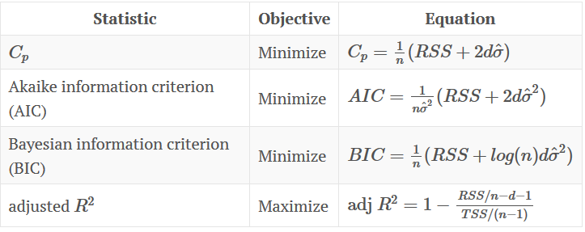

```{r echo = FALSE, message=FALSE, error=FALSE, warning=FALSE}
rm(list=ls()) # Lösche alle Variablen
library(tidyverse) # Datenaufbereitung und ggplot
library(lubridate) # Umgang mit Datum und Zeit
library(GGally) # Wird benötigt für die Erstellung des correlograms
library(e1071) # Wird für Support Vector Machines benötigt
```

# Management Summary

...

# 1 Allgemeine Projektinformationen

## 1.1 Ausgangslage
Die Prognose von Umsätzen (/Besucherzahlen) des Europäischen Hansemuseums (EHM) ist bislang seitens der Institution nicht behandelt worden. Eine systematische Planung unter Einbeziehung von Mustern findet nicht eingeschränkt statt, wenngleich das EHM daran sehr interessiert ist. 

## 1.2 Zielsetzung 
Es werden verschiedene einfache und komplexe Modelle getestet, dabei werden auch Techniken aus den Bereichen Machine Learning und Deep Learning angewendet. 

**Lösungsansatz**

Mit Hilfe von verschiedenen Daten und Einflussfaktoren sollen die Umsätze des EHM prognostiziert werden. 

*	Umsatzdaten, Wetterdaten, Veranstaltungsdaten
*	Weitere Einflussfaktoren (Wochentage, Feiertage, Ferien,…)

## 1.3 Datenbasis

Untersucht werden Daten für die Jahre 2015 bis 2020. Es liegen für diesen Zeitraum als Rohdaten folgende Datensätze vor:

*	Umsatz je Tag
* Daten zur Kieler Woche
* Daten zu Feiertagen in den Bundesländern
* Daten zu Feiertagen
* Daten zu den Jahreszeiten
* ...

* Wetterdaten 

# 2 Datenexploration

## 2.1 Einlesen der Daten

Im ersten Schritt müssen die Daten zunächst eingelesen werden um sie bearbeiten zu können:
```{r message=FALSE}
# mit read_csv einlesen um eine Veränderung der Datentypen (bzw. eine Faktorisierung) zu verhindern!
library(readxl)
Umsatz <- read_excel("Daten/Umsatz.xlsx")
Tickets <- read_excel("Daten/Tickets.xlsx")

```

## 2.2 Überprüfung der Datenstrukturen

* Datensatz **Beispieldaten**
```{r}
str(Umsatz)
glimpse(Umsatz)
range(Umsatz$Umsatz)
```

Der Datensatz **Umsatz** ist ein Dataframe, enthält 1747 Zeilen und 3 Variablen:

* Datum (`dttm`)
* Wochentag (`chr`) mit den Warengruppen 1 - 6
* Umsatz (`dbl`) mit Werten zwischen 0 und 8728 €.

* Datensatz **Tickets**
```{r}
str(Tickets)
glimpse(Tickets)
range(Tickets$Tickets)
```

Der Datensatz **Tickets** enthält ebenfalls 1747 Zeilen und die Variablen Datum (`dttm`), Wochentag (`chr`) und Tickets (`dbl`) mit Werten zwischen 0 und 1108.

## 2.3 Überprüfung des Anfangs- und Endzeitpunkt der Datumsattribute in den Datensätzen
```{r}
range(Umsatz$Datum)
range(Tickets$Datum)
```

Die Daten beider Datensätze reichen vom 29.05.2015 bis 14.03.2020.

## 2.4 Überprüfung der Datensätze auf fehlende Werte

### Überprüfung auf "klassische" fehlende Werte (NA)
Zunächst einmal wird geprüft, welche klassischen fehlenden Werte (NA) in den einzelnen Datensätzen vorhanden sind:
```{r}
sum(is.na(Umsatz))   # 0
sum(is.na(Tickets))            # 0
```

Die Datensätze sind vollständig.

> Anmerkung: Vollständig im Sinne von es gibt keine fehlenden Werte in der Tabelle. Es gibt einen Tag, an dem das Museum nicht geöffnet hat und der dementsprechend fehlt (24.12. Heiligabend).

## 2.5 Überprüfung der Datensätze auf Ausreißer

Ein Ausreißer ist ein Wert, der außerhalb der üblichen Struktur einer Verteilung liegt. Zunächst wird in einem ersten Schritt mittels einer Visualisierung in Form von `boxplots` überprüft, ob die einzelnen Datensätze überhaupt Ausreißer enthalten.

Ein Boxplot zeigt uns den Median (dicke Linie) sowie das untere und obere Quartil (als Box). Der Abstand von unterem zu oberem Quartil (interquartile range: IQR) wird standardmäßig mit 1.5 multipliziert. Und genau über die auf diese Art ermittelte Spannweite erstrecken sich die sogenannten whiskers maximal, wobei die whiskers unten und oben an der Box ansetzen. Gibt es darüber hinaus noch Werte, die weiter außerhalb liegen, werden diese als Ausreißer durch Punkte gekennzeichnet.

Die Überprüfung wird begonnen mit dem Datensatz **Umsatz**: 

```{r}
# Überprüfung der Variable Umsatz
summary(Umsatz$Umsatz)
boxplot(Umsatz$Umsatz)
hist(Umsatz$Umsatz)

# Visualisierung
Umsatz %>% 
  dplyr::select(Umsatz) %>% 
  ggplot(aes(Umsatz)) +
  geom_density()
```

Das Attribut `Umsatz` enthält zahlreiche Ausreißer. Mit bloßem Auge ist nicht zu erkennen, wie viele Ausreißer es genau sind. Die Ausreißer werden also in einem 2. Schritt genauer betrachtet, um die genaue Anzahl der Ausreißer zu ermitteln. Statistiker haben viele Verfahren entwickelt, um auseinanderzuhalten, was man als Ausreißer bezeichnen sollte, und was nicht. 

Wir verwenden - wie bereits erwähnt - die Standardeinstellung, die aus einer Definition von John W. Tukey stammt: Sie definiert einen Ausreißer als einen Punkt, der mehr als $$1,5 * IQR$$ vom unteren bzw. oberen Quartil abweicht. Anders gesagt liegen untere Ausreißer unterhalb

$$Q_1 - 1,5 * IQR$$
und obere Ausreißer oberhalb 

$$Q_3 + 1.5 * IQR$$

Vereinfachend untersuchen wir nun die Umsatzvariable insgesamt auf Ausreißer, wobei wir zunächst nicht nach Warengruppen trennen:

```{r}
g_oben <- quantile(Umsatz$Umsatz, probs=0.75) + (1.5*IQR(Umsatz$Umsatz)) #Obere Grenze fuer Ausreißer
g_oben

Umsatz %>%
  dplyr::select(Umsatz) %>%
  filter(Umsatz > g_oben) %>%
  summarise(n = n())
```
Die obere Grenze für Ausreißer liegt demzufolge bei 4413,19€ (gerundet). Es gibt insgesamt 41 Ausreißer in der Variable `Umsatz`. In einem 3. Schritt betrachten wir, an welchen Daten diese Ausreißer auftreten und ob Muster erkennbar sind (z. B. überproportional hohe Umsätze an Ostern oder anderen Feiertagen, in den Ferien, während der Kieler Woche o. Ä.):

```{r}
Umsatz %>%
  dplyr::select(Datum, Umsatz) %>%
  filter(Umsatz > g_oben) 

Beispieldaten %>%
  dplyr::select(Datum, Umsatz, Warengruppe) %>%
  filter(Umsatz > g_oben) %>%
  arrange(desc(Umsatz))

Beispieldaten %>%
 dplyr::select(Datum, Umsatz, Warengruppe) %>%
 filter(Datum == "2018-12-31")
```

Erste Erkenntnisse (nach Jahren sortiert):

[**2013**](https://www.kalender-365.eu/kalender-2013.html)

* Eine erste *Ausreißerperiode* ist - mit zwei Ausnahmetagen (Mo, 08.07.; Di, 16.07.) - in dem Zeitraum vom 06.07.2013 (Samstag) bis zum 04.08.2013 (Sonntag) zu beaobachten. Vergleicht man diese Periode mit den [Ferienzeiten der verschiedenen Bundesländer im Jahr 2013](https://www.schulferien.org/deutschland/ferien/2013/), so fällt auf, dass insbesondere die für den Tourismus in Schleswig-Holstein relevanten Bundesländer Hessen, Niedersaschsen, Rheinland-Pfalz, sowie teilweise Nordrhein-Westfalen (ab. 22.07.) in diesem Zeitraum Ferien hatten. Weiterhin lagen auch die Ferien der Berliner und der Schleswig-Holsteiner selbst sowie die der Bayern teilweise in diesem Zeitraum.
Die Vermutung liegt insofern nahe, dass die Sommerferien einen signifikanten Einfluss auf die Höhe des Umsatzes der betrachtenen Filiale haben.
* Nach dieser wirklich sichtbaren, anhaltenden Periode von überproportional hohen Umsätzen folgt eine Phase - beginnend am Samstag, 10.08.2013 -, in der ausschließlich an den beiden Wochenendtagen Ausreißer-Umsätze zu beobachten sind. Diese Phase endet am 08.09.2013 (Ausnahme in dieser Phase ist So, 01.09.).
* Nach dieser Wochenend-Ausreißerphase wird es erkennbar unregelmäßiger:
  + vereinzelt gibt es weiterhin Ausreißer an Wochenendtagen (z. B. am So, 28.09.; So, 17.11.; So, 24.11.; 01.12.; 25.12.)
  + auch an einzelnen Feiertagen / besonderen Ereignissen sind die Umsätze überproportional stark (03.10. (Tag der Deutschein Einheit); 31.12. (Silvester)).
  + die Herbst- und Winterferien sowie Weihnachten bzw. die Weihnachtsfeiertage scheinen insofern keinen signifikanten Einfluss auf die Umsätze der Bäckerei zu haben.
* Insgesamt gibt es im Jahr 2013 zwei Tage (So, 11.08. und Di, 31.12.), an denen zwei Warengruppen Ausreißer sind (jeweils Warengruppen 2 + 5).


[**2014**](https://www.kalender-365.eu/kalender-2014.html)

* Das Jahr 2014 beginnt strukturell so wie das Vorjahr geendet hat: unregelmäßig. Vereinzelt gibt es Ausreißer an Wochenendtagen (So, 12.01.; jeweils der Sonntag in der Zeit vom 09.02. - 09.03.; Sa, 29.03.; So, 06.04.).
* Ab Sa, 12.04. bis Ende April am So, 27.04. sind jeweils beide Wochenendtage überproportional stark (Anmerkung: Ferienzeit in vielen relevanten Bundesländern); auch an Ostern (Karfreitag 18.04., Ostersonntag 20.04. sowie Ostermontag 21.04.) sind starke Umsatz-Effekte zu beobachten.
* Ein ungewöhnlich hoher Umsatz ist am Montag, 05.05.2014 zu beobachten; es ist der höchste Umsatz im gesamten Zeitraum; ansonsten gibt es an den Sonntagen 18.05 und 25.05. Ausreißer sowie an Christi Himmelfaht (29.05.).
* Im Zeitraum vom 31.05. bis 29.06. erstrecken sich die Ausreißer wiederum über beide Wochentage; hinzu kommt in diesem Zeitraum ein (eingeschränkter) Effekt der Kieler Woche (Ausreißer am Do, 26.06. und Fr, 27.06.). 
* Im Juli sind am Sa, 05.07. sowie von Fr, 11.07. - So, 13.07 die "üblichen" Wochenendeffekte zu beobachten.
* Im Zeitraum vom 17.07. - 31.08 - also in einem Zeitraum von ca. 6 Wochen - jeden Tag Ausreißer zu verzeichnen; betrachtet man die [Sommerferienzeiträume der Bundesländer im Jahr 2014](https://www.schulferien.org/deutschland/ferien/2014/), so liegt die Vermutung nahe, dass wie schon im Vorjahr die Ferienzeit diese überporportional hohen Umsätze signifkant beeinflusst hat.
* An den ersten drei Septemberwochenenden sowie an den Oktoberwochenenden sind ebenfalls Ausreißer zu verzeichnen; hinzu kommt im Oktober zudem der Tag der Deutschen Einheit.
* Im November beschränken sich die Ausreißerumsätze auf die Sonntage; dies gilt mit Ausnahme des So, 21.12. auch für den Dezember; hinzu kommen im Dezember weiterhin der Di, 30. und der Mi, 31.12; auch im Jahr 2014 ist wieder kein "Weihnachts-Effekt" sichtbar.
* Insgesamt gibt es im Jahr 2014 einen Tag (Mi, 31.12.), an denen zwei Warengruppen Ausreißer sind (jeweils WG 2 + 5). Am 05.05. gibt es sogar Ausreißer in drei Warengruppen (WG 2, 3, 5).
* Mit mehr als 120 Ausreißern innerhalb eines Jahres ist das Jahr 2014 ein vglw. außergewöhnlich "ausreißerstarkes" Jahr (gewöhnlich liegt die Anzahl pro Jahr zwischen ~ 30 - 50 Ausreißern). Man könnte das Jahr 2014 selbst fast als Ausreißerjahr bezeichnen.

[**2015**](https://www.kalender-365.eu/kalender-2015.html)

* Im Zeitraum Januar bis März sind insgesamt nur vier Ausreißer zu beobachten; diese liegen jeweils auf einem Sonntag
* Das Osterwochenende im April (So, 05.04 + Mo, 06.04.) ist gewohnt stark; im Unterschied zu 2014 ist jedoch an Karfreitag kein Ausreißer-Umsatz zu verzeichnen. Ansonsten ist der April nicht von Ausreißern betroffen.
* Der Monat Mai + Anfang sind vergleichbar mit dem Vorjahr: überproportional hohe Umsätze am Sonntag nach Himmelfahrt (17.05.) sowie am Pfingstwochende (So, 24. + Mo, 25.05.).
* Der Juni erscheint schwächer als im Vorjahr; es ist lediglich ein leichter Wochenendeffekt sichtbar (Sa, 13.06., Sa, 20.06; sowie am zweiten "KiWo-Wochenende" 27. + 28.06.), der Effekt der Kieler Woche ist schwächer im Vergleich zum Vorjahr.
* Auch im Jahr 2015 scheinen die Sommerferien einen Einfluss zu haben, jedoch einen geringeren als im Vorjahr:
  + im Juli sind in den ersten drei Wochen (01.07. - 19.07.) nur Wochenendeffekte zu beobachten 
  + die Phase, in der jeder Tag ein Ausreißer ist, erstreckt sich 2015 nur über 3 Wochen (20.07. - 09.08.); in der Woche vom 10.08 - 16.08. sind zwar noch vier Ausreißer zu verzeichnen, ansonsten beschränken sich die Ausreißer im Rest des Augustes auf die Wochenenden.
* Der nächste und einzige weitere Ausreißer im Jahr 2015 ist an Silvester zu beobachten.

[**2016**](https://www.kalender-365.eu/kalender-2016.html)

* Im Jahr 2016 taucht der erste Ausreißer am Sonntag des ersten Februarwochenendes auf (07.02.).
* Das Osterwochenende Ende März (Sa, 04.04 + Mo, 06.04.) ist abermals stark, an jedem Tag sind Ausreißer zu finden.
* Im April gibt es im Jahr 2016 keinen einzigen Ausreißer, wobei in diesem Jahr auch kein Feiertag in den April fällt.
* Wie schon im Vorjahr ist an Christi Himmelfahrt (05.05.) selbst kein Ausreißer zu beobachten, wohl aber an dem darauf folgenden Sonntag (wie 2015). Ein weiterer Ausreißer im Mai liegt auf dem Pfingstmontag (16.05.). 
* Die Kieler Woche-Umsätze sind abermals schwach mit Blick auf Ausreißer; lediglich am 2. KiWo-Wochenende sind Ausreißer zu verzeichnen.
* Die Sommerferienzeit von Ende Juli bis Mitte August ist wie gewohnt mit vielen Ausreißern versehen, jedoch weniger als in den beiden Vorjahren. Ende August beschränken sich die Ausreißer auf die beiden Wochenendtage.
* Der Rest des Jahres verläuft ausreißertechnisch typisch. Es gibt zwei vereinzelte Ausreißer an zwei Sonntagen (02.10. und 18.12); Silvester ist erwartbar stark, sowohl in Warengruppe 2 als auch in Warengruppe 5.


[**2017**](https://www.kalender-365.eu/kalender-2017.html)

* Was AUsreißer anbelangt, ist das Jahr 2017 ein auffällig schwaches Jahr. Es ist mit knapp 30 Ausreißern im ganzen Jahr das schwächste von allen (Vgl. 2014: > 120).
* Die ersten beiden Ausreißer sind erst im April am Osterwochenende (15. + 16.04.) zu beobachten; ein weiterer Ausreißer kommt am letzten Aprilsonntag vor, im Mai gibt es nur einen Ausreißer am Sonntag nach Christi Himmelfahrt.
* Im Juni gibt es einen bemerkenswerten Ausreißer am Mo, 05.06. (Montag generell ungewöhnlich für Ausreißer); weiterhin sind an den beiden KiWo-Wochenenden Ausreißer zu verzeichnen.
* Ein gewisser Sommerferieneffekt ist sichtbar, dieser ist jedoch deutlich schwächer al sin den Vorjahren.
* Bemerkenswert ist ein zweiter Ausreißer an Heiligabend. 2017 ist das einzige Jahr, in dem Weihnachten bzw. genauer Heiligabend einen Ausreißer in der Warengruppe 2 zu verzeichnen hat.
* Zudem ist 2017 das einzige Jahr, in dem an Silvester kein Ausreißer in Warengruppe 2 zu beobachten ist.

Fazit: Insgesamt ein eher untypisches Jahr was Ausreißer anbelangt, sowohl von der Anzahl her als auch teilweise von der Verteilung.

[**2018**](https://www.kalender-365.eu/kalender-2018.html)

* Im Jahr 2018 gibt es einen ersten Ausreißer am Ostersonntag Anfang April (01.04.); der Mai profitiert von der Lage von Christi Himmelfahrt und Pfingsten.
* Im Juni sind an den beiden Wochenenden vor der KiWo einzelne Ausreißer zu verzeichnen; das erste KiWo-Wochenende ist stark. Insbesondere der Sa, 23.06. ist auffällig, das es der einzige Samstag ist, an dem für zwei Warengruppen (2 + 5) Ausreißer zu verzeichnen sind. 
* Der gewohnte Sommerferien-Effekt ist von Mitte Juli bis Mitte August bemerkbar und wieder deutlich stärker als im Vorjahr. Ein letzter Ausreißer im August ist am Sa, 25.08. zu verzeichnen. Danach gibt es im gesamten Jahresverlauf nur noch den gewohnten Silvesterausreißer.


[**2019**](https://www.kalender-365.eu/kalender-2019.html)

* Im Jahr 2019 gibt es zwei vereinzelte Sonntags-Ausreißer Ende Februar und Ende März.
* Ostern, Christi Himmelfahrt und Pfingsten sind gewohnt stark:
  + Ostern: Ausreißer von Sa, 20.04. - Mo, 22.04.
  + Christi Himmelfahrt: Sowohl an Christi Himmelfahrt selbst (30.05.) als auch am darauffolgenden Samstag (01.06.) sind Ausreißer beobachtbar.
  + Am Pfingstwochenende (Sa, 08. - Mo, 10.06.) sind an allen Tagen Ausreißer zu verzeichnen.
* Wiederum stark im Juni sind die beiden Kieler Woche-Wochenenden (22.-23. sowie 29.-30.06.).
* Der Sommerferieneffekt beginnt Mitte Juli (Sa, 13.07.) und hält bis zum Ende des Monats an.  


**Zusammenfassung der Erkenntnisse:**

* Warengruppe 2 (Brötchen) ist mit großem Abstand die Warengruppe mit den meisten Ausreißern, diese sind in jedem Jahr überwiegend in der Sommerfereinzeit zu verzeichnen. Weitere Ausreißer gibt es in Warengruppe 5 (Kuchen). Die Ausreißer der WG 5 sind insbesondere an Silvester zu beobachten. Einen einzelnen Ausreißer gibt es in der WG 3 (Croissant) am 05.05.2014.
* Die Struktur der Verteilung der Ausreißer ist in allen Jahren ähnlich, hat jedoch gewisse Abweichungen in den einzelnen Jahren (vgl. bspw. die Verteilung der Ausreißer in den Jahren 2014 und 2017). Was die Anzahl Ausreißer insgesamt pro Jahr anbelangt, gibt es deutliche Schwankungen. Dies sollte ggf. bei den weitergehenden Analysen noch einmal gesondert berücksichtigt werden.
* Die Sommerferien (der Tourismus) scheinen einen signifikanten Einfluss auf den Umsatz zu haben; dies gilt nicht für die übrigen Ferien des Jahres. Allerdings scheint es ebenfalls entscheidend zu sein, wie die Sommerferien in den einzelnen Bundesländern liegen (starten die Fereien vglw. früh oder eher spät, gibt es Überschneidungen bei großen BuLä, wie lange dauern diese Überschneidungen an)
* Das Wochenende ist insgesamt ebenfalls ein bedeutender Einflussfaktor; dieser Effekt beschränkt sich jedoch zeitweise nur auf den Sonntag (je nach Jahreszeit). 
* Die Kieler Woche beeinflusst die Umsätze der betrachteten Filiale in einzelnen Jahren des betrachteten Zeitraums maßgeblich, der Effekt ist jedoch nicht allzu groß.
* Feiertage haben nur teilweise einen bedeutsamen Einfluss auf den Umsatz (Ostern, Christi Himmelfahrt, Pfingsten, Tag der Deutschen Einheit, Silvester, nicht jedoch Weihnachten); andere Feiertage wie der Reformationstag haben keinen Einfluss.
* Die stärksten Ausreißer eines jeden der betrachteten Jahre sind jeweils an Silvester zu verzeichnen.


## 2.7 Deskriptive Statistik

Wir werfen einen ersten Blick auf den Gesamtumsatz und den Mittelwert des Umsatzes je Warengruppe.

```{r}
# tapply
tapply(Umsatz$Umsatz, Umsatz[,3], sum)
tapply(Umsatz$Umsatz, Umsatz[,3], mean)
```

### Welches sind die 20 umsatzstärksten Tage des Jahres (Gesamtumsatz pro Tag)?

```{r}
Umsatz %>%
  dplyr::select(Datum, Umsatz) %>%
  group_by(Datum) %>%
  summarise(Gesamtumsatz = sum(Umsatz)) %>%
  arrange(desc(Gesamtumsatz)) %>%
  top_n(20)
```

...

# 3 Datenaufbereitung, Erstellung von Rohdatensatz und Analysedatensätzen

## 3.1 Umgang mit Ausreißern

Zwei der 7 verbleibenden Variablen enthalten Ausreißer: `Umsatz` und `Windgeschwindigkeit`. Beim Umgang mit den vorhandenen Ausreißern muss differenziert werden, ob es sich um unerwartete / nicht prognostizierbare Ausreißer handelt oder ob diese in gewisser Hinsicht planbar sind, weil sie erwartbar sind, da sie in allen Jahren gleichermaßen zu beobachten sind (z.B. Silvester). Prognostizierbare Ausreißer werden im weiteren Verlauf kodiert, d.h. es werden Variablen für diese planbaren Ausreißer angelegt.

Was die vorliegenden Daten anbelangt, sind einzig die Umsätze am Montag, 05.05.2014 auf den ersten Blick nicht zu erklären. Dieser Tag ist der umsatzstärkste Tag im gesamten Zeitverlauf. Zudem ist es der einzige Tag im gesamten Datensatz, bei dem es Ausreißer für drei Warengruppen gibt (ansonsten beschränken sich die Ausreißer weitestgehend auf Warengruppe 2, vereinzelt gibt es Tage, an denen auch Warengruppe 5 Ausreißer aufweist, z.B. an Silvester). 

Bei genauerem Hinsehen haben wir festgestellt, dass für die beiden Vortage 03.05.2014 und 04.05.2014 keine Umsatzdaten vorliegen und zwar für alle Warengruppen. Der Verdacht liegt nahe, dass die Umsätze für den Zeitraum 03.-05.05.2014 summiert für den 05.05.2014 angesetzt wurden. Wir finden nämlich für den 05.05.2014 insgesamt einen Umsatz in Höhe von 3.156. Für den Vergleichszeitraum eine Woche später (10.-12.05.2014) finden wir einen Gesamtumsatz in vergleichbarer Höhe: 3.267. Es handelt sich bei keinem der Tage um einen Feiertag. 

Wir korrigieren die Werte für den Zeitraum 03.-05.05.2014 und setzen dafür vereinfachend die Werte der Folgewoche ein. Wir erstellen einen Datensatz `df` als Kopie der Beispieldaten. Dann löschen wir zunächst den 05.05.2014, laden die korrigierten Werte für den 03.-05.05.2014 aus dem Datensatz Beispieldaten_Korrektur.csv und verknüpfen ihn mit `df`.

```{r}
Beispieldaten %>% 
  group_by(Datum) %>% 
  filter(Datum=="2014-05-05") %>% 
  summarise(Summe_Umsatz=sum(Umsatz))

Beispieldaten %>% 
  filter(Datum >= "2014-05-10" & Datum <= "2014-05-12") %>%
  group_by(Datum) %>%
  summarise(Summe_Umsatz=sum(Umsatz))

# erzeuge df vor Korrektur der Beispieldaten
df <- Beispieldaten

# entferne alte Werte für den 05.05.2014
df <- df %>% filter(Datum != "2014-05-05")

# lese korrigierte Datensätze ein und füge Attribut Jahr hinzu
Beispieldaten_korr <- read_csv("data/Beispieldaten_Korrektur.csv")
Beispieldaten_korr <- Beispieldaten_korr %>% mutate(Jahr = year(Datum))

# verknüpfe df mit den korrigierten Datensätzen
df <- rbind(df, Beispieldaten_korr)
df %>% filter(Datum == "2014-05-05")
```

Da die anderen Ausreißer durch jeweilige Sondereffekte zu erklären sind (Wochenende, Feiertag, Brückentag etc.) werden diese Ausreißer im Datensatz belassen und im Fortgang hierfür gesonderte Variablen angelegt.

## 3.2 Umgang mit Warengruppe 6

Die Anzahl der Datensätze je Warengruppe differiert teilweise stark, insbesondere Warengruppe 6 ist auffällig:

* Warengruppen 1, 2, 3 und 5: jeweils 2.174 Datensätze
* Warengruppe 4: 2.120 Datensätze
* Warengruppe 6: 348 Datensätze. 

Die Datensätze der Warengruppe 6 werden infolgedessen gelöscht:
```{r}
df <- df %>%
  filter(Warengruppe != 6)
```
Nach dem Löschen der Datensätze enthält der Datensatz nunmehr 10826 Zeilen.

## 3.3 Rohdaten mit vollständiger Zeitreihe

Zunächst wird ein weiterer Datensatz `df_voll` erstellt, der eine komplette Zeitreihe enthält vom 1.7.2013 bis 31.7.2019 für alle Warengruppen 1 bis 5. Dabei wird in Kauf genommen, dass dieser zunächst viele fehlende Werte enthalten wird, die im weiteren Verlauf für die einzelnen Modelle sinnvoll zu ergänzen sind:

```{r message=FALSE}
## Hinzufügen der vollständigen Zeitreihe
Zeitreihe_voll_WG <- read_csv2("data/Zeitreihe_voll_WG.csv")
df_voll <- left_join(Zeitreihe_voll_WG, df, by = c("Datum", "Warengruppe"))
```

## 3.4 Vereinigung der Datensätze

Bei der Untersuchung der Datumsvariablen der einzelnen Datensätze ergab sich, dass diese über unterschiedliche Zeiträume reichen:

* Die Daten des Datensatzes **Beispieldaten** reichen vom 01.07.2013 bis zum 30.07.2019, sind aber teilweise unvollständig. Es fehlen bspw. für alle Warengruppen Daten für den Tag der Arbeit, Weihnachten, Neuhjahr etc. Weiterhin fehlen insbesondere bei der Warengruppe 4 immer wieder einzelne Daten in den Sommermonaten, vereinzelt auch an einzelnen Tagen im Herbst. 
* Die Daten des Datensatzes **KiWo** reichen vom 16.06.2012 bis zum 30.06.2019.
* Die Daten des Datensatzes **Wetter** reichen vom 01.01.2012 bis zum 01.08.2019.

Maßgeblich ist für uns der Zeitraum der vollstängien Zeitreihe `df_voll` vom 01.07.2013 bis zum 31.07.2019. Wir fügen über ein `left_join` die Daten zur Kieler Woche und die Wetterdaten an.

```{r}
df_voll <- left_join(df_voll, KiWo, by = "Datum")
df_voll <- left_join(df_voll, Wetter, by = "Datum")
head(df_voll)
```

## 3.5 Korrektur der Anzahl Nachkommastellen für einzelne Variablen

Die Variablen `Umsatz` und `Temperatur` enthalten jeweils vier Nachkommastellen, die als überflüssig und unsinnig erachtet werden. Die Anzahl der Nachkommstellen wird entsprechend korrigiert, wobei die Anzahl Nachkommastellen bei der Variable `Umsatz` auf 2 Nachkommastellen, die Variable `Temperatur` auf 1 Nachkommastelle gerundet wird:

```{r}
df_voll <- df_voll %>%
  mutate(Umsatz = round(Umsatz, 2)) %>% 
  mutate(Temperatur = round(Temperatur, 1))
head(df_voll)
```


## 3.6 Umgang mit fehlenden Werten

Der Datensatz **KiWo** enthält nur 72 Datensätze: für jedes Jahr wurde den Tagen, an denen die KiWo stattfindet, eine 1 zugeordnet. Diese Werte wurden Bei der Vereinigung der Datensätze entsprechend korrekt gemerged. Für alle anderen Daten, an denen keine KiWo ist, wurde bei der Vereinigung ein fehlender Wert (NA) automatisch erzeugt. Diese fehlenden Werte sind für die weitergehenden Analysen durch "0" zu ersetzen:

```{r}
df_voll <- df_voll %>%
  mutate(KielerWoche = replace_na(KielerWoche, 0))
head(df_voll)
```

Da die Variable `Wettercode` vglw. viele fehlende Werte hat (669) und unklar ist, wie diese fehlenden Werte sinnvoll ersetzt werden können, wird diese Variable ignoriert und eliminiert:

```{r}
df_voll <- df_voll[,1:8]
head(df_voll)  
```

## 3.7 Ergänzung um die Variablen Wochentag, Monat und Jahr

Ein wesentlicher Einflussfaktor für die Umsatzprognose wird der Wochentag sein, wir fügen diesen als eigene Spalte hinzu: Sonntag (1), Montag (2), ... , Samstag (7). Und für die spätere Aufteilung der Daten in Training- und Testset wird das Jahr als weitere Spalte ergänzt und der Monat.

Damit die Wochentage adäquat in die späteren Modelle einfließen können, wird der Wochentag überdies als `character`-Variable abgespeichert.

Bsp.:
Soll der `Wochentag` ein lineare Regressionsmodell aufgenommen werden, würde eine numerische Variable zu falschen Ergebnissen führen (wird der Wochentag um eins erhöht, erhöht sich der Umsatz um xy%). Bei einer `character`-Variable würde diese "dummyfiziert". Ein Wochentag würde als Referenztag abgebildet werden und die anderen 6 Wochentage in Form von Dummyvariablen.

```{r}
df_voll <- df_voll %>% mutate(Wochentag = wday(Datum))
df_voll <- df_voll %>% mutate(Jahr = year(Datum))
df_voll <- df_voll %>% mutate(Monat = month(Datum))

# Wochentag als character-Variable
df_voll <- df_voll %>% mutate(Wochentag_c = recode(Wochentag, "1" = "Sonntag", "2" = "Montag", "3" = "Dienstag", "4" = "Mittwoch", "5" = "Donnerstag", "6" = "Freitag", "7" = "Samstag"))

# Monat als character-Variable
df_voll <- df_voll %>% mutate(Monat_c = recode(Monat, "1" = "Januar", "2" = "Februar", "3" = "März", "4" = "April", "5" = "Mai", "6" = "Juni", "7" = "Juli", "8" = "August", "9" = "September", "10" = "Oktober", "11" = "November", "12" = "Dezember"))
```

Es besteht die Möglichkeit, dass es unterhalb der Wochentag keine großen Unterschiede gibt, wohl aber zwischen Wochentagen und Wochenendtagen. Insofern wird eine weitere Variable `Wochenende` erstellt, die nur die beiden Ausprägungen 1 = "Wochenende" und 0 = "kein Wochenende" ("Wochentag") hat.

```{r}
df_voll <- df_voll %>% mutate(Wochenende = recode(Wochentag, "1" = "1", "2" = "0", "3" = "0", "4" = "0", "5" = "0", "6" = "0", "7" = "1"))

df_voll <- df_voll %>% mutate(Wochenende = as.numeric(Wochenende))
```

## 3.8 Ergänzung um Sommerferienvariablen

Die Sommerferien scheinen einen starken Einfluss auf den Umsatz zu haben. Für die anderen Ferienzeiträume des Jahres gilt dies nicht. Für ausgewählte Bundesländer, namentlich Schleswig-Holstein, Nordrhein-Westfalen, Niedersachsen und Hessen wurden daher zunächst Datensätze in Excel erstellt (1 Datensatz je Bundesland). Diese Datensätze enthalten die Zeiträume der Sommerferien über die einzelnen Jahre. Diese Datensätze werden in R eingelesen und mit den anderen Daten zusammengeführt.

Die Auswahl der genannten Bundesländer erfolgte dabei anhand der Besucherzahlen / Übernachtungsvolumina in den vergangenen Jahren. Die meisten Gäste in Schleswig-Holstein kommen aus NRW, gefolgt von Niedersachsen und Schleswig-Holstein. Die Besucherzahlen aus Hessen lagen in den vergangenen Jahren etwas unterhalb derer von Niedersachsen und Schleswig-Holstein. Für Bayern und Baden-Württemberg werden zwar für die nähere Zukunft große Wachstumspotentiale prognostiziert, die Volumina waren in den betrachteten Zeiträumen jedoch gering und können daher vernachlässigt werden. Ebenso vernachlässigbar sind die übrigen Bundesländer.

```{r message=FALSE}
## Ergänzung der Sommerferien Schleswig-Holstein
SoFeSH <- read_csv2("data/SoFe_SH.csv")  # da der Separator ein ";" ist, muss read_csv2 verwendet werden
df_voll <- left_join(df_voll, SoFeSH, by = "Datum")

# Beim mergen erzeugte fehlende Werte (NA) durch 0 ersetzen:
df_voll <- df_voll %>%
  mutate(SommerferienSH = replace_na(SommerferienSH, 0))


## Ergänzung der Sommerferien Nordrhein-Westfalen
SoFeNRW <- read_csv2("data/SoFe_NRW.csv") 
df_voll <- left_join(df_voll, SoFeNRW, by = "Datum")

# Beim mergen erzeugte fehlende Werte (NA) durch 0 ersetzen:
df_voll <- df_voll %>%
  mutate(SommerferienNRW = replace_na(SommerferienNRW, 0))

## Ergänzung der Sommerferien Niedersachsen
SoFeNDS <- read_csv2("data/SoFe_NDS.csv")  
df_voll <- left_join(df_voll, SoFeNDS, by = "Datum")

# Beim mergen erzeugte fehlende Werte (NA) durch 0 ersetzen:
df_voll <- df_voll %>%
  mutate(SommerferienNDS = replace_na(SommerferienNDS, 0))

# Ergänzung der Sommerferien Hessen
SoFeHE <- read_csv2("data/SoFe_HE.csv")  
df_voll <- left_join(df_voll, SoFeHE, by = "Datum")

# Beim mergen erzeugte fehlende Werte (NA) durch 0 ersetzen:
df_voll <- df_voll %>%
  mutate(SommerferienHE = replace_na(SommerferienHE, 0))
```

## 3.9 Ergänzung um Feiertagsvariablen

Die ersten Betrachtungen und Analysen lassen den Schluss zu, dass bestimmte Feiertage Einfluss auf die Höhe des Umsatzes haben. 

Es existieren unterschiedliche Möglichkeiten, die Variable `Feiertag` für die Modellierung abzubilden / zu erfassen:

1. Anlegen einer generellen Feiertagsvariable: Feiertag ja/nein bzw. 1/0
2. Anlegen einer Variable für die einzelnen relevanten Feiertage.

Zu 1.:
Begonnen wird mit der generellen Feiertagsvariable. Ausgewählte Feiertage (Karfreitag, Ostern, Christi Himmelfahrt, Pfingsten, Tag der Deutschen Einheit) werden daher zunächst in einer Excel-Datei gespeichert. Nach dem Einlesen der Datei werden die Daten zum Analysedatensatz hinzugefügt.


```{r message=FALSE}
Feiertage <- read_csv2("data/Feiertage.csv")
df_voll <- left_join(df_voll, Feiertage, by = "Datum")

# Beim mergen erzeugte fehlende Werte (NA) durch 0 ersetzen:
df_voll <- df_voll %>%
  mutate(Feiertag = replace_na(Feiertag, 0))
```

Zu 2.:
Hier gibt es wiederum unterschiedliche Möglichkeiten. Zum einen kann man sich bei der Erstellung spezifischer Feiertagsvariablen, wie z. B. Ostern, rein auf die eigentlichen Feiertage beschränken, zum anderen könnten auch die Tage davor oder danach (Stichwort Brückentage, verlängertes Wochenende) in eine solche Feiertagsvariable einbezogen werden.
Für die Feiertage Karfreitag/Ostern (ohne Karfreitag, da die Filiale an diesem Tag geschlossen ist und dementsprechend keine Daten verfügbar sind), Christi Himmelfahrt, Pfingsten, Tag der Deutschen Einheit und Silvester werden beide Varianten umgesetzt.

Zunächst werden Variablen erstellt, die nur die Feiertage enthalten:
```{r message=FALSE}
## Hinzufügen der Variable Ostern (nur Feiertage Karfreitag, Ostersonntag, Ostermontag)
Ostern <- read_csv2("data/KarfreitagOstern.csv")
df_voll <- left_join(df_voll, Ostern, by = "Datum")

# Beim mergen erzeugte fehlende Werte (NA) durch 0 ersetzen:
df_voll <- df_voll %>%
  mutate(Ostern = replace_na(Ostern, 0))


## Hinzufügen der Variable Christihimmmelfahrt (nur dieser Feiertag)
ChristiHimmelfahrt <- read_csv2("data/ChristiHimmelfahrt.csv")
df_voll <- left_join(df_voll, ChristiHimmelfahrt, by = "Datum")

# Beim mergen erzeugte fehlende Werte (NA) durch 0 ersetzen:
df_voll <- df_voll %>%
  mutate(ChristiHimmelfahrt = replace_na(ChristiHimmelfahrt, 0))


## Hinzufügen der Variable Pfingsten (nur Pfingstsonntag, Pfingstmontag)
Pfingsten <- read_csv2("data/Pfingsten.csv")
df_voll <- left_join(df_voll, Pfingsten, by = "Datum")

# Beim mergen erzeugte fehlende Werte (NA) durch 0 ersetzen:
df_voll <- df_voll %>%
  mutate(Pfingsten = replace_na(Pfingsten, 0))


## Hinzufügen der Variable Tag der deutschen Einheit (nur der Feiertag)
TDE <- read_csv2("data/TdDE.csv")
df_voll <- left_join(df_voll, TDE, by = "Datum")

# Beim mergen erzeugte fehlende Werte (NA) durch 0 ersetzen:
df_voll <- df_voll %>%
  mutate(TDE = replace_na(TDE, 0))


## Hinzufügen der Variable Silvester
Silvester <- read_csv2("data/Silvester.csv")
df_voll <- left_join(df_voll, Silvester, by = "Datum")

# Beim mergen erzeugte fehlende Werte (NA) durch 0 ersetzen:
df_voll <- df_voll %>%
  mutate(Silvester = replace_na(Silvester, 0))

```

In einem nächsten Schritt werden Variablen erstellt, die neben den Feiertagen auch "Brückentage" / den vorherigen oder darauffolgenden Tag enthalten. Bezüglich der Frage, welche umgebenden Tage im Speziellen berücksichtigt werden, wird auf die Umsätze der umgebenden Tage in der Vergangenheit referenziert. Sind diese signifikant / bedeutend höher als vergleichbare Wochentage, so werden diese mit einbezogen.
Ausgenommen wird an dieser Stelle der Tag der Deutschen Einheit, da der Einfluss umgebender Tage bei diesem einzelnen Feiertag sehr davon abhängt, auf welchen Wochentag der Feiertag fällt.

```{r message=FALSE}
## Hinzufügen der Variable Ostern_ext (= Ostern extendet) (Gründonnerstag, "Ostersamstag", Ostersonntag, Ostermontag, ohne Karfreitag, da geschlossen)
Ostern_ext <- read_csv2("data/Ostern_extended.csv")
df_voll <- left_join(df_voll, Ostern_ext, by = "Datum")

# Beim mergen erzeugte fehlende Werte (NA) durch 0 ersetzen:
df_voll <- df_voll %>%
  mutate(Ostern_ext = replace_na(Ostern_ext, 0))


## Hinzufügen der Variable Christihimmmelfahrt (Mittwoch vor Himmelfahrt bis Sonntag nach Himmelfahrt) 
ChristiHimmelfahrt_ext <- read_csv2("data/ChristiHimmelfahrt_ext.csv")
df_voll <- left_join(df_voll, ChristiHimmelfahrt_ext, by = "Datum")

# Beim mergen erzeugte fehlende Werte (NA) durch 0 ersetzen:
df_voll <- df_voll %>%
  mutate(ChristiHimmelfahrt_ext = replace_na(ChristiHimmelfahrt_ext, 0))


## Hinzufügen der Variable Pfingsten_ext (Samstag vor Pfingsten/Pfingstssamstag, Pfingstsonntag, Pfingstmontag; Dienstag nch Pfingsten)
Pfingsten_ext <- read_csv2("data/Pfingsten_ext.csv")
df_voll <- left_join(df_voll, Pfingsten_ext, by = "Datum")

# Beim mergen erzeugte fehlende Werte (NA) durch 0 ersetzen:
df_voll <- df_voll %>%
  mutate(Pfingsten_ext = replace_na(Pfingsten_ext, 0))


## Hinzufügen der Variable Silvester_ext (inkl. Vortag 30.12. und 01.01.)
Silvester_ext <- read_csv2("data/Silvester_ext.csv")
df_voll <- left_join(df_voll, Silvester_ext, by = "Datum")

# Beim mergen erzeugte fehlende Werte (NA) durch 0 ersetzen:
df_voll <- df_voll %>%
  mutate(Silvester_ext = replace_na(Silvester_ext, 0))
```


## 3.10 Ergänzung um Variable Jahreszeit

Die ersten Betrachtungen und Analysen lassen darauf schließen, dass die Jahreszeiten einen Einfluss auf die Höhe des Umsatzes haben. 

Die Variable Jahreszeiten kann bzw. muss dabei differenziert betrachtet werden. Zum einen besteht die Möglichkeit, Jahreszeiten als vorgegebene bzw. eigens definierte Variablen abzubilden. Dabei kann man bspw. den astronomische Eigenschaften zugrunde legen. Andererseits gibt es Modelle, die von sich heraus aus fiktive bzw. synthetische Jahreszeiten im Hintergrund ableiten.

Bsp.: Jahreszeiten können im Rahmen eines Entscheidungsbaums derart generiert werden, dass März, April, Mai zusammengefasst werden und zusätzlich aufgrund struktureller Ähnlichkeiten der September und der Oktober zu dieser (synthetischen) Jahreszeit hinzugefügt werden.

Die erste Möglichkeit soll an dieser Stelle umgesetzt werden. Die zweite Möglichkeit wird im weiteren Verlauf bei der Anwendung der unterschiedlichen Modelle relevant sein.

### Anlegen einer eigens definierten Jahreszeit-Variable 

Grundsätzlich unterteilen die Jahreszeiten das Jahr in verschiedene Perioden, welche sich durch charakteristische astronomische oder klimatische Eigenschaften auszeichnen. Im alltäglichen Sprachgebrauch sind damit hauptsächlich meteorologisch deutlich voneinander unterscheidbare Jahresabschnitte gemeint; in gemäßigten Breiten sind dies Frühling, Sommer, Herbst und Winter. (http://www.hrhen.de/wk/html/jahreszeiten.html, https://vschweiz.ch/jahreszeitenbeginn/)

Legt man astronomische Jahreszeitenanfänge für die Erstellung einer ersten Jahreszeit-Variable zugrunde, sind folgende Daten zu berücksichtigen:

Jahr  | Frühling  | Sommer    | Herbst         | Winter
------|-----------|-----------|----------------|--------------
2013  | 20. März  | 21. Juni  | 22. September  | 21. Dezember
2014  | 20. März  | 21. Juni  | 23. September  | 22. Dezember
2015  | 20. März  | 21. Juni  | 23. September  | 22. Dezember
2016  | 20. März  | 21. Juni  | 22. September  | 21. Dezember  
2017  | 20. März  | 21. Juni  | 22. September  | 21. Dezember
2018  | 20. März  | 21. Juni  | 23. September  | 21. Dezember
2019  | 20. März  | 21. Juni  | 23. September  | 22. Dezember

Es gibt wiederum zwei Möglichkeiten, die Variable anzulegen:

1. Anlegen einer Variable mit allen Jahreszeiten
2. Je eine Variable pro Jahreszeit


Zunächst wird eine Variable für alle Jahreszeiten erstellt bzw. eingelesen und an den bestehenden Rohdatensatz hinzugefügt:
```{r message=FALSE}
## Hinzufügen der Variable Jahreszeiten
Jahreszeiten <- read_csv2("data/Jahreszeiten.csv")
df_voll <- left_join(df_voll, Jahreszeiten, by = "Datum")
```

In einem weiteren Schritt werden für die einzelnen Jahreszeiten eigene Variablen angelegt und mit dem bestehenden Rohdatensatz verknüpft:

```{r message=FALSE}
## Hinzufügen der Variable Fruehling
Fruehling <- read_csv2("data/Fruehling.csv")
df_voll <- left_join(df_voll, Fruehling, by = "Datum")

# Beim mergen erzeugte fehlende Werte (NA) durch 0 ersetzen:
df_voll <- df_voll %>%
  mutate(Fruehling = replace_na(Fruehling, 0))


## Hinzufügen der Variable Sommer
Sommer <- read_csv2("data/Sommer.csv")
df_voll <- left_join(df_voll, Sommer, by = "Datum")

# Beim mergen erzeugte fehlende Werte (NA) durch 0 ersetzen:
df_voll <- df_voll %>%
  mutate(Sommer = replace_na(Sommer, 0))


## Hinzufügen der Variable Herbst
Herbst <- read_csv2("data/Herbst.csv")
df_voll <- left_join(df_voll, Herbst, by = "Datum")

# Beim mergen erzeugte fehlende Werte (NA) durch 0 ersetzen:
df_voll <- df_voll %>%
  mutate(Herbst = replace_na(Herbst, 0))


## Hinzufügen der Variable Winter
Winter <- read_csv2("data/Winter.csv")
df_voll <- left_join(df_voll, Winter, by = "Datum")

# Beim mergen erzeugte fehlende Werte (NA) durch 0 ersetzen:
df_voll <- df_voll %>%
  mutate(Winter = replace_na(Winter, 0))
```

## 3.11 vollständige Datenreihe, Imputationen, Trainingsdaten, Testdaten

### vollständige Datenreihe

Ergebnis der vorangegegangenen Operationen ist der Datensatz `df_voll`, der eine vollständige Zeitreihe vom 01.07.2013 bis 31.07.2019 für die Warengruppen 1 bis 5 enthält, angereichert um zahlreiche Variablen wir Kieler Woche, Wetterdaten, Sommerferien, Feiertage.

In diesem Datensatz fehlen teilweise die Umsätze für einzelne Tage und/oder Warengruppen, weil die Rohdaten fehlende Werte aufweisen.

Der Datensatz `df_voll` kann für einzelne Analysen ohne Weiteres verwendet werden, z.B. für eine Regressionsanalyse. Möchte man Vorhersagen auf Basis der Vorwochenwerte durchführen, z.B. die Umsatz-Prognose für den aktuellen Montag auf Basis des vorangegangenen Montags durchführen, könnten Probleme auftreten, da der Vorwochenwert aufgrund der unterbrochenenen Zeitreihe ggf. nicht verfügbar ist. 

### Imputation: Ergänzung fehlender Werte

Fehlende Daten sind im Datensatz `df_voll` mit `NA` gefüllt. Das bereitet für die Anwendung u.a. der naiven Modelle Probleme: Wenn bspw. der Umsatz auf Basis des Vorwochenwertes geschätzt werden soll, dann wird ein "sinnvoller" Umsatz für jedes Datum erwartet.

Zuerst kennzeichnen wir im Datensatz `df_voll` die Zeilen, die fehlende Umsatzwerte aufweisen mit einem neuen Attribut "Umsatz_NA", das die Werte TRUE (Umsatz fehlt in den Rohdaten und wurde ergänzt) und FALSE (Umsatz vorhanden in den Rohdaten) annimmt.

Danach wollen wir diese fehlenden Umsätze durch Werte aus der Vergangenheit ersetzen. In der Regel gucken wir uns die Umsätze der Vorwoche an dem entsprechenden Wochentag an. Eine Ausnahme machen wir für die fehlenden Umsätze an Silvester und Neujahr: Da die Vorwochenwerte erhöht sind (Heiligabend) bzw. fehlen, gehen wir 4 Wochen zurück, weil die ersetzten Werte dann als Schätzer bspw. für die Folgewoche verwendet werden sollen.

```{r}
# ergänze Attribut Umsatz_NA
df_voll <- df_voll %>% mutate(Umsatz_NA=is.na(Umsatz))

# Ergänze Spalten für den Umsatz vor 1 Woche (Umsatz_lag_1W), 2 Wochen (Umsatz_lag_2W), 3 Wochen (Umsatz_lag_3W) und 4 Wochen (Umsatz_lag_4W).
# WICHTIG: Pro Woche müssen wir 7*5=35 Datensätze zurück gehen (7 Tage mal 5 Warengruppen)
df_voll <- df_voll %>% mutate(Umsatz_lag_1W=lag(Umsatz,n=35))
df_voll <- df_voll %>% mutate(Umsatz_lag_2W=lag(Umsatz,n=2*35))
df_voll <- df_voll %>% mutate(Umsatz_lag_3W=lag(Umsatz,n=3*35))
df_voll <- df_voll %>% mutate(Umsatz_lag_4W=lag(Umsatz,n=4*35))
```

Fehlende Umsätze (Umsatz_NA = TRUE) werden dann ersetzt durch den Vorwochenwert (Umsatz_lag_1W). Falls der Wert ebenfalls fehlt, gehen wir 2 Wochen zurück (Umsatz_lag_2W). Und falls der Wert ebenfalls fehlt, gehen wir 3 Wochen zurück (Umsatz_lag_3W). Eine Ausnahme bilden Silvester und Neujahr (Silvester_ext=1): In diesem Fall wollen wir den fehlenden Umsatz aus dem Wert vor 4 Wochen nehmen (Umsatz_lag_4W).

Der ersetzte Wert wird in einer separaten Variable "Umsatz_lag" gespeichert:

```{r}
# Ergänze Attribut Umsatz_lag für den Vorwochen-Umsatz mit Initialwert 0.
df_voll <- df_voll %>% mutate(Umsatz_lag = 0)

# nicht Silvester / Neujahr: Dann nehme Umsatz der Vorwoche
df_voll <- df_voll %>% mutate(Umsatz_lag_temp = Umsatz_lag_1W * Umsatz_NA * !Silvester_ext)

# Zwischenschritt: ersetze NA durch 0
df_voll <- df_voll %>%
  mutate(Umsatz_lag_temp = replace_na(Umsatz_lag_temp, 0))

# Summiere Umsatz_lag und Umsatz_lag_temp
df_voll <- df_voll %>% mutate(Umsatz_lag = Umsatz_lag + Umsatz_lag_temp)

# Silvester / Neujahr: Dann nehme Umsatz von vor 4 Wochen
df_voll <- df_voll %>% mutate(Umsatz_lag_temp = Umsatz_lag_4W * Umsatz_NA * Silvester_ext)

# Zwischenschritt: ersetze NA durch 0
df_voll <- df_voll %>%
  mutate(Umsatz_lag_temp = replace_na(Umsatz_lag_temp, 0))

# Summiere Umsatz_lag und Umsatz_lag_temp
df_voll <- df_voll %>% mutate(Umsatz_lag = Umsatz_lag + Umsatz_lag_temp)

# prüfe: Wo fehlte noch Umsatz in den Rohdaten (Umsatz_NA = TRUE) den wir nicht ersetzen konnten aus Umsatz_lag_1W und Umsatz_lag_4W (Umsatz_lag = 0)? und Umsatz_lag = 0?
df_voll %>% filter(Umsatz_NA & (Umsatz_lag==0))

# Nehme für diese Fälle den Umsatz vor 2 Wochen (Umsatz_lag_2W)
df_voll <- df_voll %>% mutate(Umsatz_lag_temp = Umsatz_lag_2W * (df_voll$Umsatz_NA & df_voll$Umsatz_lag == 0))

# Zwischenschritt: ersetze NA durch 0
df_voll <- df_voll %>%
  mutate(Umsatz_lag_temp = replace_na(Umsatz_lag_temp, 0))

# Summiere Umsatz_lag und Umsatz_lag_temp
df_voll <- df_voll %>% mutate(Umsatz_lag = Umsatz_lag + Umsatz_lag_temp)

# prüfe: Wo fehlte noch Umsatz in den Rohdaten (Umsatz_NA = TRUE), der nicht ersetzt werden konnte (Umsatz_lag = 0)?
df_voll %>% filter(Umsatz_NA & (Umsatz_lag==0))

# Spalte Umsatz_lag_temp nicht mehr benötigt, entfernen!
df_voll <- df_voll[,1:38]
```

Führe nun den Umsatz aus den Rohdaten (Umsatz) zusammen mit den aus den Vorwochen ermittelten fehlenden Werten (Umsatz_lag).

```{r}
# Vorbereitung: ersetze in Spalte Umsatz NA durch 0
df_voll <- df_voll %>%
  mutate(Umsatz = replace_na(Umsatz, 0))

# Führe Umsatz und Umsatz_lag zusammen
df_voll <- df_voll %>% mutate(Umsatz = Umsatz + Umsatz_lag)
```

### Trainings- und Testdaten

Wir verwenden den Zeitraum 2014 bis 2017 als Trainingsdaten. Die Daten des Jahres 2018 dienen als Testdaten. Dafür werden weitere Datensätze erstellt. Die Datensätze `df_train` und `df_test` basieren auf dem vollstängigen Datensatz `df_voll`. Der vollständige Datensatz enthält die komplette Zeitreihe vom 01.07.2013 bis 31.07.2019, jedes Datum und jede Warengruppe ist enthalten. Eventuell fehlende Umsätze sind aus den Vorwochen ergänzt. Zeilen, bei denen der Umsatz ergänzt wurden, sind erkennbar am Attribut "Umsatz_NA", die TRUE ist, wenn in den Rohdaten der Umsatz fehlte.

```{r}
df_voll <- df_voll %>% arrange(Datum, Warengruppe)
df_train <- df_voll %>% filter(Jahr >= 2014 & Jahr <= 2017)
df_test <- df_voll %>% filter(Jahr == 2018)

# Export nach EXCEL
# df_voll <- df_voll %>% filter(Jahr >= 2014 & Jahr <= 2018)
# write_csv(df_voll, path="data/df_voll.csv", col_names=TRUE)
```

# 4 Deskriptive Analysen

## 4.1 Umsatz je Wochentag / Warengruppe

Untersuche den Umsatz je Wochentag und/oder Warengruppe in den Daten. Als Basis verwenden wir die zunächst den vollständigen Datensatz `df_voll`.

```{r}
df_voll %>% group_by(Warengruppe) %>% summarise(Umsatz_sum = sum(Umsatz))
df_voll %>% group_by(Wochentag_c) %>% summarise(Umsatz_sum = sum(Umsatz))
df_voll %>% group_by(Warengruppe, Wochentag_c) %>% summarise(Umsatz_sum = sum(Umsatz))
df_voll %>% group_by(Warengruppe, Wochentag) %>% summarise(Umsatz_sum = sum(Umsatz))
df_voll %>% group_by(Warengruppe, Wochenende) %>% summarise(Umsatz_sum = sum(Umsatz))
```

* Warengruppe 2 zeigt den höchsten Umsatz insgesamt, gefolgt von Warengruppe 5.
* Die Wochentage Samstag und Sonntag sind mit leichtem Abstand die umsatzstärksten Tage, aggregiert über alle Warengruppen.
* Für die einzelnen Warengruppen zeigt sich ein differenzierteres Bild: Für Brot (Warengruppe 1) sind bspw. Donnerstag und Samstag die umsatzstärksten Wochentage. Auch der Montag ist in dieser Woche überdurchschnittlich stark im Vergleich zu den anderen Warengruppen.
* Vergleicht man die Wochenendumsätze mit den Umsätzen der Wochentag, so ergibt sich folgendes Bild:
  + 26% der Umsätze der Warengruppe 1 (Brot) werden am Wochenende erzielt, 74% an den Wochentagen
  + 36% der Umsätze der Warengruppe 2 (Brötchen) werden am Wochenende erzielt, 64% unter der Woche.
  + 37% der Umsätze der Warengruppe 3 (Croissants) werden am Wochenende erzielt, 63% an den Wochentagen.
  + 36% der Umsätze der Warengruppe 4 (Konditorei) werden am Wochenende erzielt, 64% unter der Woche.
  + 32% der Umsätze der Warengruppe 5 (Kuchen) werden am Wochenende erzielt, 68% unter der Woche.
  ==> demnach scheint es für die einzelnen Warengruppen abweichende Wochenend-Effekte geben. Kuchen und Brot werden im Verhältnis zu den anderen Warengruppen am Wochenende weniger verkauft.
  
## 4.2 Umsatz je Monat / Warengruppe

In einem weiteren Schritt werden die Umsätze je Warengruppe und Monat untersucht, um eine differenziertere Verteilung der Umsätze im Jahresverlauf zu erhalten. 

```{r}
df_voll %>% group_by(Warengruppe, Monat) %>% summarise(Umsatz_sum = sum(Umsatz))

df_voll %>% group_by(Warengruppe, Monat_c) %>% summarise(Umsatz_sum = sum(Umsatz)) %>% arrange(Warengruppe, desc(Umsatz_sum))
```

* Es gibt erkennbare Unterschiede zwischen den Warengruppen, was den Umsatz pro Monat anbelangt:
  + In den Warengruppen 1 - 3 (und mit Einschränkung Warengruppe 5) sind die Monate Juli, August und Juni die Top 3-Monate sind, 
  + Bei Warengruppe 4 liegen diese Monate auf den Plätzen 3 (August), 6 (Juli) und 11 (Juni). In dieser Waregngruppe ist der Februar der umsatzstärkste Monat, gefolgt von Oktober, der bei den anderen WG eher im Mittelfeld liegt (Platz 4 - 6). Die Warengruppe 4 verhält sich bei der Verteilung der Umsätze im Monatsverlauf also deutlich anders als die anderen Warengruppen.      
+ Tendenziell sind die Umsätze in den Wintermonaten (Dezember, Januar, Februar) sowie im November am schwächsten (auch hier mit leichten Abweichungen bei Warengruppe 4 und 5). Die Warengruppen Konditorei und Kuchen unterscheiden sich hier, mal mehr mal weniger, von den ersten drei Warengruppen.

## 4.3 Umsatz im Zeitverlauf

Von Interesse ist nun die Entwicklung der Umsätze im Zeitverlauf. Wir wollen prüfen, ob eine Trendentwicklung zu beobachten ist und ob es strukturelle Brüche in den Zeitreihen gibt. Wir betrachten dafür zunächst die Entwicklung des Gesamtumsatzes pro Jahr. Als Datenbasis verwenden wir die Trainingsdaten `df_train`, die den Zeitraum 2014 bis 2017 umfassen und damit 4 Jahresscheiben abbilden.

```{r}
umsatz_jahr <- df_train %>% group_by(Jahr) %>% summarise(Umsatz=sum(Umsatz))
umsatz_jahr
```

Zu beobachten ist, dass der Jahresumsatz von 2014 bis 2016 sukzessive sinkt und dann 2017 stabil bleibt. Um diese Beobachtung besser zu verstehen, betrachten wir den Umsatz nun auf Monatsebene, immer noch aggregiert über alle Warengruppen.

```{r}
umsatz_jahr_monat <- df_train %>% mutate(Jahr=as.character(Jahr)) %>% group_by(Jahr, Monat) %>% summarise(Umsatz=sum(Umsatz)) # Variable Jahr in character umgewandelt, damit im folgenden Plot eine diskrete Farbskala in der Legende gezeigt werden kann

p_umsatz_jahr_monat <- ggplot(data = umsatz_jahr_monat, aes(x = Monat, y = Umsatz)) +
  geom_point(aes(color = Jahr), size = 3, alpha = 0.5) +
  geom_line(aes(group = Jahr, color = Jahr)) + 
  scale_x_discrete(limits=c("1","2","3","4","5","6","7","8","9","10","11","12")) +
  xlab("Monat") + ylab("Umsatz") + 
  labs(color = "Jahr") +
  theme_classic() +
  ggtitle("Gesamtumsatz je Monat")

p_umsatz_jahr_monat
```

Beobachtungen:

* Die Jahre 2016 und 2017 sind weitestgehend ähnlich im Jahresverlauf. 
* Die Umsätze im Jahr 2014 sind insgesamt offenbar parallel verschoben und systematisch höher jeden Monat.
* Und der Verlauf für 2015 ist ähnlich zu 2016 und 2017, nur in den ersten 3 Monaten des Jahres scheint der Umsatz 2015 systematisch höher zu liegen.

Um dies weiter zu analysieren, betrachten wir schließlich noch den Umsatz auf Monatsebene je Warengruppe, um eventuelle Unterschiede im Verhalten der einzelnen Warengruppen aufzudecken.

```{r}
umsatz_jahr_monat_WG <- df_train %>% mutate(Jahr=as.character(Jahr)) %>% group_by(Jahr, Monat, Warengruppe) %>% summarise(Umsatz=sum(Umsatz)) # Variable Jahr in character umgewandelt, damit im folgenden Plot eine diskrete Farbskala in der Legende gezeigt werden kann
```

**Erstellung der Variablen Umsatz auf Monatsebene Warengruppe 1**
```{r}
p_umsatz_jahr_monat_WG1 <- 
  umsatz_jahr_monat_WG %>% 
  filter(Warengruppe == 1) %>% 
  ggplot(aes(x = Monat, y = Umsatz)) +
  geom_point(aes(color = Jahr), size = 3, alpha = 0.5) +
  geom_line(aes(group = Jahr, color = Jahr)) + 
  scale_x_discrete(limits=c("1","2","3","4","5","6","7","8","9","10","11","12")) +
  xlab("Monat") + ylab("Umsatz") + 
  labs(color = "Jahr") +
  theme_classic() +
  ggtitle("Warengruppe 1: Umsatz je Monat")

```


**Erstellung des Plots zur Variablen Umsatz auf Monatsebene Warengruppe 2**
```{r}
p_umsatz_jahr_monat_WG2 <- 
  umsatz_jahr_monat_WG %>% 
  filter(Warengruppe == 2) %>% 
  ggplot(aes(x = Monat, y = Umsatz)) +
  geom_point(aes(color = Jahr), size = 3, alpha = 0.5) +
  geom_line(aes(group = Jahr, color = Jahr)) + 
  scale_x_discrete(limits=c("1","2","3","4","5","6","7","8","9","10","11","12")) +
  xlab("Monat") + ylab("Umsatz") + 
  labs(color = "Jahr") +
  theme_classic() +
  ggtitle("Warengruppe 2: Umsatz je Monat")

```

**Erstellung des Plots zur Variablen Umsatz auf Monatsebene Warengruppe 3**
```{r}
p_umsatz_jahr_monat_WG3 <- 
  umsatz_jahr_monat_WG %>% 
  filter(Warengruppe == 3) %>% 
  ggplot(aes(x = Monat, y = Umsatz)) +
  geom_point(aes(color = Jahr), size = 3, alpha = 0.5) +
  geom_line(aes(group = Jahr, color = Jahr)) + 
  scale_x_discrete(limits=c("1","2","3","4","5","6","7","8","9","10","11","12")) +
  xlab("Monat") + ylab("Umsatz") + 
  labs(color = "Jahr") +
  theme_classic() +
  ggtitle("Warengruppe 3: Umsatz je Monat")

```

**Erstellung des Plots zur Variablen Umsatz auf Monatsebene Warengruppe 4**
```{r}
p_umsatz_jahr_monat_WG4 <- 
  umsatz_jahr_monat_WG %>% 
  filter(Warengruppe == 4) %>% 
  ggplot(aes(x = Monat, y = Umsatz)) +
  geom_point(aes(color = Jahr), size = 3, alpha = 0.5) +
  geom_line(aes(group = Jahr, color = Jahr)) + 
  scale_x_discrete(limits=c("1","2","3","4","5","6","7","8","9","10","11","12")) +
  xlab("Monat") + ylab("Umsatz") + 
  labs(color = "Jahr") +
  theme_classic() +
  ggtitle("Warengruppe 4: Umsatz je Monat")
```

**Erstellung des Plots zur Variablen Umsatz auf Monatsebene Warengruppe 5**
```{r}
p_umsatz_jahr_monat_WG5 <- 
  umsatz_jahr_monat_WG %>% 
  filter(Warengruppe == 5) %>% 
  ggplot(aes(x = Monat, y = Umsatz)) +
  geom_point(aes(color = Jahr), size = 3, alpha = 0.5) +
  geom_line(aes(group = Jahr, color = Jahr)) + 
  scale_x_discrete(limits=c("1","2","3","4","5","6","7","8","9","10","11","12")) +
  xlab("Monat") + ylab("Umsatz") + 
  labs(color = "Jahr") +
  theme_classic() +
  ggtitle("Warengruppe 5: Umsatz je Monat")
```

```{r}
p_umsatz_jahr_monat_WG1
p_umsatz_jahr_monat_WG2
p_umsatz_jahr_monat_WG3
p_umsatz_jahr_monat_WG4
p_umsatz_jahr_monat_WG5
```

Beobachtungen:

* Für die Warengruppen 1, 2, 3 und 5 zeigen sich ähnliche Effekte: Die Umsätze 2014 liegen systematisch höher. Das setzt sich bis in die ersten 3 Monate des Jahres 2015 fort. Ab April 2015 sind die Verläufe ähnlich bis Ende 2017.
* Die Warengruppe 4 ist insgesamt die umsatzschwächste Gruppe. Die Monatsumsätze sind über die Jahre 2014 bis 2017 relativ ähnlich. Eine Ausnahme bildet der Februar 2017: Hier liegen die Umsätze deutlich unter den Umsätzen der übrigen Jahre. Dafür gibt es bislang keine Erklärung.

Für die weitere Entwicklung unserer Prognosemodelle könnte es daher sinnvoll sein, dass wir uns bei den Trainingsdaten auf den Zeitraum ab April 2015 bis 2017 beschränken und die Zeit davor außer Acht lassen. Und wir behalten im Hinterkopf, dass der Februar 2017 auffällig niedrige Umsätze aufweist.

# 5 Anwendung naiver Modelle

## 5.1 Vorhaben

Wir wollen nun einige naive Modelle einsetzen, um die Umsätze je Warengruppe zu prognostizieren. Wir arbeiten dafür mit dem vollständigen Datensatz `df_voll`, der für jeden Tag und jede Warengruppe eine Zeile enthält. Fehlende Umsatzwerte in den Rohdaten sind durch die Vorwochenwerte ersetzt, weitere fehlenden Daten sind mit `NA` gefüllt.

Wir werden im folgenden verschiedene naive Prognosemodelle testen und vergleichen. Zuerst betrachten wir die Schätzung des Umsatzes auf Basis des Vorwochenwertes (Umsatz_lag_1W). 

Im zweiten Teil betrachten wir die Schätzung mittels eines gleitenden Durchschnitts über die letzten 3 Tage (Umsatz_glDS_3T). Wir wissen bereits, dass der Umsatz am Wochenende systematisch höher ist, als unter der Woche. Daher erwarten wir, dass der gleitende Durchschnitt in der Form nur eingeschränkt geeignet ist, wahrscheinlich nur Für Donnerstag und Freitag. Als Erweiterung könnte man den Umsatz für Wochentage auf Basis des Durchschnitts der letzten drei Wochentage schätzen und den Umsatz für Wochenendtage auf Basis der letzten drei Wochenendtage (Umsatz_glDS_3T_erw), oder sogar auf Basis der letzten vier Wochentage bzw. Wochenendtage (Umsatz_glDS_4T_erw).

Und schließlich betrachten wir einen gewichteten Mittelwert der Vorwochen (Umsatz_gewMW_4W) als Schätzer. Hierbei gewichten wir den Wert der Vorwoche mit 50%, den Wert zwei Wochen zurück mit 25% und den Wert drei Wochen zurück mit 15% und den Wert vier Wochen zurück mit 10%.

Und dann werfen wir einen Blick auf die Prognose-Güte:

- Anteil an zu hoch / zu niedrig geschätzten Umsätze, ggf. je Warengruppe und/oder Wochentag
- mittlere Abweichung, mittlere absolute Abweichung, mittlere quadratische Abweichung
- Standardabweichung, Verteilung der Abweichungen

Wir wollen die naiven Modelle in ihrer Prognose-Güte vergleichen. Und wir prüfen die Top10 stärksten Abweichungen nach oben und nach unten für die verschiedenen Modelle, um rauszufinden, ob es Tage gibt, für die mehrere oder sogar alle naiven Modelle versagen.

## 5.2 Datenaufbereitung

Wir arbeiten mit dem vollständigen Datensatz `df_voll`. Dieser enthält im Zeitraum 01.07.2013 bis 31.07.2019 eine Zeile für jedes Datum und jede Warengruppe. In den Rohdaten fehlende Umsätze sind auf Basis der Vorwochenwerte ergänzt worden. Die Zeilen mit ergänzten Umsätzen sind selektierbar über die Variable Umsatz_NA (= TRUE).

Zunächst benötigen wir Werte für folgende Attribute, die teilweise schon vorhanden sind und teilweise neu erstellt werden:

- Umsatz_lag_1W
- Umsatz_lag_2W
- Umsatz_lag_3W
- Umsatz_lag_4W
- Umsatz_gewMW_4W
- Umsatz_lag_1T bis Umsatz_lag_8T, Umsatz_lag_13T, Umsatz_lag_14T (1 bis 8, 13 und 14 Tage zurück)
- Umsatz_glDS_3T
- Umsatz_glDS_3T_erw
- Umsatz_glDS_4T_erw

Wir erstellen für diesen Abschnitt einen Analysedatensatz `df_naiv` auf Basis von `df_voll`.

```{r}
# initialisiere Datensatz
df_naiv <- df_voll

# fülle Umsatz_lag_1W mit dem Vorwochenwert (also 7 Tage mal 5 Warengruppen zurück)
df_naiv <- df_naiv %>% mutate(Umsatz_lag_1W = lag(Umsatz, n=35))

# fülle entsprechend Umsatz_lag_2W, Umsatz_lag_3W, Umsatz_lag_4W
df_naiv <- df_naiv %>% mutate(Umsatz_lag_2W = lag(Umsatz, n=70))
df_naiv <- df_naiv %>% mutate(Umsatz_lag_3W = lag(Umsatz, n=105))
df_naiv <- df_naiv %>% mutate(Umsatz_lag_4W = lag(Umsatz, n=140))

# damit können wir bereits den gewichteten Mittelwert der letzten 4 Wochen erstellen
df_naiv <- df_naiv %>% mutate(Umsatz_gewMW_4W = 0.5*Umsatz_lag_1W + 0.25*Umsatz_lag_2W + 0.15*Umsatz_lag_3W + 0.1 * Umsatz_lag_4W)

# Bereite die Berechnung des gleitenden Durchschnitts der letzten 3 Tage vor.
# Für die Berechnung des erweiterten gleitenden Durchschnitts benötigen wir weitere Tage.
df_naiv <- df_naiv %>% mutate(Umsatz_lag_1T = lag(Umsatz, n=5)) # 1 Tag zurück
df_naiv <- df_naiv %>% mutate(Umsatz_lag_2T = lag(Umsatz, n=10)) # 2 Tage zurück
df_naiv <- df_naiv %>% mutate(Umsatz_lag_3T = lag(Umsatz, n=15)) # 3 Tage zurück
df_naiv <- df_naiv %>% mutate(Umsatz_lag_4T = lag(Umsatz, n=20)) # 4 Tage zurück
df_naiv <- df_naiv %>% mutate(Umsatz_lag_5T = lag(Umsatz, n=25)) # 5 Tage zurück
df_naiv <- df_naiv %>% mutate(Umsatz_lag_6T = lag(Umsatz, n=30)) # 6 Tage zurück
df_naiv <- df_naiv %>% mutate(Umsatz_lag_7T = lag(Umsatz, n=35)) # 7 Tage zurück
df_naiv <- df_naiv %>% mutate(Umsatz_lag_8T = lag(Umsatz, n=40)) # 8 Tage zurück
df_naiv <- df_naiv %>% mutate(Umsatz_lag_13T = lag(Umsatz, n=65)) # 13 Tage zurück
df_naiv <- df_naiv %>% mutate(Umsatz_lag_14T = lag(Umsatz, n=70)) # 14 Tage zurück

# nun können wir den gleitenden Durchschnitt der letzten 3 Tage erstellen
df_naiv <- df_naiv %>% mutate(Umsatz_glDS_3T = (Umsatz_lag_1T + Umsatz_lag_2T + Umsatz_lag_3T) / 3)

# Dir Berechnung des erweiterten gleitenden Durchschnitt ist etwas aufwändiger: Hierfür wollen wir zuerst den Durchschnitt der letzten 3 Wochentage bzw. Wochenendtage ermitteln. Für einen Montag müssen wir also 3, 4 und 5 Tage zurück gehen, für einen Samstag 6, 7 und 13 Tage. Oder anders ausgedrückt: Der Umsatz 1 Tag zurück (Umsatz_lag_1T) fließt in die Berechnung des erweiterten Durchschnitts für die Tage Di, Mi, Do, Fr und So ein, also alle Tage außer Mo und Sa. Wir errechnen den erweiterten Durchschnitt scheibenweise:
df_naiv <- df_naiv %>% mutate(Umsatz_glDS_3T_erw = 0) # initialisiere neue Variable

# speichere die 1. Scheibe in Umsatz_temp zwischen
df_naiv <- df_naiv %>% mutate(Umsatz_temp = Umsatz_lag_1T * (df_naiv$Wochentag_c != "Montag" & df_naiv$Wochentag_c != "Samstag"))

# Zwischenschritt: ersetze NA durch 0
df_naiv <- df_naiv %>%
  mutate(Umsatz_temp = replace_na(Umsatz_temp, 0))

# übernehme das Zwischenergebnis in die Zielvariable Umsatz_glDS_3T_erw, mit Faktor 1/3
df_naiv <- df_naiv %>% mutate(Umsatz_glDS_3T_erw = Umsatz_glDS_3T_erw + (Umsatz_temp / 3))

# speichere die 2. Scheibe in Umsatz_temp zwischen
df_naiv <- df_naiv %>% mutate(Umsatz_temp = Umsatz_lag_2T * (df_naiv$Wochentag_c == "Mittwoch" | df_naiv$Wochentag_c == "Donnerstag" | df_naiv$Wochentag_c == "Freitag"))

# Zwischenschritt: ersetze NA durch 0
df_naiv <- df_naiv %>%
  mutate(Umsatz_temp = replace_na(Umsatz_temp, 0))

# übernehme das Zwischenergebnis in die Zielvariable Umsatz_glDS_3T_erw, mit Faktor 1/3
df_naiv <- df_naiv %>% mutate(Umsatz_glDS_3T_erw = Umsatz_glDS_3T_erw + (Umsatz_temp / 3))

# speichere die 3. Scheibe in Umsatz_temp zwischen
df_naiv <- df_naiv %>% mutate(Umsatz_temp = Umsatz_lag_3T * (df_naiv$Wochentag_c == "Montag" | df_naiv$Wochentag_c == "Donnerstag" | df_naiv$Wochentag_c == "Freitag"))

# Zwischenschritt: ersetze NA durch 0
df_naiv <- df_naiv %>%
  mutate(Umsatz_temp = replace_na(Umsatz_temp, 0))

# übernehme das Zwischenergebnis in die Zielvariable Umsatz_glDS_3T_erw, mit Faktor 1/3
df_naiv <- df_naiv %>% mutate(Umsatz_glDS_3T_erw = Umsatz_glDS_3T_erw + (Umsatz_temp / 3))

# speichere die 4. Scheibe in Umsatz_temp zwischen
df_naiv <- df_naiv %>% mutate(Umsatz_temp = Umsatz_lag_4T * (df_naiv$Wochentag_c == "Montag" | df_naiv$Wochentag_c == "Dienstag"))

# Zwischenschritt: ersetze NA durch 0
df_naiv <- df_naiv %>%
  mutate(Umsatz_temp = replace_na(Umsatz_temp, 0))

# übernehme das Zwischenergebnis in die Zielvariable Umsatz_glDS_3T_erw, mit Faktor 1/3
df_naiv <- df_naiv %>% mutate(Umsatz_glDS_3T_erw = Umsatz_glDS_3T_erw + (Umsatz_temp / 3))

# speichere die 5. Scheibe in Umsatz_temp zwischen
df_naiv <- df_naiv %>% mutate(Umsatz_temp = Umsatz_lag_5T * (df_naiv$Wochentag_c == "Montag" | df_naiv$Wochentag_c == "Dienstag" | df_naiv$Wochentag_c == "Mittwoch"))

# Zwischenschritt: ersetze NA durch 0
df_naiv <- df_naiv %>%
  mutate(Umsatz_temp = replace_na(Umsatz_temp, 0))

# übernehme das Zwischenergebnis in die Zielvariable Umsatz_glDS_3T_erw, mit Faktor 1/3
df_naiv <- df_naiv %>% mutate(Umsatz_glDS_3T_erw = Umsatz_glDS_3T_erw + (Umsatz_temp / 3))

# speichere die 6. Scheibe in Umsatz_temp zwischen
df_naiv <- df_naiv %>% mutate(Umsatz_temp = Umsatz_lag_6T * (df_naiv$Wochentag_c == "Samstag"))

# Zwischenschritt: ersetze NA durch 0
df_naiv <- df_naiv %>%
  mutate(Umsatz_temp = replace_na(Umsatz_temp, 0))

# übernehme das Zwischenergebnis in die Zielvariable Umsatz_glDS_3T_erw, mit Faktor 1/3
df_naiv <- df_naiv %>% mutate(Umsatz_glDS_3T_erw = Umsatz_glDS_3T_erw + (Umsatz_temp / 3))

# speichere die 7. Scheibe in Umsatz_temp zwischen
df_naiv <- df_naiv %>% mutate(Umsatz_temp = Umsatz_lag_7T * (df_naiv$Wochentag_c == "Samstag" | df_naiv$Wochentag_c == "Sonntag"))

# Zwischenschritt: ersetze NA durch 0
df_naiv <- df_naiv %>%
  mutate(Umsatz_temp = replace_na(Umsatz_temp, 0))

# übernehme das Zwischenergebnis in die Zielvariable Umsatz_glDS_3T_erw, mit Faktor 1/3
df_naiv <- df_naiv %>% mutate(Umsatz_glDS_3T_erw = Umsatz_glDS_3T_erw + (Umsatz_temp / 3))

# speichere die 8. Scheibe in Umsatz_temp zwischen
df_naiv <- df_naiv %>% mutate(Umsatz_temp = Umsatz_lag_8T * (df_naiv$Wochentag_c == "Sonntag"))

# Zwischenschritt: ersetze NA durch 0
df_naiv <- df_naiv %>%
  mutate(Umsatz_temp = replace_na(Umsatz_temp, 0))

# übernehme das Zwischenergebnis in die Zielvariable Umsatz_glDS_3T_erw, mit Faktor 1/3
df_naiv <- df_naiv %>% mutate(Umsatz_glDS_3T_erw = Umsatz_glDS_3T_erw + (Umsatz_temp / 3))

# speichere die 13. Scheibe in Umsatz_temp zwischen
df_naiv <- df_naiv %>% mutate(Umsatz_temp = Umsatz_lag_13T * (df_naiv$Wochentag_c == "Samstag"))

# Zwischenschritt: ersetze NA durch 0
df_naiv <- df_naiv %>%
  mutate(Umsatz_temp = replace_na(Umsatz_temp, 0))

# übernehme das Zwischenergebnis in die Zielvariable Umsatz_glDS_3T_erw, mit Faktor 1/3
df_naiv <- df_naiv %>% mutate(Umsatz_glDS_3T_erw = Umsatz_glDS_3T_erw + (Umsatz_temp / 3))

# Prüfung: df_naiv %>% filter(is.na(Umsatz_glDS_3T_erw))
```

```{r}
# Wir wiederholen das Vorgehen, um noch den Durchschnitt der letzten 4 Wochentage bzw. Wochenendtage ermitteln. Für einen Montag müssen wir also 3, 4, 5 und 6 Tage zurück gehen, für einen Samstag 6, 7, 13 und 14 Tage. Oder anders ausgedrückt: Der Umsatz 1 Tag zurück (Umsatz_lag_1T) fließt in die Berechnung des erweiterten Durchschnitts für die Tage Di, Mi, Do, Fr und So ein, also alle Tage außer Mo und Sa. Wir errechnen den erweiterten Durchschnitt scheibenweise:
df_naiv <- df_naiv %>% mutate(Umsatz_glDS_4T_erw = 0) # initialisiere neue Variable

# speichere die 1. Scheibe in Umsatz_temp zwischen
df_naiv <- df_naiv %>% mutate(Umsatz_temp = Umsatz_lag_1T * (df_naiv$Wochentag_c != "Montag" & df_naiv$Wochentag_c != "Samstag"))

# Zwischenschritt: ersetze NA durch 0
df_naiv <- df_naiv %>%
  mutate(Umsatz_temp = replace_na(Umsatz_temp, 0))

# übernehme das Zwischenergebnis in die Zielvariable Umsatz_glDS_4T_erw, mit Faktor 1/4
df_naiv <- df_naiv %>% mutate(Umsatz_glDS_4T_erw = Umsatz_glDS_4T_erw + (Umsatz_temp / 4))

# speichere die 2. Scheibe in Umsatz_temp zwischen
df_naiv <- df_naiv %>% mutate(Umsatz_temp = Umsatz_lag_2T * (df_naiv$Wochentag_c == "Mittwoch" | df_naiv$Wochentag_c == "Donnerstag" | df_naiv$Wochentag_c == "Freitag"))

# Zwischenschritt: ersetze NA durch 0
df_naiv <- df_naiv %>%
  mutate(Umsatz_temp = replace_na(Umsatz_temp, 0))

# übernehme das Zwischenergebnis in die Zielvariable Umsatz_glDS_4T_erw, mit Faktor 1/4
df_naiv <- df_naiv %>% mutate(Umsatz_glDS_4T_erw = Umsatz_glDS_4T_erw + (Umsatz_temp / 4))

# speichere die 3. Scheibe in Umsatz_temp zwischen
df_naiv <- df_naiv %>% mutate(Umsatz_temp = Umsatz_lag_3T * (df_naiv$Wochentag_c == "Montag" | df_naiv$Wochentag_c == "Donnerstag" | df_naiv$Wochentag_c == "Freitag"))

# Zwischenschritt: ersetze NA durch 0
df_naiv <- df_naiv %>%
  mutate(Umsatz_temp = replace_na(Umsatz_temp, 0))

# übernehme das Zwischenergebnis in die Zielvariable Umsatz_glDS_4T_erw, mit Faktor 1/4
df_naiv <- df_naiv %>% mutate(Umsatz_glDS_4T_erw = Umsatz_glDS_4T_erw + (Umsatz_temp / 4))

# speichere die 4. Scheibe in Umsatz_temp zwischen
df_naiv <- df_naiv %>% mutate(Umsatz_temp = Umsatz_lag_4T * (df_naiv$Wochentag_c == "Montag" | df_naiv$Wochentag_c == "Dienstag" | df_naiv$Wochentag_c == "Freitag"))

# Zwischenschritt: ersetze NA durch 0
df_naiv <- df_naiv %>%
  mutate(Umsatz_temp = replace_na(Umsatz_temp, 0))

# übernehme das Zwischenergebnis in die Zielvariable Umsatz_glDS_4T_erw, mit Faktor 1/4
df_naiv <- df_naiv %>% mutate(Umsatz_glDS_4T_erw = Umsatz_glDS_4T_erw + (Umsatz_temp / 4))

# speichere die 5. Scheibe in Umsatz_temp zwischen
df_naiv <- df_naiv %>% mutate(Umsatz_temp = Umsatz_lag_5T * (df_naiv$Wochentag_c == "Montag" | df_naiv$Wochentag_c == "Dienstag" | df_naiv$Wochentag_c == "Mittwoch"))

# Zwischenschritt: ersetze NA durch 0
df_naiv <- df_naiv %>%
  mutate(Umsatz_temp = replace_na(Umsatz_temp, 0))

# übernehme das Zwischenergebnis in die Zielvariable Umsatz_glDS_4T_erw, mit Faktor 1/4
df_naiv <- df_naiv %>% mutate(Umsatz_glDS_4T_erw = Umsatz_glDS_4T_erw + (Umsatz_temp / 4))

# speichere die 6. Scheibe in Umsatz_temp zwischen
df_naiv <- df_naiv %>% mutate(Umsatz_temp = Umsatz_lag_1T * (df_naiv$Wochentag_c != "Freitag" & df_naiv$Wochentag_c != "Sonntag"))

# Zwischenschritt: ersetze NA durch 0
df_naiv <- df_naiv %>%
  mutate(Umsatz_temp = replace_na(Umsatz_temp, 0))

# übernehme das Zwischenergebnis in die Zielvariable Umsatz_glDS_4T_erw, mit Faktor 1/4
df_naiv <- df_naiv %>% mutate(Umsatz_glDS_4T_erw = Umsatz_glDS_4T_erw + (Umsatz_temp / 4))

# speichere die 7. Scheibe in Umsatz_temp zwischen
df_naiv <- df_naiv %>% mutate(Umsatz_temp = Umsatz_lag_7T * (df_naiv$Wochentag_c == "Samstag" | df_naiv$Wochentag_c == "Sonntag"))

# Zwischenschritt: ersetze NA durch 0
df_naiv <- df_naiv %>%
  mutate(Umsatz_temp = replace_na(Umsatz_temp, 0))

# übernehme das Zwischenergebnis in die Zielvariable Umsatz_glDS_4T_erw, mit Faktor 1/4
df_naiv <- df_naiv %>% mutate(Umsatz_glDS_4T_erw = Umsatz_glDS_4T_erw + (Umsatz_temp / 4))

# speichere die 8. Scheibe in Umsatz_temp zwischen
df_naiv <- df_naiv %>% mutate(Umsatz_temp = Umsatz_lag_8T * (df_naiv$Wochentag_c == "Sonntag"))

# Zwischenschritt: ersetze NA durch 0
df_naiv <- df_naiv %>%
  mutate(Umsatz_temp = replace_na(Umsatz_temp, 0))

# übernehme das Zwischenergebnis in die Zielvariable Umsatz_glDS_4T_erw, mit Faktor 1/4
df_naiv <- df_naiv %>% mutate(Umsatz_glDS_4T_erw = Umsatz_glDS_4T_erw + (Umsatz_temp / 4))

# speichere die 13. Scheibe in Umsatz_temp zwischen
df_naiv <- df_naiv %>% mutate(Umsatz_temp = Umsatz_lag_13T * (df_naiv$Wochentag_c == "Samstag"))

# Zwischenschritt: ersetze NA durch 0
df_naiv <- df_naiv %>%
  mutate(Umsatz_temp = replace_na(Umsatz_temp, 0))

# übernehme das Zwischenergebnis in die Zielvariable Umsatz_glDS_4T_erw, mit Faktor 1/4
df_naiv <- df_naiv %>% mutate(Umsatz_glDS_4T_erw = Umsatz_glDS_4T_erw + (Umsatz_temp / 4))

# speichere die 14. Scheibe in Umsatz_temp zwischen
df_naiv <- df_naiv %>% mutate(Umsatz_temp = Umsatz_lag_14T * (df_naiv$Wochentag_c == "Samstag" | df_naiv$Wochentag_c == "Sonntag"))

# Zwischenschritt: ersetze NA durch 0
df_naiv <- df_naiv %>%
  mutate(Umsatz_temp = replace_na(Umsatz_temp, 0))

# übernehme das Zwischenergebnis in die Zielvariable Umsatz_glDS_4T_erw, mit Faktor 1/4
df_naiv <- df_naiv %>% mutate(Umsatz_glDS_4T_erw = Umsatz_glDS_4T_erw + (Umsatz_temp / 4))
```

Unsere Schätzung machen wir nur für Tage, für die Umsatzdaten in den Rohdaten vorlagen (Umsatz_NA = FALSE). Und für die einzelnen Modelle beginnt die Schätzung erst ab dem Zeitpunkt, ab dem Vorwochenwerte vorliegen. Für die Verwendung des gewichteten MIttelwertes der letzten 4 Wochen können wir bspw. erst ab dem 29. Tag schätzen. Alle anderen Schätzer liegen schon früher vor. Für die Vergleichbarkeit der Modelle starten wir daher einheitlich ab dem 01.08.2013 (also sogar erst 31 Tage nach Beginn der Zeitreihe).

## 5.3 Prognose der Umsätze anhand des Vorwochenwertes

Für die Schätzung und die anschließende Ermittlung der Gütemaße verwenden wir einen eigenen Datensatz `prog_naiv_lag_1W`.

```{r}
prog_naiv_lag_1W <- df_naiv %>%
  filter(Umsatz_NA == FALSE) %>% # fehlende Umsätze in den Rohdaten raus nehmen
  filter(Datum >= "2013-08-01")  # starte ab 01.08.2013
  
# ergänze Prognose_zuhoch (TRUE / FALSE), Abweichung (Schätzer - Umsatz), absolute Abweichung (Abweichung_abs), relative Abweichung (Abweichung_rel), quadratische Abweichung (Abweichung_quad)
prog_naiv_lag_1W <- prog_naiv_lag_1W %>%
  mutate(Prognose_zuhoch = (Umsatz_lag_1W >= Umsatz)) %>%
  mutate(Abweichung = Umsatz_lag_1W - Umsatz) %>%
  mutate(Abweichung_abs = abs(Umsatz_lag_1W - Umsatz)) %>%
  mutate(Abweichung_rel = (Umsatz_lag_1W - Umsatz) / Umsatz) %>%
  mutate(Abweichung_quad = Abweichung^2)

# Prognosegüte: Anteil "zu hoch prognostiziert". Ergänze dafür zunächst die Anzahl der Beobachtungen je Warengruppe (Anzahl), um danach den absoluten Anteil (Anteil_abs) und relativen Anteil (Anteil_rel) zu ermitteln.
prog_naiv_lag_1W <- prog_naiv_lag_1W %>%
  group_by(Warengruppe) %>%
  mutate(Anzahl = n())

prog_naiv_lag_1W %>% 
  group_by(Warengruppe, Prognose_zuhoch) %>%
  summarise(Anteil_abs = n(), Anteil_rel = round(n() / mean(Anzahl) * 100))

# Prognosegüte: mittlere Abweichung, Standardabweichung, mittlere absolute / relative Abweichung, mittlere quadratische Abweichung, das 5% und das 95% Quantil für die Abweichung
prog_naiv_lag_1W %>%
  group_by(Warengruppe) %>%
  summarise(Anzahl=n(), mittlUmsatz=mean(Umsatz), mittlAbw=mean(Abweichung), StdAbw=sd(Abweichung), mittlAbw_abs=mean(Abweichung_abs), mittlAbw_rel=round(mean(Abweichung_abs)/mean(Umsatz)*100), mittlAbw_quad=sum(Abweichung_quad)/n(), Abweichung_Q5 = quantile(Abweichung,  probs = c(0.05)), Abweichung_Q95 = quantile(Abweichung,  probs = c(0.95)))

# visualisiere die relative Abweichung im Histogramm: Erhalte eine Verteilung der Abweichung
naiv_lag_1W_relAbw_hist <- ggplot(data = prog_naiv_lag_1W, aes(x = Abweichung_rel*100)) + 
  geom_histogram(binwidth = 5, fill="steelblue", color="black", size=0.5) +
  ggtitle("Schätzung auf Basis der Vorwoche: Relative Abweichung") +
  xlab("rel. Abweichung (%)") + 
  ylab("Anzahl Beobachtungen")

# ermittle die Dichteverteilung für die Abweichung
naiv_lag_1W_relAbw_dens <- ggplot(data = prog_naiv_lag_1W, aes(x = Abweichung_rel*100)) + 
  geom_density(fill="steelblue", color="steelblue", size=0.5, alpha = 0.3) +
  ggtitle("Schätzung auf Basis der Vorwoche: Relative Abweichung") +
  xlab("rel. Abweichung (%)") + 
  ylab("Dichte")

# zeige das Histogramm und die Dichteverteilung
naiv_lag_1W_relAbw_hist
naiv_lag_1W_relAbw_dens
```

Die Verteilung der relativen Abweichung erscheint sehr breit. Unser naiver Schätzer auf Basis des Vorwochenwertes liefert also keine gute Umsatzprognose. Augenscheinlich gibt es einige Prognosewerte, die deutlich zu hoch sind. Diese Ausreißer wollen wir nun näher untersuchen, um zu verstehen, an welchen Stellen unser Modell noch Probleme hat. Für die Untersuchung der Prognosegüte hatten wir den Datensatz `prog_naiv_lag_1W` erstellt, mit dem wir jetzt weiter arbeiten.

```{r}
# Untersuche die Fälle, in denen die Prognose mehr als 100% höher war als der Umsatz. Die Ausreißer verteilen sich folgendermaßen auf die Warengruuppen:
prog_naiv_lag_1W %>%
  filter(Abweichung_rel > 1) %>%
  group_by(Warengruppe) %>%
  summarise(Anzahl=n())

# Offenbar haben wir ein Problem für die Warengruppen 1 (Brot) und 4 (Konditorei), die wir näher betrachen wollen. Untersuche, ob Feiertage die Ursache sind:
prog_naiv_lag_1W %>%
  filter(Abweichung_rel > 1, Warengruppe == 1 | Warengruppe == 4) %>%
  group_by(Warengruppe, Feiertag) %>%
  summarise(Anzahl=n())

# Das liefert uns keine nennenswerten Erkenntnisse, Feiertage scheinen nicht die Hauptursache für die starken Abweichungen zu sein. Untersuche, ob einzelne Wochentage besonders betroffen sind, jetzt wieder über alle Warengruppen:
prog_naiv_lag_1W %>%
  filter(Abweichung_rel > 1) %>%
  group_by(Wochentag_c) %>%
  summarise(Anzahl=n())
```

Für Dienstage und Freitage scheint unser naiver Schätzer nur selten eine deutlich zu hohe Prognose zu liefern. Ansonsten sind keine Unterschiede zu erkennen.

Wir werfen nun einen Blick auf die Top10 Abweichungen (Abweichung_rel) nach oben und nach unten: Für welche Tage liegt der Schätzer auf Basis des Vorwochenwertes besonders weit daneben? Oder gibt es Warengruppen, für die der Schätzer besonders viele große Ausreißer aufweist?

```{r}
# sortiere nach der relativen Abweichung und zeige die ersten und letzten 10 Zeilen
prog_naiv_lag_1W %>%
  arrange(Abweichung_rel) %>%
  head(n=10)

prog_naiv_lag_1W %>%
  arrange(Abweichung_rel) %>%
  tail(n=10)
```

Für Silvester liefert unser naiver Schätzer auf Basis des Vorwochenwertes offenbar systematisch zu niedrige Prognosen, besonders für Warengruppe 5 (Kuchen), was vermutlich am Verkauf der Berliner liegt. Das war zu erwarten, weil Silvester immer sehr umsatzstarke Tage sind. Ebenso liefert das Modell für den 7. Januar konsequent zu hohe Schätzwerte, weil diese auf Basis der sehr hohen Silvester-Umsätze prognostiziert werden.

## 5.4 Prognose der Umsätze anhand des gleitenden Durchschnitts

In diesem Abschnitt betrachten wir die Schätzung mittels eines gleitenden Durchschnitts über die letzten 3 Tage (Umsatz_glDS_3T). Wir wissen bereits, dass der Umsatz am Wochenende systematisch höher ist, als unter der Woche. Daher erwarten wir, dass der gleitende Durchschnitt in der Form nur eingeschränkt geeignet ist, wahrscheinlich nur Für Donnerstag und Freitag. 

Als Erweiterung wollen wir den Umsatz für Wochentage auf Basis des Durchschnitts der letzten drei Wochentage schätzen und den Umsatz für Wochenendtage auf Basis der letzten drei Wochenendtage (Umsatz_glDS_3T_erw). Und am Ende erweitern wir dieses Vorgehen sogar noch um einen Tag (Umsatz_glDS_4T_erw) und beziehen die letzten vier Wochen- bzw. Wochenendtage in die Prognose ein.

### Gleitender Durchschnitt der letzten 3 Tage

Für die Schätzung und die anschließende Ermittlung der Gütemaße verwenden wir eigene Datensätze `prog_naiv_glDS_3T` und `prog_naiv_glDS_3T_erw` bzw. `prog_naiv_glDS_4T_erw`. Wir starten wieder am 01.08.2013, um die Vergleichbarkeit der naiven Modelle zu wahren.

```{r}
prog_naiv_glDS_3T <- df_naiv %>%
  filter(Umsatz_NA == FALSE) %>% # fehlende Umsätze in den Rohdaten raus nehmen
  filter(Datum >= "2013-08-01")  # starte ab 01.08.2013
  
# ergänze Prognose_zuhoch (TRUE / FALSE), Abweichung (Schätzer - Umsatz), absolute Abweichung (Abweichung_abs), relative Abweichung (Abweichung_rel), quadratische Abweichung (Abweichung_quad)
prog_naiv_glDS_3T <- prog_naiv_glDS_3T %>%
  mutate(Prognose_zuhoch = (Umsatz_glDS_3T >= Umsatz)) %>%
  mutate(Abweichung = Umsatz_glDS_3T - Umsatz) %>%
  mutate(Abweichung_abs = abs(Umsatz_glDS_3T - Umsatz)) %>%
  mutate(Abweichung_rel = (Umsatz_glDS_3T - Umsatz) / Umsatz) %>%
  mutate(Abweichung_quad = Abweichung^2)

# Prognosegüte: Anteil "zu hoch prognostiziert". Ergänze dafür zunächst die Anzahl der Beobachtungen je Warengruppe (Anzahl), um danach den absoluten Anteil (Anteil_abs) und relativen Anteil (Anteil_rel) zu ermitteln.
prog_naiv_glDS_3T <- prog_naiv_glDS_3T %>%
  group_by(Warengruppe) %>%
  mutate(Anzahl = n())

prog_naiv_glDS_3T %>% 
  group_by(Warengruppe, Prognose_zuhoch) %>%
  summarise(Anteil_abs = n(), Anteil_rel = round(n() / mean(Anzahl) * 100))

# Prognosegüte: mittlere Abweichung, Standardabweichung, mittlere absolute / relative Abweichung, mittlere quadratische Abweichung, das 5% und das 95% Quantil für die Abweichung
prog_naiv_glDS_3T %>%
  group_by(Warengruppe) %>%
  summarise(Anzahl=n(), mittlUmsatz=mean(Umsatz), mittlAbw=mean(Abweichung), StdAbw=sd(Abweichung), mittlAbw_abs=mean(Abweichung_abs), mittlAbw_rel=round(mean(Abweichung_abs)/mean(Umsatz)*100), mittlAbw_quad=sum(Abweichung_quad)/n(), Abweichung_Q5 = quantile(Abweichung,  probs = c(0.05)), Abweichung_Q95 = quantile(Abweichung,  probs = c(0.95)))

# visualisiere die relative Abweichung im Histogramm: Erhalte eine Verteilung der Abweichung
naiv_glDS_3T_relAbw_hist <- ggplot(data = prog_naiv_glDS_3T, aes(x = Abweichung_rel*100)) + 
  geom_histogram(binwidth = 5, fill="red", color="black", size=0.5) +
  ggtitle("Schätzung auf Basis des gl. Durchschnitts (3 Tage): Relative Abweichung") +
  xlab("rel. Abweichung (%)") + 
  ylab("Anzahl Beobachtungen")
  
# ermittle die Dichteverteilung für die Abweichung
naiv_glDS_3T_relAbw_dens <- ggplot(data = prog_naiv_glDS_3T, aes(x = Abweichung_rel*100)) + 
  geom_density(fill="red", color="red", size=0.5, alpha = 0.3) +
  ggtitle("Schätzung auf Basis der gl. Durchschnitts (3 Tage): Relative Abweichung") +
  xlab("rel. Abweichung (%)") + 
  ylab("Dichte")

# zeige das Histogramm und die Dichteverteilung
naiv_glDS_3T_relAbw_hist
naiv_glDS_3T_relAbw_dens
```

Die Verteilung der relativen Abweichung erscheint ebenfalls sehr breit. Unser naiver Schätzer auf Basis des gleitenden Durchschnitts der letzten 3 Tage liefert also keine gute Umsatzprognose. Augenscheinlich gibt es einige Prognosewerte, die deutlich zu hoch sind. Diese Ausreißer wollen wir nun näher untersuchen, um zu verstehen, an welchen Stellen unser Modell noch Probleme hat. Für die Untersuchung der Prognosegüte hatten wir den Datensatz `prog_naiv_glDS_3T` erstellt, mit dem wir jetzt weiter arbeiten.

```{r}
# Untersuche die Fälle, in denen die Prognose mehr als 100% höher war als der Umsatz. Die Ausreißer verteilen sich folgendermaßen auf die Warengruuppen:
prog_naiv_glDS_3T %>%
  filter(Abweichung_rel > 1) %>%
  group_by(Warengruppe) %>%
  summarise(Anzahl=n())

# Offenbar haben wir ein Problem für die Warengruppen 1 (Brot) und 4 (Konditorei), die wir näher betrachen wollen. Untersuche, ob Feiertage die Ursache sind:
prog_naiv_glDS_3T %>%
  filter(Abweichung_rel > 1, Warengruppe == 1 | Warengruppe == 4) %>%
  group_by(Warengruppe, Feiertag) %>%
  summarise(Anzahl=n())

# Das liefert uns keine nennenswerten Erkenntnisse, Feiertage scheinen nicht die Hauptursache für die starken Abweichungen zu sein. Untersuche, ob einzelne Wochentage besonders betroffen sind, jetzt wieder über alle Warengruppen:
prog_naiv_glDS_3T %>%
  filter(Abweichung_rel > 1) %>%
  group_by(Wochentag_c) %>%
  summarise(Anzahl=n())
```

Wie erwartet funktioniert das Modell für die Tage Donnerstag und Freitag sehr gut, weil für diese Tage die Schätzung keine Wochenendtage einbezieht. Offenbar funktioniert das auch für den Samstag relativ gut. Für die übrigen Tage gibt es Probleme.

Wir werfen nun einen Blick auf die Top10 Abweichungen (Abweichung_rel) nach oben und nach unten: Für welche Tage liegt der Schätzer auf Basis des Vorwochenwertes besonders weit daneben? Oder gibt es Warengruppen, für die der Schätzer besonders viele große Ausreißer aufweist?

```{r}
# sortiere nach der relativen Abweichung und zeige die ersten und letzten 10 Zeilen
prog_naiv_glDS_3T %>%
  arrange(Abweichung_rel) %>%
  head(n=10)

prog_naiv_glDS_3T %>%
  arrange(Abweichung_rel) %>%
  tail(n=10)
```

Für Silvester liefert unser naiver Schätzer auf Basis des gleitenden Durchschnitts offenbar systematisch zu niedrige Prognosen, besonders für Warengruppe 5 (Kuchen), was vermutlich am Verkauf der Berliner liegt. Das war zu erwarten, weil Silvester immer sehr umsatzstarke Tage sind. Für die Tage mit deutlich zu hoher Prognose ist auf den ersten Blick keine Systematik zu erkennen.

### Erweiterter gl. Durchschnitt der letzten 3 Wochen- bzw. Wochenendtage

Als Erweiterung wollen wir den Umsatz für Wochentage auf Basis des Durchschnitts der letzten drei Wochentage schätzen und den Umsatz für Wochenendtage auf Basis der letzten drei Wochenendtage (Umsatz_glDS_3T_erw).

Für die Schätzung und die anschließende Ermittlung der Gütemaße verwenden wir einen eigenen Datensatz `prog_naiv_glDS_3T_erw`. Wir starten wieder am 01.08.2013, um die Vergleichbarkeit der naiven Modelle zu wahren.

```{r}
prog_naiv_glDS_3T_erw <- df_naiv %>%
  filter(Umsatz_NA == FALSE) %>% # fehlende Umsätze in den Rohdaten raus nehmen
  filter(Datum >= "2013-08-01")  # starte ab 01.08.2013
  
# ergänze Prognose_zuhoch (TRUE / FALSE), Abweichung (Schätzer - Umsatz), absolute Abweichung (Abweichung_abs), relative Abweichung (Abweichung_rel), quadratische Abweichung (Abweichung_quad)
prog_naiv_glDS_3T_erw <- prog_naiv_glDS_3T_erw %>%
  mutate(Prognose_zuhoch = (Umsatz_glDS_3T_erw >= Umsatz)) %>%
  mutate(Abweichung = Umsatz_glDS_3T_erw - Umsatz) %>%
  mutate(Abweichung_abs = abs(Umsatz_glDS_3T_erw - Umsatz)) %>%
  mutate(Abweichung_rel = (Umsatz_glDS_3T_erw - Umsatz) / Umsatz) %>%
  mutate(Abweichung_quad = Abweichung^2)

# Prognosegüte: Anteil "zu hoch prognostiziert". Ergänze dafür zunächst die Anzahl der Beobachtungen je Warengruppe (Anzahl), um danach den absoluten Anteil (Anteil_abs) und relativen Anteil (Anteil_rel) zu ermitteln.
prog_naiv_glDS_3T_erw <- prog_naiv_glDS_3T_erw %>%
  group_by(Warengruppe) %>%
  mutate(Anzahl = n())

prog_naiv_glDS_3T_erw %>% 
  group_by(Warengruppe, Prognose_zuhoch) %>%
  summarise(Anteil_abs = n(), Anteil_rel = round(n() / mean(Anzahl) * 100))

# Prognosegüte: mittlere Abweichung, Standardabweichung, mittlere absolute / relative Abweichung, mittlere quadratische Abweichung, das 5% und das 95% Quantil für die Abweichung
prog_naiv_glDS_3T_erw %>%
  group_by(Warengruppe) %>%
  summarise(Anzahl=n(), mittlUmsatz=mean(Umsatz), mittlAbw=mean(Abweichung), StdAbw=sd(Abweichung), mittlAbw_abs=mean(Abweichung_abs), mittlAbw_rel=round(mean(Abweichung_abs)/mean(Umsatz)*100), mittlAbw_quad=sum(Abweichung_quad)/n(), Abweichung_Q5 = quantile(Abweichung,  probs = c(0.05)), Abweichung_Q95 = quantile(Abweichung,  probs = c(0.95)))

# visualisiere die relative Abweichung im Histogramm: Erhalte eine Verteilung der Abweichung
naiv_glDS_3T_erw_relAbw_hist <- ggplot(data = prog_naiv_glDS_3T_erw, aes(x = Abweichung_rel*100)) + 
  geom_histogram(binwidth = 5, fill="yellow", color="black", size=0.5) +
  ggtitle("Schätzung auf Basis des erw. gl. Durchschnitts (3 Wochen-/Wochenendtage): Rel. Abweichung") +
  xlab("rel. Abweichung (%)") + 
  ylab("Anzahl Beobachtungen")
  
# ermittle die Dichteverteilung für die Abweichung
naiv_glDS_3T_erw_relAbw_dens <- ggplot(data = prog_naiv_glDS_3T_erw, aes(x = Abweichung_rel*100)) + 
  geom_density(fill="yellow", color="yellow", size=0.5, alpha = 0.3) +
  ggtitle("Schätzung auf Basis der erw. gl. Durchschnitts (3 Wochen-/Wochenendtage): Relative Abweichung") +
  xlab("rel. Abweichung (%)") + 
  ylab("Dichte")

# zeige das Histogramm und die Dichteverteilung
naiv_glDS_3T_erw_relAbw_hist
naiv_glDS_3T_erw_relAbw_dens
```

Die Verteilung der relativen Abweichung erscheint deutlich schmaler. Unser naiver Schätzer auf Basis des erweiterten gleitenden Durchschnitts der letzten 3 Wochentage (für Mo bis Fr) bzw. Wochenendtage (für Sa und So) liefert eine treffendere Umsatzprognose. Augenscheinlich gibt es aber immer noch einige Prognosewerte, die deutlich zu hoch sind. Diese Ausreißer wollen wir nun näher untersuchen, um zu verstehen, an welchen Stellen unser Modell noch Probleme hat. Für die Untersuchung der Prognosegüte hatten wir den Datensatz `prog_naiv_glDS_3T_erw` erstellt, mit dem wir jetzt weiter arbeiten.

```{r}
# Untersuche die Fälle, in denen die Prognose mehr als 100% höher war als der Umsatz. Die Ausreißer verteilen sich folgendermaßen auf die Warengruuppen:
prog_naiv_glDS_3T_erw %>%
  filter(Abweichung_rel > 1) %>%
  group_by(Warengruppe) %>%
  summarise(Anzahl=n())

# Offenbar haben wir ein Problem für die Warengruppen 1 (Brot) und 4 (Konditorei), die wir näher betrachen wollen. Warengruppe 2 (Brötchen) taucht gar nicht auf. Untersuche, ob Feiertage die Ursache sind:
prog_naiv_glDS_3T_erw %>%
  filter(Abweichung_rel > 1, Warengruppe == 1 | Warengruppe == 4) %>%
  group_by(Warengruppe, Feiertag) %>%
  summarise(Anzahl=n())

# Für die Warengruppe 1 (Brot) spielen Feiertage bei den größeren Ausreißern eine Rolle. Das alleine liefert uns aber keine nennenswerten Erkenntnisse. Untersuche, ob einzelne Wochentage besonders betroffen sind, jetzt wieder über alle Warengruppen:
prog_naiv_glDS_3T_erw %>%
  filter(Abweichung_rel > 1) %>%
  group_by(Wochentag_c) %>%
  summarise(Anzahl=n())
```

Das Modell funktioniert - wie erwartet - deutlich besser für alle Wochentage Mo bis Fr. Allerdings gibt es offenbar noch Schwachstellen für das Wochenende: Besonders die Schätzung für Sonntage liegt auffällig oft deutlich zu hoch.

Wir werfen nun einen Blick auf die Top10 Abweichungen (Abweichung_rel) nach oben und nach unten: Für welche Tage liegt der Schätzer auf Basis des Vorwochenwertes besonders weit daneben? Oder gibt es Warengruppen, für die der Schätzer besonders viele große Ausreißer aufweist?

```{r}
# sortiere nach der relativen Abweichung und zeige die ersten und letzten 10 Zeilen
prog_naiv_glDS_3T_erw %>%
  arrange(Abweichung_rel) %>%
  head(n=10)

prog_naiv_glDS_3T_erw %>%
  arrange(Abweichung_rel) %>%
  tail(n=10)
```

Für Silvester liefert unser naiver Schätzer auf Basis des erweiterten gleitenden Durchschnitts der letzten 3 Wochen- bzw. Wochenendtage offenbar systematisch zu niedrige Prognosen, besonders für Warengruppe 5 (Kuchen), was vermutlich am Verkauf der Berliner liegt. Das war zu erwarten, weil Silvester immer sehr umsatzstarke Tage sind. Für die Tage mit deutlich hoher Prognose ist auf den ersten Blick keine Systematik zu erkennen.

### Erweiterter gl. Durchschnitt der letzten 4 Wochen- bzw. Wochenendtage

Als Modellerweiterung betrachten wir nun die letzten 4 Wochen- bzw. Wochenendtage und erhoffen uns davon, dass die Schätzung für den Sonntag treffsicherer wird.

Für die Schätzung und die anschließende Ermittlung der Gütemaße verwenden wir einen eigenen Datensatz `prog_naiv_glDS_4T_erw`. Wir starten wieder am 01.08.2013, um die Vergleichbarkeit der naiven Modelle zu wahren.

```{r}
prog_naiv_glDS_4T_erw <- df_naiv %>%
  filter(Umsatz_NA == FALSE) %>% # fehlende Umsätze in den Rohdaten raus nehmen
  filter(Datum >= "2013-08-01")  # starte ab 01.08.2013
  
# ergänze Prognose_zuhoch (TRUE / FALSE), Abweichung (Schätzer - Umsatz), absolute Abweichung (Abweichung_abs), relative Abweichung (Abweichung_rel), quadratische Abweichung (Abweichung_quad)
prog_naiv_glDS_4T_erw <- prog_naiv_glDS_4T_erw %>%
  mutate(Prognose_zuhoch = (Umsatz_glDS_4T_erw >= Umsatz)) %>%
  mutate(Abweichung = Umsatz_glDS_4T_erw - Umsatz) %>%
  mutate(Abweichung_abs = abs(Umsatz_glDS_4T_erw - Umsatz)) %>%
  mutate(Abweichung_rel = (Umsatz_glDS_4T_erw - Umsatz) / Umsatz) %>%
  mutate(Abweichung_quad = Abweichung^2)

# Prognosegüte: Anteil "zu hoch prognostiziert". Ergänze dafür zunächst die Anzahl der Beobachtungen je Warengruppe (Anzahl), um danach den absoluten Anteil (Anteil_abs) und relativen Anteil (Anteil_rel) zu ermitteln.
prog_naiv_glDS_4T_erw <- prog_naiv_glDS_4T_erw %>%
  group_by(Warengruppe) %>%
  mutate(Anzahl = n())

prog_naiv_glDS_4T_erw %>% 
  group_by(Warengruppe, Prognose_zuhoch) %>%
  summarise(Anteil_abs = n(), Anteil_rel = round(n() / mean(Anzahl) * 100))

# Prognosegüte: mittlere Abweichung, Standardabweichung, mittlere absolute / relative Abweichung, mittlere quadratische Abweichung, das 5% und das 95% Quantil für die Abweichung
prog_naiv_glDS_4T_erw %>%
  group_by(Warengruppe) %>%
  summarise(Anzahl=n(), mittlUmsatz=mean(Umsatz), mittlAbw=mean(Abweichung), StdAbw=sd(Abweichung), mittlAbw_abs=mean(Abweichung_abs), mittlAbw_rel=round(mean(Abweichung_abs)/mean(Umsatz)*100), mittlAbw_quad=sum(Abweichung_quad)/n(), Abweichung_Q5 = quantile(Abweichung,  probs = c(0.05)), Abweichung_Q95 = quantile(Abweichung,  probs = c(0.95)))

# visualisiere die relative Abweichung im Histogramm: Erhalte eine Verteilung der Abweichung
naiv_glDS_4T_erw_relAbw_hist <- ggplot(data = prog_naiv_glDS_4T_erw, aes(x = Abweichung_rel*100)) + 
  geom_histogram(binwidth = 5, fill="orange", color="black", size=0.5) +
  ggtitle("Schätzung auf Basis des erw. gl. Durchschnitts (4 Wochen-/Wochenendtage): Rel. Abweichung") +
  xlab("rel. Abweichung (%)") + 
  ylab("Anzahl Beobachtungen")
  
# ermittle die Dichteverteilung für die Abweichung
naiv_glDS_4T_erw_relAbw_dens <- ggplot(data = prog_naiv_glDS_4T_erw, aes(x = Abweichung_rel*100)) + 
  geom_density(fill="orange", color="orange", size=0.5, alpha = 0.3) +
  ggtitle("Schätzung auf Basis der erw. gl. Durchschnitts (4 Wochen-/Wochenendtage): Relative Abweichung") +
  xlab("rel. Abweichung (%)") + 
  ylab("Dichte")

# zeige das Histogramm und die Dichteverteilung
naiv_glDS_4T_erw_relAbw_hist
naiv_glDS_4T_erw_relAbw_dens
```

Die Verteilung der relativen Abweichung erscheint ebenfalls schmal. Unser naiver Schätzer auf Basis des erweiterten gleitenden Durchschnitts der letzten 4 Wochentage (für Mo bis Fr) bzw. Wochenendtage (für Sa und So) liefert eine treffendere Umsatzprognose. Augenscheinlich gibt es aber immer noch einige Prognosewerte, die deutlich zu hoch sind. Diese Ausreißer wollen wir nun näher untersuchen, um zu verstehen, an welchen Stellen unser Modell noch Probleme hat. Für die Untersuchung der Prognosegüte hatten wir den Datensatz `prog_naiv_glDS_4T_erw` erstellt, mit dem wir jetzt weiter arbeiten.

```{r}
# Untersuche die Fälle, in denen die Prognose mehr als 100% höher war als der Umsatz. Die Ausreißer verteilen sich folgendermaßen auf die Warengruuppen:
prog_naiv_glDS_4T_erw %>%
  filter(Abweichung_rel > 1) %>%
  group_by(Warengruppe) %>%
  summarise(Anzahl=n())

# Offenbar haben wir ein Problem für die Warengruppen 1 (Brot) und 4 (Konditorei), die wir näher betrachen wollen. Warengruppe 2 (Brötchen) taucht gar nicht auf. Untersuche, ob Feiertage die Ursache sind:
prog_naiv_glDS_4T_erw %>%
  filter(Abweichung_rel > 1, Warengruppe == 1 | Warengruppe == 4) %>%
  group_by(Warengruppe, Feiertag) %>%
  summarise(Anzahl=n())

# Für die Warengruppe 1 (Brot) spielen Feiertage bei den größeren Ausreißern eine Rolle. Das alleine liefert uns aber keine nennenswerten Erkenntnisse. Untersuche, ob einzelne Wochentage besonders betroffen sind, jetzt wieder über alle Warengruppen:
prog_naiv_glDS_4T_erw %>%
  filter(Abweichung_rel > 1) %>%
  group_by(Wochentag_c) %>%
  summarise(Anzahl=n())
```

Das Modell funktioniert liefert etwas bessere Schätzungen für den Sonntag, der aber immer noch ein Problem darstellt.

Wir werfen nun einen Blick auf die Top10 Abweichungen (Abweichung_rel) nach oben und nach unten: Für welche Tage liegt der Schätzer auf Basis des Vorwochenwertes besonders weit daneben? Oder gibt es Warengruppen, für die der Schätzer besonders viele große Ausreißer aufweist?

```{r}
# sortiere nach der relativen Abweichung und zeige die ersten und letzten 10 Zeilen
prog_naiv_glDS_4T_erw %>%
  arrange(Abweichung_rel) %>%
  head(n=10)

prog_naiv_glDS_4T_erw %>%
  arrange(Abweichung_rel) %>%
  tail(n=10)
```

Für Silvester liefert unser naiver Schätzer auf Basis des erweiterten gleitenden Durchschnitts der letzten 4 Wochen- bzw. Wochenendtage offenbar systematisch zu niedrige Prognosen, besonders für Warengruppe 5 (Kuchen), was vermutlich am Verkauf der Berliner liegt. Das war zu erwarten, weil Silvester immer sehr umsatzstarke Tage sind. Für die Tage mit deutlich hoher Prognose ist auf den ersten Blick keine Systematik zu erkennen.

## 5.5 Prognose der Umsätze anhand des gewichteten Vorwochendurchschnitts

Nun betrachten wir einen gewichteten Mittelwert der Vorwochen (Umsatz_gewMW_4W) als Schätzer. Hierbei gewichten wir den Wert der Vorwoche mit 50%, den Wert zwei Wochen zurück mit 25% und den Wert drei Wochen zurück mit 15% und den Wert vier Wochen zurück mit 10%.

Für die Schätzung und die anschließende Ermittlung der Gütemaße verwenden wir einen eigenen Datensatz `prog_naiv_gewMW_4W`. Wir starten wieder am 01.08.2013, um die Vergleichbarkeit der naiven Modelle zu wahren.

```{r}
prog_naiv_gewMW_4W <- df_naiv %>%
  filter(Umsatz_NA == FALSE) %>% # fehlende Umsätze in den Rohdaten raus nehmen
  filter(Datum >= "2013-08-01")  # starte ab 01.08.2013
  
# ergänze Prognose_zuhoch (TRUE / FALSE), Abweichung (Schätzer - Umsatz), absolute Abweichung (Abweichung_abs), relative Abweichung (Abweichung_rel), quadratische Abweichung (Abweichung_quad)
prog_naiv_gewMW_4W <- prog_naiv_gewMW_4W %>%
  mutate(Prognose_zuhoch = (Umsatz_gewMW_4W >= Umsatz)) %>%
  mutate(Abweichung = Umsatz_gewMW_4W - Umsatz) %>%
  mutate(Abweichung_abs = abs(Umsatz_gewMW_4W - Umsatz)) %>%
  mutate(Abweichung_rel = (Umsatz_gewMW_4W - Umsatz) / Umsatz) %>%
  mutate(Abweichung_quad = Abweichung^2)

# Prognosegüte: Anteil "zu hoch prognostiziert". Ergänze dafür zunächst die Anzahl der Beobachtungen je Warengruppe (Anzahl), um danach den absoluten Anteil (Anteil_abs) und relativen Anteil (Anteil_rel) zu ermitteln.
prog_naiv_gewMW_4W <- prog_naiv_gewMW_4W %>%
  group_by(Warengruppe) %>%
  mutate(Anzahl = n())

prog_naiv_gewMW_4W %>% 
  group_by(Warengruppe, Prognose_zuhoch) %>%
  summarise(Anteil_abs = n(), Anteil_rel = round(n() / mean(Anzahl) * 100))

# Prognosegüte: mittlere Abweichung, Standardabweichung, mittlere absolute / relative Abweichung, mittlere quadratische Abweichung, das 5% und das 95% Quantil für die Abweichung
prog_naiv_gewMW_4W %>%
  group_by(Warengruppe) %>%
  summarise(Anzahl=n(), mittlUmsatz=mean(Umsatz), mittlAbw=mean(Abweichung), StdAbw=sd(Abweichung), mittlAbw_abs=mean(Abweichung_abs), mittlAbw_rel=round(mean(Abweichung_abs)/mean(Umsatz)*100), mittlAbw_quad=sum(Abweichung_quad)/n(), Abweichung_Q5 = quantile(Abweichung,  probs = c(0.05)), Abweichung_Q95 = quantile(Abweichung,  probs = c(0.95)))

# visualisiere die relative Abweichung im Histogramm: Erhalte eine Verteilung der Abweichung
naiv_gewMW_4W_relAbw_hist <- ggplot(data = prog_naiv_gewMW_4W, aes(x = Abweichung_rel*100)) + 
  geom_histogram(binwidth = 5, fill="purple", color="black", size=0.5) +
  ggtitle("Schätzung auf Basis des gewichteten Vorwochendurchschnitts: Rel. Abweichung") +
  xlab("rel. Abweichung (%)") + 
  ylab("Anzahl Beobachtungen")
  
# ermittle die Dichteverteilung für die Abweichung
naiv_gewMW_4W_relAbw_dens <- ggplot(data = prog_naiv_gewMW_4W, aes(x = Abweichung_rel*100)) + 
  geom_density(fill="purple", color="purple", size=0.5, alpha = 0.3) +
  ggtitle("Schätzung auf Basis des gewichteten Vorwochendurchschnitts: Relative Abweichung") +
  xlab("rel. Abweichung (%)") + 
  ylab("Dichte")

# zeige das Histogramm und die Dichteverteilung
naiv_gewMW_4W_relAbw_hist
naiv_gewMW_4W_relAbw_dens
```

Die Verteilung der relativen Abweichung erscheint zwar breit. Aber es scheint weniger Ausreißer nach oben zu geben, als in den anderen naiven Modellen. Unser naiver Schätzer auf Basis des gewichteten Vorwochendurchschnitts liefert insgesamt keine gute Umsatzprognose. Augenscheinlich gibt es einige Prognosewerte, die deutlich zu hoch sind. Diese Ausreißer wollen wir nun näher untersuchen, um zu verstehen, an welchen Stellen unser Modell noch Probleme hat. Für die Untersuchung der Prognosegüte hatten wir den Datensatz `prog_naiv_gewMW_4W` erstellt, mit dem wir jetzt weiter arbeiten.

```{r}
# Untersuche die Fälle, in denen die Prognose mehr als 100% höher war als der Umsatz. Die Ausreißer verteilen sich folgendermaßen auf die Warengruuppen:
prog_naiv_gewMW_4W %>%
  filter(Abweichung_rel > 1) %>%
  group_by(Warengruppe) %>%
  summarise(Anzahl=n())

# Offenbar haben wir ein Problem für die Warengruppen 1 (Brot) und 4 (Konditorei), die wir näher betrachen wollen. Untersuche, ob Feiertage die Ursache sind:
prog_naiv_gewMW_4W %>%
  filter(Abweichung_rel > 1, Warengruppe == 1 | Warengruppe == 4) %>%
  group_by(Warengruppe, Feiertag) %>%
  summarise(Anzahl=n())

# Für die Warengruppe 1 (Brot) spielen Feiertage bei den größeren Ausreißern eine Rolle. Das alleine liefert uns aber keine nennenswerten Erkenntnisse. Untersuche, ob einzelne Wochentage besonders betroffen sind, jetzt wieder über alle Warengruppen:
prog_naiv_gewMW_4W %>%
  filter(Abweichung_rel > 1) %>%
  group_by(Wochentag_c) %>%
  summarise(Anzahl=n())

# Für alle Wochentage ähnlich.
```

Die Schätzung auf Basis des gewichteten Durchschnitts der letzten 4 Wochen liefert offenbar für alle Wochentage wenig Ausreißer nach oben.

Wir werfen nun einen Blick auf die Top10 Abweichungen (Abweichung_rel) nach oben und nach unten: Für welche Tage liegt der Schätzer auf Basis des Vorwochenwertes besonders weit daneben? Oder gibt es Warengruppen, für die der Schätzer besonders viele große Ausreißer aufweist?

```{r}
# sortiere nach der relativen Abweichung und zeige die ersten und letzten 10 Zeilen
prog_naiv_gewMW_4W %>%
  arrange(Abweichung_rel) %>%
  head(n=10)

prog_naiv_gewMW_4W %>%
  arrange(Abweichung_rel) %>%
  tail(n=10)
```

Für Silvester liefert unser naiver Schätzer auf Basis des erweiterten gleitenden Durchschnitts der letzten 4 Wochen- bzw. Wochenendtage offenbar systematisch zu niedrige Prognosen, besonders für Warengruppe 5 (Kuchen), was vermutlich am Verkauf der Berliner liegt. Das war zu erwarten, weil Silvester immer sehr umsatzstarke Tage sind. Ebenso liefert das Modell für den 7. Januar konsequent zu hohe Schätzwerte, weil diese - zumindest zu einem großen Teil (50%) - auf Basis der sehr hohen Silvester-Umsätze prognostiziert werden.

## 5.6 Vergleich der naiven Modelle

Wir wollen jetzt die Ergebnisse der verschiedenen naiven Modelle vergleichen. Und zwar beschränken wir uns auf das Jahr 2018, weil wir die späteren Modelle (lineare Regression, Support Vector Machines, Multilayer-Perceptron,...) ebenfalls für das Jahr 2018 testen werden und einen Vergleich zu den naiven Modellen herstellen wollen.

Wir haben in diesem Kapitel die folgenden Analysedatensätze verwendet und gefüllt:

- prog_naiv_lag_1W
- prog_naiv_glDS_3T
- prog_naiv_glDS_3T_erw
- prog_naiv_glDS_4T_erw
- prog_naiv_gewMW_4W

### Vergleich der relativen Abweichung

Nun bringen wir die relativen Abweichungen in einem Datensatz zusammen, je Datum, Warengruppe und Modell, um damit Facetten-Plots der Dichteverteilung und Boxplots der Verteilungen zu erstellen.

Als Grundgerüst (Datum, Warengruppe, Jahr, Wochentag) für die gemeinsame Tabelle dient uns der ursprüngliche Datensatz `df_naiv`. Wir starten ab dem 01.08.2013, weil wir ab diesem Datum Schätzer für alle Modelle haben. Und wir streichen die Datensätze, für die die Umsätze in den Rohdaten fehlen.

```{r}
prog_naiv_vgl_relAbw <- df_naiv %>%
  filter(Umsatz_NA == FALSE) %>% # fehlende Umsätze in den Rohdaten raus nehmen
  filter(Datum >= "2013-08-01") %>%  # starte ab 01.08.2013
  dplyr::select(Datum, Warengruppe, Jahr, Wochentag, Wochentag_c, SommerferienSH, Feiertag) # behalte nur diese Spalten
```

Füge als nächstes die relativen Abweichungen an die Tabelle an:
```{r}
prog_naiv_vgl_relAbw <- prog_naiv_vgl_relAbw %>% 
  mutate(lag_1W = prog_naiv_lag_1W$Abweichung_rel) %>%
  mutate(glDS_3T = prog_naiv_glDS_3T$Abweichung_rel) %>%
  mutate(glDS_3T_erw = prog_naiv_glDS_3T_erw$Abweichung_rel) %>%
  mutate(glDS_4T_erw = prog_naiv_glDS_4T_erw$Abweichung_rel) %>%
  mutate(gewMW_4W = prog_naiv_gewMW_4W$Abweichung_rel)

```

Wir müssen die Tabelle noch pivotisieren (pivot_longer), als Vorbereitung für den anschließenden Plot:
```{r}
prog_naiv_vgl_relAbw <- prog_naiv_vgl_relAbw %>% 
  pivot_longer(cols=-c("Datum", "Warengruppe", "Jahr", "Wochentag", "Wochentag_c", "SommerferienSH", "Feiertag"), names_to="Modell", values_to="Abweichung_rel")
```

Stelle nun die Verteilung der relativen Abweichung für die verschiedenen naiven Modelle in einem Plot dar, examplarisch für die Warengruppe 1:

```{r}
prog_naiv_vgl_relAbw %>%
  filter(Jahr == 2018 & Warengruppe==1) %>%
  ggplot(mapping=aes(x=Abweichung_rel*100)) +
  geom_density(aes(color=Modell), alpha=0.3) + 
  scale_color_manual(breaks = c("lag_1W", "glDS_3T", "glDS_3T_erw", "glDS_4T_erw", "gewMW_4W"), values=c("steelblue", "red", "yellow", "orange", "purple")) +
  ggtitle("2018 / WG1 - Vergleich der naiven Modelle: Relative Abweichung") +
  xlab("rel. Abweichung (%)") + 
  ylab("Dichte") +
  xlim(-100, 200)
```

Man könnte hier noch die Verteilungen für die übrigen Warengruppen darstellen, der Erkenntnisgewinn ist jedoch vermutlich gering, daher verzichten wir darauf.

Stattdessen stellen wir die Verteilungen im Vergleich exemplarisch für Montag dar:

```{r}
prog_naiv_vgl_relAbw %>%
  filter(Jahr == 2018 & Wochentag_c=="Montag") %>%
  ggplot(mapping=aes(x=Abweichung_rel*100)) +
  geom_density(aes(color=Modell), alpha=0.3) + 
  scale_color_manual(breaks = c("lag_1W", "glDS_3T", "glDS_3T_erw", "glDS_4T_erw", "gewMW_4W"), values=c("steelblue", "red", "yellow", "orange", "purple")) +
  ggtitle("2018 / Montag - Vergleich der naiven Modelle: Relative Abweichung") +
  xlab("rel. Abweichung (%)") + 
  ylab("Dichte") +
  xlim(-100, 200)
```

Um die Dichteverteilungen besser vergleichen zu können, wählen wir Boxplots und können dann auch die Verteilungen für alle Warengruppen und Wochentage in einem Facetten-Plot zeigen.

```{r}
# Jahr 2018, alle Wochentage und Warengruppen
prog_naiv_vgl_relAbw %>%
  filter(Jahr == 2018) %>%
  ggplot(mapping=aes(x=Modell, y=Abweichung_rel*100)) +
  geom_boxplot() + coord_flip() +
  ggtitle("2018 - Vergleich der naiven Modelle: Relative Abweichung") +
  xlab("Modell") + 
  ylab("rel. Abweichung (%)") +
  ylim(-100, 200)

# Jahr 2018, nur Montage, alle Warengruppen
# prog_naiv_vgl_relAbw %>%
#   filter(Jahr == 2018 & Wochentag_c=="Montag") %>%
#   ggplot(mapping=aes(x=Modell, y=Abweichung_rel*100)) +
#   geom_boxplot() + coord_flip() +
#   ggtitle("2018 / Montag - Vergleich der naiven Modelle: Relative Abweichung") +
#   xlab("Modell") + 
#   ylab("rel. Abweichung (%)") +
#   ylim(-100, 200)

# Jahr 2018, nur Sonntage, alle Warengruppen
#prog_naiv_vgl_relAbw %>%
#  filter(Jahr == 2018 & Wochentag_c=="Sonntag") %>%
#  ggplot(mapping=aes(x=Modell, y=Abweichung_rel*100)) +
#  geom_boxplot() + coord_flip() +
#  ggtitle("2018 / Sonntag - Vergleich der naiven Modelle: Relative Abweichung") +
#  xlab("Modell") + 
#  ylab("rel. Abweichung (%)") +
#  ylim(-100, 200)

# Jahr 2018, nach Wochentag, alle Warengruppen
# Wochentag_c sortiert nach Wochentag
prog_naiv_vgl_relAbw %>%
  filter(Jahr == 2018) %>%
  mutate(Wochentag_ord = reorder(Wochentag_c,Wochentag)) %>%
  ggplot(mapping=aes(x=Modell, y=Abweichung_rel*100)) +
  geom_boxplot() + coord_flip() +
  ggtitle("2018 - Vergleich der naiven Modelle: Rel. Abweichung nach Wochentag") +
  xlab("Modell") + 
  ylab("rel. Abweichung (%)") +
  ylim(-100, 200) +
  facet_wrap(vars(Wochentag_ord))

# Jahr 2018, nach Warengruppen, alle Wochentage
prog_naiv_vgl_relAbw %>%
  filter(Jahr == 2018) %>%
  ggplot(mapping=aes(x=Modell, y=Abweichung_rel*100)) +
  geom_boxplot() + coord_flip() +
  ggtitle("2018 - Vergleich der naiven Modelle: Rel. Abweichung nach Warengruppe") +
  xlab("Modell") + 
  ylab("rel. Abweichung (%)") +
  ylim(-100, 200) +
  facet_wrap(vars(Warengruppe))

# Jahr 2018, nach Warengruppen, alle Wochentage, OHNE Sommerferien und OHNE Feiertage
prog_naiv_vgl_relAbw %>%
  filter(Jahr == 2018 & SommerferienSH == 0 & Feiertag == 0) %>%
  ggplot(mapping=aes(x=Modell, y=Abweichung_rel*100)) +
  geom_boxplot() + coord_flip() +
  ggtitle("2018 OHNE SoFerien u. Feiertage - Vgl. der naiven Modelle: Rel. Abw. nach Warengruppe") +
  xlab("Modell") + 
  ylab("rel. Abweichung (%)") +
  ylim(-100, 200) +
  facet_wrap(vars(Warengruppe))
```

Vergleicht man die Dichteverteilungen für das Jahr 2018 insgesamt (über alle Warengruppen und Wochentage), liefert der erweiterte gleitende Durchschnitt der letzten 4 Wochen- bzw. Wochenendtage die besten Ergebnisse.

Unterteilt man die Verteilungen nach Wochentag oder Warengruppe, ergibt sich ein differenzierteres Bild: 

Nach Wochentag liefert der erweiterte gleitende Durchschnitt der letzten 3 Wochen- bzw. Wochenendtage die besten Ergebnisse unter der Woche (Mo bis Fr), versagt aber an Wochenenden (Sa und So), wie wir bereits gesehen hatten. Für Samstage liefert der erweiterte gleitende Durchschnitt der letzten 4 anstatt 3 Wochen- bzw. Wochenendtage die besten Ergebnisse. Für Sonntage liefert das einfachste Modell auf Basis des Vorwochenwertes offenbar die treffendsten Schätzer.

Nach Warengruppe liefert der gleitende Durchschnitt der letzten 3 Tage die besten Ergebnisse für Warengruppe 1 (Brot). Die übrigen Warengruppen werden durch den erweiterten gleitenden Durchschnitt der letzten 3 Wochen- bzw. Wochenendtagen am besten prognostiziert.

Guckt man sich die Verteilungen nach Warengruppe OHNE Sommerferien und OHNE Feiertage an, erhält man fast identische Ergebnisse.

### Vergleich der Güte-Kennzahlen

Wir wollen nun die ermittelten Güte-Kennzahlen für die verschiedenen naiven Modelle verfeinern und zusammen bringen. Dafür erstellen wir eine Vergleichstabelle (prog_naiv_vgl_kennz), die die Kennzahlen je Modell für 2018 enthält. Im ersten Schritt betrachten wir nur die Gesamtgüte für die 5 Modelle und trennen erst später nach Warengruppen und Wochentagen.

Wir möchten nun folgende Güte-Kennzahlen für die Umsatzschätzung vergleichen:

- mittlere absolute Abweichung (MAE)
- mittlere relative Abweichung (MPE)
- mittlere Absolutwert der relativen Abweichung (MAPE)
- gewichtetes Mittel des Absolutwerts der relativen Abweichung (WAPE)
- mittlere quadratische Abweichung (MSE)
- Wurzel der mittleren quadratischen Abweichung (RMSE)
- Wurzel der mittleren quadratischen Abweichung relativ zum mittleren Umsatz (rRMSE)

Die mittlere absulute Abweichung (MAE = mean absolute error) gibt uns ein Gefühl, wie start der Schätzer vom tatsächlichen Umsatz abweicht.

Die mittlere relative Abweichung (MPE = mean percentage error) gibt uns Anhaltspunkte, ob und wir stark die Prognose eines Modells systematisch daneben liegt - in Prozent.

Der mittlere Absolutwert der relativen Abweichung (MAPE = mean absolute percentage error) verrät uns, wie stark die Schätzung im Mittel vom tatsächlichen Umsatz abweicht - in beide Richtungen - in Prozent.

Das gewichtete Mittel des Absolutwerts der relativen Abweichung (WAPE = weighted absolute percentage error) bezieht den Umsatz des Schätzers zusätzlich als Gewicht mit ein. Das Ergebnis ist ebenfalls ein Prozentwert.

Die mittlere quadratische Abweichung (MSE = mean squared error) bestraft größere Abweichungen stärker als die übrigen Kennzahlen.

Üblicherweise vergleicht man jedoch die Wurzel der mittleren quadratischen Abweichung (RMSE = root mean squared error). Und wir wollen diese Größe noch ins Verhältnis zum mittleren Umsatz setzen und erhalten eine neue Kennzahl (rRMSE), die uns einen Anhaltspunkt über vorliegende starke Abweichungen der Schätzwerte vom tatsächlichen Umsatz gibt.

Wir haben in diesem Kapitel bisher die folgenden Analysedatensätze verwendet und gefüllt:

- prog_naiv_lag_1W
- prog_naiv_glDS_3T
- prog_naiv_glDS_3T_erw
- prog_naiv_glDS_4T_erw
- prog_naiv_gewMW_4W

Diese enthalten schon:

- Abweichung: Differenz zwischen prognostiziertem und tatsächlichem Umsatz
- Abweichung_abs: Der Absolutwert der Abweichung
- Abweichung_rel: Die relative Abweichung

Wir benötigen noch weitere Hilfsgrößen:

- Abweichung_rel_abs: Der Absolutwert der relativen Abweichung
- Abweichung_rel_abs_mult_Umsatz: Das ganze noch multipliziert mit dem tatsächlichen Umsatz

```{r}
# starte mit lag_1W: Ergänze die benötigten Hilfsgrößen
prog_naiv_lag_1W <-  prog_naiv_lag_1W %>%
  mutate(Abweichung_rel_abs = abs(Abweichung_rel), Abweichung_rel_abs_mult_umsatz = Abweichung_rel_abs * Umsatz)

# Prognosegüte: mittlere Abweichung, mittlere absolute / relative Abweichung, mittlere quadratische Abweichung
temp <- prog_naiv_lag_1W %>%
  group_by() %>%
  filter(Jahr==2018) %>%
  summarise(Anzahl=n(), Umsatz_ges = round(sum(Umsatz)), Umsatz_mittel = round(sum(Umsatz)/n()), MAE = round(mean(Abweichung_abs)), MPE = round(mean(Abweichung_rel)*100), MAPE = round(mean(Abweichung_rel_abs)*100), WAPE = round(sum(Abweichung_rel_abs_mult_umsatz)/sum(Umsatz)*100), MSE = round(mean(Abweichung_quad)), RMSE = round(sqrt(mean(Abweichung_quad))), rRMSE = round(RMSE/Umsatz_mittel*100))

# füge das Modell hinzu
temp <- temp %>% mutate(Modell = "lag_1W")

# füge die Kennzahlen nun an die Vergleichstabelle
prog_naiv_vgl_kennz <- temp

# weiter mit glDS_3T: Ergänze die benötigten Hilfsgrößen
prog_naiv_glDS_3T <-  prog_naiv_glDS_3T %>%
  mutate(Abweichung_rel_abs = abs(Abweichung_rel), Abweichung_rel_abs_mult_umsatz = Abweichung_rel_abs * Umsatz)

# Prognosegüte: mittlere Abweichung, mittlere absolute / relative Abweichung, mittlere quadratische Abweichung
temp <- prog_naiv_glDS_3T %>%
  group_by() %>%
  filter(Jahr==2018) %>%
  summarise(Anzahl=n(), Umsatz_ges = round(sum(Umsatz)), Umsatz_mittel = round(sum(Umsatz)/n()), MAE = round(mean(Abweichung_abs)), MPE = round(mean(Abweichung_rel)*100), MAPE = round(mean(Abweichung_rel_abs)*100), WAPE = round(sum(Abweichung_rel_abs_mult_umsatz)/sum(Umsatz)*100), MSE = round(mean(Abweichung_quad)), RMSE = round(sqrt(mean(Abweichung_quad))), rRMSE = round(RMSE/Umsatz_mittel*100))

# füge das Modell hinzu
temp <- temp %>% mutate(Modell = "glDS_3T")

# füge die Kennzahlen nun an die Vergleichstabelle
prog_naiv_vgl_kennz <- rbind(prog_naiv_vgl_kennz, temp)

# weiter mit glDS_3T_erw: Ergänze die benötigten Hilfsgrößen
prog_naiv_glDS_3T_erw <-  prog_naiv_glDS_3T_erw %>%
  mutate(Abweichung_rel_abs = abs(Abweichung_rel), Abweichung_rel_abs_mult_umsatz = Abweichung_rel_abs * Umsatz)

# Prognosegüte: mittlere Abweichung, mittlere absolute / relative Abweichung, mittlere quadratische Abweichung
temp <- prog_naiv_glDS_3T_erw %>%
  group_by() %>%
  filter(Jahr==2018) %>%
  summarise(Anzahl=n(), Umsatz_ges = round(sum(Umsatz)), Umsatz_mittel = round(sum(Umsatz)/n()), MAE = round(mean(Abweichung_abs)), MPE = round(mean(Abweichung_rel)*100), MAPE = round(mean(Abweichung_rel_abs)*100), WAPE = round(sum(Abweichung_rel_abs_mult_umsatz)/sum(Umsatz)*100), MSE = round(mean(Abweichung_quad)), RMSE = round(sqrt(mean(Abweichung_quad))), rRMSE = round(RMSE/Umsatz_mittel*100))

# füge das Modell hinzu
temp <- temp %>% mutate(Modell = "glDS_3T_erw")

# füge die Kennzahlen nun an die Vergleichstabelle
prog_naiv_vgl_kennz <- rbind(prog_naiv_vgl_kennz, temp)

# weiter mit glDS_4T_erw: Ergänze die benötigten Hilfsgrößen
prog_naiv_glDS_4T_erw <-  prog_naiv_glDS_4T_erw %>%
  mutate(Abweichung_rel_abs = abs(Abweichung_rel), Abweichung_rel_abs_mult_umsatz = Abweichung_rel_abs * Umsatz)

# Prognosegüte: mittlere Abweichung, mittlere absolute / relative Abweichung, mittlere quadratische Abweichung
temp <- prog_naiv_glDS_4T_erw %>%
  group_by() %>%
  filter(Jahr==2018) %>%
  summarise(Anzahl=n(), Umsatz_ges = round(sum(Umsatz)), Umsatz_mittel = round(sum(Umsatz)/n()), MAE = round(mean(Abweichung_abs)), MPE = round(mean(Abweichung_rel)*100), MAPE = round(mean(Abweichung_rel_abs)*100), WAPE = round(sum(Abweichung_rel_abs_mult_umsatz)/sum(Umsatz)*100), MSE = round(mean(Abweichung_quad)), RMSE = round(sqrt(mean(Abweichung_quad))), rRMSE = round(RMSE/Umsatz_mittel*100))

# füge das Modell hinzu
temp <- temp %>% mutate(Modell = "glDS_4T_erw")

# füge die Kennzahlen nun an die Vergleichstabelle
prog_naiv_vgl_kennz <- rbind(prog_naiv_vgl_kennz, temp)

# weiter mit gewMW_4W: Ergänze die benötigten Hilfsgrößen
prog_naiv_gewMW_4W <-  prog_naiv_gewMW_4W %>%
  mutate(Abweichung_rel_abs = abs(Abweichung_rel), Abweichung_rel_abs_mult_umsatz = Abweichung_rel_abs * Umsatz)

# Prognosegüte: mittlere Abweichung, mittlere absolute / relative Abweichung, mittlere quadratische Abweichung
temp <- prog_naiv_gewMW_4W %>%
  group_by() %>%
  filter(Jahr==2018) %>%
  summarise(Anzahl=n(), Umsatz_ges = round(sum(Umsatz)), Umsatz_mittel = round(sum(Umsatz)/n()), MAE = round(mean(Abweichung_abs)), MPE = round(mean(Abweichung_rel)*100), MAPE = round(mean(Abweichung_rel_abs)*100), WAPE = round(sum(Abweichung_rel_abs_mult_umsatz)/sum(Umsatz)*100), MSE = round(mean(Abweichung_quad)), RMSE = round(sqrt(mean(Abweichung_quad))), rRMSE = round(RMSE/Umsatz_mittel*100))

# füge das Modell hinzu
temp <- temp %>% mutate(Modell = "gewMW_4W")

# füge die Kennzahlen nun an die Vergleichstabelle
prog_naiv_vgl_kennz <- rbind(prog_naiv_vgl_kennz, temp)

head(prog_naiv_vgl_kennz)
```

Im Vergleich der Gütekennzahlen fällt auf, dass alle Modelle den Umsatz im Schnitt zu hoch schätzen und zwar um 4 bis 6% (MPE). Der erweiterte gleitende Durchschnitt der letzten 4 Wochen- bzw. Wochenendtage (glDS_4T_erw) schneidet am besten ab - zumindest in der Gesamtsicht: WAPE und rRMSE zeigen die niedrigsten Werte. Wir wollen nun die Kennzahlen für dieses Modell je warengruppe und Wochentag betrachten.

```{r}
temp <- prog_naiv_glDS_4T_erw %>%
  group_by(Warengruppe) %>%
  filter(Jahr==2018) %>%
  summarise(Anzahl=n(), Umsatz_ges = round(sum(Umsatz)), Umsatz_mittel = round(sum(Umsatz)/n()), MAE = round(mean(Abweichung_abs)), MPE = round(mean(Abweichung_rel)*100), MAPE = round(mean(Abweichung_rel_abs)*100), WAPE = round(sum(Abweichung_rel_abs_mult_umsatz)/sum(Umsatz)*100), MSE = round(mean(Abweichung_quad)), RMSE = round(sqrt(mean(Abweichung_quad))), rRMSE = round(RMSE/Umsatz_mittel*100))

temp
```

Wenn wir uns das Modell (glDS_4T_erw) genauer angucken, sehen wir, dass die Schätzung für die Warengruppe 2 (Brötchen) am besten funktioniert. Der Mittelwert der relativen Abweichung (MPE) liegt nahe Null. Und das gewichtete Mittel des Absolutwerts der relativen Abweichung (WAPE) zeigt mit 11 den niedrigsten Wert. Auch der Wert für rRMSE ist deutlich niedriger als für die übrigen Warengruppen, es liegen also weniger starke Abweichungen der Schätzwerte vom tatsächlichen Umsatz vor.

Auch für Warengruppe 5 (Kuchen) liefert das Modell offenbar gute Schätzungen. Auffällig ist jedoch, dass die mittlere quadratische Abweichung (MSE) deutlich höher ist, als für die anderen Warengruppen. Das liegt am Schätzfehler für Silvester: Wie wir bereits gesehen hatten, haben wir in der Warengruppe auffällig hohen Umsatz durch den Berlinerverkauf.

Zuletzt gucken wir uns die Gütekennzahlen für dieses Modell je Wochentag an.

```{r}
temp <- prog_naiv_glDS_4T_erw %>%
  group_by(Wochentag_c) %>%
  filter(Jahr==2018) %>%
  summarise(Anzahl=n(), Umsatz_ges = round(sum(Umsatz)), Umsatz_mittel = round(sum(Umsatz)/n()), MAE = round(mean(Abweichung_abs)), MPE = round(mean(Abweichung_rel)*100), MAPE = round(mean(Abweichung_rel_abs)*100), WAPE = round(sum(Abweichung_rel_abs_mult_umsatz)/sum(Umsatz)*100), MSE = round(mean(Abweichung_quad)), RMSE = round(sqrt(mean(Abweichung_quad))), rRMSE = round(RMSE/Umsatz_mittel*100))

temp
```

Offenbar versagt dieses Modell für Montage und Sonntage: Allein die mittlere relative Abweichung (MPE) liegt für diese beiden Tage bei 10%.

### Top10 Tage der größten Abweichungen

Wir untersuchen nun die Tage mit den größten Abweichungen nach oben und unten für die verschiedenen naiven Modelle. Dabei beschränken wir uns auf das Jahr 2018, weil dieser Zeitraum auch für die anderen Modelle als Testzeitraum feststeht und wir dann die Modelle besser vergleichen können. Wir erstellen eine gemeinsame Tabelle für alle Modelle (prog_naiv_vgl_top).

Wir wollen rausfinden, ob es Tage gibt, die in allen Modellen schlecht prognostiziert werden. Für die zu niedrigen Prognosen war das vor allem der Silvester in WG5 (Kuchen = Berliner). Aber was ist mit den Tagen, an denen die Prognose zu hoch war? Den 7. Januar haben wir für einige Modelle schon erklärt. Gibt es weitere auffällige Tage? Oder führen bspw. die Sommerferien systematisch zu größeren Abweichungen?

```{r}
# starte mit lag_1W: Größte rel. Abweichungen, bei denen der Umsatz zu hoch geschätzt wurde
temp <- prog_naiv_lag_1W %>%
  filter(Jahr==2018) %>%
  arrange(Abweichung_rel) %>%
  head(n=10)

# füge das Modell und die Kategorie hinzu
temp <- temp %>% 
  mutate(Modell = "lag_1W") %>%
  mutate(Prognose = "zu tief")

# füge die Kennzahlen nun an die Vergleichstabelle
prog_naiv_vgl_top <- temp

# Größte rel. Abweichungen, bei denen der Umsatz zu niedrig geschätzt wurde
temp <- prog_naiv_lag_1W %>%
  filter(Jahr==2018) %>%
  arrange(Abweichung_rel) %>%
  tail(n=10)

# füge das Modell und die Kategorie hinzu
temp <- temp %>% 
  mutate(Modell = "lag_1W") %>%
  mutate(Prognose = "zu hoch")

# füge die Kennzahlen nun an die Vergleichstabelle
prog_naiv_vgl_top <- rbind(prog_naiv_vgl_top, temp)

# weiter mit glDS_3T: Größte rel. Abweichungen, bei denen der Umsatz zu hoch geschätzt wurde
temp <- prog_naiv_glDS_3T %>%
  filter(Jahr==2018) %>%
  arrange(Abweichung_rel) %>%
  head(n=10)

# füge das Modell und die Kategorie hinzu
temp <- temp %>% 
  mutate(Modell = "glDS_3T") %>%
  mutate(Prognose = "zu tief")

# füge die Kennzahlen nun an die Vergleichstabelle
prog_naiv_vgl_top <- rbind(prog_naiv_vgl_top, temp)

# Größte rel. Abweichungen, bei denen der Umsatz zu niedrig geschätzt wurde
temp <- prog_naiv_glDS_3T %>%
  filter(Jahr==2018) %>%
  arrange(Abweichung_rel) %>%
  tail(n=10)

# füge das Modell und die Kategorie hinzu
temp <- temp %>% 
  mutate(Modell = "glDS_3T") %>%
  mutate(Prognose = "zu hoch")

# füge die Kennzahlen nun an die Vergleichstabelle
prog_naiv_vgl_top <- rbind(prog_naiv_vgl_top, temp)

# weiter mit glDS_3T_erw: Größte rel. Abw., bei denen der Umsatz zu hoch geschätzt wurde
temp <- prog_naiv_glDS_3T_erw %>%
  filter(Jahr==2018) %>%
  arrange(Abweichung_rel) %>%
  head(n=10)

# füge das Modell und die Kategorie hinzu
temp <- temp %>% 
  mutate(Modell = "glDS_3T_erw") %>%
  mutate(Prognose = "zu tief")

# füge die Kennzahlen nun an die Vergleichstabelle
prog_naiv_vgl_top <- rbind(prog_naiv_vgl_top, temp)

# Größte rel. Abweichungen, bei denen der Umsatz zu niedrig geschätzt wurde
temp <- prog_naiv_glDS_3T_erw %>%
  filter(Jahr==2018) %>%
  arrange(Abweichung_rel) %>%
  tail(n=10)

# füge das Modell und die Kategorie hinzu
temp <- temp %>% 
  mutate(Modell = "glDS_3T_erw") %>%
  mutate(Prognose = "zu hoch")

# füge die Kennzahlen nun an die Vergleichstabelle
prog_naiv_vgl_top <- rbind(prog_naiv_vgl_top, temp)

# weiter mit glDS_4T_erw: Größte rel. Abw., bei denen der Umsatz zu hoch geschätzt wurde
temp <- prog_naiv_glDS_4T_erw %>%
  filter(Jahr==2018) %>%
  arrange(Abweichung_rel) %>%
  head(n=10)

# füge das Modell und die Kategorie hinzu
temp <- temp %>% 
  mutate(Modell = "glDS_4T_erw") %>%
  mutate(Prognose = "zu tief")

# füge die Kennzahlen nun an die Vergleichstabelle
prog_naiv_vgl_top <- rbind(prog_naiv_vgl_top, temp)

# Größte rel. Abweichungen, bei denen der Umsatz zu niedrig geschätzt wurde
temp <- prog_naiv_glDS_4T_erw %>%
  filter(Jahr==2018) %>%
  arrange(Abweichung_rel) %>%
  tail(n=10)

# füge das Modell und die Kategorie hinzu
temp <- temp %>% 
  mutate(Modell = "glDS_4T_erw") %>%
  mutate(Prognose = "zu hoch")

# füge die Kennzahlen nun an die Vergleichstabelle
prog_naiv_vgl_top <- rbind(prog_naiv_vgl_top, temp)

# weiter mit gewMW_4W: Größte rel. Abw., bei denen der Umsatz zu hoch geschätzt wurde
temp <- prog_naiv_gewMW_4W %>%
  filter(Jahr==2018) %>%
  arrange(Abweichung_rel) %>%
  head(n=10)

# füge das Modell und die Kategorie hinzu
temp <- temp %>% 
  mutate(Modell = "gewMW_4W") %>%
  mutate(Prognose = "zu tief")

# füge die Kennzahlen nun an die Vergleichstabelle
prog_naiv_vgl_top <- rbind(prog_naiv_vgl_top, temp)

# Größte rel. Abweichungen, bei denen der Umsatz zu niedrig geschätzt wurde
temp <- prog_naiv_gewMW_4W %>%
  filter(Jahr==2018) %>%
  arrange(Abweichung_rel) %>%
  tail(n=10)

# füge das Modell und die Kategorie hinzu
temp <- temp %>% 
  mutate(Modell = "gewMW_4W") %>%
  mutate(Prognose = "zu hoch")

# füge die Kennzahlen nun an die Vergleichstabelle
prog_naiv_vgl_top <- rbind(prog_naiv_vgl_top, temp)

```

Nun wollen wir im Detail analysieren, für welche Tage der Umsatz systematisch zu hoch oder zu tief geschätzt wird durch unsere verschiedenen naiven Modelle.

```{r}
prog_naiv_vgl_top %>%
  group_by(Datum, Prognose) %>%
  summarise(Anzahl = n()) %>%
  arrange(desc(Anzahl))
```

Die erste Beobachtung ist, dass einige Daten mehrfach auftauchen. Auffällig ist - wie schon bekannt - Silvester: Dieser Tag ist in jedem Jahr sehr umsatzstark und wird von den naiven Modellen auf Basis der jüngeren Vergangenheit nicht gut vorhergesagt. Und dann fällt noch der 29.03.2018 auf.

Um insgesamt besser zu verstehen, was die stark zu hohen oder zu niedrigen Schätzwerte verursacht, nehmen wir weitere Einflussfaktoren für die gefundenen Daten hinzu:

```{r}
prog_naiv_vgl_top %>%
  group_by(Datum, Warengruppe, Prognose) %>%
  summarise(Anzahl = n()) %>%
  arrange(desc(Anzahl))
```
 Jetzt sehen wir u.a., dass für den 29.03.2018 die Umsätze in den Warengruppen 1 und 3 für alle 5 naiven Modellen zu tief geschätzt wird. Und Silvester wird die Warengruppe 5 (Kuchen = Berliner) ebenfalls in allen Modelle zu tief geschätzt.
 
Für fast alle Daten ist die Prognose entweder konsequent zu hoch oder konsequent zu tief. Das Datum 07.01.2018 ist das einzige Datum, für das je zwei Schätzungen stark zu hoch (Warengruppe 5) bzw. stark zu niedrieg (Warengruppe 4) waren. Es handelt sich um den Tag eine Woche nach Silvester, der in den Modellen auf Basis des Vorwochendurchschnitts (lag_1W) und des gewichteten Vorwochendurchschnitts (gewDS_4W) schlecht geschätzt wird, weil die Schätzgrundlage (Silvester) verzerrt ist.

Wir prüfen nun, ob allgemein Ferien oder Feiertage für die Tage mit starken Abweichungen zwischen Schätzer und tatsächlichem Umsatz eine Rolle spielen.

```{r}
prog_naiv_vgl_top %>%
  group_by(Prognose, SommerferienSH) %>%
  summarise(Anzahl = n()) %>%
  arrange(desc(Anzahl))

prog_naiv_vgl_top %>%
  group_by(Prognose, Feiertag) %>%
  summarise(Anzahl = n()) %>%
  arrange(desc(Anzahl))
```

Die Sommerferien in Schleswig-Holstein haben offenbar nichts mit der schlechten Schätzung zu tun. Die Feiertage hingegen schon, aber das hatten wir erwartet: Besonders Silvester hat hier einen nennenswerten Einfluss.

Als letztes gucken wir uns den Einzeltag 29.03.2018 genau an, für den die Umsätze in den Warengruppen 1 und 3 für alle 5 naiven Modellen zu tief geschätzt wird.

```{r}
prog_naiv_vgl_top %>%
  filter(Datum == "2018-03-29")
```

Und auch hier ist die Erklärung für den zu niedrig geschätzten Umsatz ein Feiertagseffekt: Beim 29.03.2018 handelt es sich um den Donnerstag vor Karfreitag.

### Fazit naive Modelle

Wir stellen also insgesamt fest, dass unsere naiven Modelle die Umsätze auf Basis der jüngeren Vergangenheit schätzen. Stärkere Umsätze an oder vor Feiertagen werden nicht vorhergesagt. Und die Umsätze nach Feiertagen werden entsprechend zu hoch geschätzt.

Eine Verbesserung der naiven Modelle könnten wir erzielen, indem wir die Umsätze für Feiertage auf Basis der Vorjahreswerte schätzen. Das funktioniert naiv aber nur für Feiertage, die an festen Daten liegen, wie bspw. Silvester. Für Ostern funktioniert dieses naive Vorgehen nicht. Wir verzichten auf diese Modellerweiterung und widmen uns stattdessen im Folgenden statistischen Modellen und betrachten Machine Learning und Deep Learning Modelle.

# 6 Anwendung statistischer Modelle - Lineare Regression

## 6.1 Vorhaben
In einem nächsten Schritt wird mit der linearen Regression ein traditionelles statistisches Modell zur Prognose der Bäckereiumsätze eingesetzt. Die lineare Regression ist ein sehr einfacher Ansatz für das sog. "überwachte Lernen" (supervised learning). Lineare Regressionsmodelle sind insbesondere ein nützliches Werkzeug zur Vorhersage einer quantitativen Output-Variable, die in diesem Fall dem Umsatz pro Tag entspricht. Auch wenn die lineare Regression im Vergleich modernen statistischen Lernmethoden ein vergleichsweise einfaches Modell ist, ist sie immer noch weit verbreitet. Überdies dient sie als guter Ausgangspunkt für neuere Ansätze: viele neuere statistische Lernansätze können als Generalisierung oder Erweiterung der linearen Regression betrachtet werden.

Im Allgemeinen ist bei der linearen Regression zwischen der einfachen und der multiplen Regression zu unterscheiden. Während im ersten Fall nur eine einzelne Variable als Vorhersageparameter für die abhängige Variable betrachtet wird, werden bei der multiplen linearen Regression mehrere Input-Variablen in das Modell einbezogen. Da hinsichtlich der beeinflussenden Variablen Unterschiede bei den einzelnen Warengruppen zu erwarten sind, werden die Warengruppen isoliert betrachtet. Das heißt, für jede Warengruppe werden unterschiedliche Modelle angwendet und verglichen.  

Insgesamt wird Vorgehen wird in mehreren Stufen untergliedert: Zunächst wird auf Basis des allumfassenden Datensatzes `df_voll` ein Datensatz für die Anwendung der linearen Modelle (`df_lm`) erstellt und dieser sodann in einen Trainings- und einen Testdatensatz aufgeteilt. In einem nächsten Schritt werden mittels sog. *best subset selection* und *stepwise selection* die in das Modell aufzunehmenden Variablen bestimmt und auf dieser Grundlage dann ein Regressionsmodell erstellt.

## 6.2 Datenaufbereitung

Wir arbeiten mit dem vollständigen Datensatz `df_voll`. Dieser enthält im Zeitraum 01.07.2013 bis 31.07.2019 eine Zeile für jedes Datum und jede Warengruppe. In den Rohdaten fehlende Umsätze sind auf Basis der Vorwochenwerte ergänzt worden. Die Zeilen mit ergänzten Umsätzen sind selektierbar über die Variable Umsatz_NA (= TRUE).

Für unser Vorhaben beschränken wir uns auf die in den Rohdaten vorhandenen Umsätze (Umsatz_NA = FALSE). Und wir schränken die Trainingsdaten später auf den Zeitraum 2015 bis 2017 ein, weil wir oben gesehen hatten, dass die Umsätze in 2014 systematisch höher liegen als in den folgenden Jahren. Die Umsätze des Jahres 2018 dienen uns dann als Testdaten.

Wir erstellen für diesen Abschnitt einen Arbeitsdatensatz `df_lm` auf Basis von `df_voll`. Die nicht benötigten Umsatz-Spalten (Umsatz_NA sowie die Umsatz_lag Variablen) werden etfernt. Weiterhin werden Redundanzen entfernt: der Datensatz enthält sowohl für die Monate als auch für die Wochentage jeweils eine numerische und eine character-Variable. Die numerischen sind für die linearen Modelle unbrauchbar, da dann den eigentlich nominalen Variablen Zahlenwerte zugeordnet würden, die im Rahmen der linearen Modelle auch interpretiert würden. Das würde dazu führen, dass bspw. der Dezember 12x so hoch wie der Januar ist. Insofern werden die numerischen Variablen für Monnat und Wochentag entfernt.

```{r}
df_lm <- df_voll %>%
  filter(Umsatz_NA == FALSE) %>%
  select(-Umsatz_NA, -Umsatz_lag_1W, -Umsatz_lag_2W, -Umsatz_lag_3W, -Umsatz_lag_4W, -Umsatz_lag, -Wochentag, -Monat)
df_lm_train <- df_lm %>% filter(Jahr >= 2015 & Jahr <= 2017) 
df_lm_train <- na.omit(df_lm_train)
df_lm_test <- df_lm %>% filter(Jahr == 2018)
df_lm_test <-  na.omit(df_lm_test)
```

### 6.2.1 Überprüfung auf lineare Abhängigkeiten der Variablen

Für die Erstellung linearer Modelle dürfen keine linearen Abhängigkeiten zwischen den einzelnen Variablen bestehen. Zunächst ist also zu prüfen, zwischen welchen Variablen lineare Abhängigkeiten bestehen:

```{r}
alias(lm(Umsatz ~., data = df_lm_train))
```

Um die linearen Abhängigkeiten zu eliminieren, werden Variablen entfernt:
```{r}
df_lm_train <- df_lm_train %>% 
  select(-Fruehling, -Sommer, -Herbst, -Winter, - Wochenende, -Silvester)
df_lm_test <- df_lm_test %>% 
  select(-Fruehling, -Sommer, -Herbst, -Winter, -Wochenende, -Silvester)
```

Erneute Überprüfung:
```{r}
alias(lm(Umsatz ~., data = df_lm_train))
```

### 6.2.3 Überprüfung auf Multikollinearität

Bei der multiplen Regression können zwei oder mehr Prädiktorvariablen miteinander korreliert sein. Diese Situation wird als Kollinearität bezeichnet.

Es gibt eine extreme Situation, die als Multikollinearität bezeichnet wird und in der Kollinearität zwischen drei oder mehr Variablen besteht, selbst wenn kein Variablenpaar eine besonders hohe Korrelation aufweist. Dies bedeutet, dass zwischen Prädiktorvariablen Redundanz besteht.

Bei Vorhandensein von Multikollinearität wird die Lösung des Regressionsmodells instabil.

Multikollinearität kann auf zwei verschiedene Arten überprüft werden:

* Zum einen kann die Multikollinearität für einen gegebenen Prädiktor (p) bewertet werden, indem ein Score berechnet wird, der als Varianzinflationsfaktor (oder VIF) bezeichnet wird und misst, wie stark die Varianz eines Regressionskoeffizienten aufgrund der Multikollinearität im Modell aufgeblasen wird,
* zum anderen anhand der Korrelationen der Variablen untereinander.

Der kleinstmögliche Wert von VIF ist eins (Fehlen von Multikollinearität). Als Faustregel gilt, dass ein VIF-Wert, der 5 oder 10 überschreitet, ein problematisches Maß an Kollinearität anzeigt (James et al. 2014).

Bei Multikollinearität sollten die betroffenen Variablen entfernt werden, da das Vorhandensein von Multikollinearität impliziert, dass die Informationen, die diese Variable über die Antwort liefert, bei Vorhandensein der anderen Variablen redundant sind (James et al. 2014, P. Bruce und Bruce (2017)).

**Erstellung eines ersten Regressionsmodells**

Um eine Überprüfung auf Multikollinearität durchzuführen, wird ein Regressionsmodell erstellt, das alle unabhängigen Variablen enthält:

```{r}
library(caret)
# Erstellung des Modells
model1 <- lm(Umsatz ~., data = df_lm_train)
# Vorhersagen
predictions <- model1 %>% predict(df_lm_test)
# Modellperformance
data.frame(
  RMSE = RMSE(predictions, df_lm_test$Umsatz),
  R2 = R2(predictions, df_lm_test$Umsatz)
)
```

Der R^2-Wert ist mit 0.152 noch vglw. niedrig; der RMSE beträgt über alle Warengruppen 125.9.

**Überprüfung auf Multikollinearität**

*Überprüfung mittels VIF*

Die R-Funktion `vif()` [`car package`] kann genutzt werden um Multikollinearität zu erkennen:
```{r}
car::vif(model1)
```

Der VIF-Wert für die Variablen `Datum` und `Jahr` sind sehr hoch (VIF = 37.915062 respektive 35.990584). Dies könnte problematisch sein. Insofern sollten die Variablen entfernt werden. Dies würde zu einem einfacheren Modell führen, ohne die Modellgenauigkeit zu beeinträchtigen, was gut ist.

*Überprüfung durch Korrelation:*

Die Korrelationen nach Pearson können in R einfach über den Befehl `cor()` berechnet werden. Hier sollte kein Wert größer als .7 sein.

```{r}
df_lm_train %>% 
  dplyr::select(-Datum, -Warengruppe, -Umsatz, -Wochentag_c, -Monat_c, -Jahreszeit) %>%
  cor()
```

Einige der unabhängigen Variablen weisen starke bis mittelstarke Korrelationen auf (auf 3 Stellen gerundet):

* SommerferienSH und SommerferienNRW: 0.663904053
* SommerferienNRW und SommerferienHE: 0.571878261 
* SommerferienSH und SommerferienHE: 0.672564795
* SommerferienNDS und SommerferienHE: 0.665698954
* Feiertag und Ostern: 0.533295514
* Feiertag und Pfingsten: 0.533295514
* Ostern und Ostern_ext: 0.743653940
* Pfingsten und Pfingsten_ext: 0.711105992

Da die Einflussvariablen mitunter stark korrelieren und die Grenze von .7 teilweise fast ankratzen und teilweise überschreiten, muss in Erwägung gezogen werden, auch einge der stark miteinander korrelierten Variablen zu eliminieren, da bspw. die schrittweise Regression bei Multikollinearität versagt. Zunächst werden die Tatsache, dass einzelne Variablen stark untereinander korrelieren, jedoch ignoriert. Eine sich doch als notwendig abzeichnende Eliminierung weiterer Variablen erfolgt ggf. zu einem späteren Zeitpunkt.

**Umgang mit Multikollinearität**

In diesem Abschnitt, wird das Modell erneut erstellt. Dieses Mal zunächst nur ohne die beiden problematischen Variablen `Datum` und `Jahr`.

```{r}
df_lm_train <- df_lm_train %>% select(-Datum, -Jahr)
df_lm_test <- df_lm_test %>% select(-Datum, -Jahr)
# Modellbildung ohne die beiden Variablen
model2 <- lm(Umsatz ~., data = df_lm_train)
# Make predictions
predictions <- model2 %>% predict(df_lm_test)
# Model performance
data.frame(
  RMSE = RMSE(predictions, df_lm_test$Umsatz),
  R2 = R2(predictions, df_lm_test$Umsatz)
)
```

Man kann sehen, dass das Entfernen der beiden Variablen `Datum` und `Jahr` die Modellleistungsmetriken nicht sehr beeinflusst (RMSE inkl. `Datum` und `Jahr`: 125.8987, R2: 0.1522406). Mit anderen Worten, die Modellgenauigkeit leidet nur marginal unter dem Entfernen der beiden Variablen.

## 6.3 Erstellung linearer Regressionsmodelle für die einzelnen Warengruppen

**Laden der benötigten Pakete**

Wir beginnen unsere Analyse mit dem Laden der notwendigen Pakete, die bislang noch nicht geladen wurden:

* `caret` für einen einfachen Machine Learning workflow
* `leaps` für die Berechnung einer schrittweisen Regression

```{r}
library(caret)
library(leaps)
```

### 6.3.1 Warengruppe 1

**Erstellung von Trainings- und Testdatensätzen für Warengruppe 1**
```{r}
df_lm_train_WG1 <- df_lm_train %>%  filter(Warengruppe == "1")
df_lm_train_WG1 <- na.omit(df_lm_train_WG1)
df_lm_train_WG1 <- df_lm_train_WG1 %>% dplyr::select(-Warengruppe)
df_lm_test_WG1 <- df_lm_test %>% filter(Warengruppe == "1")
df_lm_test_WG1 <- na.omit(df_lm_test_WG1)
df_lm_test_WG1 <- df_lm_test_WG1 %>% dplyr::select(-Warengruppe)
```


**Auswahl der am besten geeigneten Variablen**

**Beste Teilmengenauswahl ("Best subset selection")**

Um die beste Teilmengenauswahl durchzuführen, passen wir für jede mögliche Kombination der p-Prädiktoren eine separate Regression der kleinsten Quadrate an. Das heißt, wir passen alle p-Modelle an, die genau einen Prädiktor enthalten, alle (p2) = p (p - 1) / 2-Modelle, die genau zwei Prädiktoren enthalten, und so weiter. Wir betrachten dann alle resultierenden Modelle mit dem Ziel, das beste zu identifizieren.

Der dreistufige Prozess zur Durchführung der Auswahl der besten Teilmenge umfasst:

**Schritt 1**: Bezeichne $M_0$ das Nullmodell, das keine Prädiktoren enthält. Dieses Modell sagt einfach den Stichprobenmittelwert für jede Beobachtung voraus.

**Schritt 2**: Für $k = 1,2,… p$:

* Fit alle (pk) Modelle, die genau $k$ Prädiktoren enthalten.
* Wähle die besten unter diesen (pk) Modelle, und nenne es $M_k$. Hier wird "beste Modelle" in der Form definiert, dass diese die kleinsten RSS oder äquivalent die größten $R^2$ haben.

**Schritt 3**: Wähle aus $M_0, .. , M_p$ ein einzelnes bestes Modell aus unter Verwendung eines kreuzvalidierten Vorhersagefehlers (cross validated prediction error), $Cp$, $AIC$, $BIC$ oder adjustiertem $R^2$.

Die Suche nach den besten Teilmengen an Prädikatorvariablen kann mithilfe von `regsubsets` (Teil der `leaps`-Bibliothek) durchgeführt werden. `regsubsets` identifiziert das beste Modell für eine bestimmte/festgelegte Anzahl von `k` Prädiktoren, wobei "das Beste" mithilfe von RSS quantifiziert wird. Die Syntax entspricht der `lm`-Funktion. Standardmäßig meldet `regsubsets` nur Ergebnisse bis zum besten Modell mit acht Variablen. Die Option `nvmax` kann jedoch verwendet werden, um so viele Variablen wie gewünscht zurückzugeben. Hier passen wir zu einem Modell mit 36 Variablen.

```{r}
best_subset_WG1 <- regsubsets(Umsatz ~ ., df_lm_train_WG1, nvmax = 37)
```

Die `regsubsets`-Funktion gibt ein Listenobjekt mit vielen Informationen zurück. Zunächst kann der Befehl `summary` verwendet, um den besten Satz von Variablen für jede Modellgröße zu ermitteln.

```{r}
summary(best_subset_WG1)
```

Für ein Modell mit einer Variablen kann beobachtet werden, dass die erzeugte Dummy-Variable `Wochentag_cSonntag` ein Sternchen hat, was signalisiert, dass ein Regressionsmodell mit `Umsatz` ~ `Wochentag_cSonntag` das beste Einzelvariablenmodell ist.  Das beste 2-Variablen-Modell ist `Umsatz` ~ `Wochentag_cSonntag` + `SommerferienSH`. Das beste 3-Variablen-Modell ist `Umsatz` ~ `Wochentag_cSonntag` + `Ostern` + `Ostern_ext`. Und so weiter.

Man kann auch $RSS$, $R^2$, adjustiertes $R^2$, $C_p$ und $BIC$ aus den Ergebnissen abrufen, um das beste Gesamtmodell zu bewerten.
Dies wird jedoch im Abschnitt zum Vergleichen von Modellen veranschaulicht. Schauen wir uns zunächst an, wie die schrittweise Auswahl durchgeführt wird.

**Schrittweise Auswahl ("Stepwise selection")**

Aus rechnerischen Gründen kann die beste Teilmengenauswahl nicht angewendet werden, wenn die Anzahl der $p$ Prädiktorvariablen groß ist. Die Auswahl der besten Teilmenge kann auch unter statistischen Problemen leiden, wenn $p$ groß ist. Je größer der Suchraum ist, desto höher ist die Wahrscheinlichkeit, Modelle zu finden, die in den Trainingsdaten gut aussehen, auch wenn sie möglicherweise keine Vorhersagekraft für zukünftige Daten haben. Ein enormer Suchraum kann daher zu einer Überanpassung und einer hohen Varianz der Koeffizientenschätzungen führen. Aus diesen beiden Gründen sind schrittweise Methoden, die einen weitaus eingeschränkteren Satz von Modellen untersuchen, attraktive Alternativen zur Auswahl der besten Teilmenge.

*Vorwärtsauswahl*

Die *schrittweise Vorwärtsauswahl* beginnt mit einem Modell, das keine Prädiktoren enthält und fügt dem Modell dann nacheinander Prädiktoren hinzu, bis alle Prädiktoren im Modell enthalten sind. Insbesondere wird bei jedem Schritt die Variable zum Modell hinzugefügt, die die größte zusätzliche Verbesserung der Anpassung bewirkt.

Der dreistufige Prozess der schrittweisen Vorauswahl umfasst:

**Schritt 1**: Bezeichne $M_0$ das Nullmodell, das keine Prädiktoren enthält. Dieses Modell sagt einfach den Stichprobenmittelwert für jede Beobachtung voraus.

**Schritt 2**: Für $k = 0,…, p - 1$:

* Betrachte alle $p - k$- Modelle, die die Prädiktoren in $M_k$ mit einem zusätzlichen Prädiktor erweitern. 
* Wähle das beste unter diesen $p - k$-Modellen aus und nenne es $M_[_k_+_1]$. Hier wird das beste Modell als das mit dem kleinsten $RSS$ oder dem höchstes $R^2$ definiert.

*+Schritt 3**: Wähle aus $M_0,..., M_p$ unter Verwendung eines kreuzvalidierten Vorhersagefehlers, $C_p$, $AIC$, $BIC$ oder dem adjustierten $R^2$ ein einzelnes bestes Modell aus.

Die schrittweise Vorwärtsauswahl kann mit `regsubsets` durchgeführt werden, indem die `method = "forward"` gesetzt wird:

```{r}
forward <- regsubsets(Umsatz ~ ., df_lm_train_WG1, nvmax = 37, method = "forward")
```


*Schrittweise rückwärts (Backward stepwise)*

Die *schrittweise Rückwärtsauswahl* bietet eine effiziente Alternative zur Auswahl der besten Teilmenge. Im Gegensatz zur schrittweisen Vorwärtsauswahl beginnt sie jedoch mit dem vollständigen Modell der kleinsten Quadrate, das alle $p$ Prädiktoren enthält und entfernt dann iterativ den am wenigsten nützlichen Prädiktor nacheinander.

Der dreistufige Prozess der schrittweisen Vorauswahl umfasst:

*Schritt 1**: Bezeichne $M_p$ das vollständige Modell, das alle p Prädiktoren enthält.

*Schritt 2:** Für $k = p, p - 1,..., 1$

* Betrachte alle $k$ Modelle, die alle bis auf einen der Prädiktoren in $M_k$ enthalten für insgesamt $k - 1$ Prädiktoren.

* Wähle das beste unter den $k$ Modellen aus und nenne es $M_k_1$. Hier wird das beste Modell als das mit den kleinsten $RSS$ oder den höchsten $R^2$ definiert.

*Schritt 3**: Wähle aus $M_0,…, Mp$ ein einzelnes bestes Modell aus unter Verwendung eines kreuzvalidierten Vorhersagefehlers, $C_p$, $AIC$, $BIC$ oder adjustiertem $R^2$.

Die schrittweise Vorwärtsauswahl kann mit `regsubsets` durchgeführt werden, indem die `method = "backward"` gesetzt wird:

```{r}
backward <- regsubsets(Umsatz ~ ., df_lm_train_WG1, nvmax = 37, method = "backward")
```


**Modellauswahl**

Bisher wurde gezeigt, wie die besten Teilmengen (Best Subset Selection) und schrittweisen Verfahren ausgeführt werden. In einem nächsten Schritt wird nun betrachtet, wie alle Modelle verglichen werden können, um das beste Modell zu ermitteln. 

Um das beste Modell in Bezug auf den Testfehler auszuwählen, müssen wir diesen Testfehler schätzen. Es gibt zwei gängige Ansätze:

* Der Testfehler kann indirekt geschätzt werden, indem der Trainingsfehler angepasst wird, um die Verzerrung aufgrund von Überanpassung (Overfitting) zu berücksichtigen.
* Der Testfehler kann direkt abgeschätzt werden, indem entweder ein Validierungssatzansatz oder einen Kreuzvalidierungsansatz verwendet wird.

Wir betrachten im Folgenden beide Ansätze.


### Indirekte Schätzung des Testfehlers mit $C_p$, $AIC$, $BIC$ und adjustiertem $R^2$

Bei der Durchführung der Ansätze "beste Teilmenge" oder schrittweisen Annäherung werden die ausgewählten Modelle $M_0,…, M_p$ basierend auf der Tatsache ausgewählt, dass sie den mittleren quadratischen Fehler (MSE) des Trainingssatzes minimieren. Aus diesem Grund und aufgrund der Tatsache, dass die Verwendung der Trainings-$MSE$ und $R^2$ unsere Ergebnisse beeinflusst, sollten wir diese Statistiken nicht verwenden, um zu bestimmen, welche der $M0,…, Mp$ Modelle "das Beste" ist.

Es stehen jedoch eine Reihe von Techniken zum Anpassen des Trainingsfehlers an die Modellgröße zur Verfügung. Diese Ansätze können verwendet werden, um aus einer Reihe von Modellen mit unterschiedlicher Anzahl von Variablen auszuwählen. Diese beinhalten:



Dabei ist $d$ die Anzahl der Prädiktoren und $s2$ eine Schätzung der Varianz des Fehlers ($?$)) mit jeder Antwortmessung in einem Regressionsmodell verbunden. Jede dieser Statistiken fügt dem Trainings-$RSS$ eine Strafe hinzu, um die Tatsache auszugleichen, dass der Trainingsfehler dazu neigt, den Testfehler zu unterschätzen. Die Strafe steigt eindeutig mit zunehmender Anzahl von Prädiktoren im Modell.

Daher liefern diese Statistiken eine unvoreingenommene Schätzung der Test-MSE. Wenn wir unser Modell unter Verwendung eines Trainings- / Testvalidierungsansatzes durchführen, können wir diese Statistiken verwenden, um das bevorzugte Modell zu bestimmen. Diese Statistiken sind in der Ausgabe der Funktion `regsubsets` enthalten. 

Im Folgenden werden diese Informationen extrahiert und aufgezeichnet.

```{r}
results <- summary(best_subset_WG1)

# Extrahieren und plotten der Ergebnisse
tibble(predictors = 1:37,
       adj_R2 = results$adjr2,
       Cp = results$cp,
       BIC = results$bic) %>%
  gather(statistic, value, -predictors) %>%
  ggplot(aes(predictors, value, color = statistic)) +
  geom_line(show.legend = F) +
  geom_point(show.legend = F) +
  facet_wrap(~ statistic, scales = "free")
```

```{r}
which.max(results$adjr2)
which.min(results$bic)
which.min(results$cp)
```

Es ist erkennbar, dass die Ergebnisse leicht unterschiedliche Modelle identifizieren, die als die besten angesehen werden. Die ajustierte $R^2$-Statistik legt nahe, dass das 30-Variablen-Modell bevorzugt wird, die $BIC$-Statistik schlägt das 21-Variablenmodell vor und der $C_p$ das 27-Variablen-Modell vor.

Die Variablen und Koeffizienten, die diese Modelle enthalten, können mittels der `coef`-Funktion verglichen werden:
```{r}
# 21-Variablen-Modell
coef(best_subset_WG1, 21)
```

Die 21 Variablen die in das Modell mit einbezogen werden würden, sind die folgenden:

* KielerWoche 
* Wochentag_cDonnerstag    
* Wochentag_cFreitag     
* Wochentag_cMontag
* Wochentag_cSamstag    
* Wochentag_cSonntag        
* Monat_cFebruar         
* Monat_cJanuar        
* Monat_cOktober 
* Monat_cSeptember        
* SommerferienSH       
* SommerferienNRW       
* SommerferienNDS              
* Feiertag 
* Ostern   
* ChristiHimmelfahrt
* Pfingsten                   
* TDE            
* Ostern_ext 
* Pfingsten_ext 
* JahreszeitHerbst 
  
```{r}
# 27-Variablen-Modell
coef(best_subset_WG1, 27)
```

Das 27-Variablen-Modell gemäß best subset selection liefert folgendes Ergebnis:

* KielerWoche 
* Wochentag_cDonnerstag    
* Wochentag_cFreitag     
* Wochentag_cMontag
* Wochentag_cSamstag    
* Wochentag_cSonntag  
* **Monat_cDezember**
* Monat_cFebruar         
* Monat_cJanuar  
* **Monat_cMärz**        
* **Monat_cNovember**
* Monat_cOktober 
* Monat_cSeptember        
* SommerferienSH       
* SommerferienNRW       
* SommerferienNDS       
* **SommerferienHE**
* Feiertag 
* Ostern   
* ChristiHimmelfahrt
* Pfingsten                   
* TDE            
* Ostern_ext 
* **ChristiHimmelfahrt_ext**
* Pfingsten_ext 
* JahreszeitHerbst
* **JahreszeitSommer**


```{r}
# 30-Variablen-Modell
coef(best_subset_WG1, 30)
```

Das 30-Variablen-Modell gemäß best subset selection liefert folgendes Ergebnis:

* KielerWoche 
* **Bewoelkung**
* **Temperatur**
* Wochentag_cDonnerstag    
* Wochentag_cFreitag  
* **Wochentag_cMittwoch**
* Wochentag_cMontag
* Wochentag_cSamstag    
* Wochentag_cSonntag  
* *Monat_cDezember*
* Monat_cFebruar         
* Monat_cJanuar  
* *Monat_cMärz*        
* *Monat_cNovember*
* Monat_cOktober 
* Monat_cSeptember        
* SommerferienSH       
* SommerferienNRW       
* SommerferienNDS       
* *SommerferienHE*
* Feiertag 
* Ostern   
* ChristiHimmelfahrt
* Pfingsten                   
* TDE            
* Ostern_ext 
* *ChristiHimmelfahrt_ext*
* Pfingsten_ext 
* JahreszeitHerbst
* *JahreszeitSommer*

Der gleiche Prozess kann durch schrittweise Vorwärts- und Rückwärtsauswahl durchgeführt werden, um noch mehr Optionen für optimale Modelle zu erhalten:
```{r}
forward <- regsubsets(Umsatz ~ ., df_lm_train_WG1, nvmax = 37, method = "forward")
backward <- regsubsets(Umsatz ~ ., df_lm_train_WG1, nvmax = 37, method = "backward")

# Welches Modell minimiert den Cp?
which.min(summary(forward)$cp)
which.min(summary(backward)$cp)
```

Wenn man das optimale $C_p$ für vorwärts und rückwärts schrittweise bewertet, ist erkennbar, dass gemäß der Vorwärts-Methode ein 31-Variablen-Modell die $C_p$-Statistik minimiert. Die Rückwärtsmethode schlägt ein 27-Variablen-Modell vor, ähnlich dem oben beschriebenen besten Teilmengenansatz.

Vergleicht man, das 27-Variablen-backward-Modell mit dem 27-Variablen-Modell der "best subset selection", wird erkennbar, dass die Modelle zwar viele gemeinsame Prädiktoren (23) aufnehmen, dass es jedoch auch Abweichungen bzw. Unterschiede gibt:


```{r}
coef(backward, 27)
```

* KielerWoche  
* Wochentag_cDonnerstag     
* Wochentag_cFreitag      
* Wochentag_cMontag 
* Wochentag_cSamstag
* Wochentag_cSonntag  
* Monat_cDezember
* Monat_cFebruar
* Monat_cJanuar 
* Monat_cMärz
* Monat_cNovember
* Monat_cOktober
* Monat_cSeptember
* SommerferienSH 
* SommerferienNRW
* SommerferienNDS
* SommerferienHE
* Feiertag
* Ostern 
* ChristiHimmelfahrt
* Pfingsten
* TDE
* Ostern_ext
* ChristiHimmelfahrt_ext
* Pfingsten_ext       
* JahreszeitHerbst
* JahreszeitSommer

Beide Verfahren schlagen dieselben Variablen für die Aufnahme in ein Rgeressionsmodell vor.


Betrachtet man das 31-Variablen-Modell der forward stepwise-Methode, ergibt sich folgendes Bild:
```{r}
coef(forward, 31)
```

* KielerWoche 
* Bewoelkung
* Temperatu*
* Wochentag_cDonnerstag    
* Wochentag_cFreitag  
* Wochentag_cMittwoch
* Wochentag_cMontag
* Wochentag_cSamstag    
* Wochentag_cSonntag  
* Monat_cDezember
* Monat_cFebruar         
* Monat_cJanuar  
* Monat_cMärz        
* Monat_cNovember
* Monat_cOktober 
* Monat_cSeptember        
* SommerferienSH       
* SommerferienNRW       
* SommerferienNDS       
* SommerferienHE
* Feiertag 
* Ostern   
* ChristiHimmelfahrt
* Pfingsten                   
* TDE            
* Ostern_ext 
* ChristiHimmelfahrt_ext
* Pfingsten_ext 
* Silvester_ext
* JahreszeitHerbst
* JahreszeitSommer

Vergleicht man die Koeffizienten wiederum mit 30-Variablen-Modell der best subset selection, stimmen all Variablen überein; beim 31-Variablen-Modell wird weiterhin die Variable `Silvester_ext` einbezogen.

> Auffällig ist, dass sowohl beim Vergleich der 27-Modelle als auch beim Vergleich der 30-/31-Variablen-Modelle in der best subset selection jeweils die beiden Variablen `Datum` und `Jahr` aufgenommen werden und sowohl die backward- als auch die forward-Methode dazu tendieren weitere Monate (ins. November und Dezember) aufzunehmen sowie der SommerferienHE-Variable und Silvester_ext mehr Relevanz beizumessen. 

### Direkte Schätzung des Testfehlers

Nun wird der Fehler der Testdaten für das beste Modell jeder Modellgröße berechnet. Zuerst wird eine Modellmatrix aus den Testdaten erstellt. Die Funktion `model.matrix` wird in vielen Regressionspaketen zum Erstellen einer X-Matrix aus Daten verwendet.

```{r}
test_m <- model.matrix(Umsatz ~ ., data = df_lm_test_WG1)
```

Jetzt kann jede Modellgröße (d.h. 1 Variable, 2 Variablen,..., 20 Variablen) durchlaufen werden und die Koeffizienten für das beste Modell dieser Größe extrahiert werden. Diese Werte werden sodann in die entsprechenden Spalten der Testmodellmatrix multipliziert, um die Vorhersagen zu bilden. Dann werden die Test-MSE berechnet.

```{r}
# Erstellen eines leeren Vektors, um diesen nachfolgend mit den Fehlerwerten zu füllen
validation_errors <- vector("double", length = 37)

for(i in 1:37) {
  coef_x <- coef(best_subset_WG1, id = i)                     # extract coefficients for model size i
  pred_x <- test_m[ , names(coef_x)] %*% coef_x           # predict salary using matrix algebra
  validation_errors[i] <- mean((df_lm_test_WG1$Umsatz - pred_x)^2)  # compute test error btwn actual & predicted salary
}

as.matrix(validation_errors)

# Plotten der validation errors
plot(validation_errors, type = "b")

#############################
# Alternative: http://www.science.smith.edu/~jcrouser/SDS293/labs/lab9-r.html
val_errors = rep(NA,37)

# Iterationen über jede Größe i
for(i in 1:37){
    
    # Extrahieren des Vektors der Prädiktoren im Best-Fit-Modell für i-Prädiktoren
    coefi = coef(best_subset_WG1, id = i)
    
    # Vorhersagen unter Verwendung der Matrixmultiplikation der Testmatrix und des Koeffizientenvektors erstellen
    pred = test_m[,names(coefi)]%*%coefi
    
    # Berechnung des MSE
    val_errors[i] = mean((df_lm_test_WG1$Umsatz-pred)^2)
}

# Auffinden des Modells mit dem kleinsten Fehler
min = which.min(val_errors)

# Plotten des Fehlers für jede Modellgröße
plot(val_errors, type = 'b')
points(min, val_errors[min][1], col = "red", cex = 2, pch = 20)

```

Es ist erkennbar, dass ein 21-Variablen-Modell, das durch den besten Teilmengenansatz erzeugt wird, den niedrigsten Test-MSE erzeugt. 

Einzelne Modelle werden im Folgenden miteinander verglichen. Da sowohl die best subset selection als auch die backward selction u. a. zu einem 27-Variablen-Modell geführt haben, wird dieses getestet. Weiterhin wird das "größte" Modell mit 31 Variablen in den Vergleich einbezogen. Abschließend wird geprüft, wie ein schlankeres Modell mit 21 Variablen performt.

**Teilmengenauswahl für das 27-Variablen-Modell gemäß best subset selection und backward selection**

Die 27 Variablen gemäß best subset selection sind die folgenden:

* KielerWoche  
* Wochentag_cDonnerstag     
* Wochentag_cFreitag      
* Wochentag_cMontag 
* Wochentag_cSamstag
* Wochentag_cSonntag  
* Monat_cDezember
* Monat_cFebruar
* Monat_cJanuar 
* Monat_cMärz
* Monat_cNovember
* Monat_cOktober
* Monat_cSeptember
* SommerferienSH 
* SommerferienNRW
* SommerferienNDS
* SommerferienHE
* Feiertag
* Ostern 
* ChristiHimmelfahrt
* Pfingsten
* TDE
* Ostern_ext
* ChristiHimmelfahrt_ext
* Pfingsten_ext       
* JahreszeitHerbst
* JahreszeitSommer

Die Variablen Wochentag_c, Monat_c und Jahreszeit müssen nun noch dummyfiziert werden (bei Einbeziehung aller Variablen erfolgt die Dummyfizierung automatisch im Rahmen der Regressionsanalyse): Für jeden Wochentag wird eine Variable mit Ausprägung 0/1 gebildet und danach die alte Variable Wochentag_c entfernt. Analog wird bei den beiden anderen Variablen vorgegangen.

```{r}
# Dummyfizierung der Variablen im Trainigsdatensatz:
df_lm_train_WG1_27 <- df_lm_train_WG1 %>%
  mutate(Montag=as.integer(df_lm_train_WG1$Wochentag_c=="Montag")) %>%
  mutate(Dienstag=as.integer(df_lm_train_WG1$Wochentag_c=="Dienstag")) %>%
  mutate(Mittwoch=as.integer(df_lm_train_WG1$Wochentag_c=="Mittwoch")) %>%
  mutate(Donnerstag=as.integer(df_lm_train_WG1$Wochentag_c=="Donnerstag")) %>%
  mutate(Freitag=as.integer(df_lm_train_WG1$Wochentag_c=="Freitag")) %>%
  mutate(Samstag=as.integer(df_lm_train_WG1$Wochentag_c=="Samstag")) %>%
  mutate(Sonntag=as.integer(df_lm_train_WG1$Wochentag_c=="Sonntag")) %>%
  mutate(Januar=as.integer(df_lm_train_WG1$Monat_c=="Januar")) %>%
  mutate(Februar=as.integer(df_lm_train_WG1$Monat_c=="Februar")) %>%
  mutate(Maerz=as.integer(df_lm_train_WG1$Monat_c=="Maerz")) %>%
  mutate(April=as.integer(df_lm_train_WG1$Monat_c=="April")) %>%
  mutate(Mai=as.integer(df_lm_train_WG1$Monat_c=="Mai")) %>%
  mutate(Juni=as.integer(df_lm_train_WG1$Monat_c=="Juni")) %>%
  mutate(Juli=as.integer(df_lm_train_WG1$Monat_c=="Juli")) %>%
  mutate(August=as.integer(df_lm_train_WG1$Monat_c=="August")) %>%
  mutate(September=as.integer(df_lm_train_WG1$Monat_c=="September")) %>%
  mutate(Oktober=as.integer(df_lm_train_WG1$Monat_c=="Oktober")) %>%
  mutate(November=as.integer(df_lm_train_WG1$Monat_c=="November")) %>%
  mutate(Dezember=as.integer(df_lm_train_WG1$Monat_c=="Dezember")) %>%
  mutate(Fruehling=as.integer(df_lm_train_WG1$Jahreszeit=="Fruehling")) %>%
  mutate(Sommer=as.integer(df_lm_train_WG1$Jahreszeit=="Sommer")) %>%
  mutate(Herbst=as.integer(df_lm_train_WG1$Jahreszeit=="Herbst")) %>%
  mutate(Winter=as.integer(df_lm_train_WG1$Jahreszeit=="Winter")) %>%
  dplyr::select(-Wochentag_c, -Monat_c, -Jahreszeit)

df_lm_test_WG1_27 <- df_lm_test_WG1 %>%
  mutate(Montag=as.integer(df_lm_test_WG1$Wochentag_c=="Montag")) %>%
  mutate(Dienstag=as.integer(df_lm_test_WG1$Wochentag_c=="Dienstag")) %>%
  mutate(Mittwoch=as.integer(df_lm_test_WG1$Wochentag_c=="Mittwoch")) %>%
  mutate(Donnerstag=as.integer(df_lm_test_WG1$Wochentag_c=="Donnerstag")) %>%
  mutate(Freitag=as.integer(df_lm_test_WG1$Wochentag_c=="Freitag")) %>%
  mutate(Samstag=as.integer(df_lm_test_WG1$Wochentag_c=="Samstag")) %>%
  mutate(Sonntag=as.integer(df_lm_test_WG1$Wochentag_c=="Sonntag")) %>%
  mutate(Januar=as.integer(df_lm_test_WG1$Monat_c=="Januar")) %>%
  mutate(Februar=as.integer(df_lm_test_WG1$Monat_c=="Februar")) %>%
  mutate(Maerz=as.integer(df_lm_test_WG1$Monat_c=="Maerz")) %>%
  mutate(April=as.integer(df_lm_test_WG1$Monat_c=="April")) %>%
  mutate(Mai=as.integer(df_lm_test_WG1$Monat_c=="Mai")) %>%
  mutate(Juni=as.integer(df_lm_test_WG1$Monat_c=="Juni")) %>%
  mutate(Juli=as.integer(df_lm_test_WG1$Monat_c=="Juli")) %>%
  mutate(August=as.integer(df_lm_test_WG1$Monat_c=="August")) %>%
  mutate(September=as.integer(df_lm_test_WG1$Monat_c=="September")) %>%
  mutate(Oktober=as.integer(df_lm_test_WG1$Monat_c=="Oktober")) %>%
  mutate(November=as.integer(df_lm_test_WG1$Monat_c=="November")) %>%
  mutate(Dezember=as.integer(df_lm_test_WG1$Monat_c=="Dezember")) %>%
  mutate(Fruehling=as.integer(df_lm_test_WG1$Jahreszeit=="Fruehling")) %>%
  mutate(Sommer=as.integer(df_lm_test_WG1$Jahreszeit=="Sommer")) %>%
  mutate(Herbst=as.integer(df_lm_test_WG1$Jahreszeit=="Herbst")) %>%
  mutate(Winter=as.integer(df_lm_test_WG1$Jahreszeit=="Winter")) %>%
  dplyr::select(-Wochentag_c, -Monat_c, -Jahreszeit)
```


Für das 27-Variablenmodell der best subset selection wird nun ein Regressionsmodell erstellt:
```{r}
lm_WG1_27_train <- lm(Umsatz ~ KielerWoche + Donnerstag + Freitag + Montag + Samstag + Sonntag + Dezember + Februar
 + Januar + Maerz + November + Oktober + September + SommerferienSH + SommerferienNRW + SommerferienNDS + SommerferienHE + Feiertag + Ostern + ChristiHimmelfahrt + Pfingsten + TDE + Ostern_ext + ChristiHimmelfahrt_ext + Pfingsten_ext + Herbst +	Sommer, data = df_lm_train_WG1_27)

library(broom)
glance(lm_WG1_27_train)
```

Dann wird (die Modellgüte) anhand der *Test*-Stichprobe getestet:

```{r}
lm_WG1_27_predict <- predict(lm_WG1_27_train, newdata = df_lm_test_WG1_27)
```

Als Ergebnis wird ein Vektor erzeugt, der für jede Beobachtung des Test-Samples den geschätzten (vorhergesagten) Umsatzwert speichert. Die Gütewerte lassen sich mit `caret::postResample` ausgeben:
```{r}
caret::postResample(pred = lm_WG1_27_predict, obs = df_lm_test_WG1_27$Umsatz)
```

Diese Vorhersage-Ergebnisse werden den Test-Daten hinzugefügt und sodann eine gemeinsame Übersichtstabelle für die Gütekennzahlen angelegt `lm_vgl_kennz`, die nach und nach angereichert wird mit den Ergebnissen der anderen Modelle je Warengruppe:
```{r}
# Hinzufügen der Ergebnisse
df_lm_test_WG1_27 <- df_lm_test_WG1_27 %>%
  mutate(predicted = lm_WG1_27_predict)

# ergänze Prognose_zuhoch (TRUE / FALSE), Abweichung (Schätzer - Umsatz), absolute Abweichung (Abweichung_abs), relative Abweichung (Abweichung_rel), quadratische Abweichung (Abweichung_quad)
df_lm_test_WG1_27 <- df_lm_test_WG1_27 %>%
  mutate(Prognose_zuhoch = (predicted >= Umsatz)) %>%
  mutate(Abweichung = predicted - Umsatz) %>%
  mutate(Abweichung_abs = abs(predicted - Umsatz)) %>%
  mutate(Abweichung_rel = (predicted - Umsatz) / Umsatz) %>%
  mutate(Abweichung_quad = Abweichung^2)

# Ergänze die benötigten Hilfsgrößen
df_lm_test_WG1_27 <-df_lm_test_WG1_27 %>%
  mutate(Abweichung_rel_abs = abs(Abweichung_rel), Abweichung_rel_abs_mult_umsatz = Abweichung_rel_abs * Umsatz)

# Prognosegüte: mittlere Abweichung, mittlere absolute / relative Abweichung, mittlere quadratische Abweichung
temp <- df_lm_test_WG1_27 %>%
  group_by() %>%
  summarise(Anzahl=n(), Umsatz_ges = round(sum(Umsatz)), Umsatz_mittel = round(sum(Umsatz)/n()), MAE = round(mean(Abweichung_abs)), MPE = round(mean(Abweichung_rel)*100), MAPE = round(mean(Abweichung_rel_abs)*100), WAPE = round(sum(Abweichung_rel_abs_mult_umsatz)/sum(Umsatz)*100), MSE = round(mean(Abweichung_quad)), RMSE = round(sqrt(mean(Abweichung_quad))), rRMSE = round(RMSE/Umsatz_mittel*100))

# füge das Modell hinzu
temp <- temp %>% mutate(Modell = "best27_WG1")

# füge die Kennzahlen nun an die Vergleichstabelle
lm_vgl_kennz <- temp
lm_vgl_kennz
```


**Teilmengenauswahl für das 31-Variablen-Modell gemäß backward stepwise**

Es erfolgt ein weiterer Vergleich mit dem 31 Variablen-Modell der best subset selection:

Die 31 Variablen gemäß best subset selection sind die folgenden:

* KielerWoche 
* Bewoelkung
* Temperatu*
* Wochentag_cDonnerstag    
* Wochentag_cFreitag  
* Wochentag_cMittwoch
* Wochentag_cMontag
* Wochentag_cSamstag    
* Wochentag_cSonntag  
* Monat_cDezember
* Monat_cFebruar         
* Monat_cJanuar  
* Monat_cMärz        
* Monat_cNovember
* Monat_cOktober 
* Monat_cSeptember        
* SommerferienSH       
* SommerferienNRW       
* SommerferienNDS       
* SommerferienHE
* Feiertag 
* Ostern   
* ChristiHimmelfahrt
* Pfingsten                   
* TDE            
* Ostern_ext 
* ChristiHimmelfahrt_ext
* Pfingsten_ext 
* Silvester_ext
* JahreszeitHerbst
* JahreszeitSommer

Die Variablen Wochentag_c, Monat_c und Jahreszeit müssen nun noch dummyfiziert werden (bei Einbeziehung aller Variablen erfolgt die Dummyfizierung automatisch im Rahmen der Regressionsanalyse): Für jeden Wochentag wird eine Variable mit Ausprägung 0/1 gebildet und danach die alte Variable Wochentag_c entfernt. Analog wird bei den beiden anderen Variablen vorgegangen.

```{r}
# Dummyfizierung der Variablen im Trainigsdatensatz:
df_lm_train_WG1_31 <- df_lm_train_WG1 %>%
  mutate(Montag=as.integer(df_lm_train_WG1$Wochentag_c=="Montag")) %>%
  mutate(Dienstag=as.integer(df_lm_train_WG1$Wochentag_c=="Dienstag")) %>%
  mutate(Mittwoch=as.integer(df_lm_train_WG1$Wochentag_c=="Mittwoch")) %>%
  mutate(Donnerstag=as.integer(df_lm_train_WG1$Wochentag_c=="Donnerstag")) %>%
  mutate(Freitag=as.integer(df_lm_train_WG1$Wochentag_c=="Freitag")) %>%
  mutate(Samstag=as.integer(df_lm_train_WG1$Wochentag_c=="Samstag")) %>%
  mutate(Sonntag=as.integer(df_lm_train_WG1$Wochentag_c=="Sonntag")) %>%
  mutate(Januar=as.integer(df_lm_train_WG1$Monat_c=="Januar")) %>%
  mutate(Februar=as.integer(df_lm_train_WG1$Monat_c=="Februar")) %>%
  mutate(Maerz=as.integer(df_lm_train_WG1$Monat_c=="Maerz")) %>%
  mutate(April=as.integer(df_lm_train_WG1$Monat_c=="April")) %>%
  mutate(Mai=as.integer(df_lm_train_WG1$Monat_c=="Mai")) %>%
  mutate(Juni=as.integer(df_lm_train_WG1$Monat_c=="Juni")) %>%
  mutate(Juli=as.integer(df_lm_train_WG1$Monat_c=="Juli")) %>%
  mutate(August=as.integer(df_lm_train_WG1$Monat_c=="August")) %>%
  mutate(September=as.integer(df_lm_train_WG1$Monat_c=="September")) %>%
  mutate(Oktober=as.integer(df_lm_train_WG1$Monat_c=="Oktober")) %>%
  mutate(November=as.integer(df_lm_train_WG1$Monat_c=="November")) %>%
  mutate(Dezember=as.integer(df_lm_train_WG1$Monat_c=="Dezember")) %>%
  mutate(Fruehling=as.integer(df_lm_train_WG1$Jahreszeit=="Fruehling")) %>%
  mutate(Sommer=as.integer(df_lm_train_WG1$Jahreszeit=="Sommer")) %>%
  mutate(Herbst=as.integer(df_lm_train_WG1$Jahreszeit=="Herbst")) %>%
  mutate(Winter=as.integer(df_lm_train_WG1$Jahreszeit=="Winter")) %>%
  dplyr::select(-Wochentag_c, -Monat_c, -Jahreszeit)

df_lm_test_WG1_31 <- df_lm_test_WG1 %>%
  mutate(Montag=as.integer(df_lm_test_WG1$Wochentag_c=="Montag")) %>%
  mutate(Dienstag=as.integer(df_lm_test_WG1$Wochentag_c=="Dienstag")) %>%
  mutate(Mittwoch=as.integer(df_lm_test_WG1$Wochentag_c=="Mittwoch")) %>%
  mutate(Donnerstag=as.integer(df_lm_test_WG1$Wochentag_c=="Donnerstag")) %>%
  mutate(Freitag=as.integer(df_lm_test_WG1$Wochentag_c=="Freitag")) %>%
  mutate(Samstag=as.integer(df_lm_test_WG1$Wochentag_c=="Samstag")) %>%
  mutate(Sonntag=as.integer(df_lm_test_WG1$Wochentag_c=="Sonntag")) %>%
  mutate(Januar=as.integer(df_lm_test_WG1$Monat_c=="Januar")) %>%
  mutate(Februar=as.integer(df_lm_test_WG1$Monat_c=="Februar")) %>%
  mutate(Maerz=as.integer(df_lm_test_WG1$Monat_c=="Maerz")) %>%
  mutate(April=as.integer(df_lm_test_WG1$Monat_c=="April")) %>%
  mutate(Mai=as.integer(df_lm_test_WG1$Monat_c=="Mai")) %>%
  mutate(Juni=as.integer(df_lm_test_WG1$Monat_c=="Juni")) %>%
  mutate(Juli=as.integer(df_lm_test_WG1$Monat_c=="Juli")) %>%
  mutate(August=as.integer(df_lm_test_WG1$Monat_c=="August")) %>%
  mutate(September=as.integer(df_lm_test_WG1$Monat_c=="September")) %>%
  mutate(Oktober=as.integer(df_lm_test_WG1$Monat_c=="Oktober")) %>%
  mutate(November=as.integer(df_lm_test_WG1$Monat_c=="November")) %>%
  mutate(Dezember=as.integer(df_lm_test_WG1$Monat_c=="Dezember")) %>%
  mutate(Fruehling=as.integer(df_lm_test_WG1$Jahreszeit=="Fruehling")) %>%
  mutate(Sommer=as.integer(df_lm_test_WG1$Jahreszeit=="Sommer")) %>%
  mutate(Herbst=as.integer(df_lm_test_WG1$Jahreszeit=="Herbst")) %>%
  mutate(Winter=as.integer(df_lm_test_WG1$Jahreszeit=="Winter")) %>%
  dplyr::select(-Wochentag_c, -Monat_c, -Jahreszeit)
```

Für das 31-Variablenmodell der best subset selection wird nun ein Regressionsmodell erstellt:

```{r}
lm_WG1_31_train <- lm(Umsatz ~ KielerWoche + Bewoelkung + Temperatur + Donnerstag + Freitag + Mittwoch + Montag + Samstag + Sonntag + Dezember + Februar + Januar + Maerz + November + Oktober + September + SommerferienSH + SommerferienNRW + SommerferienNDS + SommerferienHE + Feiertag + Ostern + ChristiHimmelfahrt + Pfingsten + TDE + Ostern_ext + ChristiHimmelfahrt_ext + Pfingsten_ext + Silvester_ext + Herbst + Sommer, data = df_lm_train_WG1_31)

library(broom)
glance(lm_WG1_31_train)
```

Dann wird (die Modellgüte) anhand der *Test*-Stichprobe getestet:

```{r}
lm_WG1_31_predict <- predict(lm_WG1_31_train, newdata = df_lm_test_WG1_31)
```

Als Ergebnis wird ein Vektor erzeugt, der für jede Beobachtung des Test-Samples den geschätzten (vorhergesagten) Umsatzwert speichert. Die Gütewerte lassen sich mit `caret::postResample` ausgeben:
```{r}
caret::postResample(pred = lm_WG1_31_predict, obs = df_lm_test_WG1_31$Umsatz)
```

Diese Vorhersage-Ergebnisse werden den Test-Daten hinzugefügt und sodann eine gemeinsame Übersichtstabelle für die Gütekennzahlen angelegt `lm_vgl_kennz`, die nach und nach angereichert wird mit den Ergebnissen der anderen Modelle je Warengruppe:
```{r}
# Hinzufügen der Ergebnisse
df_lm_test_WG1_31 <- df_lm_test_WG1_31 %>%
  mutate(predicted = lm_WG1_31_predict)

# ergänze Prognose_zuhoch (TRUE / FALSE), Abweichung (Schätzer - Umsatz), absolute Abweichung (Abweichung_abs), relative Abweichung (Abweichung_rel), quadratische Abweichung (Abweichung_quad)
df_lm_test_WG1_31 <- df_lm_test_WG1_31 %>%
  mutate(Prognose_zuhoch = (predicted >= Umsatz)) %>%
  mutate(Abweichung = predicted - Umsatz) %>%
  mutate(Abweichung_abs = abs(predicted - Umsatz)) %>%
  mutate(Abweichung_rel = (predicted - Umsatz) / Umsatz) %>%
  mutate(Abweichung_quad = Abweichung^2)

# Ergänze die benötigten Hilfsgrößen
df_lm_test_WG1_31 <-df_lm_test_WG1_31 %>%
  mutate(Abweichung_rel_abs = abs(Abweichung_rel), Abweichung_rel_abs_mult_umsatz = Abweichung_rel_abs * Umsatz)

# Prognosegüte: mittlere Abweichung, mittlere absolute / relative Abweichung, mittlere quadratische Abweichung
temp <- df_lm_test_WG1_31 %>%
  group_by() %>%
  summarise(Anzahl=n(), Umsatz_ges = round(sum(Umsatz)), Umsatz_mittel = round(sum(Umsatz)/n()), MAE = round(mean(Abweichung_abs)), MPE = round(mean(Abweichung_rel)*100), MAPE = round(mean(Abweichung_rel_abs)*100), WAPE = round(sum(Abweichung_rel_abs_mult_umsatz)/sum(Umsatz)*100), MSE = round(mean(Abweichung_quad)), RMSE = round(sqrt(mean(Abweichung_quad))), rRMSE = round(RMSE/Umsatz_mittel*100))

# füge das Modell hinzu
temp <- temp %>% mutate(Modell = "best31_WG1")

# füge die Kennzahlen nun an die Vergleichstabelle
lm_vgl_kennz <- rbind(lm_vgl_kennz, temp)
lm_vgl_kennz
```

**Teilmengenauswahl für das 21-Variablen-Modell gemäß backward stepwise**

Es erfolgt ein weiterer Vergleich mit dem 21 Variablen-Modell der best subset selection:

Die 21 Variablen gemäß best subset selection sind die folgenden:

* KielerWoche 
* Wochentag_cDonnerstag    
* Wochentag_cFreitag     
* Wochentag_cMontag
* Wochentag_cSamstag    
* Wochentag_cSonntag        
* Monat_cFebruar         
* Monat_cJanuar        
* Monat_cOktober 
* Monat_cSeptember        
* SommerferienSH       
* SommerferienNRW       
* SommerferienNDS              
* Feiertag 
* Ostern   
* ChristiHimmelfahrt
* Pfingsten                   
* TDE            
* Ostern_ext 
* Pfingsten_ext 
* JahreszeitHerbst

Die Variablen Wochentag_c, Monat_c und Jahreszeit müssen nun noch dummyfiziert werden (bei Einbeziehung aller Variablen erfolgt die Dummyfizierung automatisch im Rahmen der Regressionsanalyse): Für jeden Wochentag wird eine Variable mit Ausprägung 0/1 gebildet und danach die alte Variable Wochentag_c entfernt. Analog wird bei den beiden anderen Variablen vorgegangen.

```{r}
# Dummyfizierung der Variablen im Trainigsdatensatz:
df_lm_train_WG1_21 <- df_lm_train_WG1 %>%
  mutate(Montag=as.integer(df_lm_train_WG1$Wochentag_c=="Montag")) %>%
  mutate(Dienstag=as.integer(df_lm_train_WG1$Wochentag_c=="Dienstag")) %>%
  mutate(Mittwoch=as.integer(df_lm_train_WG1$Wochentag_c=="Mittwoch")) %>%
  mutate(Donnerstag=as.integer(df_lm_train_WG1$Wochentag_c=="Donnerstag")) %>%
  mutate(Freitag=as.integer(df_lm_train_WG1$Wochentag_c=="Freitag")) %>%
  mutate(Samstag=as.integer(df_lm_train_WG1$Wochentag_c=="Samstag")) %>%
  mutate(Sonntag=as.integer(df_lm_train_WG1$Wochentag_c=="Sonntag")) %>%
  mutate(Januar=as.integer(df_lm_train_WG1$Monat_c=="Januar")) %>%
  mutate(Februar=as.integer(df_lm_train_WG1$Monat_c=="Februar")) %>%
  mutate(Maerz=as.integer(df_lm_train_WG1$Monat_c=="Maerz")) %>%
  mutate(April=as.integer(df_lm_train_WG1$Monat_c=="April")) %>%
  mutate(Mai=as.integer(df_lm_train_WG1$Monat_c=="Mai")) %>%
  mutate(Juni=as.integer(df_lm_train_WG1$Monat_c=="Juni")) %>%
  mutate(Juli=as.integer(df_lm_train_WG1$Monat_c=="Juli")) %>%
  mutate(August=as.integer(df_lm_train_WG1$Monat_c=="August")) %>%
  mutate(September=as.integer(df_lm_train_WG1$Monat_c=="September")) %>%
  mutate(Oktober=as.integer(df_lm_train_WG1$Monat_c=="Oktober")) %>%
  mutate(November=as.integer(df_lm_train_WG1$Monat_c=="November")) %>%
  mutate(Dezember=as.integer(df_lm_train_WG1$Monat_c=="Dezember")) %>%
  mutate(Fruehling=as.integer(df_lm_train_WG1$Jahreszeit=="Fruehling")) %>%
  mutate(Sommer=as.integer(df_lm_train_WG1$Jahreszeit=="Sommer")) %>%
  mutate(Herbst=as.integer(df_lm_train_WG1$Jahreszeit=="Herbst")) %>%
  mutate(Winter=as.integer(df_lm_train_WG1$Jahreszeit=="Winter")) %>%
  dplyr::select(-Wochentag_c, -Monat_c, -Jahreszeit)

df_lm_test_WG1_21 <- df_lm_test_WG1 %>%
  mutate(Montag=as.integer(df_lm_test_WG1$Wochentag_c=="Montag")) %>%
  mutate(Dienstag=as.integer(df_lm_test_WG1$Wochentag_c=="Dienstag")) %>%
  mutate(Mittwoch=as.integer(df_lm_test_WG1$Wochentag_c=="Mittwoch")) %>%
  mutate(Donnerstag=as.integer(df_lm_test_WG1$Wochentag_c=="Donnerstag")) %>%
  mutate(Freitag=as.integer(df_lm_test_WG1$Wochentag_c=="Freitag")) %>%
  mutate(Samstag=as.integer(df_lm_test_WG1$Wochentag_c=="Samstag")) %>%
  mutate(Sonntag=as.integer(df_lm_test_WG1$Wochentag_c=="Sonntag")) %>%
  mutate(Januar=as.integer(df_lm_test_WG1$Monat_c=="Januar")) %>%
  mutate(Februar=as.integer(df_lm_test_WG1$Monat_c=="Februar")) %>%
  mutate(Maerz=as.integer(df_lm_test_WG1$Monat_c=="Maerz")) %>%
  mutate(April=as.integer(df_lm_test_WG1$Monat_c=="April")) %>%
  mutate(Mai=as.integer(df_lm_test_WG1$Monat_c=="Mai")) %>%
  mutate(Juni=as.integer(df_lm_test_WG1$Monat_c=="Juni")) %>%
  mutate(Juli=as.integer(df_lm_test_WG1$Monat_c=="Juli")) %>%
  mutate(August=as.integer(df_lm_test_WG1$Monat_c=="August")) %>%
  mutate(September=as.integer(df_lm_test_WG1$Monat_c=="September")) %>%
  mutate(Oktober=as.integer(df_lm_test_WG1$Monat_c=="Oktober")) %>%
  mutate(November=as.integer(df_lm_test_WG1$Monat_c=="November")) %>%
  mutate(Dezember=as.integer(df_lm_test_WG1$Monat_c=="Dezember")) %>%
  mutate(Fruehling=as.integer(df_lm_test_WG1$Jahreszeit=="Fruehling")) %>%
  mutate(Sommer=as.integer(df_lm_test_WG1$Jahreszeit=="Sommer")) %>%
  mutate(Herbst=as.integer(df_lm_test_WG1$Jahreszeit=="Herbst")) %>%
  mutate(Winter=as.integer(df_lm_test_WG1$Jahreszeit=="Winter")) %>%
  dplyr::select(-Wochentag_c, -Monat_c, -Jahreszeit)
```

Für das 21-Variablenmodell der best subset selection wird nun ein Regressionsmodell erstellt:

```{r}
lm_WG1_21_train <- lm(Umsatz ~ KielerWoche + Donnerstag + Freitag + Montag + Samstag + Sonntag + Februar + Januar + Oktober + September + SommerferienSH + SommerferienNRW + SommerferienNDS + Feiertag + Ostern + ChristiHimmelfahrt + Pfingsten + TDE + Ostern_ext + Pfingsten_ext + Herbst, data = df_lm_train_WG1_21)

glance(lm_WG1_21_train)
```

Dann wird (die Modellgüte) anhand der *Test*-Stichprobe getestet:

```{r}
lm_WG1_21_predict <- predict(lm_WG1_21_train, newdata = df_lm_test_WG1_21)
```

Als Ergebnis wird ein Vektor erzeugt, der für jede Beobachtung des Test-Samples den geschätzten (vorhergesagten) Umsatzwert speichert. Die Gütewerte lassen sich mit `caret::postResample` ausgeben:
```{r}
caret::postResample(pred = lm_WG1_21_predict, obs = df_lm_test_WG1_21$Umsatz)
```

Diese Vorhersage-Ergebnisse werden den Test-Daten hinzugefügt und sodann eine gemeinsame Übersichtstabelle für die Gütekennzahlen angelegt `lm_vgl_kennz`, die nach und nach angereichert wird mit den Ergebnissen der anderen Modelle je Warengruppe:
```{r}
# Hinzufügen der Ergebnisse
df_lm_test_WG1_21 <- df_lm_test_WG1_21 %>%
  mutate(predicted = lm_WG1_21_predict)

# ergänze Prognose_zuhoch (TRUE / FALSE), Abweichung (Schätzer - Umsatz), absolute Abweichung (Abweichung_abs), relative Abweichung (Abweichung_rel), quadratische Abweichung (Abweichung_quad)
df_lm_test_WG1_21 <- df_lm_test_WG1_21 %>%
  mutate(Prognose_zuhoch = (predicted >= Umsatz)) %>%
  mutate(Abweichung = predicted - Umsatz) %>%
  mutate(Abweichung_abs = abs(predicted - Umsatz)) %>%
  mutate(Abweichung_rel = (predicted - Umsatz) / Umsatz) %>%
  mutate(Abweichung_quad = Abweichung^2)

# Ergänze die benötigten Hilfsgrößen
df_lm_test_WG1_21 <-df_lm_test_WG1_21 %>%
  mutate(Abweichung_rel_abs = abs(Abweichung_rel), Abweichung_rel_abs_mult_umsatz = Abweichung_rel_abs * Umsatz)

# Prognosegüte: mittlere Abweichung, mittlere absolute / relative Abweichung, mittlere quadratische Abweichung
temp <- df_lm_test_WG1_21 %>%
  group_by() %>%
  summarise(Anzahl=n(), Umsatz_ges = round(sum(Umsatz)), Umsatz_mittel = round(sum(Umsatz)/n()), MAE = round(mean(Abweichung_abs)), MPE = round(mean(Abweichung_rel)*100), MAPE = round(mean(Abweichung_rel_abs)*100), WAPE = round(sum(Abweichung_rel_abs_mult_umsatz)/sum(Umsatz)*100), MSE = round(mean(Abweichung_quad)), RMSE = round(sqrt(mean(Abweichung_quad))), rRMSE = round(RMSE/Umsatz_mittel*100))

# füge das Modell hinzu
temp <- temp %>% mutate(Modell = "best21_WG1")

# füge die Kennzahlen nun an die Vergleichstabelle
lm_vgl_kennz <- rbind(lm_vgl_kennz, temp)
lm_vgl_kennz
```


Der Vergleich der Modelle zeigt, dass es keine großen Unterschiede bei den Gütekennzahlen gibt. Die 10 Variablen mehr, die im 31-Variablen-Modell gegenüber dem 21-Variablen-Modell hinzugefügt werden, scheinen keinen wirklich relevanten weiteren Prognosebeitrag zu liefern. Das schlanke Modell performt sogar am besten, wenn auch nur marginal. Da generell schlankere Modelle bevorzugt werden sollten, würde die Wahl hier auf das 21-Variablen-Modell fallen.

Für das 21-Variablen-Modell wird nun noch geprüft, ob das Hinzufügen von Interaktionseffekten eine Verbesserung bewirkt. 
Es könnte ja bspw. sein, dassdie Stärke des Einflusses der Kieler Woche am Wochenende anders ist als an den Wochentagen. Am Samstag und Sonntag, so könnte man argumentieren, besuchen mehr Gäste von außerhalb, also Menschen, die nicht in Kiel wohnen, die Kieler Woche, da sie nicht arbeiten müssen, mehr Zeit haben etc.

Um R dazu zu bringen, die Regressionsgerade frei variieren zu lassen, werden die Interaktionen als zusätzliche Terme zur Regressionsgeraden hinzugefügt:

```{r}
lm_WG1_21_train_inter <- lm(Umsatz ~ KielerWoche + Donnerstag + Freitag + Montag + Samstag + Sonntag + Februar + Januar + Oktober + September + SommerferienSH + SommerferienNRW + SommerferienNDS + Feiertag + Ostern + ChristiHimmelfahrt + Pfingsten + TDE + Ostern_ext + Pfingsten_ext + Herbst + KielerWoche:Samstag + KielerWoche:Sonntag, data = df_lm_train_WG1_21)

glance(lm_WG1_21_train_inter)
tidy(lm_WG1_21_train_inter)
```

Dann wird (die Modellgüte) anhand der *Test*-Stichprobe getestet:

```{r}
lm_WG1_21_predict_inter <- predict(lm_WG1_21_train_inter, newdata = df_lm_test_WG1_21)
```

Als Ergebnis wird ein Vektor erzeugt, der für jede Beobachtung des Test-Samples den geschätzten (vorhergesagten) Umsatzwert speichert. Die Gütewerte lassen sich mit `caret::postResample` ausgeben:
```{r}
caret::postResample(pred = lm_WG1_21_predict_inter, obs = df_lm_test_WG1_21$Umsatz)
```

Diese Vorhersage-Ergebnisse werden den Test-Daten hinzugefügt und sodann eine gemeinsame Übersichtstabelle für die Gütekennzahlen angelegt `lm_vgl_kennz`, die nach und nach angereichert wird mit den Ergebnissen der anderen Modelle je Warengruppe:
```{r}
# Hinzufügen der Ergebnisse
df_lm_test_WG1_21 <- df_lm_test_WG1_21 %>%
  mutate(predicted_inter = lm_WG1_21_predict_inter)

# ergänze Prognose_zuhoch (TRUE / FALSE), Abweichung (Schätzer - Umsatz), absolute Abweichung (Abweichung_abs), relative Abweichung (Abweichung_rel), quadratische Abweichung (Abweichung_quad)
df_lm_test_WG1_21 <- df_lm_test_WG1_21 %>%
  mutate(Prognose_zuhoch = (predicted_inter >= Umsatz)) %>%
  mutate(Abweichung = predicted_inter - Umsatz) %>%
  mutate(Abweichung_abs = abs(predicted_inter - Umsatz)) %>%
  mutate(Abweichung_rel = (predicted_inter - Umsatz) / Umsatz) %>%
  mutate(Abweichung_quad = Abweichung^2)

# Ergänze die benötigten Hilfsgrößen
df_lm_test_WG1_21 <-df_lm_test_WG1_21 %>%
  mutate(Abweichung_rel_abs = abs(Abweichung_rel), Abweichung_rel_abs_mult_umsatz = Abweichung_rel_abs * Umsatz)

# Prognosegüte: mittlere Abweichung, mittlere absolute / relative Abweichung, mittlere quadratische Abweichung
temp <- df_lm_test_WG1_21 %>%
  group_by() %>%
  summarise(Anzahl=n(), Umsatz_ges = round(sum(Umsatz)), Umsatz_mittel = round(sum(Umsatz)/n()), MAE = round(mean(Abweichung_abs)), MPE = round(mean(Abweichung_rel)*100), MAPE = round(mean(Abweichung_rel_abs)*100), WAPE = round(sum(Abweichung_rel_abs_mult_umsatz)/sum(Umsatz)*100), MSE = round(mean(Abweichung_quad)), RMSE = round(sqrt(mean(Abweichung_quad))), rRMSE = round(RMSE/Umsatz_mittel*100))

# füge das Modell hinzu
temp <- temp %>% mutate(Modell = "best21_inter_WG1")

# füge die Kennzahlen nun an die Vergleichstabelle
lm_vgl_kennz <- rbind(lm_vgl_kennz, temp)
lm_vgl_kennz
```


```{r}
lm_WG1_21_train_inter <- lm(Umsatz ~ KielerWoche + Donnerstag + Freitag + Montag + Samstag + Sonntag + Februar + Januar + Oktober + September + SommerferienSH + SommerferienNRW + SommerferienNDS + Feiertag + Ostern + ChristiHimmelfahrt + Pfingsten + TDE + Ostern_ext + Pfingsten_ext + Herbst + KielerWoche:Freitag + KielerWoche:Samstag + KielerWoche:Sonntag, data = df_lm_train_WG1_21)

glance(lm_WG1_21_train_inter)
```

Das Hinzufügen des Interaktionseffekts bewirkt hier keine Verbesserung. Somit bleibt es dabei, dass das 21-Variablen-Modell für Warengruppe 1 am besten performt.

Folgende Variablen sind also am besten geeignet, um Prognosen für die Umsätze in der Warengruppe 1 zu erstellen:

* KielerWoche 
* Wochentage:
  + Donnerstag    
  + Freitag     
  + Montag
  + Samstag    
  + Sonntag        
* Monate:
  + Februar         
  + Januar        
  + Oktober 
  + September        
* Sommerferien:
  + SH       
  + NRW       
  + NDS              
* Feiertag 
* Ostern   
* ChristiHimmelfahrt
* Pfingsten                   
* TDE            
* Ostern_ext 
* Pfingsten_ext 
* Jahreszeit:
  + Herbst

### 6.3.2 Warengruppe 2

**Erstellung von Trainings- und Testdatensätzen für Warengruppe 2**
```{r}
df_lm_train_WG2 <- df_lm_train %>%  filter(Warengruppe == "2")
df_lm_train_WG2 <- na.omit(df_lm_train_WG2)
df_lm_train_WG2 <- df_lm_train_WG2 %>% dplyr::select(-Warengruppe)
df_lm_test_WG2 <- df_lm_test %>% filter(Warengruppe == "2")
df_lm_test_WG2 <- na.omit(df_lm_test_WG2)
df_lm_test_WG2 <- df_lm_test_WG2 %>% dplyr::select(-Warengruppe)
```

**Auswahl der am besten geeigneten Variablen**
Was die Vorgehensweise und die enstsprechenden Erläuterungen anbelangt, siehe 6.3.1.

**Beste Teilmengenauswahl ("Best subset selection")**
vgl. Abschnitt

```{r}
best_subset_WG2 <- regsubsets(Umsatz ~ ., df_lm_train_WG2, nvmax = 37)
```

Die `regsubsets`-Funktion gibt ein Listenobjekt mit vielen Informationen zurück. Zunächst kann der Befehl `summary` verwendet, um den besten Satz von Variablen für jede Modellgröße zu ermitteln.

```{r}
summary(best_subset_WG2)
```

Für ein Modell mit einer Variablen kann beobachtet werden, dass die erzeugte Dummy-Variable `Sommer` ein Sternchen hat, was signalisiert, dass ein Regressionsmodell mit `Umsatz` ~ `Sommer` das beste Einzelvariablenmodell ist.  Das beste 2-Variablen-Modell ist `Umsatz` ~ `Sommer + Wochentag_cSonntag`. Das beste 3-Variablen-Modell ist `Umsatz` ~ `Sommer + Wochentag_cSonntag + Wochentag_cSamstag`. Das beste 4-Variablen-Modell ist interessant: `Umsatz` ~ `Wochentag_cSonntag` + `Wochentag_cSamstag` + `SommerferienNRW` + `Temperatur`. Die Variable `Sommer` taucht in diesem Modell nicht mehr auf; allerdings wird diese indirekt einbezogen, da sowohl die Tempertaur als auch die Sommerferien NRW mit dem Sommer verknüpft sind.

**Schrittweise Auswahl ("Stepwise selection")**

Die schrittweise Vorwärtsauswahl kann mit `regsubsets` durchgeführt werden, indem die `method = "forward"` gesetzt wird:

```{r}
forward <- regsubsets(Umsatz ~ ., df_lm_train_WG2, nvmax = 37, method = "forward")
```


*Schrittweise rückwärts (Backward stepwise)*

Die schrittweise Vorwärtsauswahl kann mit `regsubsets` durchgeführt werden, indem die `method = "backward"` gesetzt wird:

```{r}
backward <- regsubsets(Umsatz ~ ., df_lm_train_WG2, nvmax = 37, method = "backward")
```


**Modellauswahl**

### Indirekte Schätzung des Testfehlers mit $C_p$, $AIC$, $BIC$ und adjustiertem $R^2$

```{r}
results <- summary(best_subset_WG2)

# Extrahieren und plotten der Ergebnisse
tibble(predictors = 1:37,
       adj_R2 = results$adjr2,
       Cp = results$cp,
       BIC = results$bic) %>%
  gather(statistic, value, -predictors) %>%
  ggplot(aes(predictors, value, color = statistic)) +
  geom_line(show.legend = F) +
  geom_point(show.legend = F) +
  facet_wrap(~ statistic, scales = "free")
```

```{r}
which.max(results$adjr2)
which.min(results$bic)
which.min(results$cp)
```

Es ist erkennbar, dass die Ergebnisse leicht unterschiedliche Modelle identifizieren, die als die besten angesehen werden. Die ajustierte $R^2$-Statistik legt nahe, dass das 32-Variablen-Modell bevorzugt wird, die $BIC$-Statistik schlägt das 23-Variablenmodell vor und der $C_p$ das 29-Variablen-Modell vor.

Der gleiche Prozess kann durch schrittweise Vorwärts- und Rückwärtsauswahl durchgeführt werden, um noch mehr Optionen für optimale Modelle zu erhalten:
```{r}
forward <- regsubsets(Umsatz ~ ., df_lm_train_WG2, nvmax = 37, method = "forward")
backward <- regsubsets(Umsatz ~ ., df_lm_train_WG2, nvmax = 37, method = "backward")

# Welches Modell minimiert den Cp?
which.min(summary(forward)$cp)
which.min(summary(backward)$cp)
```

Wenn man das optimale $C_p$ für vorwärts und rückwärts schrittweise bewertet, ist erkennbar, dass gemäß der Vorwärts-Methode ein 31-Variablen-Modell die $C_p$-Statistik minimiert. Die Rückwärtsmethode schlägt ein 29-Variablen-Modell vor.

Wenn wir die Koeffizienten dieser Modelle bewerten, ergibt sich bzgl. der Zusammensetzung der Prädikatoren folgendes Bild: 
```{r}
# 23-Variablen-Modell
coef(best_subset_WG2, 23)
```

Folgende Variablen werden in das 23-Variablen-Modell integriert:

* KielerWoche
* Temperatur
* Windgeschwindigkeit
* Wochentag_cFreitag 
* Wochentag_cSamstag
* Wochentag_cSonntag
* Monat_cAugust
* Monat_cDezember
* Monat_cJuli 
* Monat_cJuni
* Monat_cMai
* Monat_cOktober
* Monat_cSeptember
* SommerferienSH 
* SommerferienNRW
* SommerferienNDS
* SommerferienHE
* Feiertag
* Ostern_ext 
* ChristiHimmelfahrt_ext
* Pfingsten_ext
* Silvester_ext
* JahreszeitHerbst

```{r}
# 29-Variablen-Modell
coef(best_subset_WG2, 29)
```

Beim 29-Variablen-Modell werden folgende Variablen gegenüber dem 23-Variablen-Modell ergänzt:

* Wochentag_cMittwoch
* Monat_cFebruar
* Monat_cNovember
* Ostern
* JahreszeitSommer
* JahreszeitWinter

Weiterhin wurde die `Temperatur` gegen die Variable `Bewoelkung` "getauscht".


```{r}
# 32-Variablen-Modell
coef(best_subset_WG2, 32)
```

* KielerWoche
* Bewoelkung
* *Temperatur*
* Windgeschwindigkeit
* Wochentag_cFreitag 
* *Wochentag_cMittwoch*
* Wochentag_cSamstag
* Wochentag_cSonntag
* Monat_cAugust
* Monat_cDezember
* **Monat_cFebruar**
* Monat_cJuli 
* Monat_cJuni
* Monat_cMai
* *Monat_cNovember*
* Monat_cOktober
* Monat_cSeptember
* SommerferienSH 
* SommerferienNRW
* SommerferienNDS
* SommerferienHE
* Feiertag
* **ChristiHimmelfahrt**
* **Pfingsten**
* **TDE**
* Ostern_ext 
* ChristiHimmelfahrt_ext
* Pfingsten_ext
* Silvester_ext
* JahreszeitHerbst
* *JahreszeitSommer*
* *JahreszeitWinter* 

Der Unterschied zwischen Prädiktoren im 29- und 32-Variablen-Modell besteht größtenteils aus einer Erweiterung (fett marktierte Variablen). Nicht mehr dabei ist die Variable `Ostern`.


```{r}
coef(forward, 31)
coef(backward, 29)
```

Ein Vergleich des best subset 29-Variablen-Modell mit dem backward selection 29-Variablen-Modell ergibt folgendes:


Ein Vergleich des best subset 32-Variablen-Modell mit dem backward selection 31-Variablen-Modell nach forward selection ergibt folgendes:


Die beiden Modelle unterscheiden sich nur marginal.

### Direkte Schätzung des Testfehlers

Nun wird der Fehler der Testdaten für das beste Modell jeder Modellgröße berechnet. Zuerst wird eine Modellmatrix aus den Testdaten erstellt. Die Funktion `model.matrix` wird in vielen Regressionspaketen zum Erstellen einer X-Matrix aus Daten verwendet.

```{r}
test_m <- model.matrix(Umsatz ~ ., data = df_lm_test_WG2)
```

Jetzt kann jede Modellgröße (d.h. 1 Variable, 2 Variablen,..., 20 Variablen) durchlaufen werden und die Koeffizienten für das beste Modell dieser Größe extrahiert werden. Diese Werte werden sodann in die entsprechenden Spalten der Testmodellmatrix multipliziert, um die Vorhersagen zu bilden. Dann werden die Test-MSE berechnet.

```{r}
# Erstellen eines leeren Vektors, um diesen nachfolgend mit den Fehlerwerten zu füllen
validation_errors <- vector("double", length = 37)

for(i in 1:37) {
  coef_x <- coef(best_subset_WG2, id = i)                     # extract coefficients for model size i
  pred_x <- test_m[ , names(coef_x)] %*% coef_x           # predict salary using matrix algebra
  validation_errors[i] <- mean((df_lm_test_WG2$Umsatz - pred_x)^2)  # compute test error btwn actual & predicted salary
}

as.matrix(validation_errors)

# Plotten der validation errors
plot(validation_errors, type = "b")

#############################
# Alternative: http://www.science.smith.edu/~jcrouser/SDS293/labs/lab9-r.html
val_errors = rep(NA,37)

# Iterationen über jede Größe i
for(i in 1:37){
    
    # Extrahieren des Vektors der Prädiktoren im Best-Fit-Modell für i-Prädiktoren
    coefi = coef(best_subset_WG2, id = i)
    
    # Vorhersagen unter Verwendung der Matrixmultiplikation der Testmatrix und des Koeffizientenvektors erstellen
    pred = test_m[,names(coefi)]%*%coefi
    
    # Berechnung des MSE
    val_errors[i] = mean((df_lm_test_WG2$Umsatz-pred)^2)
}

# Auffinden des Modells mit dem kleinsten Fehler
min = which.min(val_errors)

# Plotten des Fehlers für jede Modellgröße
plot(val_errors, type = 'b')
points(min, val_errors[min][1], col = "red", cex = 2, pch = 20)

```

Es ist erkennbar, dass ein 24-Variablen-Modell, das durch den besten Teilmengenansatz erzeugt wird, den niedrigsten Test-MSE erzeugt. 
Auch ein 30-Variablen-Modell scheinz vergleichweichsweise gut zu performen.

Wir können jetzt die beste Teilmengenauswahl für den gesamten Datensatz durchführen, um zum einen das 24-Variablen-Modell zu erhalten. Dieses Modell wird mit den 32-Variablen-Modellen nach Best subset selection verglichen. Diese Modelle werden sodann mit den 29-Variablen-Modellen verglichen. 

**Teilmengenauswahl für das 24-Variablen-Modell**

```{r}
final_best_WG2_24 <- regsubsets(Umsatz ~ ., data = df_lm_train_WG2, nvmax = 37)
coef(final_best_WG2_24, 24)
```

Die 24 Variablen sind die folgenden:

* KielerWoche
* Temperatur
* Windgeschwindigkeit
* Wochentag_cFreitag
* Wochentag_cSamstag
* Wochentag_cSonntag
* Monat_cAugust
* Monat_cDezember
* Monat_cJuli
* Monat_cJuni
* Monat_cMai
* Monat_cNovember
* Monat_cOktober
* Monat_cSeptember 
* SommerferienSH 
* SommerferienNRW 
* SommerferienNDS
* SommerferienHE
* Feiertag
* Ostern_ext
* ChristiHimmelfahrt_ext
* Pfingsten_ext    
* Silvester_ext
* JahreszeitHerbst

Die Variablen Wochentag_c, Monat und Jahreszeit nun noch dummyfiziert werden (bei Einbeziehung aller Variablen erfolgt die Dummyfizierung automatisch im Rahmen der Regressionsanalyse): Für jeden Wochentag wird eine Variable mit Ausprägung 0/1 gebildet und danach die alte Variable Wochentag_c entfernt. Analog wird bei den beiden anderen Variablen vorgegangen.

```{r}
# Dummyfizierung der Variablen im Trainigsdatensatz:
df_lm_train_WG2_24 <- df_lm_train_WG2 %>%
  mutate(Montag=as.integer(df_lm_train_WG2$Wochentag_c=="Montag")) %>%
  mutate(Dienstag=as.integer(df_lm_train_WG2$Wochentag_c=="Dienstag")) %>%
  mutate(Mittwoch=as.integer(df_lm_train_WG2$Wochentag_c=="Mittwoch")) %>%
  mutate(Donnerstag=as.integer(df_lm_train_WG2$Wochentag_c=="Donnerstag")) %>%
  mutate(Freitag=as.integer(df_lm_train_WG2$Wochentag_c=="Freitag")) %>%
  mutate(Samstag=as.integer(df_lm_train_WG2$Wochentag_c=="Samstag")) %>%
  mutate(Sonntag=as.integer(df_lm_train_WG2$Wochentag_c=="Sonntag")) %>%
  mutate(Januar=as.integer(df_lm_train_WG2$Monat_c=="Januar")) %>%
  mutate(Februar=as.integer(df_lm_train_WG2$Monat_c=="Februar")) %>%
  mutate(Maerz=as.integer(df_lm_train_WG2$Monat_c=="März")) %>%
  mutate(April=as.integer(df_lm_train_WG2$Monat_c=="April")) %>%
  mutate(Mai=as.integer(df_lm_train_WG2$Monat_c=="Mai")) %>%
  mutate(Juni=as.integer(df_lm_train_WG2$Monat_c=="Juni")) %>%
  mutate(Juli=as.integer(df_lm_train_WG2$Monat_c=="Juli")) %>%
  mutate(August=as.integer(df_lm_train_WG2$Monat_c=="August")) %>%
  mutate(September=as.integer(df_lm_train_WG2$Monat_c=="September")) %>%
  mutate(Oktober=as.integer(df_lm_train_WG2$Monat_c=="Oktober")) %>%
  mutate(November=as.integer(df_lm_train_WG2$Monat_c=="November")) %>%
  mutate(Dezember=as.integer(df_lm_train_WG2$Monat_c=="Dezember")) %>%
  mutate(Fruehling=as.integer(df_lm_train_WG2$Jahreszeit=="Fruehling")) %>%
  mutate(Sommer=as.integer(df_lm_train_WG2$Jahreszeit=="Sommer")) %>%
  mutate(Herbst=as.integer(df_lm_train_WG2$Jahreszeit=="Herbst")) %>%
  mutate(Winter=as.integer(df_lm_train_WG2$Jahreszeit=="Winter")) %>%
  dplyr::select(-Wochentag_c, -Monat_c, -Jahreszeit)

df_lm_test_WG2_24 <- df_lm_test_WG2 %>%
  mutate(Montag=as.integer(df_lm_test_WG2$Wochentag_c=="Montag")) %>%
  mutate(Dienstag=as.integer(df_lm_test_WG2$Wochentag_c=="Dienstag")) %>%
  mutate(Mittwoch=as.integer(df_lm_test_WG2$Wochentag_c=="Mittwoch")) %>%
  mutate(Donnerstag=as.integer(df_lm_test_WG2$Wochentag_c=="Donnerstag")) %>%
  mutate(Freitag=as.integer(df_lm_test_WG2$Wochentag_c=="Freitag")) %>%
  mutate(Samstag=as.integer(df_lm_test_WG2$Wochentag_c=="Samstag")) %>%
  mutate(Sonntag=as.integer(df_lm_test_WG2$Wochentag_c=="Sonntag")) %>%
  mutate(Januar=as.integer(df_lm_test_WG2$Monat_c=="Januar")) %>%
  mutate(Februar=as.integer(df_lm_test_WG2$Monat_c=="Februar")) %>%
  mutate(Maerz=as.integer(df_lm_test_WG2$Monat_c=="März")) %>%
  mutate(April=as.integer(df_lm_test_WG2$Monat_c=="April")) %>%
  mutate(Mai=as.integer(df_lm_test_WG2$Monat_c=="Mai")) %>%
  mutate(Juni=as.integer(df_lm_test_WG2$Monat_c=="Juni")) %>%
  mutate(Juli=as.integer(df_lm_test_WG2$Monat_c=="Juli")) %>%
  mutate(August=as.integer(df_lm_test_WG2$Monat_c=="August")) %>%
  mutate(September=as.integer(df_lm_test_WG2$Monat_c=="September")) %>%
  mutate(Oktober=as.integer(df_lm_test_WG2$Monat_c=="Oktober")) %>%
  mutate(November=as.integer(df_lm_test_WG2$Monat_c=="November")) %>%
  mutate(Dezember=as.integer(df_lm_test_WG2$Monat_c=="Dezember")) %>%
  mutate(Fruehling=as.integer(df_lm_test_WG2$Jahreszeit=="Fruehling")) %>%
  mutate(Sommer=as.integer(df_lm_test_WG2$Jahreszeit=="Sommer")) %>%
  mutate(Herbst=as.integer(df_lm_test_WG2$Jahreszeit=="Herbst")) %>%
  mutate(Winter=as.integer(df_lm_test_WG2$Jahreszeit=="Winter")) %>%
  dplyr::select(-Wochentag_c, -Monat_c, -Jahreszeit)
```


Für das 24-Variablenmodell wird nun ein Regressionsmodell erstellt:

```{r}
lm_WG2_24_train <- lm(Umsatz ~ KielerWoche + Temperatur + Windgeschwindigkeit + Freitag + Samstag + Sonntag + August +  Dezember + Juli + Juni + Mai + November + Oktober + September + SommerferienSH + SommerferienNRW + SommerferienNDS + SommerferienHE + Feiertag + Ostern_ext + ChristiHimmelfahrt_ext + Silvester_ext + Herbst, data = df_lm_train_WG2_24)

glance(lm_WG2_24_train)
```

Dann wird (die Modellgüte) anhand der *Test*-Stichprobe getestet:

```{r}
lm_WG2_24_predict <- predict(lm_WG2_24_train, newdata = df_lm_test_WG2_24)
```

Als Ergebnis wird ein Vektor erzeugt, der für jede Beobachtung des Test-Samples den geschätzten (vorhergesagten) Umsatzwert speichert. Die Gütewerte lassen sich mit `caret::postResample` ausgeben:
```{r}
caret::postResample(pred = lm_WG2_24_predict, obs = df_lm_test_WG2_24$Umsatz)
```


Diese Vorhersage-Ergebnisse werden den Test-Daten hinzugefügt, sodann die Gütekennzahlen berechnet, die wiederum der gemeinsamen Übersichtstabelle für die Gütekennzahlen `lm_vgl_kennz` hinzugefügt werden:
```{r}
# Hinzufügen der Ergebnisse
df_lm_test_WG2_24 <- df_lm_test_WG2_24 %>%
  mutate(predicted = lm_WG2_24_predict)

# ergänze Prognose_zuhoch (TRUE / FALSE), Abweichung (Schätzer - Umsatz), absolute Abweichung (Abweichung_abs), relative Abweichung (Abweichung_rel), quadratische Abweichung (Abweichung_quad)
df_lm_test_WG2_24 <- df_lm_test_WG2_24 %>%
  mutate(Prognose_zuhoch = (predicted >= Umsatz)) %>%
  mutate(Abweichung = predicted - Umsatz) %>%
  mutate(Abweichung_abs = abs(predicted - Umsatz)) %>%
  mutate(Abweichung_rel = (predicted - Umsatz) / Umsatz) %>%
  mutate(Abweichung_quad = Abweichung^2)

# Ergänze die benötigten Hilfsgrößen
df_lm_test_WG2_24 <-df_lm_test_WG2_24 %>%
  mutate(Abweichung_rel_abs = abs(Abweichung_rel), Abweichung_rel_abs_mult_umsatz = Abweichung_rel_abs * Umsatz)

# Prognosegüte: mittlere Abweichung, mittlere absolute / relative Abweichung, mittlere quadratische Abweichung
temp <- df_lm_test_WG2_24 %>%
  group_by() %>%
  summarise(Anzahl=n(), Umsatz_ges = round(sum(Umsatz)), Umsatz_mittel = round(sum(Umsatz)/n()), MAE = round(mean(Abweichung_abs)), MPE = round(mean(Abweichung_rel)*100), MAPE = round(mean(Abweichung_rel_abs)*100), WAPE = round(sum(Abweichung_rel_abs_mult_umsatz)/sum(Umsatz)*100), MSE = round(mean(Abweichung_quad)), RMSE = round(sqrt(mean(Abweichung_quad))), rRMSE = round(RMSE/Umsatz_mittel*100))

# füge das Modell hinzu
temp <- temp %>% mutate(Modell = "best24_WG2")

# füge die Kennzahlen nun an die Vergleichstabelle
lm_vgl_kennz <- rbind(lm_vgl_kennz, temp)
lm_vgl_kennz
```

**Teilmengenauswahl für das 32-Variablen-Modell**

Die 32 Variablen sind die folgenden:

* KielerWoche
* Bewoelkung
* Temperatur
* Windgeschwindigkeit
* Wochentag_cFreitag 
* Wochentag_cMittwoch
* Wochentag_cSamstag
* Wochentag_cSonntag
* Monat_cAugust
* Monat_cDezember
* Monat_cFebruar
* Monat_cJuli 
* Monat_cJuni
* Monat_cMai
* Monat_cNovember
* Monat_cOktober
* Monat_cSeptember
* SommerferienSH 
* SommerferienNRW
* SommerferienNDS
* SommerferienHE
* Feiertag
* ChristiHimmelfahrt
* Pfingsten
* TDE
* Ostern_ext 
* ChristiHimmelfahrt_ext
* Pfingsten_ext
* Silvester_ext
* JahreszeitHerbst
* JahreszeitSommer
* JahreszeitWinter

Die Variablen Wochentag_c, Monat und Jahreszeit nun noch dummyfiziert werden (bei Einbeziehung aller Variablen erfolgt die Dummyfizierung automatisch im Rahmen der Regressionsanalyse): Für jeden Wochentag wird eine Variable mit Ausprägung 0/1 gebildet und danach die alte Variable Wochentag_c entfernt. Analog wird bei den beiden anderen Variablen vorgegangen.

```{r}
# Dummyfizierung der Variablen im Trainigsdatensatz:
df_lm_train_WG2_32 <- df_lm_train_WG2 %>%
  mutate(Montag=as.integer(df_lm_train_WG2$Wochentag_c=="Montag")) %>%
  mutate(Dienstag=as.integer(df_lm_train_WG2$Wochentag_c=="Dienstag")) %>%
  mutate(Mittwoch=as.integer(df_lm_train_WG2$Wochentag_c=="Mittwoch")) %>%
  mutate(Donnerstag=as.integer(df_lm_train_WG2$Wochentag_c=="Donnerstag")) %>%
  mutate(Freitag=as.integer(df_lm_train_WG2$Wochentag_c=="Freitag")) %>%
  mutate(Samstag=as.integer(df_lm_train_WG2$Wochentag_c=="Samstag")) %>%
  mutate(Sonntag=as.integer(df_lm_train_WG2$Wochentag_c=="Sonntag")) %>%
  mutate(Januar=as.integer(df_lm_train_WG2$Monat_c=="Januar")) %>%
  mutate(Februar=as.integer(df_lm_train_WG2$Monat_c=="Februar")) %>%
  mutate(Maerz=as.integer(df_lm_train_WG2$Monat_c=="März")) %>%
  mutate(April=as.integer(df_lm_train_WG2$Monat_c=="April")) %>%
  mutate(Mai=as.integer(df_lm_train_WG2$Monat_c=="Mai")) %>%
  mutate(Juni=as.integer(df_lm_train_WG2$Monat_c=="Juni")) %>%
  mutate(Juli=as.integer(df_lm_train_WG2$Monat_c=="Juli")) %>%
  mutate(August=as.integer(df_lm_train_WG2$Monat_c=="August")) %>%
  mutate(September=as.integer(df_lm_train_WG2$Monat_c=="September")) %>%
  mutate(Oktober=as.integer(df_lm_train_WG2$Monat_c=="Oktober")) %>%
  mutate(November=as.integer(df_lm_train_WG2$Monat_c=="November")) %>%
  mutate(Dezember=as.integer(df_lm_train_WG2$Monat_c=="Dezember")) %>%
  mutate(Fruehling=as.integer(df_lm_train_WG2$Jahreszeit=="Fruehling")) %>%
  mutate(Sommer=as.integer(df_lm_train_WG2$Jahreszeit=="Sommer")) %>%
  mutate(Herbst=as.integer(df_lm_train_WG2$Jahreszeit=="Herbst")) %>%
  mutate(Winter=as.integer(df_lm_train_WG2$Jahreszeit=="Winter")) %>%
  dplyr::select(-Wochentag_c, -Monat_c, -Jahreszeit)

df_lm_test_WG2_32 <- df_lm_test_WG2 %>%
  mutate(Montag=as.integer(df_lm_test_WG2$Wochentag_c=="Montag")) %>%
  mutate(Dienstag=as.integer(df_lm_test_WG2$Wochentag_c=="Dienstag")) %>%
  mutate(Mittwoch=as.integer(df_lm_test_WG2$Wochentag_c=="Mittwoch")) %>%
  mutate(Donnerstag=as.integer(df_lm_test_WG2$Wochentag_c=="Donnerstag")) %>%
  mutate(Freitag=as.integer(df_lm_test_WG2$Wochentag_c=="Freitag")) %>%
  mutate(Samstag=as.integer(df_lm_test_WG2$Wochentag_c=="Samstag")) %>%
  mutate(Sonntag=as.integer(df_lm_test_WG2$Wochentag_c=="Sonntag")) %>%
  mutate(Januar=as.integer(df_lm_test_WG2$Monat_c=="Januar")) %>%
  mutate(Februar=as.integer(df_lm_test_WG2$Monat_c=="Februar")) %>%
  mutate(Maerz=as.integer(df_lm_test_WG2$Monat_c=="März")) %>%
  mutate(April=as.integer(df_lm_test_WG2$Monat_c=="April")) %>%
  mutate(Mai=as.integer(df_lm_test_WG2$Monat_c=="Mai")) %>%
  mutate(Juni=as.integer(df_lm_test_WG2$Monat_c=="Juni")) %>%
  mutate(Juli=as.integer(df_lm_test_WG2$Monat_c=="Juli")) %>%
  mutate(August=as.integer(df_lm_test_WG2$Monat_c=="August")) %>%
  mutate(September=as.integer(df_lm_test_WG2$Monat_c=="September")) %>%
  mutate(Oktober=as.integer(df_lm_test_WG2$Monat_c=="Oktober")) %>%
  mutate(November=as.integer(df_lm_test_WG2$Monat_c=="November")) %>%
  mutate(Dezember=as.integer(df_lm_test_WG2$Monat_c=="Dezember")) %>%
  mutate(Fruehling=as.integer(df_lm_test_WG2$Jahreszeit=="Fruehling")) %>%
  mutate(Sommer=as.integer(df_lm_test_WG2$Jahreszeit=="Sommer")) %>%
  mutate(Herbst=as.integer(df_lm_test_WG2$Jahreszeit=="Herbst")) %>%
  mutate(Winter=as.integer(df_lm_test_WG2$Jahreszeit=="Winter")) %>%
  dplyr::select(-Wochentag_c, -Monat_c, -Jahreszeit)
```

Für das 32-Variablenmodell wird nun ein Regressionsmodell erstellt:

```{r}
lm_WG2_32_train <- lm(Umsatz ~ KielerWoche + Bewoelkung + Temperatur + Windgeschwindigkeit + Freitag + Mittwoch + Samstag + Sonntag + August +  Dezember + Februar + Juli + Juni + Mai + November + Oktober + September + SommerferienSH + SommerferienNRW + SommerferienNDS + SommerferienHE + Feiertag + ChristiHimmelfahrt + Pfingsten + TDE + Ostern_ext + ChristiHimmelfahrt_ext + Pfingsten_ext + Silvester_ext + Herbst + Sommer + Winter, data = df_lm_train_WG2_32)

glance(lm_WG2_32_train)
```


Dann wird (die Modellgüte) anhand der *Test*-Stichprobe getestet:

```{r}
lm_WG2_32_predict <- predict(lm_WG2_32_train, newdata = df_lm_test_WG2_32)
```

Als Ergebnis wird ein Vektor erzeugt, der für jede Beobachtung des Test-Samples den geschätzten (vorhergesagten) Umsatzwert speichert. Die Gütewerte lassen sich mit `caret::postResample` ausgeben:
```{r}
caret::postResample(pred = lm_WG2_32_predict, obs = df_lm_test_WG2_32$Umsatz)
```

Diese Vorhersage-Ergebnisse werden den Test-Daten hinzugefügt, sodann die Gütekennzahlen berechnet, die wiederum der gemeinsamen Übersichtstabelle für die Gütekennzahlen `lm_vgl_kennz` hinzugefügt werden:
```{r}
# Hinzufügen der Ergebnisse
df_lm_test_WG2_32 <- df_lm_test_WG2_32 %>%
  mutate(predicted = lm_WG2_32_predict)

# ergänze Prognose_zuhoch (TRUE / FALSE), Abweichung (Schätzer - Umsatz), absolute Abweichung (Abweichung_abs), relative Abweichung (Abweichung_rel), quadratische Abweichung (Abweichung_quad)
df_lm_test_WG2_32 <- df_lm_test_WG2_32 %>%
  mutate(Prognose_zuhoch = (predicted >= Umsatz)) %>%
  mutate(Abweichung = predicted - Umsatz) %>%
  mutate(Abweichung_abs = abs(predicted - Umsatz)) %>%
  mutate(Abweichung_rel = (predicted - Umsatz) / Umsatz) %>%
  mutate(Abweichung_quad = Abweichung^2)

# Ergänze die benötigten Hilfsgrößen
df_lm_test_WG2_32 <-df_lm_test_WG2_32 %>%
  mutate(Abweichung_rel_abs = abs(Abweichung_rel), Abweichung_rel_abs_mult_umsatz = Abweichung_rel_abs * Umsatz)

# Prognosegüte: mittlere Abweichung, mittlere absolute / relative Abweichung, mittlere quadratische Abweichung
temp <- df_lm_test_WG2_32 %>%
  group_by() %>%
  summarise(Anzahl=n(), Umsatz_ges = round(sum(Umsatz)), Umsatz_mittel = round(sum(Umsatz)/n()), MAE = round(mean(Abweichung_abs)), MPE = round(mean(Abweichung_rel)*100), MAPE = round(mean(Abweichung_rel_abs)*100), WAPE = round(sum(Abweichung_rel_abs_mult_umsatz)/sum(Umsatz)*100), MSE = round(mean(Abweichung_quad)), RMSE = round(sqrt(mean(Abweichung_quad))), rRMSE = round(RMSE/Umsatz_mittel*100))

# füge das Modell hinzu
temp <- temp %>% mutate(Modell = "best32_WG2")

# füge die Kennzahlen nun an die Vergleichstabelle
lm_vgl_kennz <- rbind(lm_vgl_kennz, temp)
lm_vgl_kennz
```


**Teilmengenauswahl für die 29-Variablen-Modelle**

Die 29 Variablen nach **best subset selection** sind die folgenden:

•	KielerWoche
•	Bewoelkung
•	Windgeschwindigkeit
•	Wochentag_cFreitag
•	Wochentag_cSamstag
•	Wochentag_cSonntag
•	Monat_cAugust
•	Monat_cDezember
•	Monat_cJuli 
•	Monat_cJuni
•	Monat_cMai
•	Monat_cNovember
•	Monat_cOktober
•	Monat_cSeptember
•	SommerferienSH 
•	SommerferienNRW
•	SommerferienNDS
•	SommerferienHE
•	Feiertag
•	Ostern_ext 
•	ChristiHimmelfahrt_ext
•	Pfingsten_ext
•	Silvester_ext
•	JahreszeitHerbst
•	Wochentag_cMittwoch
•	Monat_cFebruar
•	Ostern
•	JahreszeitSommer
•	JahreszeitWinter

Die Variablen Wochentag_c, Monat und Jahreszeit nun noch dummyfiziert werden (bei Einbeziehung aller Variablen erfolgt die Dummyfizierung automatisch im Rahmen der Regressionsanalyse): Für jeden Wochentag wird eine Variable mit Ausprägung 0/1 gebildet und danach die alte Variable Wochentag_c entfernt. Analog wird bei den beiden anderen Variablen vorgegangen.

```{r}
# Dummyfizierung der Variablen im Trainigsdatensatz:
df_lm_train_WG2_29 <- df_lm_train_WG2 %>%
  mutate(Montag=as.integer(df_lm_train_WG2$Wochentag_c=="Montag")) %>%
  mutate(Dienstag=as.integer(df_lm_train_WG2$Wochentag_c=="Dienstag")) %>%
  mutate(Mittwoch=as.integer(df_lm_train_WG2$Wochentag_c=="Mittwoch")) %>%
  mutate(Donnerstag=as.integer(df_lm_train_WG2$Wochentag_c=="Donnerstag")) %>%
  mutate(Freitag=as.integer(df_lm_train_WG2$Wochentag_c=="Freitag")) %>%
  mutate(Samstag=as.integer(df_lm_train_WG2$Wochentag_c=="Samstag")) %>%
  mutate(Sonntag=as.integer(df_lm_train_WG2$Wochentag_c=="Sonntag")) %>%
  mutate(Januar=as.integer(df_lm_train_WG2$Monat_c=="Januar")) %>%
  mutate(Februar=as.integer(df_lm_train_WG2$Monat_c=="Februar")) %>%
  mutate(Maerz=as.integer(df_lm_train_WG2$Monat_c=="März")) %>%
  mutate(April=as.integer(df_lm_train_WG2$Monat_c=="April")) %>%
  mutate(Mai=as.integer(df_lm_train_WG2$Monat_c=="Mai")) %>%
  mutate(Juni=as.integer(df_lm_train_WG2$Monat_c=="Juni")) %>%
  mutate(Juli=as.integer(df_lm_train_WG2$Monat_c=="Juli")) %>%
  mutate(August=as.integer(df_lm_train_WG2$Monat_c=="August")) %>%
  mutate(September=as.integer(df_lm_train_WG2$Monat_c=="September")) %>%
  mutate(Oktober=as.integer(df_lm_train_WG2$Monat_c=="Oktober")) %>%
  mutate(November=as.integer(df_lm_train_WG2$Monat_c=="November")) %>%
  mutate(Dezember=as.integer(df_lm_train_WG2$Monat_c=="Dezember")) %>%
  mutate(Fruehling=as.integer(df_lm_train_WG2$Jahreszeit=="Fruehling")) %>%
  mutate(Sommer=as.integer(df_lm_train_WG2$Jahreszeit=="Sommer")) %>%
  mutate(Herbst=as.integer(df_lm_train_WG2$Jahreszeit=="Herbst")) %>%
  mutate(Winter=as.integer(df_lm_train_WG2$Jahreszeit=="Winter")) %>%
  dplyr::select(-Wochentag_c, -Monat_c, -Jahreszeit)

df_lm_test_WG2_29 <- df_lm_test_WG2 %>%
  mutate(Montag=as.integer(df_lm_test_WG2$Wochentag_c=="Montag")) %>%
  mutate(Dienstag=as.integer(df_lm_test_WG2$Wochentag_c=="Dienstag")) %>%
  mutate(Mittwoch=as.integer(df_lm_test_WG2$Wochentag_c=="Mittwoch")) %>%
  mutate(Donnerstag=as.integer(df_lm_test_WG2$Wochentag_c=="Donnerstag")) %>%
  mutate(Freitag=as.integer(df_lm_test_WG2$Wochentag_c=="Freitag")) %>%
  mutate(Samstag=as.integer(df_lm_test_WG2$Wochentag_c=="Samstag")) %>%
  mutate(Sonntag=as.integer(df_lm_test_WG2$Wochentag_c=="Sonntag")) %>%
  mutate(Januar=as.integer(df_lm_test_WG2$Monat_c=="Januar")) %>%
  mutate(Februar=as.integer(df_lm_test_WG2$Monat_c=="Februar")) %>%
  mutate(Maerz=as.integer(df_lm_test_WG2$Monat_c=="März")) %>%
  mutate(April=as.integer(df_lm_test_WG2$Monat_c=="April")) %>%
  mutate(Mai=as.integer(df_lm_test_WG2$Monat_c=="Mai")) %>%
  mutate(Juni=as.integer(df_lm_test_WG2$Monat_c=="Juni")) %>%
  mutate(Juli=as.integer(df_lm_test_WG2$Monat_c=="Juli")) %>%
  mutate(August=as.integer(df_lm_test_WG2$Monat_c=="August")) %>%
  mutate(September=as.integer(df_lm_test_WG2$Monat_c=="September")) %>%
  mutate(Oktober=as.integer(df_lm_test_WG2$Monat_c=="Oktober")) %>%
  mutate(November=as.integer(df_lm_test_WG2$Monat_c=="November")) %>%
  mutate(Dezember=as.integer(df_lm_test_WG2$Monat_c=="Dezember")) %>%
  mutate(Fruehling=as.integer(df_lm_test_WG2$Jahreszeit=="Fruehling")) %>%
  mutate(Sommer=as.integer(df_lm_test_WG2$Jahreszeit=="Sommer")) %>%
  mutate(Herbst=as.integer(df_lm_test_WG2$Jahreszeit=="Herbst")) %>%
  mutate(Winter=as.integer(df_lm_test_WG2$Jahreszeit=="Winter")) %>%
  dplyr::select(-Wochentag_c, -Monat_c, -Jahreszeit)
```

Für das 29-Variablenmodell nach best subset selection wird nun ein Regressionsmodell erstellt:

```{r}
lm_WG2_29_train_bss <- lm(Umsatz ~ KielerWoche + Bewoelkung + Windgeschwindigkeit + Freitag + Mittwoch + Samstag + Sonntag + August +  Dezember + Februar + Juli + Juni + Mai + November + Oktober + September + SommerferienSH + SommerferienNRW + SommerferienNDS + SommerferienHE + Feiertag + Ostern + Ostern_ext + ChristiHimmelfahrt_ext + Pfingsten_ext + Silvester_ext + Herbst + Sommer + Winter, data = df_lm_train_WG2_29)

glance(lm_WG2_29_train_bss)
```


Dann wird (die Modellgüte) anhand der *Test*-Stichprobe getestet:

```{r}
lm_WG2_29_predict_bss <- predict(lm_WG2_29_train_bss, newdata = df_lm_test_WG2_29)
```

Als Ergebnis wird ein Vektor erzeugt, der für jede Beobachtung des Test-Samples den geschätzten (vorhergesagten) Umsatzwert speichert. Die Gütewerte lassen sich mit `caret::postResample` ausgeben:
```{r}
caret::postResample(pred = lm_WG2_29_predict_bss, obs = df_lm_test_WG2_29$Umsatz)
```

Diese Vorhersage-Ergebnisse werden den Test-Daten hinzugefügt, sodann die Gütekennzahlen berechnet, die wiederum der gemeinsamen Übersichtstabelle für die Gütekennzahlen `lm_vgl_kennz` hinzugefügt werden:
```{r}
# Hinzufügen der Ergebnisse
df_lm_test_WG2_29 <- df_lm_test_WG2_29 %>%
  mutate(predicted_bss = lm_WG2_29_predict_bss)

# ergänze Prognose_zuhoch (TRUE / FALSE), Abweichung (Schätzer - Umsatz), absolute Abweichung (Abweichung_abs), relative Abweichung (Abweichung_rel), quadratische Abweichung (Abweichung_quad)
df_lm_test_WG2_29 <- df_lm_test_WG2_29 %>%
  mutate(Prognose_zuhoch = (predicted_bss >= Umsatz)) %>%
  mutate(Abweichung = predicted_bss - Umsatz) %>%
  mutate(Abweichung_abs = abs(predicted_bss - Umsatz)) %>%
  mutate(Abweichung_rel = (predicted_bss - Umsatz) / Umsatz) %>%
  mutate(Abweichung_quad = Abweichung^2)

# Ergänze die benötigten Hilfsgrößen
df_lm_test_WG2_29 <-df_lm_test_WG2_29 %>%
  mutate(Abweichung_rel_abs = abs(Abweichung_rel), Abweichung_rel_abs_mult_umsatz = Abweichung_rel_abs * Umsatz)

# Prognosegüte: mittlere Abweichung, mittlere absolute / relative Abweichung, mittlere quadratische Abweichung
temp <- df_lm_test_WG2_29 %>%
  group_by() %>%
  summarise(Anzahl=n(), Umsatz_ges = round(sum(Umsatz)), Umsatz_mittel = round(sum(Umsatz)/n()), MAE = round(mean(Abweichung_abs)), MPE = round(mean(Abweichung_rel)*100), MAPE = round(mean(Abweichung_rel_abs)*100), WAPE = round(sum(Abweichung_rel_abs_mult_umsatz)/sum(Umsatz)*100), MSE = round(mean(Abweichung_quad)), RMSE = round(sqrt(mean(Abweichung_quad))), rRMSE = round(RMSE/Umsatz_mittel*100))

# füge das Modell hinzu
temp <- temp %>% mutate(Modell = "best29_bss_WG2")

# füge die Kennzahlen nun an die Vergleichstabelle
lm_vgl_kennz <- rbind(lm_vgl_kennz, temp)
lm_vgl_kennz
```

Zum Vergleich wird nun ein Regressionsmodell für das 29-Variablenmodell nach backward selection erstellt:

```{r}
lm_WG2_29_train_back <- lm(Umsatz ~ KielerWoche + Temperatur + Bewoelkung + Windgeschwindigkeit + Donnerstag + Montag + Freitag + Samstag + Sonntag + August +  Dezember + Januar + Maerz + Juli + Juni + Mai + November + Oktober + September + SommerferienSH + SommerferienNRW + SommerferienNDS + SommerferienHE + Feiertag + Ostern_ext + ChristiHimmelfahrt_ext + Pfingsten_ext + Silvester_ext + Herbst, data = df_lm_train_WG2_29)

glance(lm_WG2_29_train_back)
```


Dann wird (die Modellgüte) anhand der *Test*-Stichprobe getestet:

```{r}
lm_WG2_29_predict_back <- predict(lm_WG2_29_train_back, newdata = df_lm_test_WG2_29)
```

Als Ergebnis wird ein Vektor erzeugt, der für jede Beobachtung des Test-Samples den geschätzten (vorhergesagten) Umsatzwert speichert. Die Gütewerte lassen sich mit `caret::postResample` ausgeben:
```{r}
caret::postResample(pred = lm_WG2_29_predict_back, obs = df_lm_test_WG2_29$Umsatz)
```

Diese Vorhersage-Ergebnisse werden den Test-Daten hinzugefügt, sodann die Gütekennzahlen berechnet, die wiederum der gemeinsamen Übersichtstabelle für die Gütekennzahlen `lm_vgl_kennz` hinzugefügt werden:
```{r}
# Hinzufügen der Ergebnisse
df_lm_test_WG2_29 <- df_lm_test_WG2_29 %>%
  mutate(predicted_back = lm_WG2_29_predict_back)

# ergänze Prognose_zuhoch (TRUE / FALSE), Abweichung (Schätzer - Umsatz), absolute Abweichung (Abweichung_abs), relative Abweichung (Abweichung_rel), quadratische Abweichung (Abweichung_quad)
df_lm_test_WG2_29 <- df_lm_test_WG2_29 %>%
  mutate(Prognose_zuhoch = (predicted_back >= Umsatz)) %>%
  mutate(Abweichung = predicted_back - Umsatz) %>%
  mutate(Abweichung_abs = abs(predicted_back - Umsatz)) %>%
  mutate(Abweichung_rel = (predicted_back - Umsatz) / Umsatz) %>%
  mutate(Abweichung_quad = Abweichung^2)

# Ergänze die benötigten Hilfsgrößen
df_lm_test_WG2_29 <-df_lm_test_WG2_29 %>%
  mutate(Abweichung_rel_abs = abs(Abweichung_rel), Abweichung_rel_abs_mult_umsatz = Abweichung_rel_abs * Umsatz)

# Prognosegüte: mittlere Abweichung, mittlere absolute / relative Abweichung, mittlere quadratische Abweichung
temp <- df_lm_test_WG2_29 %>%
  group_by() %>%
  summarise(Anzahl=n(), Umsatz_ges = round(sum(Umsatz)), Umsatz_mittel = round(sum(Umsatz)/n()), MAE = round(mean(Abweichung_abs)), MPE = round(mean(Abweichung_rel)*100), MAPE = round(mean(Abweichung_rel_abs)*100), WAPE = round(sum(Abweichung_rel_abs_mult_umsatz)/sum(Umsatz)*100), MSE = round(mean(Abweichung_quad)), RMSE = round(sqrt(mean(Abweichung_quad))), rRMSE = round(RMSE/Umsatz_mittel*100))

# füge das Modell hinzu
temp <- temp %>% mutate(Modell = "best29_back_WG2")

# füge die Kennzahlen nun an die Vergleichstabelle
lm_vgl_kennz <- rbind(lm_vgl_kennz, temp)
lm_vgl_kennz
```

Auch wenn es nur marginale Unterschiede zwischen den Performances der einzelnen Modelle gibt, performt abschließend das 24-Variablen-Modell am besten. da generell schlankere Modelle bevorzugt werden sollten, fällt die Wahl auf das genannte Modell.

Folgende Variablen sind also am besten geeignet, um Prognosen für die Umsätze in der Warengruppe 2 zu erstellen:

* KielerWoche
* Temperatur
* Windgeschwindigkeit
* Wochentage:
  + Freitag
  + Samstag
  + Sonntag
* Monate:
  + August
  + Dezember
  + Juli
  + Juni
  + Mai
  + November
  + Oktober
  + September 
* Sommerferien:
  + SH 
  + NRW 
  + NDS
  + HE
* Feiertag
* Ostern_ext
* ChristiHimmelfahrt_ext
* Pfingsten_ext    
* Silvester_ext
* Jahreszeit:
  + Herbst

### 6.3.3 Warengruppe 3

**Erstellung von Trainings- und Testdatensätzen für Warengruppe 3**
```{r}
df_lm_train_WG3 <- df_lm_train %>%  filter(Warengruppe == "3")
df_lm_train_WG3 <- na.omit(df_lm_train_WG3)
df_lm_train_WG3 <- df_lm_train_WG3 %>% dplyr::select(-Warengruppe)
df_lm_test_WG3 <- df_lm_test %>% filter(Warengruppe == "3")
df_lm_test_WG3 <- na.omit(df_lm_test_WG3)
df_lm_test_WG3 <- df_lm_test_WG3 %>% dplyr::select(-Warengruppe)
```

**Auswahl der am besten geeigneten Variablen**
Was die Vorgehensweise und die enstsprechenden Erläuterungen anbelangt, siehe 6.3.1.

**Beste Teilmengenauswahl ("Best subset selection")**
vgl. Abschnitt

```{r}
best_subset_WG3 <- regsubsets(Umsatz ~ ., df_lm_train_WG3, nvmax = 37)
```

Die `regsubsets`-Funktion gibt ein Listenobjekt mit vielen Informationen zurück. Zunächst kann der Befehl `summary` verwendet, um den besten Satz von Variablen für jede Modellgröße zu ermitteln.

```{r}
summary(best_subset_WG3)
```

Für ein Modell mit einer Variablen kann beobachtet werden, dass die erzeugte Dummy-Variable `SommerferienNRW` ein Sternchen hat, was signalisiert, dass ein Regressionsmodell mit `Umsatz` ~ `SommerferienNRW` das beste Einzelvariablenmodell ist.  Das beste 2-Variablen-Modell ist `Umsatz` ~ `SommerferienNRW + Temperatur`. Das beste 3-Variablen-Modell ist `Umsatz` ~ `SommerferienNRW + Temperatur + Wochentag_cSonntag`. Beim 4-Variablen-Modell wird der `Wochentag_cSamstag` hinzugefügt.

**Modellauswahl**

### Indirekte Schätzung des Testfehlers mit $C_p$, $AIC$, $BIC$ und adjustiertem $R^2$

```{r}
results <- summary(best_subset_WG3)

# Extrahieren und plotten der Ergebnisse
tibble(predictors = 1:37,
       adj_R2 = results$adjr2,
       Cp = results$cp,
       BIC = results$bic) %>%
  gather(statistic, value, -predictors) %>%
  ggplot(aes(predictors, value, color = statistic)) +
  geom_line(show.legend = F) +
  geom_point(show.legend = F) +
  facet_wrap(~ statistic, scales = "free")
```

```{r}
which.max(results$adjr2)
which.min(results$bic)
which.min(results$cp)
```

Es ist erkennbar, dass die Ergebnisse leicht unterschiedliche Modelle identifizieren, die als die besten angesehen werden. Die ajustierte $R^2$-Statistik legt nahe, dass das 30-Variablen-Modell bevorzugt wird, die $BIC$-Statistik schlägt das 20-Variablenmodell vor und der $C_p$ das 28-Variablen-Modell vor.

Der gleiche Prozess kann durch schrittweise Vorwärts- und Rückwärtsauswahl durchgeführt werden, um noch mehr Optionen für optimale Modelle zu erhalten:
```{r}
forward <- regsubsets(Umsatz ~ ., df_lm_train_WG3, nvmax = 37, method = "forward")
backward <- regsubsets(Umsatz ~ ., df_lm_train_WG3, nvmax = 37, method = "backward")

# Welches Modell minimiert den Cp?
which.min(summary(forward)$cp)
which.min(summary(backward)$cp)
```

Wenn man das optimale $C_p$ für vorwärts und rückwärts schrittweise bewertet, ist erkennbar, dass gemäß der Vorwärts-Methode ein 29-Variablen-Modell die $C_p$-Statistik minimiert. Die Rückwärtsmethode schlägt ein 28-Variablen-Modell vor.

Wenn wir die Koeffizienten dieser Modelle bewerten, ergibt sich bzgl. der Zusammensetzung der Prädikatoren folgendes Bild: 
```{r}
# 20-Variablen-Modell
coef(best_subset_WG3, 20)
```

Folgende Variablen werden in das 20-Variablen-Modell integriert:

* KielerWoche
* Temperatur
* Wochentag_cSamstag
* Wochentag_cSonntag
* Monat_cFebruar
* Monat_cJanuar
* Monat_cJuni
* Monat_cMärz
* Monat_cOktober
* Monat_cSeptember
* SommerferienSH 
* SommerferienNRW
* SommerferienNDS
* SommerferienHE
* Feiertag
* Ostern
* Ostern_ext 
* ChristiHimmelfahrt_ext
* Pfingsten_ext
* JahreszeitHerbst

```{r}
# 28-Variablen-Modell
coef(best_subset_WG3, 28)
```

Beim 28-Variablen-Modell werden folgende Variablen aufgenommen:

* KielerWoche
* Bewoelkung
* Wochentag_cFreitag
* Wochentag_cSamstag
* Wochentag_cSonntag
* Monat_cAugust
* Monat_cFebruar
* Monat_cJanuar
* Monat_cJuli 
* Monat_cJuni
* Monat_cMai
* Monat_cMärz
* Monat_cOktober
* Monat_cSeptember
* SommerferienSH 
* SommerferienNRW
* SommerferienNDS
* SommerferienHE
* Ostern
* Pfingsten
* TDE
* Ostern_ext
* ChristiHimmelfahrt_ext
* Pfingsten_ext
* Silvester_ext
* JahreszeitHerbst
* JahreszeitSommer
* JahreszeitWinter


```{r}
# 30-Variablen-Modell
coef(best_subset_WG3, 30)
```

Im 30-Variablen-Modell werden die beiden Variablen `Temperatur` und `Wochentag_cMontag` ergänzt.


```{r}
coef(forward, 29)
coef(backward, 28)
```

Die Modelle unterscheiden sich nur marginal von denen der best subset selection.

### Direkte Schätzung des Testfehlers

Nun wird der Fehler der Testdaten für das beste Modell jeder Modellgröße berechnet. Zuerst wird eine Modellmatrix aus den Testdaten erstellt. Die Funktion `model.matrix` wird in vielen Regressionspaketen zum Erstellen einer X-Matrix aus Daten verwendet.

```{r}
test_m <- model.matrix(Umsatz ~ ., data = df_lm_test_WG3)
```

Jetzt kann jede Modellgröße (d.h. 1 Variable, 2 Variablen,..., 20 Variablen) durchlaufen werden und die Koeffizienten für das beste Modell dieser Größe extrahiert werden. Diese Werte werden sodann in die entsprechenden Spalten der Testmodellmatrix multipliziert, um die Vorhersagen zu bilden. Dann werden die Test-MSE berechnet.

```{r}
# Erstellen eines leeren Vektors, um diesen nachfolgend mit den Fehlerwerten zu füllen
validation_errors <- vector("double", length = 37)

for(i in 1:37) {
  coef_x <- coef(best_subset_WG3, id = i)                     # extract coefficients for model size i
  pred_x <- test_m[ , names(coef_x)] %*% coef_x           # predict salary using matrix algebra
  validation_errors[i] <- mean((df_lm_test_WG3$Umsatz - pred_x)^2)  # compute test error btwn actual & predicted salary
}

as.matrix(validation_errors)

# Plotten der validation errors
plot(validation_errors, type = "b")

#############################
# Alternative: http://www.science.smith.edu/~jcrouser/SDS293/labs/lab9-r.html
val_errors = rep(NA,37)

# Iterationen über jede Größe i
for(i in 1:37){
    
    # Extrahieren des Vektors der Prädiktoren im Best-Fit-Modell für i-Prädiktoren
    coefi = coef(best_subset_WG3, id = i)
    
    # Vorhersagen unter Verwendung der Matrixmultiplikation der Testmatrix und des Koeffizientenvektors erstellen
    pred = test_m[,names(coefi)]%*%coefi
    
    # Berechnung des MSE
    val_errors[i] = mean((df_lm_test_WG2$Umsatz-pred)^2)
}

# Auffinden des Modells mit dem kleinsten Fehler
min = which.min(val_errors)

# Plotten des Fehlers für jede Modellgröße
plot(val_errors, type = 'b')
points(min, val_errors[min][1], col = "red", cex = 2, pch = 20)

```

Es ist erkennbar, dass ein 21-Variablen-Modell, das durch den besten Teilmengenansatz erzeugt wird, den niedrigsten Test-MSE erzeugt. Auch ein 10- bzw. 12-Variablen-Modell scheinen vergleichweichsweise gut zu performen.

Wir können jetzt die beste Teilmengenauswahl für den gesamten Datensatz durchführen, um zum einen das 20-Variablen-Modell zu erhalten. Dieses Modell wird mit den 30-Variablen-Modellen nach Best subset selection verglichen.

**Teilmengenauswahl für das 20-Variablen-Modell**

Die 20 Variablen sind die folgenden:

* KielerWoche
* Temperatur
* Wochentag_cSamstag
* Wochentag_cSonntag
* Monat_cFebruar
* Monat_cJanuar
* Monat_cJuni
* Monat_cMärz
* Monat_cOktober
* Monat_cSeptember
* SommerferienSH 
* SommerferienNRW
* SommerferienNDS
* SommerferienHE
* Feiertag
* Ostern
* Ostern_ext 
* ChristiHimmelfahrt_ext
* Pfingsten_ext
* JahreszeitHerbst

Die Variablen Wochentag_c, Monat und Jahreszeit müssen noch dummyfiziert werden (bei Einbeziehung aller Variablen erfolgt die Dummyfizierung automatisch im Rahmen der Regressionsanalyse): Für jeden Wochentag wird eine Variable mit Ausprägung 0/1 gebildet und danach die alte Variable Wochentag_c entfernt. Analog wird bei den beiden anderen Variablen vorgegangen.

```{r}
# Dummyfizierung der Variablen im Trainigsdatensatz:
df_lm_train_WG3_20 <- df_lm_train_WG3 %>%
  mutate(Montag=as.integer(df_lm_train_WG3$Wochentag_c=="Montag")) %>%
  mutate(Dienstag=as.integer(df_lm_train_WG3$Wochentag_c=="Dienstag")) %>%
  mutate(Mittwoch=as.integer(df_lm_train_WG3$Wochentag_c=="Mittwoch")) %>%
  mutate(Donnerstag=as.integer(df_lm_train_WG3$Wochentag_c=="Donnerstag")) %>%
  mutate(Freitag=as.integer(df_lm_train_WG3$Wochentag_c=="Freitag")) %>%
  mutate(Samstag=as.integer(df_lm_train_WG3$Wochentag_c=="Samstag")) %>%
  mutate(Sonntag=as.integer(df_lm_train_WG3$Wochentag_c=="Sonntag")) %>%
  mutate(Januar=as.integer(df_lm_train_WG3$Monat_c=="Januar")) %>%
  mutate(Februar=as.integer(df_lm_train_WG3$Monat_c=="Februar")) %>%
  mutate(Maerz=as.integer(df_lm_train_WG3$Monat_c=="März")) %>%
  mutate(April=as.integer(df_lm_train_WG3$Monat_c=="April")) %>%
  mutate(Mai=as.integer(df_lm_train_WG3$Monat_c=="Mai")) %>%
  mutate(Juni=as.integer(df_lm_train_WG3$Monat_c=="Juni")) %>%
  mutate(Juli=as.integer(df_lm_train_WG3$Monat_c=="Juli")) %>%
  mutate(August=as.integer(df_lm_train_WG3$Monat_c=="August")) %>%
  mutate(September=as.integer(df_lm_train_WG3$Monat_c=="September")) %>%
  mutate(Oktober=as.integer(df_lm_train_WG3$Monat_c=="Oktober")) %>%
  mutate(November=as.integer(df_lm_train_WG3$Monat_c=="November")) %>%
  mutate(Dezember=as.integer(df_lm_train_WG3$Monat_c=="Dezember")) %>%
  mutate(Fruehling=as.integer(df_lm_train_WG3$Jahreszeit=="Fruehling")) %>%
  mutate(Sommer=as.integer(df_lm_train_WG3$Jahreszeit=="Sommer")) %>%
  mutate(Herbst=as.integer(df_lm_train_WG3$Jahreszeit=="Herbst")) %>%
  mutate(Winter=as.integer(df_lm_train_WG3$Jahreszeit=="Winter")) %>%
  dplyr::select(-Wochentag_c, -Monat_c, -Jahreszeit)

df_lm_test_WG3_20 <- df_lm_test_WG3 %>%
  mutate(Montag=as.integer(df_lm_test_WG3$Wochentag_c=="Montag")) %>%
  mutate(Dienstag=as.integer(df_lm_test_WG3$Wochentag_c=="Dienstag")) %>%
  mutate(Mittwoch=as.integer(df_lm_test_WG3$Wochentag_c=="Mittwoch")) %>%
  mutate(Donnerstag=as.integer(df_lm_test_WG3$Wochentag_c=="Donnerstag")) %>%
  mutate(Freitag=as.integer(df_lm_test_WG3$Wochentag_c=="Freitag")) %>%
  mutate(Samstag=as.integer(df_lm_test_WG3$Wochentag_c=="Samstag")) %>%
  mutate(Sonntag=as.integer(df_lm_test_WG3$Wochentag_c=="Sonntag")) %>%
  mutate(Januar=as.integer(df_lm_test_WG3$Monat_c=="Januar")) %>%
  mutate(Februar=as.integer(df_lm_test_WG3$Monat_c=="Februar")) %>%
  mutate(Maerz=as.integer(df_lm_test_WG3$Monat_c=="März")) %>%
  mutate(April=as.integer(df_lm_test_WG3$Monat_c=="April")) %>%
  mutate(Mai=as.integer(df_lm_test_WG3$Monat_c=="Mai")) %>%
  mutate(Juni=as.integer(df_lm_test_WG3$Monat_c=="Juni")) %>%
  mutate(Juli=as.integer(df_lm_test_WG3$Monat_c=="Juli")) %>%
  mutate(August=as.integer(df_lm_test_WG3$Monat_c=="August")) %>%
  mutate(September=as.integer(df_lm_test_WG3$Monat_c=="September")) %>%
  mutate(Oktober=as.integer(df_lm_test_WG3$Monat_c=="Oktober")) %>%
  mutate(November=as.integer(df_lm_test_WG3$Monat_c=="November")) %>%
  mutate(Dezember=as.integer(df_lm_test_WG3$Monat_c=="Dezember")) %>%
  mutate(Fruehling=as.integer(df_lm_test_WG2$Jahreszeit=="Fruehling")) %>%
  mutate(Sommer=as.integer(df_lm_test_WG3$Jahreszeit=="Sommer")) %>%
  mutate(Herbst=as.integer(df_lm_test_WG3$Jahreszeit=="Herbst")) %>%
  mutate(Winter=as.integer(df_lm_test_WG3$Jahreszeit=="Winter")) %>%
  dplyr::select(-Wochentag_c, -Monat_c, -Jahreszeit)
```


Für das 20-Variablenmodell wird nun ein Regressionsmodell erstellt:

```{r}
lm_WG3_20_train <- lm(Umsatz ~ KielerWoche + Temperatur + Freitag + Samstag + Sonntag + August +  Dezember + Juli + Juni + Mai + November + Oktober + September + SommerferienSH + SommerferienNRW + SommerferienNDS + SommerferienHE + Feiertag + Ostern_ext + ChristiHimmelfahrt_ext + Silvester_ext + Herbst, data = df_lm_train_WG3_20)

glance(lm_WG3_20_train)
```

Dann wird (die Modellgüte) anhand der *Test*-Stichprobe getestet:

```{r}
lm_WG3_20_predict <- predict(lm_WG3_20_train, newdata = df_lm_test_WG3_20)
```

Als Ergebnis wird ein Vektor erzeugt, der für jede Beobachtung des Test-Samples den geschätzten (vorhergesagten) Umsatzwert speichert. Die Gütewerte lassen sich mit `caret::postResample` ausgeben:
```{r}
caret::postResample(pred = lm_WG3_20_predict, obs = df_lm_test_WG3_20$Umsatz)
```


Diese Vorhersage-Ergebnisse werden den Test-Daten hinzugefügt, sodann die Gütekennzahlen berechnet, die wiederum der gemeinsamen Übersichtstabelle für die Gütekennzahlen `lm_vgl_kennz` hinzugefügt werden:
```{r}
# Hinzufügen der Ergebnisse
df_lm_test_WG3_20 <- df_lm_test_WG3_20 %>%
  mutate(predicted = lm_WG3_20_predict)

# ergänze Prognose_zuhoch (TRUE / FALSE), Abweichung (Schätzer - Umsatz), absolute Abweichung (Abweichung_abs), relative Abweichung (Abweichung_rel), quadratische Abweichung (Abweichung_quad)
df_lm_test_WG3_20 <- df_lm_test_WG3_20 %>%
  mutate(Prognose_zuhoch = (predicted >= Umsatz)) %>%
  mutate(Abweichung = predicted - Umsatz) %>%
  mutate(Abweichung_abs = abs(predicted - Umsatz)) %>%
  mutate(Abweichung_rel = (predicted - Umsatz) / Umsatz) %>%
  mutate(Abweichung_quad = Abweichung^2)

# Ergänze die benötigten Hilfsgrößen
df_lm_test_WG3_20 <-df_lm_test_WG3_20 %>%
  mutate(Abweichung_rel_abs = abs(Abweichung_rel), Abweichung_rel_abs_mult_umsatz = Abweichung_rel_abs * Umsatz)

# Prognosegüte: mittlere Abweichung, mittlere absolute / relative Abweichung, mittlere quadratische Abweichung
temp <- df_lm_test_WG3_20 %>%
  group_by() %>%
  summarise(Anzahl=n(), Umsatz_ges = round(sum(Umsatz)), Umsatz_mittel = round(sum(Umsatz)/n()), MAE = round(mean(Abweichung_abs)), MPE = round(mean(Abweichung_rel)*100), MAPE = round(mean(Abweichung_rel_abs)*100), WAPE = round(sum(Abweichung_rel_abs_mult_umsatz)/sum(Umsatz)*100), MSE = round(mean(Abweichung_quad)), RMSE = round(sqrt(mean(Abweichung_quad))), rRMSE = round(RMSE/Umsatz_mittel*100))

# füge das Modell hinzu
temp <- temp %>% mutate(Modell = "best20_WG3")

# füge die Kennzahlen nun an die Vergleichstabelle
lm_vgl_kennz <- rbind(lm_vgl_kennz, temp)
lm_vgl_kennz
```

**Teilmengenauswahl für das 30-Variablen-Modell**

Die 30 Variablen sind die folgenden:

* KielerWoche
* Temperatur
* Bewoelkung
* Wochentag_cFreitag
* Wochentag_cMonatg
* Wochentag_cSamstag
* Wochentag_cSonntag
* Monat_cAugust
* Monat_cFebruar
* Monat_cJanuar
* Monat_cJuli 
* Monat_cJuni
* Monat_cMai
* Monat_cMärz
* Monat_cOktober
* Monat_cSeptember
* SommerferienSH 
* SommerferienNRW
* SommerferienNDS
* SommerferienHE
* Ostern
* Pfingsten
* TDE
* Ostern_ext
* ChristiHimmelfahrt_ext
* Pfingsten_ext
* Silvester_ext
* JahreszeitHerbst
* JahreszeitSommer
* JahreszeitWinter


Die Variablen Wochentag_c, Monat und Jahreszeit nun noch dummyfiziert werden (bei Einbeziehung aller Variablen erfolgt die Dummyfizierung automatisch im Rahmen der Regressionsanalyse): Für jeden Wochentag wird eine Variable mit Ausprägung 0/1 gebildet und danach die alte Variable Wochentag_c entfernt. Analog wird bei den beiden anderen Variablen vorgegangen.

```{r}
# Dummyfizierung der Variablen im Trainigsdatensatz:
df_lm_train_WG3_30 <- df_lm_train_WG3 %>%
  mutate(Montag=as.integer(df_lm_train_WG3$Wochentag_c=="Montag")) %>%
  mutate(Dienstag=as.integer(df_lm_train_WG3$Wochentag_c=="Dienstag")) %>%
  mutate(Mittwoch=as.integer(df_lm_train_WG3$Wochentag_c=="Mittwoch")) %>%
  mutate(Donnerstag=as.integer(df_lm_train_WG3$Wochentag_c=="Donnerstag")) %>%
  mutate(Freitag=as.integer(df_lm_train_WG3$Wochentag_c=="Freitag")) %>%
  mutate(Samstag=as.integer(df_lm_train_WG3$Wochentag_c=="Samstag")) %>%
  mutate(Sonntag=as.integer(df_lm_train_WG3$Wochentag_c=="Sonntag")) %>%
  mutate(Januar=as.integer(df_lm_train_WG3$Monat_c=="Januar")) %>%
  mutate(Februar=as.integer(df_lm_train_WG3$Monat_c=="Februar")) %>%
  mutate(Maerz=as.integer(df_lm_train_WG3$Monat_c=="März")) %>%
  mutate(April=as.integer(df_lm_train_WG3$Monat_c=="April")) %>%
  mutate(Mai=as.integer(df_lm_train_WG3$Monat_c=="Mai")) %>%
  mutate(Juni=as.integer(df_lm_train_WG3$Monat_c=="Juni")) %>%
  mutate(Juli=as.integer(df_lm_train_WG3$Monat_c=="Juli")) %>%
  mutate(August=as.integer(df_lm_train_WG3$Monat_c=="August")) %>%
  mutate(September=as.integer(df_lm_train_WG3$Monat_c=="September")) %>%
  mutate(Oktober=as.integer(df_lm_train_WG3$Monat_c=="Oktober")) %>%
  mutate(November=as.integer(df_lm_train_WG3$Monat_c=="November")) %>%
  mutate(Dezember=as.integer(df_lm_train_WG3$Monat_c=="Dezember")) %>%
  mutate(Fruehling=as.integer(df_lm_train_WG3$Jahreszeit=="Fruehling")) %>%
  mutate(Sommer=as.integer(df_lm_train_WG3$Jahreszeit=="Sommer")) %>%
  mutate(Herbst=as.integer(df_lm_train_WG3$Jahreszeit=="Herbst")) %>%
  mutate(Winter=as.integer(df_lm_train_WG3$Jahreszeit=="Winter")) %>%
  dplyr::select(-Wochentag_c, -Monat_c, -Jahreszeit)

df_lm_test_WG3_30 <- df_lm_test_WG3 %>%
  mutate(Montag=as.integer(df_lm_test_WG3$Wochentag_c=="Montag")) %>%
  mutate(Dienstag=as.integer(df_lm_test_WG3$Wochentag_c=="Dienstag")) %>%
  mutate(Mittwoch=as.integer(df_lm_test_WG3$Wochentag_c=="Mittwoch")) %>%
  mutate(Donnerstag=as.integer(df_lm_test_WG3$Wochentag_c=="Donnerstag")) %>%
  mutate(Freitag=as.integer(df_lm_test_WG3$Wochentag_c=="Freitag")) %>%
  mutate(Samstag=as.integer(df_lm_test_WG3$Wochentag_c=="Samstag")) %>%
  mutate(Sonntag=as.integer(df_lm_test_WG3$Wochentag_c=="Sonntag")) %>%
  mutate(Januar=as.integer(df_lm_test_WG3$Monat_c=="Januar")) %>%
  mutate(Februar=as.integer(df_lm_test_WG3$Monat_c=="Februar")) %>%
  mutate(Maerz=as.integer(df_lm_test_WG3$Monat_c=="März")) %>%
  mutate(April=as.integer(df_lm_test_WG3$Monat_c=="April")) %>%
  mutate(Mai=as.integer(df_lm_test_WG3$Monat_c=="Mai")) %>%
  mutate(Juni=as.integer(df_lm_test_WG3$Monat_c=="Juni")) %>%
  mutate(Juli=as.integer(df_lm_test_WG3$Monat_c=="Juli")) %>%
  mutate(August=as.integer(df_lm_test_WG3$Monat_c=="August")) %>%
  mutate(September=as.integer(df_lm_test_WG3$Monat_c=="September")) %>%
  mutate(Oktober=as.integer(df_lm_test_WG3$Monat_c=="Oktober")) %>%
  mutate(November=as.integer(df_lm_test_WG3$Monat_c=="November")) %>%
  mutate(Dezember=as.integer(df_lm_test_WG3$Monat_c=="Dezember")) %>%
  mutate(Fruehling=as.integer(df_lm_test_WG2$Jahreszeit=="Fruehling")) %>%
  mutate(Sommer=as.integer(df_lm_test_WG3$Jahreszeit=="Sommer")) %>%
  mutate(Herbst=as.integer(df_lm_test_WG3$Jahreszeit=="Herbst")) %>%
  mutate(Winter=as.integer(df_lm_test_WG3$Jahreszeit=="Winter")) %>%
  dplyr::select(-Wochentag_c, -Monat_c, -Jahreszeit)
```

Für das 30-Variablenmodell wird nun ein Regressionsmodell erstellt:


```{r}
lm_WG3_30_train <- lm(Umsatz ~ KielerWoche + Bewoelkung + Temperatur + Freitag + Montag + Samstag + Sonntag + August + Februar + Januar + Juli + Juni + Mai + Maerz + Oktober + September + SommerferienSH + SommerferienNRW + SommerferienNDS + SommerferienHE + Ostern + Pfingsten + TDE + Ostern_ext + ChristiHimmelfahrt_ext + Pfingsten_ext + Silvester_ext + Herbst + Sommer + Winter, data = df_lm_train_WG3_30)

glance(lm_WG3_30_train)
```


Dann wird (die Modellgüte) anhand der *Test*-Stichprobe getestet:

```{r}
lm_WG3_30_predict <- predict(lm_WG3_30_train, newdata = df_lm_test_WG3_30)
```

Als Ergebnis wird ein Vektor erzeugt, der für jede Beobachtung des Test-Samples den geschätzten (vorhergesagten) Umsatzwert speichert. Die Gütewerte lassen sich mit `caret::postResample` ausgeben:
```{r}
caret::postResample(pred = lm_WG3_30_predict, obs = df_lm_test_WG3_30$Umsatz)
```

Diese Vorhersage-Ergebnisse werden den Test-Daten hinzugefügt, sodann die Gütekennzahlen berechnet, die wiederum der gemeinsamen Übersichtstabelle für die Gütekennzahlen `lm_vgl_kennz` hinzugefügt werden:
```{r}
# Hinzufügen der Ergebnisse
df_lm_test_WG3_30 <- df_lm_test_WG3_30 %>%
  mutate(predicted = lm_WG3_30_predict)

# ergänze Prognose_zuhoch (TRUE / FALSE), Abweichung (Schätzer - Umsatz), absolute Abweichung (Abweichung_abs), relative Abweichung (Abweichung_rel), quadratische Abweichung (Abweichung_quad)
df_lm_test_WG3_30 <- df_lm_test_WG3_30 %>%
  mutate(Prognose_zuhoch = (predicted >= Umsatz)) %>%
  mutate(Abweichung = predicted - Umsatz) %>%
  mutate(Abweichung_abs = abs(predicted - Umsatz)) %>%
  mutate(Abweichung_rel = (predicted - Umsatz) / Umsatz) %>%
  mutate(Abweichung_quad = Abweichung^2)

# Ergänze die benötigten Hilfsgrößen
df_lm_test_WG3_30 <-df_lm_test_WG3_30 %>%
  mutate(Abweichung_rel_abs = abs(Abweichung_rel), Abweichung_rel_abs_mult_umsatz = Abweichung_rel_abs * Umsatz)

# Prognosegüte: mittlere Abweichung, mittlere absolute / relative Abweichung, mittlere quadratische Abweichung
temp <- df_lm_test_WG3_30 %>%
  group_by() %>%
  summarise(Anzahl=n(), Umsatz_ges = round(sum(Umsatz)), Umsatz_mittel = round(sum(Umsatz)/n()), MAE = round(mean(Abweichung_abs)), MPE = round(mean(Abweichung_rel)*100), MAPE = round(mean(Abweichung_rel_abs)*100), WAPE = round(sum(Abweichung_rel_abs_mult_umsatz)/sum(Umsatz)*100), MSE = round(mean(Abweichung_quad)), RMSE = round(sqrt(mean(Abweichung_quad))), rRMSE = round(RMSE/Umsatz_mittel*100))

# füge das Modell hinzu
temp <- temp %>% mutate(Modell = "best30_WG3")

# füge die Kennzahlen nun an die Vergleichstabelle
lm_vgl_kennz <- rbind(lm_vgl_kennz, temp)
lm_vgl_kennz
```

Auch bei der Warengruppe 3 gibt es hnur marginale Unterschiede zwischen dem 20- und dem 30-Variablen-Modell. Letzteres performt ein wenig besser, aht aber den Nachteil, dass es 50% mehr Prädikatoren enthält. Es ist die Frage, ob sich das Aufblähen des Modells für eine solch marginale Verbesserung lohnt. An dieser Stelle wird das bisherige Vorgehen weiterverfolgt und gemessen an den Gütekriterien das 30-Variablen-Modell ausgewählt. 

Die 30 Variablen, die am besten geeignet sind um Prognosen für die Umsätze der Warengruppe 3 vorzunehmen sind:

* KielerWoche
* Temperatur
* Bewoelkung
* Wochentage:
  + Freitag
  + Montag
  + Samstag
  + Sonntag
* Monate:
  + August
  + Februar
  + Januar
  + Juli 
  + Juni
  + Mai
  + März
  + Oktober
  + September
* Sommerferien
  + SH 
  + NRW
  + NDS
  + HE
* Ostern
* Pfingsten
* TDE
* Ostern_ext
* ChristiHimmelfahrt_ext
* Pfingsten_ext
* Silvester_ext
* Jahreszeiten:
  + Herbst
  + Sommer
  + Winter

### 6.3.4 Warengruppe 4

**Erstellung von Trainings- und Testdatensätzen für Warengruppe 5**
```{r}
df_lm_train_WG4 <- df_lm_train %>%  filter(Warengruppe == "4")
df_lm_train_WG4 <- na.omit(df_lm_train_WG4)
df_lm_train_WG4 <- df_lm_train_WG4 %>% dplyr::select(-Warengruppe)
df_lm_test_WG4 <- df_lm_test %>% filter(Warengruppe == "4")
df_lm_test_WG4 <- na.omit(df_lm_test_WG4)
df_lm_test_WG4 <- df_lm_test_WG4 %>% dplyr::select(-Warengruppe)
```

**Auswahl der am besten geeigneten Variablen**
Was die Vorgehensweise und die enstsprechenden Erläuterungen anbelangt, siehe 6.3.1.

**Beste Teilmengenauswahl ("Best subset selection")**
vgl. Abschnitt

```{r}
best_subset_WG4 <- regsubsets(Umsatz ~ ., df_lm_train_WG4, nvmax = 37)
```

Die `regsubsets`-Funktion gibt ein Listenobjekt mit vielen Informationen zurück. Zunächst kann der Befehl `summary` verwendet, um den besten Satz von Variablen für jede Modellgröße zu ermitteln.

```{r}
summary(best_subset_WG4)
```

Für ein Modell mit einer Variablen kann beobachtet werden, dass die Variable `Wochentag_cSonntag` ein Sternchen hat, was signalisiert, dass ein Regressionsmodell mit `Umsatz ~ Wochentag_cSonntag` das beste Einzelvariablenmodell ist. Das beste 2-Variablen-Modell ist `Umsatz` ~ `Wochentag_cSonntag + Monat_cFebruar`. Das beste 3-Variablen-Modell ist `Umsatz` ~ `Wochentag_cSonntag + Monat_cFebruar + Feiertag`. Und so weiter.

**Schrittweise Auswahl ("Stepwise selection")**

Die schrittweise Vorwärtsauswahl kann mit `regsubsets` durchgeführt werden, indem die `method = "forward"` gesetzt wird:

```{r}
forward <- regsubsets(Umsatz ~ ., df_lm_train_WG4, nvmax = 37, method = "forward")
```


*Schrittweise rückwärts (Backward stepwise)*

Die schrittweise Vorwärtsauswahl kann mit `regsubsets` durchgeführt werden, indem die `method = "backward"` gesetzt wird:

```{r}
backward <- regsubsets(Umsatz ~ ., df_lm_train_WG4, nvmax = 37, method = "backward")
```


**Modellauswahl**

### Indirekte Schätzung des Testfehlers mit $C_p$, $AIC$, $BIC$ und adjustiertem $R^2$

```{r}
results <- summary(best_subset_WG4)

# Extrahieren und plotten der Ergebnisse
tibble(predictors = 1:37,
       adj_R2 = results$adjr2,
       Cp = results$cp,
       BIC = results$bic) %>%
  gather(statistic, value, -predictors) %>%
  ggplot(aes(predictors, value, color = statistic)) +
  geom_line(show.legend = F) +
  geom_point(show.legend = F) +
  facet_wrap(~ statistic, scales = "free")
```

```{r}
which.max(results$adjr2)
which.min(results$bic)
which.min(results$cp)
```

Es ist erkennbar, dass die Ergebnisse leicht unterschiedliche Modelle identifizieren, die als die besten angesehen werden. Die ajustierte $R^2$-Statistik legt nahe, dass ein 20-Variablen-Modell bevorzugt wird, die $BIC$-Statistik schlägt ein 11-Variablenmodell vor und der $C_p$ ein 14-Variablen-Modell vor.

Das Ergebnis wird verglichen mit der Auswahl nach forward und backward selection:
```{r}
# Welches Modell minimiert den Cp?
which.min(summary(forward)$cp)
which.min(summary(backward)$cp)
```

Wenn man das optimale $C_p$ für vorwärts und rückwärts schrittweise bewertet, ist erkennbar, dass gemäß der Vorwärts-Methode ein 18-Variablen-Modell die $C_p$-Statistik minimiert. Die Rückwärtsmethode schlägt ein 15-Variablen-Modell vor.

Wenn wir diese Modelle bewerten, ergibt sich bzgl. der Zusammensetzung der Prädikatoren  folgendes Bild:.
```{r}
# 11-Variablen-Modell
coef(best_subset_WG4, 11)

# 14-Variablen-Modell
coef(best_subset_WG4, 14)

# 20-Variablen-Modell
coef(best_subset_WG4, 20)
```


Die Auswahl gemäß forward und backward selection ergibt sich wie folgt:

```{r}
# 18-Variablen-Modell
coef(forward, 18)

# 15-Variablen-Modell
coef(backward, 15)
```


### Direkte Schätzung des Testfehlers

Nun wird der Fehler der Testdaten für das beste Modell jeder Modellgröße berechnet. Zuerst wird eine Modellmatrix aus den Testdaten erstellt. Die Funktion `model.matrix` wird in vielen Regressionspaketen zum Erstellen einer X-Matrix aus Daten verwendet.

```{r}
test_m <- model.matrix(Umsatz ~ ., data = df_lm_test_WG4)
```

Jetzt kann jede Modellgröße (d.h. 1 Variable, 2 Variablen,..., 20 Variablen) durchlaufen werden und die Koeffizienten für das beste Modell dieser Größe extrahiert werden. Diese Werte werden sodann in die entsprechenden Spalten der Testmodellmatrix multipliziert, um die Vorhersagen zu bilden. Dann werden die Test-MSE berechnet.

```{r}
# Erstellen eines leeren Vektors, um diesen nachfolgend mit den Fehlerwerten zu füllen
validation_errors <- vector("double", length = 37)

for(i in 1:37) {
  coef_x <- coef(best_subset_WG4, id = i)                     # extract coefficients for model size i
  pred_x <- test_m[ , names(coef_x)] %*% coef_x           # predict salary using matrix algebra
  validation_errors[i] <- mean((df_lm_test_WG4$Umsatz - pred_x)^2)  # compute test error btwn actual & predicted salary
}

as.matrix(validation_errors)

# Plotten der validation errors
plot(validation_errors, type = "b")

#############################
# Alternative: http://www.science.smith.edu/~jcrouser/SDS293/labs/lab9-r.html
val_errors = rep(NA, 37)

# Iterationen über jede Größe i
for(i in 1:37){
    
    # Extrahieren des Vektors der Prädiktoren im Best-Fit-Modell für i-Prädiktoren
    coefi = coef(best_subset_WG4, id = i)
    
    # Vorhersagen unter Verwendung der Matrixmultiplikation der Testmatrix und des Koeffizientenvektors erstellen
    pred = test_m[,names(coefi)]%*%coefi
    
    # Berechnung des MSE
    val_errors[i] = mean((df_lm_test_WG4$Umsatz-pred)^2)
}

# Auffinden des Modells mit dem kleinsten Fehler
min = which.min(val_errors)

# Plotten des Fehlers für jede Modellgröße
plot(val_errors, type = 'b')
points(min, val_errors[min][1], col = "red", cex = 2, pch = 20)

```

Es ist erkennbar, dass das 1-Variablen-Modell, das durch den besten Teilmengenansatz erzeugt wird, den niedrigsten Test-MSE erzeugt. 

Verglichen werden nachfolgend das 1-Variablen-Modell, die 11- und 20-Variablen-Modelle nach best subset selection und die beiden forward und backward-Modelle.

**Teilmengenauswahl für das 1-Variablen-Modell**

```{r}
final_best_WG4_1 <- regsubsets(Umsatz ~ ., data = df_lm_train_WG4, nvmax = 37)
coef(final_best_WG4_1, 1)
```

Die Variable ist der `Wochentag_cSonntag`

Die Variable Wochentag_c muss noch dummyfiziert werden.

```{r}
# Dummyfizierung der Variablen im Trainigsdatensatz:
df_lm_train_WG4_1 <- df_lm_train_WG4 %>%
  mutate(Montag=as.integer(df_lm_train_WG4$Wochentag_c=="Montag")) %>%
  mutate(Dienstag=as.integer(df_lm_train_WG4$Wochentag_c=="Dienstag")) %>%
  mutate(Mittwoch=as.integer(df_lm_train_WG4$Wochentag_c=="Mittwoch")) %>%
  mutate(Donnerstag=as.integer(df_lm_train_WG4$Wochentag_c=="Donnerstag")) %>%
  mutate(Freitag=as.integer(df_lm_train_WG4$Wochentag_c=="Freitag")) %>%
  mutate(Samstag=as.integer(df_lm_train_WG4$Wochentag_c=="Samstag")) %>%
  mutate(Sonntag=as.integer(df_lm_train_WG4$Wochentag_c=="Sonntag")) %>%
  mutate(Januar=as.integer(df_lm_train_WG4$Monat_c=="Januar")) %>%
  mutate(Februar=as.integer(df_lm_train_WG4$Monat_c=="Februar")) %>%
  mutate(Maerz=as.integer(df_lm_train_WG4$Monat_c=="März")) %>%
  mutate(April=as.integer(df_lm_train_WG4$Monat_c=="April")) %>%
  mutate(Mai=as.integer(df_lm_train_WG4$Monat_c=="Mai")) %>%
  mutate(Juni=as.integer(df_lm_train_WG4$Monat_c=="Juni")) %>%
  mutate(Juli=as.integer(df_lm_train_WG4$Monat_c=="Juli")) %>%
  mutate(August=as.integer(df_lm_train_WG4$Monat_c=="August")) %>%
  mutate(September=as.integer(df_lm_train_WG4$Monat_c=="September")) %>%
  mutate(Oktober=as.integer(df_lm_train_WG4$Monat_c=="Oktober")) %>%
  mutate(November=as.integer(df_lm_train_WG4$Monat_c=="November")) %>%
  mutate(Dezember=as.integer(df_lm_train_WG4$Monat_c=="Dezember")) %>%
  mutate(Fruehling=as.integer(df_lm_train_WG4$Jahreszeit=="Fruehling")) %>%
  mutate(Sommer=as.integer(df_lm_train_WG4$Jahreszeit=="Sommer")) %>%
  mutate(Herbst=as.integer(df_lm_train_WG4$Jahreszeit=="Herbst")) %>%
  mutate(Winter=as.integer(df_lm_train_WG4$Jahreszeit=="Winter")) %>%
  dplyr::select(-Wochentag_c, -Monat_c, -Jahreszeit)

df_lm_test_WG4_1 <- df_lm_test_WG4 %>%
  mutate(Montag=as.integer(df_lm_test_WG4$Wochentag_c=="Montag")) %>%
  mutate(Dienstag=as.integer(df_lm_test_WG4$Wochentag_c=="Dienstag")) %>%
  mutate(Mittwoch=as.integer(df_lm_test_WG4$Wochentag_c=="Mittwoch")) %>%
  mutate(Donnerstag=as.integer(df_lm_test_WG4$Wochentag_c=="Donnerstag")) %>%
  mutate(Freitag=as.integer(df_lm_test_WG4$Wochentag_c=="Freitag")) %>%
  mutate(Samstag=as.integer(df_lm_test_WG4$Wochentag_c=="Samstag")) %>%
  mutate(Sonntag=as.integer(df_lm_test_WG4$Wochentag_c=="Sonntag")) %>%
  mutate(Januar=as.integer(df_lm_test_WG4$Monat_c=="Januar")) %>%
  mutate(Februar=as.integer(df_lm_test_WG4$Monat_c=="Februar")) %>%
  mutate(Maerz=as.integer(df_lm_test_WG4$Monat_c=="März")) %>%
  mutate(April=as.integer(df_lm_test_WG4$Monat_c=="April")) %>%
  mutate(Mai=as.integer(df_lm_test_WG4$Monat_c=="Mai")) %>%
  mutate(Juni=as.integer(df_lm_test_WG4$Monat_c=="Juni")) %>%
  mutate(Juli=as.integer(df_lm_test_WG4$Monat_c=="Juli")) %>%
  mutate(August=as.integer(df_lm_test_WG4$Monat_c=="August")) %>%
  mutate(September=as.integer(df_lm_test_WG4$Monat_c=="September")) %>%
  mutate(Oktober=as.integer(df_lm_test_WG4$Monat_c=="Oktober")) %>%
  mutate(November=as.integer(df_lm_test_WG4$Monat_c=="November")) %>%
  mutate(Dezember=as.integer(df_lm_test_WG4$Monat_c=="Dezember")) %>%
  mutate(Fruehling=as.integer(df_lm_test_WG4$Jahreszeit=="Fruehling")) %>%
  mutate(Sommer=as.integer(df_lm_test_WG4$Jahreszeit=="Sommer")) %>%
  mutate(Herbst=as.integer(df_lm_test_WG4$Jahreszeit=="Herbst")) %>%
  mutate(Winter=as.integer(df_lm_test_WG4$Jahreszeit=="Winter")) %>%
  dplyr::select(-Wochentag_c, -Monat_c, -Jahreszeit)
```


Für das 1-Variablenmodell wird nun ein Regressionsmodell erstellt:

```{r}
lm_WG4_1_train <- lm(Umsatz ~ Sonntag, data = df_lm_train_WG4_1)

glance(lm_WG4_1_train)
```

Dieses einfache Regressionsmodell hat einen vergleichweise schlechten $R^2$-Wert. Am Ende ist es wahrscheinlich zu einfach.

Dann wird (die Modellgüte) anhand der *Test*-Stichprobe getestet:

```{r}
lm_WG4_1_predict <- predict(lm_WG4_1_train, newdata = df_lm_test_WG4_1)
```

Als Ergebnis wird ein Vektor erzeugt, der für jede Beobachtung des Test-Samples den geschätzten (vorhergesagten) Umsatzwert speichert. Die Gütewerte lassen sich mit `caret::postResample` ausgeben:
```{r}
caret::postResample(pred = lm_WG4_1_predict, obs = df_lm_test_WG4_1$Umsatz)
```


Diese Vorhersage-Ergebnisse werden den Test-Daten hinzugefügt, sodann die Gütekennzahlen berechnet, die wiederum der gemeinsamen Übersichtstabelle für die Gütekennzahlen `lm_vgl_kennz` hinzugefügt werden:
```{r}
# Hinzufügen der Ergebnisse
df_lm_test_WG4_1 <- df_lm_test_WG4_1 %>%
  mutate(predicted = lm_WG4_1_predict)

# ergänze Prognose_zuhoch (TRUE / FALSE), Abweichung (Schätzer - Umsatz), absolute Abweichung (Abweichung_abs), relative Abweichung (Abweichung_rel), quadratische Abweichung (Abweichung_quad)
df_lm_test_WG4_1 <-df_lm_test_WG4_1 %>%
  mutate(Prognose_zuhoch = (predicted >= Umsatz)) %>%
  mutate(Abweichung = predicted - Umsatz) %>%
  mutate(Abweichung_abs = abs(predicted - Umsatz)) %>%
  mutate(Abweichung_rel = (predicted - Umsatz) / Umsatz) %>%
  mutate(Abweichung_quad = Abweichung^2)

# Ergänze die benötigten Hilfsgrößen
df_lm_test_WG4_1 <- df_lm_test_WG4_1 %>%
  mutate(Abweichung_rel_abs = abs(Abweichung_rel), Abweichung_rel_abs_mult_umsatz = Abweichung_rel_abs * Umsatz)

# Prognosegüte: mittlere Abweichung, mittlere absolute / relative Abweichung, mittlere quadratische Abweichung
temp <- df_lm_test_WG4_1 %>%
  group_by() %>%
  summarise(Anzahl=n(), Umsatz_ges = round(sum(Umsatz)), Umsatz_mittel = round(sum(Umsatz)/n()), MAE = round(mean(Abweichung_abs)), MPE = round(mean(Abweichung_rel)*100), MAPE = round(mean(Abweichung_rel_abs)*100), WAPE = round(sum(Abweichung_rel_abs_mult_umsatz)/sum(Umsatz)*100), MSE = round(mean(Abweichung_quad)), RMSE = round(sqrt(mean(Abweichung_quad))), rRMSE = round(RMSE/Umsatz_mittel*100))

# füge das Modell hinzu
temp <- temp %>% mutate(Modell = "best1_WG4")

# füge die Kennzahlen nun an die Vergleichstabelle
lm_vgl_kennz <- rbind(lm_vgl_kennz, temp)
lm_vgl_kennz
```

**Teilmengenauswahl für das 11-Variablen-Modell**

Die 11 Variablen sind die folgenden:

•	Wochentag_cSamstag
•	Wochentag_cSonntag
•	Monat_cFebruar
•	Monat_cJuli
•	Monat_cJuni
•	Feiertag
•	Ostern 
•	ChristiHimmelfahrt          
•	Pfingsten
•	TDE
•	JahreszeitSommer

Die Variablen Wochentag_c, Monat und Jahreszeit nun noch dummyfiziert werden (bei Einbeziehung aller Variablen erfolgt die Dummyfizierung automatisch im Rahmen der Regressionsanalyse): Für jeden Wochentag wird eine Variable mit Ausprägung 0/1 gebildet und danach die alte Variable Wochentag_c entfernt. Analog wird bei den beiden anderen Variablen vorgegangen.

```{r}
# Dummyfizierung der Variablen im Trainigsdatensatz:
df_lm_train_WG4_11 <- df_lm_train_WG4 %>%
  mutate(Montag=as.integer(df_lm_train_WG4$Wochentag_c=="Montag")) %>%
  mutate(Dienstag=as.integer(df_lm_train_WG4$Wochentag_c=="Dienstag")) %>%
  mutate(Mittwoch=as.integer(df_lm_train_WG4$Wochentag_c=="Mittwoch")) %>%
  mutate(Donnerstag=as.integer(df_lm_train_WG4$Wochentag_c=="Donnerstag")) %>%
  mutate(Freitag=as.integer(df_lm_train_WG4$Wochentag_c=="Freitag")) %>%
  mutate(Samstag=as.integer(df_lm_train_WG4$Wochentag_c=="Samstag")) %>%
  mutate(Sonntag=as.integer(df_lm_train_WG4$Wochentag_c=="Sonntag")) %>%
  mutate(Januar=as.integer(df_lm_train_WG4$Monat_c=="Januar")) %>%
  mutate(Februar=as.integer(df_lm_train_WG4$Monat_c=="Februar")) %>%
  mutate(Maerz=as.integer(df_lm_train_WG4$Monat_c=="März")) %>%
  mutate(April=as.integer(df_lm_train_WG4$Monat_c=="April")) %>%
  mutate(Mai=as.integer(df_lm_train_WG4$Monat_c=="Mai")) %>%
  mutate(Juni=as.integer(df_lm_train_WG4$Monat_c=="Juni")) %>%
  mutate(Juli=as.integer(df_lm_train_WG4$Monat_c=="Juli")) %>%
  mutate(August=as.integer(df_lm_train_WG4$Monat_c=="August")) %>%
  mutate(September=as.integer(df_lm_train_WG4$Monat_c=="September")) %>%
  mutate(Oktober=as.integer(df_lm_train_WG4$Monat_c=="Oktober")) %>%
  mutate(November=as.integer(df_lm_train_WG4$Monat_c=="November")) %>%
  mutate(Dezember=as.integer(df_lm_train_WG4$Monat_c=="Dezember")) %>%
  mutate(Fruehling=as.integer(df_lm_train_WG4$Jahreszeit=="Fruehling")) %>%
  mutate(Sommer=as.integer(df_lm_train_WG4$Jahreszeit=="Sommer")) %>%
  mutate(Herbst=as.integer(df_lm_train_WG4$Jahreszeit=="Herbst")) %>%
  mutate(Winter=as.integer(df_lm_train_WG4$Jahreszeit=="Winter")) %>%
  dplyr::select(-Wochentag_c, -Monat_c, -Jahreszeit)

df_lm_test_WG4_11 <- df_lm_test_WG4 %>%
  mutate(Montag=as.integer(df_lm_test_WG4$Wochentag_c=="Montag")) %>%
  mutate(Dienstag=as.integer(df_lm_test_WG4$Wochentag_c=="Dienstag")) %>%
  mutate(Mittwoch=as.integer(df_lm_test_WG4$Wochentag_c=="Mittwoch")) %>%
  mutate(Donnerstag=as.integer(df_lm_test_WG4$Wochentag_c=="Donnerstag")) %>%
  mutate(Freitag=as.integer(df_lm_test_WG4$Wochentag_c=="Freitag")) %>%
  mutate(Samstag=as.integer(df_lm_test_WG4$Wochentag_c=="Samstag")) %>%
  mutate(Sonntag=as.integer(df_lm_test_WG4$Wochentag_c=="Sonntag")) %>%
  mutate(Januar=as.integer(df_lm_test_WG4$Monat_c=="Januar")) %>%
  mutate(Februar=as.integer(df_lm_test_WG4$Monat_c=="Februar")) %>%
  mutate(Maerz=as.integer(df_lm_test_WG4$Monat_c=="März")) %>%
  mutate(April=as.integer(df_lm_test_WG4$Monat_c=="April")) %>%
  mutate(Mai=as.integer(df_lm_test_WG4$Monat_c=="Mai")) %>%
  mutate(Juni=as.integer(df_lm_test_WG4$Monat_c=="Juni")) %>%
  mutate(Juli=as.integer(df_lm_test_WG4$Monat_c=="Juli")) %>%
  mutate(August=as.integer(df_lm_test_WG4$Monat_c=="August")) %>%
  mutate(September=as.integer(df_lm_test_WG4$Monat_c=="September")) %>%
  mutate(Oktober=as.integer(df_lm_test_WG4$Monat_c=="Oktober")) %>%
  mutate(November=as.integer(df_lm_test_WG4$Monat_c=="November")) %>%
  mutate(Dezember=as.integer(df_lm_test_WG4$Monat_c=="Dezember")) %>%
  mutate(Fruehling=as.integer(df_lm_test_WG4$Jahreszeit=="Fruehling")) %>%
  mutate(Sommer=as.integer(df_lm_test_WG4$Jahreszeit=="Sommer")) %>%
  mutate(Herbst=as.integer(df_lm_test_WG4$Jahreszeit=="Herbst")) %>%
  mutate(Winter=as.integer(df_lm_test_WG4$Jahreszeit=="Winter")) %>%
  dplyr::select(-Wochentag_c, -Monat_c, -Jahreszeit)
```

Für das 11-Variablenmodell wird nun ein Regressionsmodell erstellt:

```{r}
lm_WG4_11_train <- lm(Umsatz ~ Samstag + Sonntag + Februar + Juli + Juni + Feiertag + Ostern + ChristiHimmelfahrt + Pfingsten + TDE + Sommer, data = df_lm_train_WG4_11)

glance(lm_WG4_11_train)
```

Dann wird (die Modellgüte) anhand der *Test*-Stichprobe getestet:

```{r}
lm_WG4_11_predict <- predict(lm_WG4_11_train, newdata = df_lm_test_WG4_11)
```

Als Ergebnis wird ein Vektor erzeugt, der für jede Beobachtung des Test-Samples den geschätzten (vorhergesagten) Umsatzwert speichert. Die Gütewerte lassen sich mit `caret::postResample` ausgeben:
```{r}
caret::postResample(pred = lm_WG4_11_predict, obs = df_lm_test_WG4_11$Umsatz)
```


Diese Vorhersage-Ergebnisse werden den Test-Daten hinzugefügt, sodann die Gütekennzahlen berechnet, die wiederum der gemeinsamen Übersichtstabelle für die Gütekennzahlen `lm_vgl_kennz` hinzugefügt werden:
```{r}
# Hinzufügen der Ergebnisse
df_lm_test_WG4_11 <- df_lm_test_WG4_11 %>%
  mutate(predicted = lm_WG4_11_predict)

# ergänze Prognose_zuhoch (TRUE / FALSE), Abweichung (Schätzer - Umsatz), absolute Abweichung (Abweichung_abs), relative Abweichung (Abweichung_rel), quadratische Abweichung (Abweichung_quad)
df_lm_test_WG4_11 <-df_lm_test_WG4_11 %>%
  mutate(Prognose_zuhoch = (predicted >= Umsatz)) %>%
  mutate(Abweichung = predicted - Umsatz) %>%
  mutate(Abweichung_abs = abs(predicted - Umsatz)) %>%
  mutate(Abweichung_rel = (predicted - Umsatz) / Umsatz) %>%
  mutate(Abweichung_quad = Abweichung^2)

# Ergänze die benötigten Hilfsgrößen
df_lm_test_WG4_11 <- df_lm_test_WG4_11 %>%
  mutate(Abweichung_rel_abs = abs(Abweichung_rel), Abweichung_rel_abs_mult_umsatz = Abweichung_rel_abs * Umsatz)

# Prognosegüte: mittlere Abweichung, mittlere absolute / relative Abweichung, mittlere quadratische Abweichung
temp <- df_lm_test_WG4_11 %>%
  group_by() %>%
  summarise(Anzahl=n(), Umsatz_ges = round(sum(Umsatz)), Umsatz_mittel = round(sum(Umsatz)/n()), MAE = round(mean(Abweichung_abs)), MPE = round(mean(Abweichung_rel)*100), MAPE = round(mean(Abweichung_rel_abs)*100), WAPE = round(sum(Abweichung_rel_abs_mult_umsatz)/sum(Umsatz)*100), MSE = round(mean(Abweichung_quad)), RMSE = round(sqrt(mean(Abweichung_quad))), rRMSE = round(RMSE/Umsatz_mittel*100))

# füge das Modell hinzu
temp <- temp %>% mutate(Modell = "best11_WG4")

# füge die Kennzahlen nun an die Vergleichstabelle
lm_vgl_kennz <- rbind(lm_vgl_kennz, temp)
lm_vgl_kennz
```


**Teilmengenauswahl für das 20-Variablen-Modell nach best subset selection**

Die 20 Variablen sind die folgenden:

•	Temperatur     
•	Wochentag_cFreitag      
•	Wochentag_cMontag     
•	Wochentag_cSamstag
•	Wochentag_cSonntag        
•	Monat_cDezember         
•	Monat_cFebruar            
•	Monat_cJuli            
•	Monat_cJuni
•	Monat_cNovember         
•	SommerferienSH               
•	Feiertag
•	Ostern
•	ChristiHimmelfahrt
•	Pfingsten
•	TDE 
•	ChristiHimmelfahrt_ext          
•	Pfingsten_ext 
•	JahreszeitHerbst
•	JahreszeitSommer

Die Variablen Wochentag_c, Monat und Jahreszeit nun noch dummyfiziert werden (bei Einbeziehung aller Variablen erfolgt die Dummyfizierung automatisch im Rahmen der Regressionsanalyse): Für jeden Wochentag wird eine Variable mit Ausprägung 0/1 gebildet und danach die alte Variable Wochentag_c entfernt. Analog wird bei den beiden anderen Variablen vorgegangen.

```{r}
# Dummyfizierung der Variablen im Trainigsdatensatz:
df_lm_train_WG4_20 <- df_lm_train_WG4 %>%
  mutate(Montag=as.integer(df_lm_train_WG4$Wochentag_c=="Montag")) %>%
  mutate(Dienstag=as.integer(df_lm_train_WG4$Wochentag_c=="Dienstag")) %>%
  mutate(Mittwoch=as.integer(df_lm_train_WG4$Wochentag_c=="Mittwoch")) %>%
  mutate(Donnerstag=as.integer(df_lm_train_WG4$Wochentag_c=="Donnerstag")) %>%
  mutate(Freitag=as.integer(df_lm_train_WG4$Wochentag_c=="Freitag")) %>%
  mutate(Samstag=as.integer(df_lm_train_WG4$Wochentag_c=="Samstag")) %>%
  mutate(Sonntag=as.integer(df_lm_train_WG4$Wochentag_c=="Sonntag")) %>%
  mutate(Januar=as.integer(df_lm_train_WG4$Monat_c=="Januar")) %>%
  mutate(Februar=as.integer(df_lm_train_WG4$Monat_c=="Februar")) %>%
  mutate(Maerz=as.integer(df_lm_train_WG4$Monat_c=="März")) %>%
  mutate(April=as.integer(df_lm_train_WG4$Monat_c=="April")) %>%
  mutate(Mai=as.integer(df_lm_train_WG4$Monat_c=="Mai")) %>%
  mutate(Juni=as.integer(df_lm_train_WG4$Monat_c=="Juni")) %>%
  mutate(Juli=as.integer(df_lm_train_WG4$Monat_c=="Juli")) %>%
  mutate(August=as.integer(df_lm_train_WG4$Monat_c=="August")) %>%
  mutate(September=as.integer(df_lm_train_WG4$Monat_c=="September")) %>%
  mutate(Oktober=as.integer(df_lm_train_WG4$Monat_c=="Oktober")) %>%
  mutate(November=as.integer(df_lm_train_WG4$Monat_c=="November")) %>%
  mutate(Dezember=as.integer(df_lm_train_WG4$Monat_c=="Dezember")) %>%
  mutate(Fruehling=as.integer(df_lm_train_WG4$Jahreszeit=="Fruehling")) %>%
  mutate(Sommer=as.integer(df_lm_train_WG4$Jahreszeit=="Sommer")) %>%
  mutate(Herbst=as.integer(df_lm_train_WG4$Jahreszeit=="Herbst")) %>%
  mutate(Winter=as.integer(df_lm_train_WG4$Jahreszeit=="Winter")) %>%
  dplyr::select(-Wochentag_c, -Monat_c, -Jahreszeit)

df_lm_test_WG4_20 <- df_lm_test_WG4 %>%
  mutate(Montag=as.integer(df_lm_test_WG4$Wochentag_c=="Montag")) %>%
  mutate(Dienstag=as.integer(df_lm_test_WG4$Wochentag_c=="Dienstag")) %>%
  mutate(Mittwoch=as.integer(df_lm_test_WG4$Wochentag_c=="Mittwoch")) %>%
  mutate(Donnerstag=as.integer(df_lm_test_WG4$Wochentag_c=="Donnerstag")) %>%
  mutate(Freitag=as.integer(df_lm_test_WG4$Wochentag_c=="Freitag")) %>%
  mutate(Samstag=as.integer(df_lm_test_WG4$Wochentag_c=="Samstag")) %>%
  mutate(Sonntag=as.integer(df_lm_test_WG4$Wochentag_c=="Sonntag")) %>%
  mutate(Januar=as.integer(df_lm_test_WG4$Monat_c=="Januar")) %>%
  mutate(Februar=as.integer(df_lm_test_WG4$Monat_c=="Februar")) %>%
  mutate(Maerz=as.integer(df_lm_test_WG4$Monat_c=="März")) %>%
  mutate(April=as.integer(df_lm_test_WG4$Monat_c=="April")) %>%
  mutate(Mai=as.integer(df_lm_test_WG4$Monat_c=="Mai")) %>%
  mutate(Juni=as.integer(df_lm_test_WG4$Monat_c=="Juni")) %>%
  mutate(Juli=as.integer(df_lm_test_WG4$Monat_c=="Juli")) %>%
  mutate(August=as.integer(df_lm_test_WG4$Monat_c=="August")) %>%
  mutate(September=as.integer(df_lm_test_WG4$Monat_c=="September")) %>%
  mutate(Oktober=as.integer(df_lm_test_WG4$Monat_c=="Oktober")) %>%
  mutate(November=as.integer(df_lm_test_WG4$Monat_c=="November")) %>%
  mutate(Dezember=as.integer(df_lm_test_WG4$Monat_c=="Dezember")) %>%
  mutate(Fruehling=as.integer(df_lm_test_WG4$Jahreszeit=="Fruehling")) %>%
  mutate(Sommer=as.integer(df_lm_test_WG4$Jahreszeit=="Sommer")) %>%
  mutate(Herbst=as.integer(df_lm_test_WG4$Jahreszeit=="Herbst")) %>%
  mutate(Winter=as.integer(df_lm_test_WG4$Jahreszeit=="Winter")) %>%
  dplyr::select(-Wochentag_c, -Monat_c, -Jahreszeit)
```

Für das 20-Variablenmodell wird nun ein Regressionsmodell erstellt:

```{r}
lm_WG4_20_train <- lm(Umsatz ~ Temperatur + Freitag + Montag + Samstag + Sonntag + Dezember + Februar + Juli + Juni + November + SommerferienSH + Feiertag + Ostern + ChristiHimmelfahrt + Pfingsten + TDE + ChristiHimmelfahrt_ext + Pfingsten_ext + Herbst + Sommer, data = df_lm_train_WG4_20)

glance(lm_WG4_20_train)
```

Dann wird (die Modellgüte) anhand der *Test*-Stichprobe getestet:

```{r}
lm_WG4_20_predict <- predict(lm_WG4_20_train, newdata = df_lm_test_WG4_20)
```

Als Ergebnis wird ein Vektor erzeugt, der für jede Beobachtung des Test-Samples den geschätzten (vorhergesagten) Umsatzwert speichert. Die Gütewerte lassen sich mit `caret::postResample` ausgeben:
```{r}
caret::postResample(pred = lm_WG4_20_predict, obs = df_lm_test_WG4_20$Umsatz)
```


Diese Vorhersage-Ergebnisse werden den Test-Daten hinzugefügt, sodann die Gütekennzahlen berechnet, die wiederum der gemeinsamen Übersichtstabelle für die Gütekennzahlen `lm_vgl_kennz` hinzugefügt werden:
```{r}
# Hinzufügen der Ergebnisse
df_lm_test_WG4_20 <- df_lm_test_WG4_20 %>%
  mutate(predicted = lm_WG4_20_predict)

# ergänze Prognose_zuhoch (TRUE / FALSE), Abweichung (Schätzer - Umsatz), absolute Abweichung (Abweichung_abs), relative Abweichung (Abweichung_rel), quadratische Abweichung (Abweichung_quad)
df_lm_test_WG4_20 <-df_lm_test_WG4_20 %>%
  mutate(Prognose_zuhoch = (predicted >= Umsatz)) %>%
  mutate(Abweichung = predicted - Umsatz) %>%
  mutate(Abweichung_abs = abs(predicted - Umsatz)) %>%
  mutate(Abweichung_rel = (predicted - Umsatz) / Umsatz) %>%
  mutate(Abweichung_quad = Abweichung^2)

# Ergänze die benötigten Hilfsgrößen
df_lm_test_WG4_20 <- df_lm_test_WG4_20 %>%
  mutate(Abweichung_rel_abs = abs(Abweichung_rel), Abweichung_rel_abs_mult_umsatz = Abweichung_rel_abs * Umsatz)

# Prognosegüte: mittlere Abweichung, mittlere absolute / relative Abweichung, mittlere quadratische Abweichung
temp <- df_lm_test_WG4_20 %>%
  group_by() %>%
  summarise(Anzahl=n(), Umsatz_ges = round(sum(Umsatz)), Umsatz_mittel = round(sum(Umsatz)/n()), MAE = round(mean(Abweichung_abs)), MPE = round(mean(Abweichung_rel)*100), MAPE = round(mean(Abweichung_rel_abs)*100), WAPE = round(sum(Abweichung_rel_abs_mult_umsatz)/sum(Umsatz)*100), MSE = round(mean(Abweichung_quad)), RMSE = round(sqrt(mean(Abweichung_quad))), rRMSE = round(RMSE/Umsatz_mittel*100))

# füge das Modell hinzu
temp <- temp %>% mutate(Modell = "best20_WG4")

# füge die Kennzahlen nun an die Vergleichstabelle
lm_vgl_kennz <- rbind(lm_vgl_kennz, temp)
lm_vgl_kennz
```

**Teilmengenauswahl für das 18-Variablen-Modell gemäß forward selection**

Die 18 Variablen sind die folgenden:

•	Temperatur  
•	Wochentag_cDonnerstag    
•	Wochentag_cMittwoch     
•	Wochentag_cSamstag
•	Wochentag_cSonntag          
•	Monat_cAugust         
•	Monat_cFebruar            
•	Monat_cJuni         
•	Monat_cOktober
•	Monat_cSeptember               
•	Feiertag
•	Ostern     
•	ChristiHimmelfahrt              
•	Pfingsten
•	TDE 
•	ChristiHimmelfahrt_ext          
•	Pfingsten_ext          
•	Silvester_ext

Die Variablen Wochentag_c, Monat und Jahreszeit nun noch dummyfiziert werden (bei Einbeziehung aller Variablen erfolgt die Dummyfizierung automatisch im Rahmen der Regressionsanalyse): Für jeden Wochentag wird eine Variable mit Ausprägung 0/1 gebildet und danach die alte Variable Wochentag_c entfernt. Analog wird bei den beiden anderen Variablen vorgegangen.

```{r}
# Dummyfizierung der Variablen im Trainigsdatensatz:
df_lm_train_WG4_18 <- df_lm_train_WG4 %>%
  mutate(Montag=as.integer(df_lm_train_WG4$Wochentag_c=="Montag")) %>%
  mutate(Dienstag=as.integer(df_lm_train_WG4$Wochentag_c=="Dienstag")) %>%
  mutate(Mittwoch=as.integer(df_lm_train_WG4$Wochentag_c=="Mittwoch")) %>%
  mutate(Donnerstag=as.integer(df_lm_train_WG4$Wochentag_c=="Donnerstag")) %>%
  mutate(Freitag=as.integer(df_lm_train_WG4$Wochentag_c=="Freitag")) %>%
  mutate(Samstag=as.integer(df_lm_train_WG4$Wochentag_c=="Samstag")) %>%
  mutate(Sonntag=as.integer(df_lm_train_WG4$Wochentag_c=="Sonntag")) %>%
  mutate(Januar=as.integer(df_lm_train_WG4$Monat_c=="Januar")) %>%
  mutate(Februar=as.integer(df_lm_train_WG4$Monat_c=="Februar")) %>%
  mutate(Maerz=as.integer(df_lm_train_WG4$Monat_c=="März")) %>%
  mutate(April=as.integer(df_lm_train_WG4$Monat_c=="April")) %>%
  mutate(Mai=as.integer(df_lm_train_WG4$Monat_c=="Mai")) %>%
  mutate(Juni=as.integer(df_lm_train_WG4$Monat_c=="Juni")) %>%
  mutate(Juli=as.integer(df_lm_train_WG4$Monat_c=="Juli")) %>%
  mutate(August=as.integer(df_lm_train_WG4$Monat_c=="August")) %>%
  mutate(September=as.integer(df_lm_train_WG4$Monat_c=="September")) %>%
  mutate(Oktober=as.integer(df_lm_train_WG4$Monat_c=="Oktober")) %>%
  mutate(November=as.integer(df_lm_train_WG4$Monat_c=="November")) %>%
  mutate(Dezember=as.integer(df_lm_train_WG4$Monat_c=="Dezember")) %>%
  mutate(Fruehling=as.integer(df_lm_train_WG4$Jahreszeit=="Fruehling")) %>%
  mutate(Sommer=as.integer(df_lm_train_WG4$Jahreszeit=="Sommer")) %>%
  mutate(Herbst=as.integer(df_lm_train_WG4$Jahreszeit=="Herbst")) %>%
  mutate(Winter=as.integer(df_lm_train_WG4$Jahreszeit=="Winter")) %>%
  dplyr::select(-Wochentag_c, -Monat_c, -Jahreszeit)

df_lm_test_WG4_18 <- df_lm_test_WG4 %>%
  mutate(Montag=as.integer(df_lm_test_WG4$Wochentag_c=="Montag")) %>%
  mutate(Dienstag=as.integer(df_lm_test_WG4$Wochentag_c=="Dienstag")) %>%
  mutate(Mittwoch=as.integer(df_lm_test_WG4$Wochentag_c=="Mittwoch")) %>%
  mutate(Donnerstag=as.integer(df_lm_test_WG4$Wochentag_c=="Donnerstag")) %>%
  mutate(Freitag=as.integer(df_lm_test_WG4$Wochentag_c=="Freitag")) %>%
  mutate(Samstag=as.integer(df_lm_test_WG4$Wochentag_c=="Samstag")) %>%
  mutate(Sonntag=as.integer(df_lm_test_WG4$Wochentag_c=="Sonntag")) %>%
  mutate(Januar=as.integer(df_lm_test_WG4$Monat_c=="Januar")) %>%
  mutate(Februar=as.integer(df_lm_test_WG4$Monat_c=="Februar")) %>%
  mutate(Maerz=as.integer(df_lm_test_WG4$Monat_c=="März")) %>%
  mutate(April=as.integer(df_lm_test_WG4$Monat_c=="April")) %>%
  mutate(Mai=as.integer(df_lm_test_WG4$Monat_c=="Mai")) %>%
  mutate(Juni=as.integer(df_lm_test_WG4$Monat_c=="Juni")) %>%
  mutate(Juli=as.integer(df_lm_test_WG4$Monat_c=="Juli")) %>%
  mutate(August=as.integer(df_lm_test_WG4$Monat_c=="August")) %>%
  mutate(September=as.integer(df_lm_test_WG4$Monat_c=="September")) %>%
  mutate(Oktober=as.integer(df_lm_test_WG4$Monat_c=="Oktober")) %>%
  mutate(November=as.integer(df_lm_test_WG4$Monat_c=="November")) %>%
  mutate(Dezember=as.integer(df_lm_test_WG4$Monat_c=="Dezember")) %>%
  mutate(Fruehling=as.integer(df_lm_test_WG4$Jahreszeit=="Fruehling")) %>%
  mutate(Sommer=as.integer(df_lm_test_WG4$Jahreszeit=="Sommer")) %>%
  mutate(Herbst=as.integer(df_lm_test_WG4$Jahreszeit=="Herbst")) %>%
  mutate(Winter=as.integer(df_lm_test_WG4$Jahreszeit=="Winter")) %>%
  dplyr::select(-Wochentag_c, -Monat_c, -Jahreszeit)
```

Für das 18-Variablenmodell wird nun ein Regressionsmodell erstellt:

```{r}
lm_WG4_18_train <- lm(Umsatz ~ Temperatur + Donnerstag + Mittwoch + Samstag + Sonntag + August + Februar + Juni + Oktober + September + Feiertag + Ostern + ChristiHimmelfahrt + Pfingsten + TDE + ChristiHimmelfahrt_ext + Pfingsten_ext + Silvester_ext, data = df_lm_train_WG4_18)

glance(lm_WG4_18_train)
```

Dann wird (die Modellgüte) anhand der *Test*-Stichprobe getestet:

```{r}
lm_WG4_18_predict <- predict(lm_WG4_18_train, newdata = df_lm_test_WG4_18)
```

Als Ergebnis wird ein Vektor erzeugt, der für jede Beobachtung des Test-Samples den geschätzten (vorhergesagten) Umsatzwert speichert. Die Gütewerte lassen sich mit `caret::postResample` ausgeben:
```{r}
caret::postResample(pred = lm_WG4_18_predict, obs = df_lm_test_WG4_18$Umsatz)
```


Diese Vorhersage-Ergebnisse werden den Test-Daten hinzugefügt, sodann die Gütekennzahlen berechnet, die wiederum der gemeinsamen Übersichtstabelle für die Gütekennzahlen `lm_vgl_kennz` hinzugefügt werden:
```{r}
# Hinzufügen der Ergebnisse
df_lm_test_WG4_18 <- df_lm_test_WG4_18 %>%
  mutate(predicted = lm_WG4_18_predict)

# ergänze Prognose_zuhoch (TRUE / FALSE), Abweichung (Schätzer - Umsatz), absolute Abweichung (Abweichung_abs), relative Abweichung (Abweichung_rel), quadratische Abweichung (Abweichung_quad)
df_lm_test_WG4_18 <-df_lm_test_WG4_18 %>%
  mutate(Prognose_zuhoch = (predicted >= Umsatz)) %>%
  mutate(Abweichung = predicted - Umsatz) %>%
  mutate(Abweichung_abs = abs(predicted - Umsatz)) %>%
  mutate(Abweichung_rel = (predicted - Umsatz) / Umsatz) %>%
  mutate(Abweichung_quad = Abweichung^2)

# Ergänze die benötigten Hilfsgrößen
df_lm_test_WG4_18 <- df_lm_test_WG4_18 %>%
  mutate(Abweichung_rel_abs = abs(Abweichung_rel), Abweichung_rel_abs_mult_umsatz = Abweichung_rel_abs * Umsatz)

# Prognosegüte: mittlere Abweichung, mittlere absolute / relative Abweichung, mittlere quadratische Abweichung
temp <- df_lm_test_WG4_18 %>%
  group_by() %>%
  summarise(Anzahl=n(), Umsatz_ges = round(sum(Umsatz)), Umsatz_mittel = round(sum(Umsatz)/n()), MAE = round(mean(Abweichung_abs)), MPE = round(mean(Abweichung_rel)*100), MAPE = round(mean(Abweichung_rel_abs)*100), WAPE = round(sum(Abweichung_rel_abs_mult_umsatz)/sum(Umsatz)*100), MSE = round(mean(Abweichung_quad)), RMSE = round(sqrt(mean(Abweichung_quad))), rRMSE = round(RMSE/Umsatz_mittel*100))

# füge das Modell hinzu
temp <- temp %>% mutate(Modell = "best18_WG4")

# füge die Kennzahlen nun an die Vergleichstabelle
lm_vgl_kennz <- rbind(lm_vgl_kennz, temp)
lm_vgl_kennz
```

**Teilmengenauswahl für das 15-Variablen-Modell gemäß backward selection**

Die 15 Variablen sind die folgenden:

•	Wochentag_cFreitag  
•	Wochentag_cMontag 
•	Wochentag_cSamstag 
•	Wochentag_cSonntag     
•	Monat_cFebruar
•	Monat_cJuli        
•	Monat_cJuni     
•	SommerferienSH           
•	Feiertag
•	Ostern 
•	ChristiHimmelfahrt
•	Pfingsten
•	TDE
•	JahreszeitHerbst   
•	JahreszeitSommer

Die Variablen Wochentag_c, Monat und Jahreszeit nun noch dummyfiziert werden (bei Einbeziehung aller Variablen erfolgt die Dummyfizierung automatisch im Rahmen der Regressionsanalyse): Für jeden Wochentag wird eine Variable mit Ausprägung 0/1 gebildet und danach die alte Variable Wochentag_c entfernt. Analog wird bei den beiden anderen Variablen vorgegangen.

```{r}
# Dummyfizierung der Variablen im Trainigsdatensatz:
df_lm_train_WG4_15 <- df_lm_train_WG4 %>%
  mutate(Montag=as.integer(df_lm_train_WG4$Wochentag_c=="Montag")) %>%
  mutate(Dienstag=as.integer(df_lm_train_WG4$Wochentag_c=="Dienstag")) %>%
  mutate(Mittwoch=as.integer(df_lm_train_WG4$Wochentag_c=="Mittwoch")) %>%
  mutate(Donnerstag=as.integer(df_lm_train_WG4$Wochentag_c=="Donnerstag")) %>%
  mutate(Freitag=as.integer(df_lm_train_WG4$Wochentag_c=="Freitag")) %>%
  mutate(Samstag=as.integer(df_lm_train_WG4$Wochentag_c=="Samstag")) %>%
  mutate(Sonntag=as.integer(df_lm_train_WG4$Wochentag_c=="Sonntag")) %>%
  mutate(Januar=as.integer(df_lm_train_WG4$Monat_c=="Januar")) %>%
  mutate(Februar=as.integer(df_lm_train_WG4$Monat_c=="Februar")) %>%
  mutate(Maerz=as.integer(df_lm_train_WG4$Monat_c=="März")) %>%
  mutate(April=as.integer(df_lm_train_WG4$Monat_c=="April")) %>%
  mutate(Mai=as.integer(df_lm_train_WG4$Monat_c=="Mai")) %>%
  mutate(Juni=as.integer(df_lm_train_WG4$Monat_c=="Juni")) %>%
  mutate(Juli=as.integer(df_lm_train_WG4$Monat_c=="Juli")) %>%
  mutate(August=as.integer(df_lm_train_WG4$Monat_c=="August")) %>%
  mutate(September=as.integer(df_lm_train_WG4$Monat_c=="September")) %>%
  mutate(Oktober=as.integer(df_lm_train_WG4$Monat_c=="Oktober")) %>%
  mutate(November=as.integer(df_lm_train_WG4$Monat_c=="November")) %>%
  mutate(Dezember=as.integer(df_lm_train_WG4$Monat_c=="Dezember")) %>%
  mutate(Fruehling=as.integer(df_lm_train_WG4$Jahreszeit=="Fruehling")) %>%
  mutate(Sommer=as.integer(df_lm_train_WG4$Jahreszeit=="Sommer")) %>%
  mutate(Herbst=as.integer(df_lm_train_WG4$Jahreszeit=="Herbst")) %>%
  mutate(Winter=as.integer(df_lm_train_WG4$Jahreszeit=="Winter")) %>%
  dplyr::select(-Wochentag_c, -Monat_c, -Jahreszeit)

df_lm_test_WG4_15 <- df_lm_test_WG4 %>%
  mutate(Montag=as.integer(df_lm_test_WG4$Wochentag_c=="Montag")) %>%
  mutate(Dienstag=as.integer(df_lm_test_WG4$Wochentag_c=="Dienstag")) %>%
  mutate(Mittwoch=as.integer(df_lm_test_WG4$Wochentag_c=="Mittwoch")) %>%
  mutate(Donnerstag=as.integer(df_lm_test_WG4$Wochentag_c=="Donnerstag")) %>%
  mutate(Freitag=as.integer(df_lm_test_WG4$Wochentag_c=="Freitag")) %>%
  mutate(Samstag=as.integer(df_lm_test_WG4$Wochentag_c=="Samstag")) %>%
  mutate(Sonntag=as.integer(df_lm_test_WG4$Wochentag_c=="Sonntag")) %>%
  mutate(Januar=as.integer(df_lm_test_WG4$Monat_c=="Januar")) %>%
  mutate(Februar=as.integer(df_lm_test_WG4$Monat_c=="Februar")) %>%
  mutate(Maerz=as.integer(df_lm_test_WG4$Monat_c=="März")) %>%
  mutate(April=as.integer(df_lm_test_WG4$Monat_c=="April")) %>%
  mutate(Mai=as.integer(df_lm_test_WG4$Monat_c=="Mai")) %>%
  mutate(Juni=as.integer(df_lm_test_WG4$Monat_c=="Juni")) %>%
  mutate(Juli=as.integer(df_lm_test_WG4$Monat_c=="Juli")) %>%
  mutate(August=as.integer(df_lm_test_WG4$Monat_c=="August")) %>%
  mutate(September=as.integer(df_lm_test_WG4$Monat_c=="September")) %>%
  mutate(Oktober=as.integer(df_lm_test_WG4$Monat_c=="Oktober")) %>%
  mutate(November=as.integer(df_lm_test_WG4$Monat_c=="November")) %>%
  mutate(Dezember=as.integer(df_lm_test_WG4$Monat_c=="Dezember")) %>%
  mutate(Fruehling=as.integer(df_lm_test_WG4$Jahreszeit=="Fruehling")) %>%
  mutate(Sommer=as.integer(df_lm_test_WG4$Jahreszeit=="Sommer")) %>%
  mutate(Herbst=as.integer(df_lm_test_WG4$Jahreszeit=="Herbst")) %>%
  mutate(Winter=as.integer(df_lm_test_WG4$Jahreszeit=="Winter")) %>%
  dplyr::select(-Wochentag_c, -Monat_c, -Jahreszeit)
```

Für das 15-Variablenmodell wird nun ein Regressionsmodell erstellt:

```{r}
lm_WG4_15_train <- lm(Umsatz ~ Freitag + Montag + Samstag + Sonntag + Februar + Juli + Juni + SommerferienSH + Feiertag + Ostern + ChristiHimmelfahrt + Pfingsten + TDE + Herbst + Sommer, data = df_lm_train_WG4_15)

glance(lm_WG4_15_train)
```

Dann wird (die Modellgüte) anhand der *Test*-Stichprobe getestet:

```{r}
lm_WG4_15_predict <- predict(lm_WG4_15_train, newdata = df_lm_test_WG4_15)
```

Als Ergebnis wird ein Vektor erzeugt, der für jede Beobachtung des Test-Samples den geschätzten (vorhergesagten) Umsatzwert speichert. Die Gütewerte lassen sich mit `caret::postResample` ausgeben:
```{r}
caret::postResample(pred = lm_WG4_15_predict, obs = df_lm_test_WG4_15$Umsatz)
```


Diese Vorhersage-Ergebnisse werden den Test-Daten hinzugefügt, sodann die Gütekennzahlen berechnet, die wiederum der gemeinsamen Übersichtstabelle für die Gütekennzahlen `lm_vgl_kennz` hinzugefügt werden:
```{r}
# Hinzufügen der Ergebnisse
df_lm_test_WG4_15 <- df_lm_test_WG4_15 %>%
  mutate(predicted = lm_WG4_15_predict)

# ergänze Prognose_zuhoch (TRUE / FALSE), Abweichung (Schätzer - Umsatz), absolute Abweichung (Abweichung_abs), relative Abweichung (Abweichung_rel), quadratische Abweichung (Abweichung_quad)
df_lm_test_WG4_15 <-df_lm_test_WG4_15 %>%
  mutate(Prognose_zuhoch = (predicted >= Umsatz)) %>%
  mutate(Abweichung = predicted - Umsatz) %>%
  mutate(Abweichung_abs = abs(predicted - Umsatz)) %>%
  mutate(Abweichung_rel = (predicted - Umsatz) / Umsatz) %>%
  mutate(Abweichung_quad = Abweichung^2)

# Ergänze die benötigten Hilfsgrößen
df_lm_test_WG4_15 <- df_lm_test_WG4_15 %>%
  mutate(Abweichung_rel_abs = abs(Abweichung_rel), Abweichung_rel_abs_mult_umsatz = Abweichung_rel_abs * Umsatz)

# Prognosegüte: mittlere Abweichung, mittlere absolute / relative Abweichung, mittlere quadratische Abweichung
temp <- df_lm_test_WG4_15 %>%
  group_by() %>%
  summarise(Anzahl=n(), Umsatz_ges = round(sum(Umsatz)), Umsatz_mittel = round(sum(Umsatz)/n()), MAE = round(mean(Abweichung_abs)), MPE = round(mean(Abweichung_rel)*100), MAPE = round(mean(Abweichung_rel_abs)*100), WAPE = round(sum(Abweichung_rel_abs_mult_umsatz)/sum(Umsatz)*100), MSE = round(mean(Abweichung_quad)), RMSE = round(sqrt(mean(Abweichung_quad))), rRMSE = round(RMSE/Umsatz_mittel*100))

# füge das Modell hinzu
temp <- temp %>% mutate(Modell = "best15_WG4")

# füge die Kennzahlen nun an die Vergleichstabelle
lm_vgl_kennz <- rbind(lm_vgl_kennz, temp)
lm_vgl_kennz
```

Auch bei Warengruppe 4 gibt es nur sehr marginale unterschiede zwischen den einzelnen modellen. Selbst das 1-Variablen-Modell performt vergleichsweise gut. Der Sonntag scheint somit der ausschlaggebende Prädiktor für den Umsatz in der Warengruppe 4 zu sein. Das 18- und das 20-Variablen-Modell performen nahezu identisch. Da eine eindeutige Entscheidung zwischen dem 1-Variablen-Modell und dem 20-Variablen-Modell nicht möglich ist, wird an dieser Stelle das sehr schlanke Modell bevorzugt. 

### 6.3.5 Warengruppe 5

**Erstellung von Trainings- und Testdatensätzen für Warengruppe 5**
```{r}
df_lm_train_WG5 <- df_lm_train %>%  filter(Warengruppe == "5")
df_lm_train_WG5 <- na.omit(df_lm_train_WG5)
df_lm_train_WG5 <- df_lm_train_WG5 %>% dplyr::select(-Warengruppe)
df_lm_test_WG5 <- df_lm_test %>% filter(Warengruppe == "5")
df_lm_test_WG5 <- na.omit(df_lm_test_WG5)
df_lm_test_WG5 <- df_lm_test_WG5 %>% dplyr::select(-Warengruppe)
```

**Auswahl der am besten geeigneten Variablen**
Was die Vorgehensweise und die enstsprechenden Erläuterungen anbelangt, siehe 6.3.1.

**Beste Teilmengenauswahl ("Best subset selection")**
vgl. Abschnitt

```{r}
best_subset_WG5 <- regsubsets(Umsatz ~ ., df_lm_train_WG5, nvmax = 37)
```

Die `regsubsets`-Funktion gibt ein Listenobjekt mit vielen Informationen zurück. Zunächst kann der Befehl `summary` verwendet, um den besten Satz von Variablen für jede Modellgröße zu ermitteln.

```{r}
summary(best_subset_WG5)
```

Für ein Modell mit einer Variablen kann beobachtet werden, dass die Variable `Silvester_ext` ein Sternchen hat, was signalisiert, dass ein Regressionsmodell mit `Umsatz ~ Silvester_ext` das beste Einzelvariablenmodell ist. Das beste 2-Variablen-Modell ist `Umsatz` ~ `Silvester_ext + JahreszeitSommer`. Das beste 3-Variablen-Modell ist `Umsatz` ~ `Silvester_ext  + JahreszeitSommer + Feiertag`. Und so weiter.

**Schrittweise Auswahl ("Stepwise selection")**

Die schrittweise Vorwärtsauswahl kann mit `regsubsets` durchgeführt werden, indem die `method = "forward"` gesetzt wird:

```{r}
forward <- regsubsets(Umsatz ~ ., df_lm_train_WG5, nvmax = 37, method = "forward")
```


*Schrittweise rückwärts (Backward stepwise)*

Die schrittweise Vorwärtsauswahl kann mit `regsubsets` durchgeführt werden, indem die `method = "backward"` gesetzt wird:

```{r}
backward <- regsubsets(Umsatz ~ ., df_lm_train_WG5, nvmax = 37, method = "backward")
```


**Modellauswahl**

### Indirekte Schätzung des Testfehlers mit $C_p$, $AIC$, $BIC$ und adjustiertem $R^2$

```{r}
results <- summary(best_subset_WG5)

# Extrahieren und plotten der Ergebnisse
tibble(predictors = 1:37,
       adj_R2 = results$adjr2,
       Cp = results$cp,
       BIC = results$bic) %>%
  gather(statistic, value, -predictors) %>%
  ggplot(aes(predictors, value, color = statistic)) +
  geom_line(show.legend = F) +
  geom_point(show.legend = F) +
  facet_wrap(~ statistic, scales = "free")
```

```{r}
which.max(results$adjr2)
which.min(results$bic)
which.min(results$cp)
```

Es ist erkennbar, dass die Ergebnisse leicht unterschiedliche Modelle identifizieren, die als die besten angesehen werden. Die ajustierte $R^2$-Statistik legt nahe, dass ein 31-Variablen-Modell bevorzugt wird, die $BIC$-Statistik schlägt ein 22-Variablenmodell vor und der $C_p$ ein 27-Variablen-Modell vor.

Wir vergleichen das Ergebnis mit denen der stepwise selection:
```{r}
# Welches Modell minimiert den Cp?
which.min(summary(forward)$cp)
which.min(summary(backward)$cp)
```

Wenn man das optimale $C_p$ für vorwärts und rückwärts schrittweise bewertet, ist erkennbar, dass gemäß der Vorwärts-Methode ein 27-Variablen-Modell die $C_p$-Statistik minimiert. Die Rückwärtsmethode schlägt ein 29-Variablen-Modell vor.

Wenn wir die Modelle der subset selection vergleichen, ergibt sich bzgl. der Zusammensetzung der Prädikatoren folgendes Bild:.
```{r}
# 22-Variablen-Modell
coef(best_subset_WG5, 22)

# 27-Variablen-Modell
coef(best_subset_WG5, 27)

# 31-Variablen-Modell
coef(best_subset_WG5, 31)
```


Betrachtet man die Variablenauswahl der stepwise selection genauer, ergibt sich folgendes Bild:

```{r}
# 27-Variablen-Modell
coef(forward, 27)

# 29-Variablen-Modell
coef(backward, 29)
```


### Direkte Schätzung des Testfehlers

Nun wird der Fehler der Testdaten für das beste Modell jeder Modellgröße berechnet. Zuerst wird eine Modellmatrix aus den Testdaten erstellt. Die Funktion `model.matrix` wird in vielen Regressionspaketen zum Erstellen einer X-Matrix aus Daten verwendet.

```{r}
test_m <- model.matrix(Umsatz ~ ., data = df_lm_test_WG5)
```

Jetzt kann jede Modellgröße (d.h. 1 Variable, 2 Variablen,..., 20 Variablen) durchlaufen werden und die Koeffizienten für das beste Modell dieser Größe extrahiert werden. Diese Werte werden sodann in die entsprechenden Spalten der Testmodellmatrix multipliziert, um die Vorhersagen zu bilden. Dann werden die Test-MSE berechnet.

```{r}
# Erstellen eines leeren Vektors, um diesen nachfolgend mit den Fehlerwerten zu füllen
validation_errors <- vector("double", length = 37)

for(i in 1:37) {
  coef_x <- coef(best_subset_WG5, id = i)                     # extract coefficients for model size i
  pred_x <- test_m[ , names(coef_x)] %*% coef_x           # predict salary using matrix algebra
  validation_errors[i] <- mean((df_lm_test_WG5$Umsatz - pred_x)^2)  # compute test error btwn actual & predicted salary
}

as.matrix(validation_errors)

# Plotten der validation errors
plot(validation_errors, type = "b")

#############################
# Alternative: http://www.science.smith.edu/~jcrouser/SDS293/labs/lab9-r.html
val_errors = rep(NA, 37)

# Iterationen über jede Größe i
for(i in 1:37){
    
    # Extrahieren des Vektors der Prädiktoren im Best-Fit-Modell für i-Prädiktoren
    coefi = coef(best_subset_WG5, id = i)
    
    # Vorhersagen unter Verwendung der Matrixmultiplikation der Testmatrix und des Koeffizientenvektors erstellen
    pred = test_m[,names(coefi)]%*%coefi
    
    # Berechnung des MSE
    val_errors[i] = mean((df_lm_test_WG5$Umsatz-pred)^2)
}

# Auffinden des Modells mit dem kleinsten Fehler
min = which.min(val_errors)

# Plotten des Fehlers für jede Modellgröße
plot(val_errors, type = 'b')
points(min, val_errors[min][1], col = "red", cex = 2, pch = 20)

```

Es ist erkennbar, dass das 8-Variablen-Modell, das durch den besten Teilmengenansatz erzeugt wird, den niedrigsten Test-MSE erzeugt. Auch ein 21-Variablen-Modell scheint vergleichweichsweise gut zu performen.

Wir können jetzt die beste Teilmengenauswahl für den gesamten Datensatz durchführen, um zum einen das 16-Variablen-Modell zu erhalten. Dieses Modell wird mit dem 10-und dem 28-Variablen-Modell verglichen.

**Teilmengenauswahl für das 8-Variablen-Modell**

```{r}
final_best_WG5_8 <- regsubsets(Umsatz ~ ., data = df_lm_train_WG5, nvmax = 37)
coef(final_best_WG5_8, 8)
```

Die 8 Variablen sind die folgenden:

* Wochentag_cSamstag 
* Wochentag_cSonntag           
* Feiertag             
* Ostern 
* ChristiHimmelfahrt
* Pfingsten
* TDE
* JahreszeitSommer

Die Variablen Wochentag_c, Monat_c und Jahreszeit müssen nun noch dummyfiziert werden (bei Einbeziehung aller Variablen erfolgt die Dummyfizierung automatisch im Rahmen der Regressionsanalyse): Für jeden Wochentag wird eine Variable mit Ausprägung 0/1 gebildet und danach die alte Variable Wochentag_c entfernt. Analog wird bei den beiden anderen Variablen vorgegangen.

```{r}
# Dummyfizierung der Variablen im Trainigsdatensatz:
df_lm_train_WG5_8 <- df_lm_train_WG5 %>%
  mutate(Montag=as.integer(df_lm_train_WG5$Wochentag_c=="Montag")) %>%
  mutate(Dienstag=as.integer(df_lm_train_WG5$Wochentag_c=="Dienstag")) %>%
  mutate(Mittwoch=as.integer(df_lm_train_WG5$Wochentag_c=="Mittwoch")) %>%
  mutate(Donnerstag=as.integer(df_lm_train_WG5$Wochentag_c=="Donnerstag")) %>%
  mutate(Freitag=as.integer(df_lm_train_WG5$Wochentag_c=="Freitag")) %>%
  mutate(Samstag=as.integer(df_lm_train_WG5$Wochentag_c=="Samstag")) %>%
  mutate(Sonntag=as.integer(df_lm_train_WG5$Wochentag_c=="Sonntag")) %>%
  mutate(Januar=as.integer(df_lm_train_WG5$Monat_c=="Januar")) %>%
  mutate(Februar=as.integer(df_lm_train_WG5$Monat_c=="Februar")) %>%
  mutate(Maerz=as.integer(df_lm_train_WG5$Monat_c=="März")) %>%
  mutate(April=as.integer(df_lm_train_WG5$Monat_c=="April")) %>%
  mutate(Mai=as.integer(df_lm_train_WG5$Monat_c=="Mai")) %>%
  mutate(Juni=as.integer(df_lm_train_WG5$Monat_c=="Juni")) %>%
  mutate(Juli=as.integer(df_lm_train_WG5$Monat_c=="Juli")) %>%
  mutate(August=as.integer(df_lm_train_WG5$Monat_c=="August")) %>%
  mutate(September=as.integer(df_lm_train_WG5$Monat_c=="September")) %>%
  mutate(Oktober=as.integer(df_lm_train_WG5$Monat_c=="Oktober")) %>%
  mutate(November=as.integer(df_lm_train_WG5$Monat_c=="November")) %>%
  mutate(Dezember=as.integer(df_lm_train_WG5$Monat_c=="Dezember")) %>%
  mutate(Fruehling=as.integer(df_lm_train_WG5$Jahreszeit=="Fruehling")) %>%
  mutate(Sommer=as.integer(df_lm_train_WG5$Jahreszeit=="Sommer")) %>%
  mutate(Herbst=as.integer(df_lm_train_WG5$Jahreszeit=="Herbst")) %>%
  mutate(Winter=as.integer(df_lm_train_WG5$Jahreszeit=="Winter")) %>%
  dplyr::select(-Wochentag_c, -Monat_c, -Jahreszeit)

df_lm_test_WG5_8 <- df_lm_test_WG5 %>%
  mutate(Montag=as.integer(df_lm_test_WG5$Wochentag_c=="Montag")) %>%
  mutate(Dienstag=as.integer(df_lm_test_WG5$Wochentag_c=="Dienstag")) %>%
  mutate(Mittwoch=as.integer(df_lm_test_WG5$Wochentag_c=="Mittwoch")) %>%
  mutate(Donnerstag=as.integer(df_lm_test_WG5$Wochentag_c=="Donnerstag")) %>%
  mutate(Freitag=as.integer(df_lm_test_WG5$Wochentag_c=="Freitag")) %>%
  mutate(Samstag=as.integer(df_lm_test_WG5$Wochentag_c=="Samstag")) %>%
  mutate(Sonntag=as.integer(df_lm_test_WG5$Wochentag_c=="Sonntag")) %>%
  mutate(Januar=as.integer(df_lm_test_WG5$Monat_c=="Januar")) %>%
  mutate(Februar=as.integer(df_lm_test_WG5$Monat_c=="Februar")) %>%
  mutate(Maerz=as.integer(df_lm_test_WG5$Monat_c=="März")) %>%
  mutate(April=as.integer(df_lm_test_WG5$Monat_c=="April")) %>%
  mutate(Mai=as.integer(df_lm_test_WG5$Monat_c=="Mai")) %>%
  mutate(Juni=as.integer(df_lm_test_WG5$Monat_c=="Juni")) %>%
  mutate(Juli=as.integer(df_lm_test_WG5$Monat_c=="Juli")) %>%
  mutate(August=as.integer(df_lm_test_WG5$Monat_c=="August")) %>%
  mutate(September=as.integer(df_lm_test_WG5$Monat_c=="September")) %>%
  mutate(Oktober=as.integer(df_lm_test_WG5$Monat_c=="Oktober")) %>%
  mutate(November=as.integer(df_lm_test_WG5$Monat_c=="November")) %>%
  mutate(Dezember=as.integer(df_lm_test_WG5$Monat_c=="Dezember")) %>%
  mutate(Fruehling=as.integer(df_lm_test_WG5$Jahreszeit=="Fruehling")) %>%
  mutate(Sommer=as.integer(df_lm_test_WG5$Jahreszeit=="Sommer")) %>%
  mutate(Herbst=as.integer(df_lm_test_WG5$Jahreszeit=="Herbst")) %>%
  mutate(Winter=as.integer(df_lm_test_WG5$Jahreszeit=="Winter")) %>%
  dplyr::select(-Wochentag_c, -Monat_c, -Jahreszeit)
```


Für das 8-Variablenmodell wird nun ein Regressionsmodell erstellt:
          
```{r}
lm_WG5_8_train <- lm(Umsatz ~ Samstag + Sonntag + Feiertag + Ostern + ChristiHimmelfahrt + Pfingsten + TDE + Sommer, data = df_lm_train_WG5_8)

glance(lm_WG5_8_train)
```

Dann wird (die Modellgüte) anhand der *Test*-Stichprobe getestet:

```{r}
lm_WG5_8_predict <- predict(lm_WG5_8_train, newdata = df_lm_test_WG5_8)
```

Als Ergebnis wird ein Vektor erzeugt, der für jede Beobachtung des Test-Samples den geschätzten (vorhergesagten) Umsatzwert speichert. Die Gütewerte lassen sich mit `caret::postResample` ausgeben:
```{r}
caret::postResample(pred = lm_WG5_8_predict, obs = df_lm_test_WG5_8$Umsatz)
```


Diese Vorhersage-Ergebnisse werden den Test-Daten hinzugefügt, sodann die Gütekennzahlen berechnet, die wiederum der gemeinsamen Übersichtstabelle für die Gütekennzahlen `lm_vgl_kennz` hinzugefügt werden:
```{r}
# Hinzufügen der Ergebnisse
df_lm_test_WG5_8 <- df_lm_test_WG5_8 %>%
  mutate(predicted = lm_WG5_8_predict)

# ergänze Prognose_zuhoch (TRUE / FALSE), Abweichung (Schätzer - Umsatz), absolute Abweichung (Abweichung_abs), relative Abweichung (Abweichung_rel), quadratische Abweichung (Abweichung_quad)
df_lm_test_WG5_8 <-df_lm_test_WG5_8 %>%
  mutate(Prognose_zuhoch = (predicted >= Umsatz)) %>%
  mutate(Abweichung = predicted - Umsatz) %>%
  mutate(Abweichung_abs = abs(predicted - Umsatz)) %>%
  mutate(Abweichung_rel = (predicted - Umsatz) / Umsatz) %>%
  mutate(Abweichung_quad = Abweichung^2)

# Ergänze die benötigten Hilfsgrößen
df_lm_test_WG5_8 <- df_lm_test_WG5_8 %>%
  mutate(Abweichung_rel_abs = abs(Abweichung_rel), Abweichung_rel_abs_mult_umsatz = Abweichung_rel_abs * Umsatz)

# Prognosegüte: mittlere Abweichung, mittlere absolute / relative Abweichung, mittlere quadratische Abweichung
temp <- df_lm_test_WG5_8 %>%
  group_by() %>%
  summarise(Anzahl=n(), Umsatz_ges = round(sum(Umsatz)), Umsatz_mittel = round(sum(Umsatz)/n()), MAE = round(mean(Abweichung_abs)), MPE = round(mean(Abweichung_rel)*100), MAPE = round(mean(Abweichung_rel_abs)*100), WAPE = round(sum(Abweichung_rel_abs_mult_umsatz)/sum(Umsatz)*100), MSE = round(mean(Abweichung_quad)), RMSE = round(sqrt(mean(Abweichung_quad))), rRMSE = round(RMSE/Umsatz_mittel*100))

# füge das Modell hinzu
temp <- temp %>% mutate(Modell = "best8_bss_WG5")

# füge die Kennzahlen nun an die Vergleichstabelle
lm_vgl_kennz <- rbind(lm_vgl_kennz, temp)
lm_vgl_kennz
```

**Teilmengenauswahl für das 22-Variablen-Modell gemäß best subset selection**

Die 22 Variablen sind die folgenden:

•	Temperatur 
•	Wochentag_cFreitag 
•	Wochentag_cSamstag 
•	Wochentag_cSonntag      
•	Monat_cAugust
•	Monat_cDezember     
•	Monat_cFebruar        
•	Monat_cJuli        
•	Monat_cJuni         
•	Monat_cMai     
•	Monat_cOktober
•	Monat_cSeptember     
•	SommerferienSH           
•	Feiertag
•	Ostern 
•	ChristiHimmelfahrt          
•	Pfingsten
•	TDE
•	Ostern_ext 
•	Silvester_ext   
•	JahreszeitHerbst   
•	JahreszeitWinter

Die Variablen Wochentag_c, Monat_c und Jahreszeit müssen nun noch dummyfiziert werden (bei Einbeziehung aller Variablen erfolgt die Dummyfizierung automatisch im Rahmen der Regressionsanalyse): Für jeden Wochentag wird eine Variable mit Ausprägung 0/1 gebildet und danach die alte Variable Wochentag_c entfernt. Analog wird bei den beiden anderen Variablen vorgegangen.

```{r}
# Dummyfizierung der Variablen im Trainigsdatensatz:
df_lm_train_WG5_22 <- df_lm_train_WG5 %>%
  mutate(Montag=as.integer(df_lm_train_WG5$Wochentag_c=="Montag")) %>%
  mutate(Dienstag=as.integer(df_lm_train_WG5$Wochentag_c=="Dienstag")) %>%
  mutate(Mittwoch=as.integer(df_lm_train_WG5$Wochentag_c=="Mittwoch")) %>%
  mutate(Donnerstag=as.integer(df_lm_train_WG5$Wochentag_c=="Donnerstag")) %>%
  mutate(Freitag=as.integer(df_lm_train_WG5$Wochentag_c=="Freitag")) %>%
  mutate(Samstag=as.integer(df_lm_train_WG5$Wochentag_c=="Samstag")) %>%
  mutate(Sonntag=as.integer(df_lm_train_WG5$Wochentag_c=="Sonntag")) %>%
  mutate(Januar=as.integer(df_lm_train_WG5$Monat_c=="Januar")) %>%
  mutate(Februar=as.integer(df_lm_train_WG5$Monat_c=="Februar")) %>%
  mutate(Maerz=as.integer(df_lm_train_WG5$Monat_c=="März")) %>%
  mutate(April=as.integer(df_lm_train_WG5$Monat_c=="April")) %>%
  mutate(Mai=as.integer(df_lm_train_WG5$Monat_c=="Mai")) %>%
  mutate(Juni=as.integer(df_lm_train_WG5$Monat_c=="Juni")) %>%
  mutate(Juli=as.integer(df_lm_train_WG5$Monat_c=="Juli")) %>%
  mutate(August=as.integer(df_lm_train_WG5$Monat_c=="August")) %>%
  mutate(September=as.integer(df_lm_train_WG5$Monat_c=="September")) %>%
  mutate(Oktober=as.integer(df_lm_train_WG5$Monat_c=="Oktober")) %>%
  mutate(November=as.integer(df_lm_train_WG5$Monat_c=="November")) %>%
  mutate(Dezember=as.integer(df_lm_train_WG5$Monat_c=="Dezember")) %>%
  mutate(Fruehling=as.integer(df_lm_train_WG5$Jahreszeit=="Fruehling")) %>%
  mutate(Sommer=as.integer(df_lm_train_WG5$Jahreszeit=="Sommer")) %>%
  mutate(Herbst=as.integer(df_lm_train_WG5$Jahreszeit=="Herbst")) %>%
  mutate(Winter=as.integer(df_lm_train_WG5$Jahreszeit=="Winter")) %>%
  dplyr::select(-Wochentag_c, -Monat_c, -Jahreszeit)

df_lm_test_WG5_22 <- df_lm_test_WG5 %>%
  mutate(Montag=as.integer(df_lm_test_WG5$Wochentag_c=="Montag")) %>%
  mutate(Dienstag=as.integer(df_lm_test_WG5$Wochentag_c=="Dienstag")) %>%
  mutate(Mittwoch=as.integer(df_lm_test_WG5$Wochentag_c=="Mittwoch")) %>%
  mutate(Donnerstag=as.integer(df_lm_test_WG5$Wochentag_c=="Donnerstag")) %>%
  mutate(Freitag=as.integer(df_lm_test_WG5$Wochentag_c=="Freitag")) %>%
  mutate(Samstag=as.integer(df_lm_test_WG5$Wochentag_c=="Samstag")) %>%
  mutate(Sonntag=as.integer(df_lm_test_WG5$Wochentag_c=="Sonntag")) %>%
  mutate(Januar=as.integer(df_lm_test_WG5$Monat_c=="Januar")) %>%
  mutate(Februar=as.integer(df_lm_test_WG5$Monat_c=="Februar")) %>%
  mutate(Maerz=as.integer(df_lm_test_WG5$Monat_c=="März")) %>%
  mutate(April=as.integer(df_lm_test_WG5$Monat_c=="April")) %>%
  mutate(Mai=as.integer(df_lm_test_WG5$Monat_c=="Mai")) %>%
  mutate(Juni=as.integer(df_lm_test_WG5$Monat_c=="Juni")) %>%
  mutate(Juli=as.integer(df_lm_test_WG5$Monat_c=="Juli")) %>%
  mutate(August=as.integer(df_lm_test_WG5$Monat_c=="August")) %>%
  mutate(September=as.integer(df_lm_test_WG5$Monat_c=="September")) %>%
  mutate(Oktober=as.integer(df_lm_test_WG5$Monat_c=="Oktober")) %>%
  mutate(November=as.integer(df_lm_test_WG5$Monat_c=="November")) %>%
  mutate(Dezember=as.integer(df_lm_test_WG5$Monat_c=="Dezember")) %>%
  mutate(Fruehling=as.integer(df_lm_test_WG5$Jahreszeit=="Fruehling")) %>%
  mutate(Sommer=as.integer(df_lm_test_WG5$Jahreszeit=="Sommer")) %>%
  mutate(Herbst=as.integer(df_lm_test_WG5$Jahreszeit=="Herbst")) %>%
  mutate(Winter=as.integer(df_lm_test_WG5$Jahreszeit=="Winter")) %>%
  dplyr::select(-Wochentag_c, -Monat_c, -Jahreszeit)
```


Für das 22-Variablenmodell wird nun ein Regressionsmodell erstellt:

```{r}
lm_WG5_22_train <- lm(Umsatz ~ Temperatur + Freitag + Samstag + Sonntag + August + Dezember + Februar + Juli + Juni + Mai + Oktober + September + SommerferienSH + Feiertag + Ostern + ChristiHimmelfahrt + Pfingsten + TDE + Ostern_ext + Silvester_ext + Herbst + Sommer, data = df_lm_train_WG5_22)

glance(lm_WG5_22_train)
```

Dann wird (die Modellgüte) anhand der *Test*-Stichprobe getestet:

```{r}
lm_WG5_22_predict <- predict(lm_WG5_22_train, newdata = df_lm_test_WG5_22)
```

Als Ergebnis wird ein Vektor erzeugt, der für jede Beobachtung des Test-Samples den geschätzten (vorhergesagten) Umsatzwert speichert. Die Gütewerte lassen sich mit `caret::postResample` ausgeben:
```{r}
caret::postResample(pred = lm_WG5_22_predict, obs = df_lm_test_WG5_22$Umsatz)
```


Diese Vorhersage-Ergebnisse werden den Test-Daten hinzugefügt, sodann die Gütekennzahlen berechnet, die wiederum der gemeinsamen Übersichtstabelle für die Gütekennzahlen `lm_vgl_kennz` hinzugefügt werden:
```{r}
# Hinzufügen der Ergebnisse
df_lm_test_WG5_22 <- df_lm_test_WG5_22 %>%
  mutate(predicted = lm_WG5_22_predict)

# ergänze Prognose_zuhoch (TRUE / FALSE), Abweichung (Schätzer - Umsatz), absolute Abweichung (Abweichung_abs), relative Abweichung (Abweichung_rel), quadratische Abweichung (Abweichung_quad)
df_lm_test_WG5_22 <-df_lm_test_WG5_22 %>%
  mutate(Prognose_zuhoch = (predicted >= Umsatz)) %>%
  mutate(Abweichung = predicted - Umsatz) %>%
  mutate(Abweichung_abs = abs(predicted - Umsatz)) %>%
  mutate(Abweichung_rel = (predicted - Umsatz) / Umsatz) %>%
  mutate(Abweichung_quad = Abweichung^2)

# Ergänze die benötigten Hilfsgrößen
df_lm_test_WG5_22 <- df_lm_test_WG5_22 %>%
  mutate(Abweichung_rel_abs = abs(Abweichung_rel), Abweichung_rel_abs_mult_umsatz = Abweichung_rel_abs * Umsatz)

# Prognosegüte: mittlere Abweichung, mittlere absolute / relative Abweichung, mittlere quadratische Abweichung
temp <- df_lm_test_WG5_22 %>%
  group_by() %>%
  summarise(Anzahl=n(), Umsatz_ges = round(sum(Umsatz)), Umsatz_mittel = round(sum(Umsatz)/n()), MAE = round(mean(Abweichung_abs)), MPE = round(mean(Abweichung_rel)*100), MAPE = round(mean(Abweichung_rel_abs)*100), WAPE = round(sum(Abweichung_rel_abs_mult_umsatz)/sum(Umsatz)*100), MSE = round(mean(Abweichung_quad)), RMSE = round(sqrt(mean(Abweichung_quad))), rRMSE = round(RMSE/Umsatz_mittel*100))

# füge das Modell hinzu
temp <- temp %>% mutate(Modell = "best22_bss_WG5")

# füge die Kennzahlen nun an die Vergleichstabelle
lm_vgl_kennz <- rbind(lm_vgl_kennz, temp)
lm_vgl_kennz
```

**Teilmengenauswahl für das 27-Variablen-Modell gemäß best subset selection**

Die 27 Variablen sind die folgenden:

•	KielerWoche         
•	Bewoelkung         
•	Temperatur 
•	Wochentag_cFreitag  
•	Wochentag_cMontag
•	Wochentag_cSamstag 
•	Wochentag_cSonntag      
•	Monat_cAugust    
•	Monat_cDezember     
•	Monat_cFebruar        
•	Monat_cJuli
•	Monat_cJuni         
•	Monat_cMai     
•	Monat_cOktober   
•	Monat_cSeptember     
•	SommerferienSH    
•	SommerferienNRW
•	SommerferienNDS           
•	Feiertag
•	Ostern 
•	ChristiHimmelfahrt 
•	Pfingsten
•	TDE
•	Ostern_ext      
•	Silvester_ext   
•	JahreszeitHerbst   
•	JahreszeitWinter

Die Variablen Wochentag_c, Monat_c und Jahreszeit müssen nun noch dummyfiziert werden (bei Einbeziehung aller Variablen erfolgt die Dummyfizierung automatisch im Rahmen der Regressionsanalyse): Für jeden Wochentag wird eine Variable mit Ausprägung 0/1 gebildet und danach die alte Variable Wochentag_c entfernt. Analog wird bei den beiden anderen Variablen vorgegangen.

```{r}
# Dummyfizierung der Variablen im Trainigsdatensatz:
df_lm_train_WG5_27 <- df_lm_train_WG5 %>%
  mutate(Montag=as.integer(df_lm_train_WG5$Wochentag_c=="Montag")) %>%
  mutate(Dienstag=as.integer(df_lm_train_WG5$Wochentag_c=="Dienstag")) %>%
  mutate(Mittwoch=as.integer(df_lm_train_WG5$Wochentag_c=="Mittwoch")) %>%
  mutate(Donnerstag=as.integer(df_lm_train_WG5$Wochentag_c=="Donnerstag")) %>%
  mutate(Freitag=as.integer(df_lm_train_WG5$Wochentag_c=="Freitag")) %>%
  mutate(Samstag=as.integer(df_lm_train_WG5$Wochentag_c=="Samstag")) %>%
  mutate(Sonntag=as.integer(df_lm_train_WG5$Wochentag_c=="Sonntag")) %>%
  mutate(Januar=as.integer(df_lm_train_WG5$Monat_c=="Januar")) %>%
  mutate(Februar=as.integer(df_lm_train_WG5$Monat_c=="Februar")) %>%
  mutate(Maerz=as.integer(df_lm_train_WG5$Monat_c=="März")) %>%
  mutate(April=as.integer(df_lm_train_WG5$Monat_c=="April")) %>%
  mutate(Mai=as.integer(df_lm_train_WG5$Monat_c=="Mai")) %>%
  mutate(Juni=as.integer(df_lm_train_WG5$Monat_c=="Juni")) %>%
  mutate(Juli=as.integer(df_lm_train_WG5$Monat_c=="Juli")) %>%
  mutate(August=as.integer(df_lm_train_WG5$Monat_c=="August")) %>%
  mutate(September=as.integer(df_lm_train_WG5$Monat_c=="September")) %>%
  mutate(Oktober=as.integer(df_lm_train_WG5$Monat_c=="Oktober")) %>%
  mutate(November=as.integer(df_lm_train_WG5$Monat_c=="November")) %>%
  mutate(Dezember=as.integer(df_lm_train_WG5$Monat_c=="Dezember")) %>%
  mutate(Fruehling=as.integer(df_lm_train_WG5$Jahreszeit=="Fruehling")) %>%
  mutate(Sommer=as.integer(df_lm_train_WG5$Jahreszeit=="Sommer")) %>%
  mutate(Herbst=as.integer(df_lm_train_WG5$Jahreszeit=="Herbst")) %>%
  mutate(Winter=as.integer(df_lm_train_WG5$Jahreszeit=="Winter")) %>%
  dplyr::select(-Wochentag_c, -Monat_c, -Jahreszeit)

df_lm_test_WG5_27 <- df_lm_test_WG5 %>%
  mutate(Montag=as.integer(df_lm_test_WG5$Wochentag_c=="Montag")) %>%
  mutate(Dienstag=as.integer(df_lm_test_WG5$Wochentag_c=="Dienstag")) %>%
  mutate(Mittwoch=as.integer(df_lm_test_WG5$Wochentag_c=="Mittwoch")) %>%
  mutate(Donnerstag=as.integer(df_lm_test_WG5$Wochentag_c=="Donnerstag")) %>%
  mutate(Freitag=as.integer(df_lm_test_WG5$Wochentag_c=="Freitag")) %>%
  mutate(Samstag=as.integer(df_lm_test_WG5$Wochentag_c=="Samstag")) %>%
  mutate(Sonntag=as.integer(df_lm_test_WG5$Wochentag_c=="Sonntag")) %>%
  mutate(Januar=as.integer(df_lm_test_WG5$Monat_c=="Januar")) %>%
  mutate(Februar=as.integer(df_lm_test_WG5$Monat_c=="Februar")) %>%
  mutate(Maerz=as.integer(df_lm_test_WG5$Monat_c=="März")) %>%
  mutate(April=as.integer(df_lm_test_WG5$Monat_c=="April")) %>%
  mutate(Mai=as.integer(df_lm_test_WG5$Monat_c=="Mai")) %>%
  mutate(Juni=as.integer(df_lm_test_WG5$Monat_c=="Juni")) %>%
  mutate(Juli=as.integer(df_lm_test_WG5$Monat_c=="Juli")) %>%
  mutate(August=as.integer(df_lm_test_WG5$Monat_c=="August")) %>%
  mutate(September=as.integer(df_lm_test_WG5$Monat_c=="September")) %>%
  mutate(Oktober=as.integer(df_lm_test_WG5$Monat_c=="Oktober")) %>%
  mutate(November=as.integer(df_lm_test_WG5$Monat_c=="November")) %>%
  mutate(Dezember=as.integer(df_lm_test_WG5$Monat_c=="Dezember")) %>%
  mutate(Fruehling=as.integer(df_lm_test_WG5$Jahreszeit=="Fruehling")) %>%
  mutate(Sommer=as.integer(df_lm_test_WG5$Jahreszeit=="Sommer")) %>%
  mutate(Herbst=as.integer(df_lm_test_WG5$Jahreszeit=="Herbst")) %>%
  mutate(Winter=as.integer(df_lm_test_WG5$Jahreszeit=="Winter")) %>%
  dplyr::select(-Wochentag_c, -Monat_c, -Jahreszeit)
```


Für das 27-Variablenmodell wird nun ein Regressionsmodell erstellt:

```{r}
lm_WG5_27_train <- lm(Umsatz ~ KielerWoche + Bewoelkung + Temperatur + Freitag + Montag + Samstag + Sonntag + August + Dezember + Februar + Juli + Juni + Mai + Oktober + September + SommerferienSH + SommerferienNRW + SommerferienNDS + Feiertag + Ostern + ChristiHimmelfahrt + Pfingsten + TDE + Ostern_ext + Silvester_ext + Herbst + Winter, data = df_lm_train_WG5_27)

glance(lm_WG5_27_train)
```

Dann wird (die Modellgüte) anhand der *Test*-Stichprobe getestet:

```{r}
lm_WG5_27_predict <- predict(lm_WG5_27_train, newdata = df_lm_test_WG5_27)
```

Als Ergebnis wird ein Vektor erzeugt, der für jede Beobachtung des Test-Samples den geschätzten (vorhergesagten) Umsatzwert speichert. Die Gütewerte lassen sich mit `caret::postResample` ausgeben:
```{r}
caret::postResample(pred = lm_WG5_27_predict, obs = df_lm_test_WG5_27$Umsatz)
```


Diese Vorhersage-Ergebnisse werden den Test-Daten hinzugefügt, sodann die Gütekennzahlen berechnet, die wiederum der gemeinsamen Übersichtstabelle für die Gütekennzahlen `lm_vgl_kennz` hinzugefügt werden:
```{r}
# Hinzufügen der Ergebnisse
df_lm_test_WG5_27 <- df_lm_test_WG5_27 %>%
  mutate(predicted = lm_WG5_27_predict)

# ergänze Prognose_zuhoch (TRUE / FALSE), Abweichung (Schätzer - Umsatz), absolute Abweichung (Abweichung_abs), relative Abweichung (Abweichung_rel), quadratische Abweichung (Abweichung_quad)
df_lm_test_WG5_27 <-df_lm_test_WG5_27 %>%
  mutate(Prognose_zuhoch = (predicted >= Umsatz)) %>%
  mutate(Abweichung = predicted - Umsatz) %>%
  mutate(Abweichung_abs = abs(predicted - Umsatz)) %>%
  mutate(Abweichung_rel = (predicted - Umsatz) / Umsatz) %>%
  mutate(Abweichung_quad = Abweichung^2)

# Ergänze die benötigten Hilfsgrößen
df_lm_test_WG5_27 <- df_lm_test_WG5_27 %>%
  mutate(Abweichung_rel_abs = abs(Abweichung_rel), Abweichung_rel_abs_mult_umsatz = Abweichung_rel_abs * Umsatz)

# Prognosegüte: mittlere Abweichung, mittlere absolute / relative Abweichung, mittlere quadratische Abweichung
temp <- df_lm_test_WG5_27 %>%
  group_by() %>%
  summarise(Anzahl=n(), Umsatz_ges = round(sum(Umsatz)), Umsatz_mittel = round(sum(Umsatz)/n()), MAE = round(mean(Abweichung_abs)), MPE = round(mean(Abweichung_rel)*100), MAPE = round(mean(Abweichung_rel_abs)*100), WAPE = round(sum(Abweichung_rel_abs_mult_umsatz)/sum(Umsatz)*100), MSE = round(mean(Abweichung_quad)), RMSE = round(sqrt(mean(Abweichung_quad))), rRMSE = round(RMSE/Umsatz_mittel*100))

# füge das Modell hinzu
temp <- temp %>% mutate(Modell = "best27_bss_WG5")

# füge die Kennzahlen nun an die Vergleichstabelle
lm_vgl_kennz <- rbind(lm_vgl_kennz, temp)
lm_vgl_kennz
```

**Teilmengenauswahl für das 27-Variablen-Modell gemäß forward selection**

Für das 27-Variablenmodell gemäß forward selection wird nun ein Regressionsmodell erstellt:

```{r}
lm_WG5_27_train_for <- lm(Umsatz ~ Bewoelkung + Temperatur + Freitag + Montag + Samstag + Sonntag + August + Dezember + Februar + Juli + Juni + Mai + November + Oktober + September + SommerferienSH + SommerferienHE + Feiertag + Ostern + ChristiHimmelfahrt + Pfingsten + TDE + Ostern_ext + Silvester_ext + Herbst + Sommer + Winter, data = df_lm_train_WG5_27)

glance(lm_WG5_27_train_for)
```

Dann wird (die Modellgüte) anhand der *Test*-Stichprobe getestet:

```{r}
lm_WG5_27_predict_for <- predict(lm_WG5_27_train_for, newdata = df_lm_test_WG5_27)
```

Als Ergebnis wird ein Vektor erzeugt, der für jede Beobachtung des Test-Samples den geschätzten (vorhergesagten) Umsatzwert speichert. Die Gütewerte lassen sich mit `caret::postResample` ausgeben:
```{r}
caret::postResample(pred = lm_WG5_27_predict_for, obs = df_lm_test_WG5_27$Umsatz)
```


Diese Vorhersage-Ergebnisse werden den Test-Daten hinzugefügt, sodann die Gütekennzahlen berechnet, die wiederum der gemeinsamen Übersichtstabelle für die Gütekennzahlen `lm_vgl_kennz` hinzugefügt werden:
```{r}
# Hinzufügen der Ergebnisse
df_lm_test_WG5_27 <- df_lm_test_WG5_27 %>%
  mutate(predicted = lm_WG5_27_predict_for)

# ergänze Prognose_zuhoch (TRUE / FALSE), Abweichung (Schätzer - Umsatz), absolute Abweichung (Abweichung_abs), relative Abweichung (Abweichung_rel), quadratische Abweichung (Abweichung_quad)
df_lm_test_WG5_27 <-df_lm_test_WG5_27 %>%
  mutate(Prognose_zuhoch = (predicted >= Umsatz)) %>%
  mutate(Abweichung = predicted - Umsatz) %>%
  mutate(Abweichung_abs = abs(predicted - Umsatz)) %>%
  mutate(Abweichung_rel = (predicted - Umsatz) / Umsatz) %>%
  mutate(Abweichung_quad = Abweichung^2)

# Ergänze die benötigten Hilfsgrößen
df_lm_test_WG5_27 <- df_lm_test_WG5_27 %>%
  mutate(Abweichung_rel_abs = abs(Abweichung_rel), Abweichung_rel_abs_mult_umsatz = Abweichung_rel_abs * Umsatz)

# Prognosegüte: mittlere Abweichung, mittlere absolute / relative Abweichung, mittlere quadratische Abweichung
temp <- df_lm_test_WG5_27 %>%
  group_by() %>%
  summarise(Anzahl=n(), Umsatz_ges = round(sum(Umsatz)), Umsatz_mittel = round(sum(Umsatz)/n()), MAE = round(mean(Abweichung_abs)), MPE = round(mean(Abweichung_rel)*100), MAPE = round(mean(Abweichung_rel_abs)*100), WAPE = round(sum(Abweichung_rel_abs_mult_umsatz)/sum(Umsatz)*100), MSE = round(mean(Abweichung_quad)), RMSE = round(sqrt(mean(Abweichung_quad))), rRMSE = round(RMSE/Umsatz_mittel*100))

# füge das Modell hinzu
temp <- temp %>% mutate(Modell = "best27_forward_WG5")

# füge die Kennzahlen nun an die Vergleichstabelle
lm_vgl_kennz <- rbind(lm_vgl_kennz, temp)
lm_vgl_kennz
```


**Teilmengenauswahl für das 29-Variablen-Modell gemäß backward selection**

Die 29 Variablen sind die folgenden:

•	KielerWoche         
•	Bewoelkung         
•	Temperatur 
•	Wochentag_cFreitag  
•	Wochentag_cMontag
•	Wochentag_cSamstag 
•	Wochentag_cSonntag      
•	Monat_cAugust     
•	Monat_cFebruar      
•	Monat_cJanuar        
•	Monat_cJuli
•	Monat_cJuni         
•	Monat_cMai        
•	Monat_cMärz    
•	Monat_cNovember     
•	Monat_cOktober   
•	Monat_cSeptember
•	SommerferienSH    
•	SommerferienNRW    
•	SommerferienNDS           
•	Feiertag
•	Ostern
•	ChristiHimmelfahrt
•	Pfingsten
•	TDE
•	Ostern_ext      
•	Silvester_ext   
•	JahreszeitHerbst   
•	JahreszeitWinter

Die Variablen Wochentag_c, Monat_c und Jahreszeit müssen nun noch dummyfiziert werden (bei Einbeziehung aller Variablen erfolgt die Dummyfizierung automatisch im Rahmen der Regressionsanalyse): Für jeden Wochentag wird eine Variable mit Ausprägung 0/1 gebildet und danach die alte Variable Wochentag_c entfernt. Analog wird bei den beiden anderen Variablen vorgegangen.

```{r}
# Dummyfizierung der Variablen im Trainigsdatensatz:
df_lm_train_WG5_29 <- df_lm_train_WG5 %>%
  mutate(Montag=as.integer(df_lm_train_WG5$Wochentag_c=="Montag")) %>%
  mutate(Dienstag=as.integer(df_lm_train_WG5$Wochentag_c=="Dienstag")) %>%
  mutate(Mittwoch=as.integer(df_lm_train_WG5$Wochentag_c=="Mittwoch")) %>%
  mutate(Donnerstag=as.integer(df_lm_train_WG5$Wochentag_c=="Donnerstag")) %>%
  mutate(Freitag=as.integer(df_lm_train_WG5$Wochentag_c=="Freitag")) %>%
  mutate(Samstag=as.integer(df_lm_train_WG5$Wochentag_c=="Samstag")) %>%
  mutate(Sonntag=as.integer(df_lm_train_WG5$Wochentag_c=="Sonntag")) %>%
  mutate(Januar=as.integer(df_lm_train_WG5$Monat_c=="Januar")) %>%
  mutate(Februar=as.integer(df_lm_train_WG5$Monat_c=="Februar")) %>%
  mutate(Maerz=as.integer(df_lm_train_WG5$Monat_c=="März")) %>%
  mutate(April=as.integer(df_lm_train_WG5$Monat_c=="April")) %>%
  mutate(Mai=as.integer(df_lm_train_WG5$Monat_c=="Mai")) %>%
  mutate(Juni=as.integer(df_lm_train_WG5$Monat_c=="Juni")) %>%
  mutate(Juli=as.integer(df_lm_train_WG5$Monat_c=="Juli")) %>%
  mutate(August=as.integer(df_lm_train_WG5$Monat_c=="August")) %>%
  mutate(September=as.integer(df_lm_train_WG5$Monat_c=="September")) %>%
  mutate(Oktober=as.integer(df_lm_train_WG5$Monat_c=="Oktober")) %>%
  mutate(November=as.integer(df_lm_train_WG5$Monat_c=="November")) %>%
  mutate(Dezember=as.integer(df_lm_train_WG5$Monat_c=="Dezember")) %>%
  mutate(Fruehling=as.integer(df_lm_train_WG5$Jahreszeit=="Fruehling")) %>%
  mutate(Sommer=as.integer(df_lm_train_WG5$Jahreszeit=="Sommer")) %>%
  mutate(Herbst=as.integer(df_lm_train_WG5$Jahreszeit=="Herbst")) %>%
  mutate(Winter=as.integer(df_lm_train_WG5$Jahreszeit=="Winter")) %>%
  dplyr::select(-Wochentag_c, -Monat_c, -Jahreszeit)

df_lm_test_WG5_29 <- df_lm_test_WG5 %>%
  mutate(Montag=as.integer(df_lm_test_WG5$Wochentag_c=="Montag")) %>%
  mutate(Dienstag=as.integer(df_lm_test_WG5$Wochentag_c=="Dienstag")) %>%
  mutate(Mittwoch=as.integer(df_lm_test_WG5$Wochentag_c=="Mittwoch")) %>%
  mutate(Donnerstag=as.integer(df_lm_test_WG5$Wochentag_c=="Donnerstag")) %>%
  mutate(Freitag=as.integer(df_lm_test_WG5$Wochentag_c=="Freitag")) %>%
  mutate(Samstag=as.integer(df_lm_test_WG5$Wochentag_c=="Samstag")) %>%
  mutate(Sonntag=as.integer(df_lm_test_WG5$Wochentag_c=="Sonntag")) %>%
  mutate(Januar=as.integer(df_lm_test_WG5$Monat_c=="Januar")) %>%
  mutate(Februar=as.integer(df_lm_test_WG5$Monat_c=="Februar")) %>%
  mutate(Maerz=as.integer(df_lm_test_WG5$Monat_c=="März")) %>%
  mutate(April=as.integer(df_lm_test_WG5$Monat_c=="April")) %>%
  mutate(Mai=as.integer(df_lm_test_WG5$Monat_c=="Mai")) %>%
  mutate(Juni=as.integer(df_lm_test_WG5$Monat_c=="Juni")) %>%
  mutate(Juli=as.integer(df_lm_test_WG5$Monat_c=="Juli")) %>%
  mutate(August=as.integer(df_lm_test_WG5$Monat_c=="August")) %>%
  mutate(September=as.integer(df_lm_test_WG5$Monat_c=="September")) %>%
  mutate(Oktober=as.integer(df_lm_test_WG5$Monat_c=="Oktober")) %>%
  mutate(November=as.integer(df_lm_test_WG5$Monat_c=="November")) %>%
  mutate(Dezember=as.integer(df_lm_test_WG5$Monat_c=="Dezember")) %>%
  mutate(Fruehling=as.integer(df_lm_test_WG5$Jahreszeit=="Fruehling")) %>%
  mutate(Sommer=as.integer(df_lm_test_WG5$Jahreszeit=="Sommer")) %>%
  mutate(Herbst=as.integer(df_lm_test_WG5$Jahreszeit=="Herbst")) %>%
  mutate(Winter=as.integer(df_lm_test_WG5$Jahreszeit=="Winter")) %>%
  dplyr::select(-Wochentag_c, -Monat_c, -Jahreszeit)
```

Für das 29-Variablenmodell gemäß backward selection wird nun ein Regressionsmodell erstellt:

```{r}
lm_WG5_29_train <- lm(Umsatz ~ KielerWoche + Bewoelkung + Temperatur + Freitag + Montag + Samstag + Sonntag + August + Februar + Januar + Juli + Juni + Mai + Maerz + November + Oktober + September + SommerferienSH + SommerferienNRW + SommerferienNDS + Feiertag + Ostern + ChristiHimmelfahrt + Pfingsten + TDE + Ostern_ext + Silvester_ext + Herbst + Winter, data = df_lm_train_WG5_29)

glance(lm_WG5_29_train)
```

Dann wird (die Modellgüte) anhand der *Test*-Stichprobe getestet:

```{r}
lm_WG5_29_predict <- predict(lm_WG5_29_train, newdata = df_lm_test_WG5_29)
```

Als Ergebnis wird ein Vektor erzeugt, der für jede Beobachtung des Test-Samples den geschätzten (vorhergesagten) Umsatzwert speichert. Die Gütewerte lassen sich mit `caret::postResample` ausgeben:
```{r}
caret::postResample(pred = lm_WG5_29_predict, obs = df_lm_test_WG5_29$Umsatz)
```


Diese Vorhersage-Ergebnisse werden den Test-Daten hinzugefügt, sodann die Gütekennzahlen berechnet, die wiederum der gemeinsamen Übersichtstabelle für die Gütekennzahlen `lm_vgl_kennz` hinzugefügt werden:
```{r}
# Hinzufügen der Ergebnisse
df_lm_test_WG5_29 <- df_lm_test_WG5_29 %>%
  mutate(predicted = lm_WG5_29_predict)

# ergänze Prognose_zuhoch (TRUE / FALSE), Abweichung (Schätzer - Umsatz), absolute Abweichung (Abweichung_abs), relative Abweichung (Abweichung_rel), quadratische Abweichung (Abweichung_quad)
df_lm_test_WG5_29 <-df_lm_test_WG5_29 %>%
  mutate(Prognose_zuhoch = (predicted >= Umsatz)) %>%
  mutate(Abweichung = predicted - Umsatz) %>%
  mutate(Abweichung_abs = abs(predicted - Umsatz)) %>%
  mutate(Abweichung_rel = (predicted - Umsatz) / Umsatz) %>%
  mutate(Abweichung_quad = Abweichung^2)

# Ergänze die benötigten Hilfsgrößen
df_lm_test_WG5_29 <- df_lm_test_WG5_29 %>%
  mutate(Abweichung_rel_abs = abs(Abweichung_rel), Abweichung_rel_abs_mult_umsatz = Abweichung_rel_abs * Umsatz)

# Prognosegüte: mittlere Abweichung, mittlere absolute / relative Abweichung, mittlere quadratische Abweichung
temp <- df_lm_test_WG5_29 %>%
  group_by() %>%
  summarise(Anzahl=n(), Umsatz_ges = round(sum(Umsatz)), Umsatz_mittel = round(sum(Umsatz)/n()), MAE = round(mean(Abweichung_abs)), MPE = round(mean(Abweichung_rel)*100), MAPE = round(mean(Abweichung_rel_abs)*100), WAPE = round(sum(Abweichung_rel_abs_mult_umsatz)/sum(Umsatz)*100), MSE = round(mean(Abweichung_quad)), RMSE = round(sqrt(mean(Abweichung_quad))), rRMSE = round(RMSE/Umsatz_mittel*100))

# füge das Modell hinzu
temp <- temp %>% mutate(Modell = "best29_backward_WG5")

# füge die Kennzahlen nun an die Vergleichstabelle
lm_vgl_kennz <- rbind(lm_vgl_kennz, temp)
lm_vgl_kennz
```

Auch für Warengruppe 5 ergibt sich ein ähnliches Bild wie für alle anderen Warengruppen: Die Modelle weichen nur marginal voneinander ab. Je nachdem, ob man den MPE oder den RMSE als finales Entscheidungskriteirum heranzieht, performt im ersten Fall das 22-Variablen-Modell am besten, im letzteren das 8-Variablen-Modell.

## 6.4 Vergleich der linearen Modelle

Wir haben jetzt die Gütekennzahlen für sämtliche Warengruppen für verschiedene Modelle ermittelt. Innerhalb der Warengruppen unterscheiden sich die Modelle nur marginal. Die besten Modelle für die Warengruppen sind:

* Warengruppe 1: 21 Variablen
* Warengruppe 2: 24 Variablen
* Warengruppe 3: 30 Variablen
* Warengruppe 4: 1 Variablen
* Warengruppe 5: 8 Variablen.

In Anlehnung an gängiges vorgehen in der Praxis wurde jeweils das einfachste Modell gewählt, also das mit möglichst wenig Variablen. 

Dann fällt auf, dass die Schätzer für die Warengruppe 1 und 3 offenbar systematisch zu niedrig sind, weil die mittlere relative Abweichung bei -8% liegt. Warengruppe 4 wird dagegen konsequent zu hoch geschätzt. Für die Warengruppen 2 und 5 liegt der Wert näher an Null bzw. ist gleich 0.

Und der mittlere gewichtete Absolutwert der relativen Abweichung (WAPE), den wir vorrangig als Güte-Kriterium im Auge haben, zeigt den niedrigsten Wert für Warengruppe 2, gefolgt von Warengruppe 5. Ähnliche Ergebnisse hatten wir auch mit dem besten naiven Modell erzielt: Dort konnten mit dem erweiterten gleitenden Durchschnitt der letzten 4 Wochen- bzw. Wochenendtage die besten Ergebnisse für die Warengruppen insgesamt erzielt werden und für die Warengruppe 2 lag der WAPE ebenfalls bei 11.

Wir widmen uns nun den Verfahren aus dem Bereich Machine Learning und Deep Learning und wollen rausfinden, ob sich damit noch bessere Ergebnisse erzielen lassen.

# 7 Anwendung von ML Verfahren: Decision Trees (Entscheidungsbäume)

## 7.1 Vorhaben

In einem weiteren Schritt wird mit den Entscheidungsbäumen ein erstes Machine Learning-Verfahren angewendet. 

Entscheidungsbäume stellen, allgemein gesprochen, Entscheidungen und deren Konsequenzen in einer baumähnlichen Struktur dar. Dabei stellen die Prüfungen die "Astgabeln" oder "Knoten" (nodes) dar, die "Äste" die Entscheidungen der Prüfungen und die "Blätter" des Baumes repräsentieren die Entscheidung des Modells. Entscheidungsbäume können sowohl für Klassifikations- als auch für numerische Vorhersagemodelle verwendet werden. (Sauer, 378).

Grundlegende Entscheidungsbäume unterteilen einen Datensatz in kleinere Gruppen und passen dann für jede Untergruppe ein einfaches Modell (Konstante) an. Leider ist ein einzelnes Baummodell in der Regel sehr instabil und ein schlechter Prädiktor. Durch Bootstrap-Aggregation (Bagging) von Entscheidungsbäumen kann diese Technik jedoch sehr leistungsfähig und effektiv werden. Darüber hinaus bildet dies die grundlegende Grundlage für komplexere baumbasierte Modelle wie Random Forests ("zufällige Wälder") und sog. gradient boosting machines ("Maschinen zur Erhöhung des Gradienten").

In diesem Abschnitt werden zunächst Entscheidungsbäume und bagging behandelt. 

**Die Idee**

Es gibt viele Methoden zur Konstruktion von Entscheidungsbäumen, aber eine der ältesten ist der von Breiman et al. entwickelte Klassifizierungs- und Regressionsbaumansatz (CART). (1984). Dieses Projekt konzentriert sich auf den Regressionsteil von CART. Grundlegende Entscheidungs- bzw. Regressionsbäume unterteilen einen Datensatz in kleinere Untergruppen und passen dann für jede Beobachtung in der Untergruppe eine einfache Konstante an. Die Partitionierung wird durch aufeinanderfolgende binäre Partitionen (auch als rekursive Partitionierung bezeichnet) auf der Grundlage der verschiedenen Prädiktoren erreicht. Die vorherzusagende Konstante basiert auf den durchschnittlichen Antwortwerten für alle Beobachtungen, die in diese Untergruppe fallen.

Nehmen wir zum Beispiel an, wir möchten die Umsatz pro Tag einer Bäckereifiliale basierend auf Wochentagen, Jahreszeit, Ferien, ... vorhersagen. Alle Beobachtungen gehen durch diesen Baum, werden an einem bestimmten Knoten bewertet und gehen nach links, wenn die Antwort "Ja" lautet, oder nach rechts, wenn die Antwort "Nein" lautet. Alle Beobachtungen mit Samstag oder Sonntag gehen also zum linken Zweig, alle anderen Beobachtungen zum rechten Zweig. Als nächstes wird der linke Zweig weiter nach der Jahreszeit aufgeteilt. Diese Samstag- oder Sonntag-Beobachtungen mit der Jahreszeit Sommer gehen zum linken Zweig über, diejenigen mit Frühling, Herbst oder Winter gehen nach rechts. Und so weiter. Diese Zweige führen abschließend zu Endknoten oder Blättern, die unseren vorhergesagten Umsatz pro Tag enthalten. 

**Laden notwendiger packages**

Für das Vorhaben werden die nachfolgenden packages benötigt und somit geladen. Die meisten dieser packages/Pakete spielen eine unterstützende Rolle, während der Schwerpunkt auf dem `rpart`-package liegt.

```{r}
# already loaded: library(dplyr)       # data wrangling
library(rpart)       # performing regression trees
library(rpart.plot)  # plotting regression trees
library(ipred)       # bagging
# already loaded: library(caret)       # bagging
```

## 7.2 Datenaufbereitung

Wir arbeiten mit dem vollständigen Datensatz `df_voll`. Dieser enthält im Zeitraum 01.07.2013 bis 31.07.2019 eine Zeile für jedes Datum und jede Warengruppe. In den Rohdaten fehlende Umsätze sind auf Basis der Vorwochenwerte ergänzt worden. Die Zeilen mit ergänzten Umsätzen sind selektierbar über die Variable Umsatz_NA (= TRUE).

Für unser Vorhaben beschränken wir uns auf die in den Rohdaten vorhandenen Umsätze (Umsatz_NA = FALSE). Und wir schränken die Trainingsdaten später auf den Zeitraum 2015 bis 2017 ein, weil wir oben gesehen hatten, dass die Umsätze in 2014 systematisch höher liegen als in den folgenden Jahren. Die Umsätze des Jahres 2018 dienen uns dann als Testdaten.

Wir erstellen für diesen Abschnitt einen Analysedatensatz `df_dt` auf Basis von `df_voll`.
Redundante Spalten nehmen wir raus (Wochentag, Monat, Jahreszeit) und entfernen die nicht benötigten Umsatz-Spalten (Umsatz_NA sowie die Umsatz_lag Variablen).

```{r}
df_dt <- df_voll

# verwende nur originäre Umsatzdaten und grenze den Zeitraum auf 2015 bis 2018 ein
df_dt <- df_dt %>% 
  filter(Umsatz_NA == FALSE) %>%
  filter(Jahr >= 2015 & Jahr <= 2018)

# behalte nur die Spalten, die wir für unsere SVM verwenden wollen
df_dt <- df_dt %>%
  dplyr::select(-Wochentag, -Monat, -Jahreszeit, -Umsatz_NA, -Umsatz_lag_1W, -Umsatz_lag_2W, -Umsatz_lag_3W, -Umsatz_lag_4W, -Umsatz_lag)
```

Weiterhin werden fehlende Werte eleminiert.

```{r}
# eliminiere fehlende Werte
df_dt <- na.omit(df_dt)
```

Für die Trainingsdaten verwenden wir den Zeitraum 2015 bis 2017 und für die Testdaten das Jahr 2018. Die Modellierung erfolgt je Warengruppe, daher teilen wir den Datensatz `df_dt` auf.

```{r}
df_dt_train <- df_dt %>% filter(Jahr < 2018)
df_dt_test <- df_dt %>% filter(Jahr == 2018)

df_dt_train_WG1 <- df_dt_train %>% filter(Warengruppe==1)
df_dt_train_WG2 <- df_dt_train %>% filter(Warengruppe==2)
df_dt_train_WG3 <- df_dt_train %>% filter(Warengruppe==3)
df_dt_train_WG4 <- df_dt_train %>% filter(Warengruppe==4)
df_dt_train_WG5 <- df_dt_train %>% filter(Warengruppe==5)

df_dt_test_WG1 <- df_dt_test %>% filter(Warengruppe==1)
df_dt_test_WG2 <- df_dt_test %>% filter(Warengruppe==2)
df_dt_test_WG3 <- df_dt_test %>% filter(Warengruppe==3)
df_dt_test_WG4 <- df_dt_test %>% filter(Warengruppe==4)
df_dt_test_WG5 <- df_dt_test %>% filter(Warengruppe==5)
```

## 7.3 Grundlegende Implementierung und Tuning


Wir können einen Regressionsbaum mit `rpart` anpassen und ihn dann mit `rpart.plot` visualisieren. Der Anpassungsprozess und die visuelle Ausgabe von Regressionsbäumen und Klassifizierungsbäumen sind sehr ähnlich. Beide verwenden die Formelmethode zum Ausdrücken des Modells (ähnlich wie `lm`). Wenn wir jedoch einen Regressionsbaum anpassen, müssen wir `method = "anova"` setzen. Standardmäßig errät `rpart` auf intelligente Weise, welcher Methodenwert auf dem Datentyp Ihrer Antwortspalte basieren soll. Es wird jedoch empfohlen, die Methode aus Gründen der Reproduzierbarkeit explizit festzulegen.

**Grundlegende Implementierung - Warengruppe 1**

Wir beginnen mit Warengruppe 1:

```{r}
# Warengruppe 1
dt1_WG1 <- rpart(
  formula = Umsatz ~ .,
  data    = df_dt_train_WG1,
  method  = "anova"
  )

dt1_WG1
```

Sobald wir unser Modell angepasst haben, können wir einen Blick auf den dt1_WG1-Output werfen. Dieser erklärt die Schritte der Teilung: Wir beginnen bspw. mit 1061 Beobachtungen am Wurzelknoten (ganz am Anfang) und die erste Variable, die zur Teilung verwendet wird (also die erste Variable, die eine Reduzierung der SSE optimiert), ist der Wochentag Sonntag. Wir sehen, dass am ersten Knoten alle Beobachtungen mit Wochentag_c = Sonntag zum zweiten Zweig gehen. Die Gesamtzahl der Beobachtungen, die diesem Zweig folgen (152), der durchschnittliche Umsatz (70,14) und der SSE (83154.48) sind aufgeführt.

Wenn man nach dem 3. Zweig sucht, sieht man, dass 909 Beobachtungen mit Wochentag_c = Dienstag, Donnerstag, Freitag, Mittwoch, Montag, Samstag diesem Zweig folgen und ihre durchschnittlichen Umsätze 123.49€ betragen und der SSE hier 1109737.00 beträgt.

Grundsätzlich sagt uns dies, dass die wichtigste Variable, die anfangs den größten Rückgang der SEE aufweist, der Wochentag ist, wobei die Umsätze sonntags in der Warengruppe Brot um > 40% geringer sind als an den anderen Tagen der Woche.

Wir können unser Modell mit `rpart.plot` visualisieren. `rpart.plot` bietet viele Plotoptionen, auf die wir an dieser Stelle nicht weiter eingehen werden. Im Standard-Plot werden jedoch der Prozentsatz der Daten angezeigt, die auf diesen Knoten fallen, und der durchschnittliche Umsatz für diesen Zweig. 

```{r}
rpart.plot(dt1_WG1)

library(partykit)
plot(as.party(dt1_WG1))
```

Man kann feststellen, dass dieser Baum 11 interne Knoten enthält, was zu 12 Endknoten führt. Grundsätzlich partitioniert dieser Baum in 11 Variablen, um sein Modell zu erstellen. Es gibt jedoch 28 Variablen in `df_dt_train_WG1`. Also was ist passiert?

Hinter den Kulissen wendet `rpart` automatisch einen Bereich von Kostenkomplexität an (α-Werte zum Beschneiden des Baums). Um den Fehler für jeden α-Wert zu vergleichen, führt `rpart` eine 10-fache Kreuzvalidierung durch, sodass der mit einem bestimmten α-Wert verbundene Fehler berechnet wird. 

```{r}
plotcp(dt1_WG1)
```

In diesem Beispiel finden wir abnehmende Renditen nach 12 Endknoten, wie in der Grafik dargestellt (y-Achse ist Kreuzvalidierungsfehler, untere x-Achse ist Kostenkomplexitätswert (α), obere x-Achse ist die Anzahl von Endknoten (Baumgröße = | T |)). Die gestrichelte Linie, die zwischen den Punkten | T | = 3 und 4 verläuft, deutet darauf hin, dass auch ein kleiner Baum gewählt werden kann. Breiman et al. (1984) schlugen vor, dass es in der Praxis üblich ist, den kleinsten Baum innerhalb von 1 Standardabweichung des minimalen Kreuzvalidierungsfehlers zu verwenden (auch bekannt als 1-SE-Regel). Daher könnten wir auch einen Baum mit 3 oder 4 Endknoten verwenden und vernünftigerweise erwarten, dass innerhalb einer kleinen Fehlergrenze ähnliche Ergebnisse erzielt werden.

```{r}
dt1_WG1$cptable
```

**Tuning - Warengruppe 1**

Neben dem Kostenkomplexität (α)-Parameter ist es auch üblich folgende Parameter anzupassen:

* `minsplit`: Die Mindestanzahl von Datenpunkten, die erforderlich sind, um eine Teilung zu versuchen, bevor ein Endknoten erstellt werden muss. Der Standardwert ist 20. Wenn man diesen Wert verkleinert, können Endknoten, die möglicherweise nur eine Handvoll Beobachtungen enthalten, erstellt werden um den vorhergesagten Wert zu prognostizieren. 
* `maxdepth`: Die maximale Anzahl interner Knoten zwischen dem Wurzelknoten und den Endknoten. Der Standardwert ist 30, was ziemlich liberal ist und das Bauen ziemlich großer Bäume ermöglicht.

`rpart` verwendet ein spezielles Steuer- bzw. Kontrollargument, bei dem eine Liste von Hyperparameterwerten bereitgestellt wird. Wenn wir beispielsweise ein Modell mit `minsplit` = 20 und `maxdepth` = 12 bewerten möchten, können wir Folgendes ausführen:

```{r}
dt2_WG1 <- rpart(
    formula = Umsatz ~ .,
    data    = df_dt_train_WG1,
    method  = "anova", 
    control = list(minsplit = 20, maxdepth = 12, xval = 10)
)

dt2_WG1$cptable
```

Obwohl dieser Ansatz nützlich ist, müssen mehrere Modelle manuell bewertet werden. Besser ist es insofern eine Rastersuche durchzuführen, um automatisch nach einer Reihe unterschiedlich abgestimmter Modelle zu suchen, um die optimale Hyperparametereinstellung zu ermitteln.

Um eine Rastersuche durchzuführen, erstellen wir zuerst unser Hyperparameter-Raster. In diesem Beispiel suchen wir einen Bereich von `minsplit` von 5 bis 150 und variiere die maximale Tiefe von 8 bis 15 (da unser ursprüngliches Modell eine optimale Tiefe von 12 gefunden hat). Das Ergebnis sind 1168 verschiedene Kombinationen, für die 1168 verschiedene Modelle erforderlich sind.

```{r}
hyper_grid <- expand.grid(
  minsplit = seq(5, 150, 1),
  maxdepth = seq(8, 15, 1)
)

head(hyper_grid)
##   minsplit maxdepth
## 1        5        8
## 2        6        8
## 3        7        8
## 4        8        8
## 5        9        8
## 6       10        8

# total number of combinations
nrow(hyper_grid)
## [1] 1168
```

Um die Modellierung zu automatisieren, richten wir einfach eine `for`-Schleife ein und durchlaufen jede Kombination aus `minsplit` und `maxdepth`. Wir speichern jedes Modell in einem eigenen Listenelement.

```{r}
models <- list()

for (i in 1:nrow(hyper_grid)) {
  
  # get minsplit, maxdepth values at row i
  minsplit <- hyper_grid$minsplit[i]
  maxdepth <- hyper_grid$maxdepth[i]

  # train a model and store in the list
  models[[i]] <- rpart(
    formula = Umsatz ~ .,
    data    = df_dt_train_WG1,
    method  = "anova",
    control = list(minsplit = minsplit, maxdepth = maxdepth)
    )
}
```

Wir können jetzt eine Funktion erstellen, um den minimalen Fehler zu extrahieren, der mit dem α-Wert der optimalen Kostenkomplexität für jedes Modell verbunden ist. 

```{r}
# function to get optimal cp
get_cp <- function(x) {
  min    <- which.min(x$cptable[, "xerror"])
  cp <- x$cptable[min, "CP"] 
}

# function to get minimum error
get_min_error <- function(x) {
  min    <- which.min(x$cptable[, "xerror"])
  xerror <- x$cptable[min, "xerror"] 
}

hyper_grid %>%
  mutate(
    cp    = purrr::map_dbl(models, get_cp),
    error = purrr::map_dbl(models, get_min_error)
    ) %>%
  arrange(error) %>%
  top_n(-5, wt = error)
## minsplit  maxdepth   cp      error
##       51	       14	0.01	0.6055641	
##       70     	 10	0.01	0.6061298	
##        9	       14	0.01	0.6149394	
##       81	        8	0.01	0.6154432	
##       92	       11	0.01	0.6165628	
```

Es ist erkennbar, dass das optimale Modell eine leichte Verbesserung gegenüber unserem früheren Modell darstellt (xerror von 0.605 gegenüber 0.643).

Wenn die Ergebnisse zufriedenstellend sind, kann dieses endgültige optimale Modell angewendet werden und auf dem Testsatz vorhersagen. 

```{r}
optimal_tree_WG1 <- rpart(
    formula = Umsatz ~ .,
    data    = df_dt_train_WG1,
    method  = "anova",
    control = list(minsplit = 51, maxdepth = 14, cp = 0.01)
    )

pred <- predict(optimal_tree_WG1, newdata = df_dt_test_WG1)
RMSE(pred = pred, obs = df_dt_test_WG1$Umsatz)
```

Der endgültige RMSE beträgt 39.78, was darauf hindeutet, dass unsere prognostizierten Umsätze im Durchschnitt etwa 39.78 € vom tatsächlichen Umsatz abweichen.

Um das Modell abschließend mit den anderen vergleichen zu können, wird eine Tabelle mit den zu untersuchenden Kennzahlen erstellt:
```{r}
# Hinzufügen der Ergebnisse
df_dt_test_WG1 <- df_dt_test_WG1 %>%
  mutate(predicted = pred)

# ergänze Prognose_zuhoch (TRUE / FALSE), Abweichung (Schätzer - Umsatz), absolute Abweichung (Abweichung_abs), relative Abweichung (Abweichung_rel), quadratische Abweichung (Abweichung_quad)
df_dt_test_WG1 <- df_dt_test_WG1 %>%
  mutate(Prognose_zuhoch = (predicted >= Umsatz)) %>%
  mutate(Abweichung = predicted - Umsatz) %>%
  mutate(Abweichung_abs = abs(predicted - Umsatz)) %>%
  mutate(Abweichung_rel = (predicted - Umsatz) / Umsatz) %>%
  mutate(Abweichung_quad = Abweichung^2)

# Ergänze die benötigten Hilfsgrößen
df_dt_test_WG1 <- df_dt_test_WG1 %>%
  mutate(Abweichung_rel_abs = abs(Abweichung_rel), Abweichung_rel_abs_mult_umsatz = Abweichung_rel_abs * Umsatz)

# Prognosegüte: mittlere Abweichung, mittlere absolute / relative Abweichung, mittlere quadratische Abweichung
temp <- df_dt_test_WG1 %>%
  group_by() %>%
  summarise(Anzahl=n(), Umsatz_ges = round(sum(Umsatz)), Umsatz_mittel = round(sum(Umsatz)/n()), MAE = round(mean(Abweichung_abs)), MPE = round(mean(Abweichung_rel)*100), MAPE = round(mean(Abweichung_rel_abs)*100), WAPE = round(sum(Abweichung_rel_abs_mult_umsatz)/sum(Umsatz)*100), MSE = round(mean(Abweichung_quad)), RMSE = round(sqrt(mean(Abweichung_quad))), rRMSE = round(RMSE/Umsatz_mittel*100))

# füge das Modell hinzu
temp <- temp %>% mutate(Modell = "optimaltree_WG1")

# füge die Kennzahlen nun an die Vergleichstabelle
dt_vgl_kennz <- temp
dt_vgl_kennz
```

**Grundlegende Implementierung - Warengruppe 2**

Wir führen unsere Modellierung fort mit Warengruppe 2:

```{r}
# Warengruppe 2
dt1_WG2 <- rpart(
  formula = Umsatz ~ .,
  data    = df_dt_train_WG2,
  method  = "anova"
  )

dt1_WG2
```

Sobald wir unser Modell angepasst haben, können wir einen Blick auf den dt1_WG2-Output werfen. Wir beginnen wieder mit 1061 Beobachtungen am Wurzelknoten (ganz am Anfang) und die erste Variable, die zur Teilung verwendet wird (also die erste Variable, die eine Reduzierung der SSE optimiert), ist bei dieser Warengruppe der Monat (Monat_c=April,Dezember,Februar,Januar,Juni,Mai,März,November,Oktober,September). Wir sehen, dass am ersten Knoten alle Beobachtungen mit Monat_c=April,Dezember,Februar,Januar,Juni,Mai,März,November,Oktober,September zum zweiten Zweig gehen. Die Gesamtzahl der Beobachtungen, die diesem Zweig folgen (880), der durchschnittliche Umsatz (266.70) und der SSE (974238.00) sind aufgeführt.

Wenn man nach dem 3. Zweig sucht, sieht man, dass 181 Beobachtungen mit Monat_c=August,Juli diesem Zweig folgen und ihre durchschnittlichen Umsätze 535.80€ betragen und der SSE hier 1594924.00 beträgt.

Grundsätzlich sagt uns dies, dass die wichtigste Variable, die anfangs den größten Rückgang der SSE aufweist, der Monat ist, wobei die durchschnittlichen Umsätze im August und Juli in der Warengruppe Brötchen um > 100% höher sind als in den Monaten April, Dezember, Februar, Januar, Juni, Mai, März, November, Oktober, September.

Wir visualisieren unser Modell mit erneut `rpart.plot`.

```{r}
rpart.plot(dt1_WG2)

library(partykit)
plot(as.party(dt1_WG2))
```

Man kann feststellen, dass dieser Baum 10 interne Knoten enthält, was zu 11 Endknoten führt. 

```{r}
plotcp(dt1_WG2)
```

Die gestrichelte Linie, die zwischen den Punkten | T | = 8 und 9 verläuft, deutet abermals darauf hin, dass auch ein kleiner Baum gewählt werden kann. Wir könnten nach der 1-SE-Regel auch einen Baum mit 8 oder 9 Endknoten verwenden und vernünftigerweise erwarten, dass innerhalb einer kleinen Fehlergrenze ähnliche Ergebnisse erzielt werden.

```{r}
dt1_WG2$cptable
```

**Tuning - Warengruppe 2**

Neben dem Kostenkomplexität (α)-Parameter ist es auch üblich folgende Parameter anzupassen:

* `minsplit`: Die Mindestanzahl von Datenpunkten, die erforderlich sind, um eine Teilung zu versuchen, bevor ein Endknoten erstellt werden muss. Der Standardwert ist 20. Wenn man diesen Wert verkleinert, können Endknoten, die möglicherweise nur eine Handvoll Beobachtungen enthalten, erstellt werden um den vorhergesagten Wert zu prognostizieren. 
* `maxdepth`: Die maximale Anzahl interner Knoten zwischen dem Wurzelknoten und den Endknoten. Der Standardwert ist 30, was ziemlich liberal ist und das Bauen ziemlich großer Bäume ermöglicht.

`rpart` verwendet ein spezielles Steuer- bzw. Kontrollargument, bei dem eine Liste von Hyperparameterwerten bereitgestellt wird. Wenn wir beispielsweise ein Modell mit `minsplit` = 20 und `maxdepth` = 12 bewerten möchten, können wir Folgendes ausführen:

```{r}
dt2_WG2 <- rpart(
    formula = Umsatz ~ .,
    data    = df_dt_train_WG2,
    method  = "anova", 
    control = list(minsplit = 20, maxdepth = 12, xval = 10)
)

dt2_WG2$cptable
```

Obwohl dieser Ansatz nützlich ist, müssen mehrere Modelle manuell bewertet werden. Besser ist es insofern eine Rastersuche durchzuführen, um automatisch nach einer Reihe unterschiedlich abgestimmter Modelle zu suchen, um die optimale Hyperparametereinstellung zu ermitteln.

Um eine Rastersuche durchzuführen, erstellen wir zuerst unser Hyperparameter-Raster. In diesem Beispiel suchen wir einen Bereich von `minsplit` von 5 bis 150 und variiere die maximale Tiefe von 8 bis 15 (da unser ursprüngliches Modell eine optimale Tiefe von 11 gefunden hat). Das Ergebnis sind 1168 verschiedene Kombinationen, für die 1168 verschiedene Modelle erforderlich sind.

```{r}
hyper_grid <- expand.grid(
  minsplit = seq(5, 150, 1),
  maxdepth = seq(8, 15, 1)
)

head(hyper_grid)

# total number of combinations
nrow(hyper_grid)
```

Um die Modellierung zu automatisieren, richten wir einfach eine `for`-Schleife ein und durchlaufen jede Kombination aus `minsplit` und `maxdepth`. Wir speichern jedes Modell in einem eigenen Listenelement.

```{r}
models <- list()

for (i in 1:nrow(hyper_grid)) {
  
  # get minsplit, maxdepth values at row i
  minsplit <- hyper_grid$minsplit[i]
  maxdepth <- hyper_grid$maxdepth[i]

  # train a model and store in the list
  models[[i]] <- rpart(
    formula = Umsatz ~ .,
    data    = df_dt_train_WG2,
    method  = "anova",
    control = list(minsplit = minsplit, maxdepth = maxdepth)
    )
}
```

Wir erstellen erneut eine Funktion, um den minimalen Fehler zu extrahieren, der mit dem α-Wert der optimalen Kostenkomplexität für jedes Modell verbunden ist. 

```{r}
# function to get optimal cp
get_cp <- function(x) {
  min    <- which.min(x$cptable[, "xerror"])
  cp <- x$cptable[min, "CP"] 
}

# function to get minimum error
get_min_error <- function(x) {
  min    <- which.min(x$cptable[, "xerror"])
  xerror <- x$cptable[min, "xerror"] 
}

hyper_grid %>%
  mutate(
    cp    = purrr::map_dbl(models, get_cp),
    error = purrr::map_dbl(models, get_min_error)
    ) %>%
  arrange(error) %>%
  top_n(-5, wt = error)
```

Es ist erkennbar, dass das optimale Modell eine leichte Verbesserung gegenüber unserem früheren Modell darstellt (xerror von 0.2711664	 gegenüber 0.2886208).

Wenn die Ergebnisse zufriedenstellend sind, kann dieses endgültige optimale Modell angewendet werden und auf dem Testsatz vorhersagen. 

```{r}
optimal_tree_WG2 <- rpart(
    formula = Umsatz ~ .,
    data    = df_dt_train_WG2,
    method  = "anova",
    control = list(minsplit = 10, maxdepth = 10, cp = 0.01)
    )

pred <- predict(optimal_tree_WG2, newdata = df_dt_test_WG2)
RMSE(pred = pred, obs = df_dt_test_WG2$Umsatz)
```

Der endgültige RMSE beträgt 65.51, was darauf hindeutet, dass unsere prognostizierten Umsätze im Durchschnitt etwa 65.51 € vom tatsächlichen Umsatz abweichen.

```{r}
# Hinzufügen der Ergebnisse
df_dt_test_WG2 <- df_dt_test_WG2 %>%
  mutate(predicted = pred)

# ergänze Prognose_zuhoch (TRUE / FALSE), Abweichung (Schätzer - Umsatz), absolute Abweichung (Abweichung_abs), relative Abweichung (Abweichung_rel), quadratische Abweichung (Abweichung_quad)
df_dt_test_WG2 <- df_dt_test_WG2 %>%
  mutate(Prognose_zuhoch = (predicted >= Umsatz)) %>%
  mutate(Abweichung = predicted - Umsatz) %>%
  mutate(Abweichung_abs = abs(predicted - Umsatz)) %>%
  mutate(Abweichung_rel = (predicted - Umsatz) / Umsatz) %>%
  mutate(Abweichung_quad = Abweichung^2)

# Ergänze die benötigten Hilfsgrößen
df_dt_test_WG2 <- df_dt_test_WG2 %>%
  mutate(Abweichung_rel_abs = abs(Abweichung_rel), Abweichung_rel_abs_mult_umsatz = Abweichung_rel_abs * Umsatz)

# Prognosegüte: mittlere Abweichung, mittlere absolute / relative Abweichung, mittlere quadratische Abweichung
temp <- df_dt_test_WG2 %>%
  group_by() %>%
  summarise(Anzahl=n(), Umsatz_ges = round(sum(Umsatz)), Umsatz_mittel = round(sum(Umsatz)/n()), MAE = round(mean(Abweichung_abs)), MPE = round(mean(Abweichung_rel)*100), MAPE = round(mean(Abweichung_rel_abs)*100), WAPE = round(sum(Abweichung_rel_abs_mult_umsatz)/sum(Umsatz)*100), MSE = round(mean(Abweichung_quad)), RMSE = round(sqrt(mean(Abweichung_quad))), rRMSE = round(RMSE/Umsatz_mittel*100))

# füge das Modell hinzu
temp <- temp %>% mutate(Modell = "optimaltree_WG2")

# füge die Kennzahlen nun an die Vergleichstabelle
dt_vgl_kennz <- rbind(dt_vgl_kennz, temp)
dt_vgl_kennz
```

**Grundlegende Implementierung - Warengruppe 3**

Nachfolgend wird Warengruppe 3 behandelt.

```{r}
# Warengruppe 3
dt1_WG3 <- rpart(
  formula = Umsatz ~ .,
  data    = df_dt_train_WG3,
  method  = "anova"
  )

dt1_WG3
```

Der dt1_WG3-Output beginnt wieder mit 1061 Beobachtungen am Wurzelknoten (ganz am Anfang) und die erste Variable, die zur Teilung verwendet wird (also die erste Variable, die eine Reduzierung der SSE optimiert), ist bei dieser Warengruppe der Monat (Monat_c=April,Dezember,Februar,Januar,Juni,Mai,März,November,Oktober,September). Wir sehen, dass am ersten Knoten alle Beobachtungen mit Monat_c=April,Dezember,Februar,Januar,Juni,Mai,März,November,Oktober,September zum zweiten Zweig gehen. Die Gesamtzahl der Beobachtungen, die diesem Zweig folgen (880), der durchschnittliche Umsatz (266.70) und der SSE (974238.00) sind aufgeführt.

Wenn man nach dem 3. Zweig sucht, sieht man, dass 181 Beobachtungen mit Monat_c=August,Juli diesem Zweig folgen und ihre durchschnittlichen Umsätze 535.80€ betragen und der SSE hier 1594924.00 beträgt.

Grundsätzlich sagt uns dies, dass die wichtigste Variable, die anfangs den größten Rückgang der SSE aufweist, der Monat ist, wobei die durchschnittlichen Umsätze im August und Juli in der Warengruppe Brötchen um > 100% höher sind als in den Monaten April, Dezember, Februar, Januar, Juni, Mai, März, November, Oktober, September.

Wir visualisieren unser Modell mit erneut `rpart.plot`.

```{r}
rpart.plot(dt1_WG3)

library(partykit)
plot(as.party(dt1_WG3))
```

Man kann feststellen, dass dieser Baum 9 interne Knoten enthält, was zu 10 Endknoten führt. 

```{r}
plotcp(dt1_WG3)
```

Die gestrichelte Linie, die durch den Punkt | T | = 9 verläuft, deutet abermals darauf hin, dass auch ein kleiner Baum gewählt werden kann. Wir könnten nach der 1-SE-Regel auch einen Baum mit 9 Endknoten verwenden und vernünftigerweise erwarten, dass innerhalb einer kleinen Fehlergrenze ähnliche Ergebnisse erzielt werden.

```{r}
dt1_WG3$cptable
```

**Tuning - Warengruppe 3**

Neben dem Kostenkomplexität (α)-Parameter ist es auch üblich folgende Parameter anzupassen:

* `minsplit`: Die Mindestanzahl von Datenpunkten, die erforderlich sind, um eine Teilung zu versuchen, bevor ein Endknoten erstellt werden muss. Der Standardwert ist 20. Wenn man diesen Wert verkleinert, können Endknoten, die möglicherweise nur eine Handvoll Beobachtungen enthalten, erstellt werden um den vorhergesagten Wert zu prognostizieren. 
* `maxdepth`: Die maximale Anzahl interner Knoten zwischen dem Wurzelknoten und den Endknoten. Der Standardwert ist 30, was ziemlich liberal ist und das Bauen ziemlich großer Bäume ermöglicht.

`rpart` verwendet ein spezielles Steuer- bzw. Kontrollargument, bei dem eine Liste von Hyperparameterwerten bereitgestellt wird. Wenn wir beispielsweise ein Modell mit `minsplit` = 20 und `maxdepth` = 12 bewerten möchten, können wir Folgendes ausführen:

```{r}
dt2_WG3 <- rpart(
    formula = Umsatz ~ .,
    data    = df_dt_train_WG3,
    method  = "anova", 
    control = list(minsplit = 20, maxdepth = 12, xval = 10)
)

dt2_WG3$cptable
```

Obwohl dieser Ansatz nützlich ist, müssen mehrere Modelle manuell bewertet werden. Besser ist es insofern eine Rastersuche durchzuführen, um automatisch nach einer Reihe unterschiedlich abgestimmter Modelle zu suchen, um die optimale Hyperparametereinstellung zu ermitteln.

Um eine Rastersuche durchzuführen, erstellen wir zuerst unser Hyperparameter-Raster. In diesem Beispiel suchen wir einen Bereich von `minsplit` von 5 bis 150 und variiere die maximale Tiefe von 8 bis 15 (da unser ursprüngliches Modell eine optimale Tiefe von 11 gefunden hat). Das Ergebnis sind 1168 verschiedene Kombinationen, für die 1168 verschiedene Modelle erforderlich sind.

```{r}
hyper_grid <- expand.grid(
  minsplit = seq(5, 150, 1),
  maxdepth = seq(8, 15, 1)
)

head(hyper_grid)

# total number of combinations
nrow(hyper_grid)
```

Um die Modellierung zu automatisieren, richten wir einfach eine `for`-Schleife ein und durchlaufen jede Kombination aus `minsplit` und `maxdepth`. Wir speichern jedes Modell in einem eigenen Listenelement.

```{r}
models <- list()

for (i in 1:nrow(hyper_grid)) {
  
  # get minsplit, maxdepth values at row i
  minsplit <- hyper_grid$minsplit[i]
  maxdepth <- hyper_grid$maxdepth[i]

  # train a model and store in the list
  models[[i]] <- rpart(
    formula = Umsatz ~ .,
    data    = df_dt_train_WG3,
    method  = "anova",
    control = list(minsplit = minsplit, maxdepth = maxdepth)
    )
}
```

Wir erstellen erneut eine Funktion, um den minimalen Fehler zu extrahieren, der mit dem α-Wert der optimalen Kostenkomplexität für jedes Modell verbunden ist. 

```{r}
# function to get optimal cp
get_cp <- function(x) {
  min    <- which.min(x$cptable[, "xerror"])
  cp <- x$cptable[min, "CP"] 
}

# function to get minimum error
get_min_error <- function(x) {
  min    <- which.min(x$cptable[, "xerror"])
  xerror <- x$cptable[min, "xerror"] 
}

hyper_grid %>%
  mutate(
    cp    = purrr::map_dbl(models, get_cp),
    error = purrr::map_dbl(models, get_min_error)
    ) %>%
  arrange(error) %>%
  top_n(-5, wt = error)
```

Es ist erkennbar, dass das optimale Modell eine leichte Verbesserung gegenüber unserem früheren Modell darstellt (xerror von 0.2490572 gegenüber 0.2652715).

Wenn die Ergebnisse zufriedenstellend sind, kann dieses endgültige optimale Modell angewendet werden und auf dem Testsatz vorhersagen. 

```{r}
optimal_tree_WG3 <- rpart(
    formula = Umsatz ~ .,
    data    = df_dt_train_WG3,
    method  = "anova",
    control = list(minsplit = 37, maxdepth = 13, cp = 0.01)
    )

pred <- predict(optimal_tree_WG3, newdata = df_dt_test_WG3)
RMSE(pred = pred, obs = df_dt_test_WG3$Umsatz)
```

Der endgültige RMSE beträgt 50.81, was darauf hindeutet, dass unsere prognostizierten Umsätze im Durchschnitt etwa 50.81 € vom tatsächlichen Umsatz abweichen.

```{r}
# Hinzufügen der Ergebnisse
df_dt_test_WG3 <- df_dt_test_WG3 %>%
  mutate(predicted = pred)

# ergänze Prognose_zuhoch (TRUE / FALSE), Abweichung (Schätzer - Umsatz), absolute Abweichung (Abweichung_abs), relative Abweichung (Abweichung_rel), quadratische Abweichung (Abweichung_quad)
df_dt_test_WG3 <- df_dt_test_WG3 %>%
  mutate(Prognose_zuhoch = (predicted >= Umsatz)) %>%
  mutate(Abweichung = predicted - Umsatz) %>%
  mutate(Abweichung_abs = abs(predicted - Umsatz)) %>%
  mutate(Abweichung_rel = (predicted - Umsatz) / Umsatz) %>%
  mutate(Abweichung_quad = Abweichung^2)

# Ergänze die benötigten Hilfsgrößen
df_dt_test_WG3 <- df_dt_test_WG3 %>%
  mutate(Abweichung_rel_abs = abs(Abweichung_rel), Abweichung_rel_abs_mult_umsatz = Abweichung_rel_abs * Umsatz)

# Prognosegüte: mittlere Abweichung, mittlere absolute / relative Abweichung, mittlere quadratische Abweichung
temp <- df_dt_test_WG3 %>%
  group_by() %>%
  summarise(Anzahl=n(), Umsatz_ges = round(sum(Umsatz)), Umsatz_mittel = round(sum(Umsatz)/n()), MAE = round(mean(Abweichung_abs)), MPE = round(mean(Abweichung_rel)*100), MAPE = round(mean(Abweichung_rel_abs)*100), WAPE = round(sum(Abweichung_rel_abs_mult_umsatz)/sum(Umsatz)*100), MSE = round(mean(Abweichung_quad)), RMSE = round(sqrt(mean(Abweichung_quad))), rRMSE = round(RMSE/Umsatz_mittel*100))

# füge das Modell hinzu
temp <- temp %>% mutate(Modell = "optimaltree_WG3")

# füge die Kennzahlen nun an die Vergleichstabelle
dt_vgl_kennz <- rbind(dt_vgl_kennz, temp)
dt_vgl_kennz
```

**Grundlegende Implementierung - Warengruppe 4**

Da ganze Procedere wird nun auf Warengruppe 4 angewendet.

```{r}
# Warengruppe 4
dt1_WG4 <- rpart(
  formula = Umsatz ~ .,
  data    = df_dt_train_WG4,
  method  = "anova"
  )

dt1_WG4
```

Der dt1_WG4-Output beginnt mit 1047 Beobachtungen am Wurzelknoten (ganz am Anfang) und die erste Variable, die zur Teilung verwendet wird (also die erste Variable, die eine Reduzierung der SSE optimiert), ist bei dieser Warengruppe der Wochentag (Wochentag_c=Dienstag,Donnerstag,Freitag,Mittwoch,Montag,Samstag). Wir sehen, dass am ersten Knoten alle Beobachtungen mit Wochentag_c=Dienstag,Donnerstag,Freitag,Mittwoch,Montag,Samstag zum zweiten Zweig gehen. Die Gesamtzahl der Beobachtungen, die diesem Zweig folgen (895), der durchschnittliche Umsatz (81.13) und der SSE (632802.600) sind aufgeführt.

Wenn man nach dem 3. Zweig sucht, sieht man, dass 152 Beobachtungen mit 3) Wochentag_c=Sonntag diesem Zweig folgen und ihre durchschnittlichen Umsätze 132.82€ betragen und der SSE hier 305680.200 beträgt.

Grundsätzlich sagt uns dies, dass die wichtigste Variable, die anfangs den größten Rückgang der SSE aufweist, der Wochentag ist, wobei die durchschnittlichen Umsätze am Sonntag in der Warengruppe Kuchen um > 64% höher sind als an den anderen Wochentagen.

Wir visualisieren unser Modell mit erneut `rpart.plot`.

```{r}
rpart.plot(dt1_WG4)

library(partykit)
plot(as.party(dt1_WG4))
```

Man kann feststellen, dass dieser Baum 9 interne Knoten enthält, was zu 10 Endknoten führt. 

```{r}
plotcp(dt1_WG4)
```

Die gestrichelte Linie, die etwa durch den Punkt | T | = 8 verläuft, deutet abermals darauf hin, dass auch ein kleiner Baum gewählt werden kann. Wir könnten nach der 1-SE-Regel auch einen Baum mit 8 Endknoten verwenden und vernünftigerweise erwarten, dass innerhalb einer kleinen Fehlergrenze ähnliche Ergebnisse erzielt werden.

```{r}
dt1_WG4$cptable
```

**Tuning - Warengruppe 4**

Neben dem Kostenkomplexität (α)-Parameter ist es auch üblich folgende Parameter anzupassen:

* `minsplit`: Die Mindestanzahl von Datenpunkten, die erforderlich sind, um eine Teilung zu versuchen, bevor ein Endknoten erstellt werden muss. Der Standardwert ist 20. Wenn man diesen Wert verkleinert, können Endknoten, die möglicherweise nur eine Handvoll Beobachtungen enthalten, erstellt werden um den vorhergesagten Wert zu prognostizieren. 
* `maxdepth`: Die maximale Anzahl interner Knoten zwischen dem Wurzelknoten und den Endknoten. Der Standardwert ist 30, was ziemlich liberal ist und das Bauen ziemlich großer Bäume ermöglicht.

`rpart` verwendet ein spezielles Steuer- bzw. Kontrollargument, bei dem eine Liste von Hyperparameterwerten bereitgestellt wird. Wenn wir beispielsweise ein Modell mit `minsplit` = 20 und `maxdepth` = 12 bewerten möchten, können wir Folgendes ausführen:

```{r}
dt2_WG4 <- rpart(
    formula = Umsatz ~ .,
    data    = df_dt_train_WG4,
    method  = "anova", 
    control = list(minsplit = 20, maxdepth = 12, xval = 10)
)

dt2_WG4$cptable
```

Obwohl dieser Ansatz nützlich ist, müssen mehrere Modelle manuell bewertet werden. Besser ist es insofern eine Rastersuche durchzuführen, um automatisch nach einer Reihe unterschiedlich abgestimmter Modelle zu suchen, um die optimale Hyperparametereinstellung zu ermitteln.

Um eine Rastersuche durchzuführen, erstellen wir zuerst unser Hyperparameter-Raster. In diesem Beispiel suchen wir einen Bereich von `minsplit` von 5 bis 150 und variiere die maximale Tiefe von 8 bis 15 (da unser ursprüngliches Modell eine optimale Tiefe von 11 gefunden hat). Das Ergebnis sind 1168 verschiedene Kombinationen, für die 1168 verschiedene Modelle erforderlich sind.

```{r}
hyper_grid <- expand.grid(
  minsplit = seq(5, 150, 1),
  maxdepth = seq(8, 15, 1)
)

head(hyper_grid)

# total number of combinations
nrow(hyper_grid)
```

Um die Modellierung zu automatisieren, richten wir einfach eine `for`-Schleife ein und durchlaufen jede Kombination aus `minsplit` und `maxdepth`. Wir speichern jedes Modell in einem eigenen Listenelement.

```{r}
models <- list()

for (i in 1:nrow(hyper_grid)) {
  
  # get minsplit, maxdepth values at row i
  minsplit <- hyper_grid$minsplit[i]
  maxdepth <- hyper_grid$maxdepth[i]

  # train a model and store in the list
  models[[i]] <- rpart(
    formula = Umsatz ~ .,
    data    = df_dt_train_WG4,
    method  = "anova",
    control = list(minsplit = minsplit, maxdepth = maxdepth)
    )
}
```

Wir erstellen erneut eine Funktion, um den minimalen Fehler zu extrahieren, der mit dem α-Wert der optimalen Kostenkomplexität für jedes Modell verbunden ist. 

```{r}
# function to get optimal cp
get_cp <- function(x) {
  min    <- which.min(x$cptable[, "xerror"])
  cp <- x$cptable[min, "CP"] 
}

# function to get minimum error
get_min_error <- function(x) {
  min    <- which.min(x$cptable[, "xerror"])
  xerror <- x$cptable[min, "xerror"] 
}

hyper_grid %>%
  mutate(
    cp    = purrr::map_dbl(models, get_cp),
    error = purrr::map_dbl(models, get_min_error)
    ) %>%
  arrange(error) %>%
  top_n(-5, wt = error)
```

Es ist erkennbar, dass das optimale Modell eine leichte Verbesserung gegenüber unserem früheren Modell darstellt (xerror von 0.5018793 gegenüber 0.5157798).

Wenn die Ergebnisse zufriedenstellend sind, kann dieses endgültige optimale Modell angewendet werden und auf dem Testsatz vorhersagen. 

```{r}
optimal_tree_WG4 <- rpart(
    formula = Umsatz ~ .,
    data    = df_dt_train_WG4,
    method  = "anova",
    control = list(minsplit = 13, maxdepth = 12, cp = 0.01)
    )

pred <- predict(optimal_tree_WG4, newdata = df_dt_test_WG4)
RMSE(pred = pred, obs = df_dt_test_WG4$Umsatz)
```

Der endgültige RMSE beträgt 24.31, was darauf hindeutet, dass unsere prognostizierten Umsätze im Durchschnitt etwa 24.31 € vom tatsächlichen Umsatz abweichen.

```{r}
# Hinzufügen der Ergebnisse
df_dt_test_WG4 <- df_dt_test_WG4 %>%
  mutate(predicted = pred)

# ergänze Prognose_zuhoch (TRUE / FALSE), Abweichung (Schätzer - Umsatz), absolute Abweichung (Abweichung_abs), relative Abweichung (Abweichung_rel), quadratische Abweichung (Abweichung_quad)
df_dt_test_WG4 <- df_dt_test_WG4 %>%
  mutate(Prognose_zuhoch = (predicted >= Umsatz)) %>%
  mutate(Abweichung = predicted - Umsatz) %>%
  mutate(Abweichung_abs = abs(predicted - Umsatz)) %>%
  mutate(Abweichung_rel = (predicted - Umsatz) / Umsatz) %>%
  mutate(Abweichung_quad = Abweichung^2)

# Ergänze die benötigten Hilfsgrößen
df_dt_test_WG4 <- df_dt_test_WG4 %>%
  mutate(Abweichung_rel_abs = abs(Abweichung_rel), Abweichung_rel_abs_mult_umsatz = Abweichung_rel_abs * Umsatz)

# Prognosegüte: mittlere Abweichung, mittlere absolute / relative Abweichung, mittlere quadratische Abweichung
temp <- df_dt_test_WG4 %>%
  group_by() %>%
  summarise(Anzahl=n(), Umsatz_ges = round(sum(Umsatz)), Umsatz_mittel = round(sum(Umsatz)/n()), MAE = round(mean(Abweichung_abs)), MPE = round(mean(Abweichung_rel)*100), MAPE = round(mean(Abweichung_rel_abs)*100), WAPE = round(sum(Abweichung_rel_abs_mult_umsatz)/sum(Umsatz)*100), MSE = round(mean(Abweichung_quad)), RMSE = round(sqrt(mean(Abweichung_quad))), rRMSE = round(RMSE/Umsatz_mittel*100))

# füge das Modell hinzu
temp <- temp %>% mutate(Modell = "optimaltree_WG4")

# füge die Kennzahlen nun an die Vergleichstabelle
dt_vgl_kennz <- rbind(dt_vgl_kennz, temp)
dt_vgl_kennz
```

**Grundlegende Implementierung - Warengruppe 5**

Abschließend wird nun noch ein Entscheidungsbaum für Warengruppe 5 erstellt.

```{r}
# Warengruppe 5
dt1_WG5 <- rpart(
  formula = Umsatz ~ .,
  data    = df_dt_train_WG5,
  method  = "anova"
  )

dt1_WG5
```

Der dt1_WG5-Output beginnt mit 1061 Beobachtungen am Wurzelknoten (ganz am Anfang) und die erste Variable, die zur Teilung verwendet wird (also die erste Variable, die eine Reduzierung der SSE optimiert), ist bei dieser Warengruppe der Feiertag. Wir sehen, dass am ersten Knoten alle Beobachtungen mit Feiertag< 0.5 zum zweiten Zweig gehen. Die Gesamtzahl der Beobachtungen, die diesem Zweig folgen (743), der durchschnittliche Umsatz (246.50) und der SSE (1693783.00) sind aufgeführt.

Wenn man nach dem 3. Zweig sucht, sieht man, dass 21 Beobachtungen mit Feiertag> 0.5 diesem Zweig folgen und ihre durchschnittlichen Umsätze 503.02€ betragen und der SSE hier 4876955.00 beträgt.

Grundsätzlich sagt uns dies, dass die wichtigste Variable, die anfangs den größten Rückgang der SSE aufweist, der Feiertag ist, wobei die durchschnittlichen Umsätze am Feiertag in der Warengruppe Konditorei um > 100% höher sind als an den Nicht-Feiertagen.

Wir visualisieren unser Modell mit erneut `rpart.plot`.

```{r}
rpart.plot(dt1_WG5)

library(partykit)
plot(as.party(dt1_WG5))
```

Man kann feststellen, dass dieser Baum 7 interne Knoten enthält, was zu 8 Endknoten führt. 

```{r}
plotcp(dt1_WG5)
```

Die gestrichelte Linie verläuft hier durch keinen Punkt. Ein Baum mit 8 Knoten ist somit scheinbar der kleinstmögliche.

```{r}
dt1_WG5$cptable
```

**Tuning - Warengruppe 5**

Neben dem Kostenkomplexität (α)-Parameter ist es auch üblich folgende Parameter anzupassen:

* `minsplit`: Die Mindestanzahl von Datenpunkten, die erforderlich sind, um eine Teilung zu versuchen, bevor ein Endknoten erstellt werden muss. Der Standardwert ist 20. Wenn man diesen Wert verkleinert, können Endknoten, die möglicherweise nur eine Handvoll Beobachtungen enthalten, erstellt werden um den vorhergesagten Wert zu prognostizieren. 
* `maxdepth`: Die maximale Anzahl interner Knoten zwischen dem Wurzelknoten und den Endknoten. Der Standardwert ist 30, was ziemlich liberal ist und das Bauen ziemlich großer Bäume ermöglicht.

`rpart` verwendet ein spezielles Steuer- bzw. Kontrollargument, bei dem eine Liste von Hyperparameterwerten bereitgestellt wird. Wenn wir beispielsweise ein Modell mit `minsplit` = 20 und `maxdepth` = 10 bewerten möchten, können wir Folgendes ausführen:

```{r}
dt2_WG5 <- rpart(
    formula = Umsatz ~ .,
    data    = df_dt_train_WG5,
    method  = "anova", 
    control = list(minsplit = 20, maxdepth = 10, xval = 10)
)

dt2_WG5$cptable
```

Obwohl dieser Ansatz nützlich ist, müssen mehrere Modelle manuell bewertet werden. Besser ist es insofern eine Rastersuche durchzuführen, um automatisch nach einer Reihe unterschiedlich abgestimmter Modelle zu suchen, um die optimale Hyperparametereinstellung zu ermitteln.

Um eine Rastersuche durchzuführen, erstellen wir zuerst unser Hyperparameter-Raster. In diesem Beispiel suchen wir einen Bereich von `minsplit` von 5 bis 150 und variiere die maximale Tiefe von 8 bis 15 (da unser ursprüngliches Modell eine optimale Tiefe von 11 gefunden hat). Das Ergebnis sind 1168 verschiedene Kombinationen, für die 208 verschiedene Modelle erforderlich sind.

```{r}
hyper_grid <- expand.grid(
  minsplit = seq(5, 30, 1),
  maxdepth = seq(8, 15, 1)
)

head(hyper_grid)

# total number of combinations
nrow(hyper_grid)
```

Um die Modellierung zu automatisieren, richten wir einfach eine `for`-Schleife ein und durchlaufen jede Kombination aus `minsplit` und `maxdepth`. Wir speichern jedes Modell in einem eigenen Listenelement.

```{r}
models <- list()

for (i in 1:nrow(hyper_grid)) {
  
  # get minsplit, maxdepth values at row i
  minsplit <- hyper_grid$minsplit[i]
  maxdepth <- hyper_grid$maxdepth[i]

  # train a model and store in the list
  models[[i]] <- rpart(
    formula = Umsatz ~ .,
    data    = df_dt_train_WG5,
    method  = "anova",
    control = list(minsplit = minsplit, maxdepth = maxdepth)
    )
}
```

Wir erstellen erneut eine Funktion, um den minimalen Fehler zu extrahieren, der mit dem α-Wert der optimalen Kostenkomplexität für jedes Modell verbunden ist. 

```{r}
# function to get optimal cp
get_cp <- function(x) {
  min    <- which.min(x$cptable[, "xerror"])
  cp <- x$cptable[min, "CP"] 
}

# function to get minimum error
get_min_error <- function(x) {
  min    <- which.min(x$cptable[, "xerror"])
  xerror <- x$cptable[min, "xerror"] 
}

hyper_grid %>%
  mutate(
    cp    = purrr::map_dbl(models, get_cp),
    error = purrr::map_dbl(models, get_min_error)
    ) %>%
  arrange(error) %>%
  top_n(-5, wt = error)
```

Es ist erkennbar, dass das optimale Modell eine deutliche Verbesserung gegenüber unserem früheren Modell darstellt (xerror von 0.6213613 gegenüber 0.7828373).

Wenn die Ergebnisse zufriedenstellend sind, kann dieses endgültige optimale Modell angewendet werden und auf dem Testsatz vorhersagen. 

```{r}
optimal_tree_WG5 <- rpart(
    formula = Umsatz ~ .,
    data    = df_dt_train_WG5,
    method  = "anova",
    control = list(minsplit = 13, maxdepth = 10, cp = 0.01)
    )

pred <- predict(optimal_tree_WG5, newdata = df_dt_test_WG5)
RMSE(pred = pred, obs = df_dt_test_WG5$Umsatz)
```

Der endgültige RMSE beträgt 68.65, was darauf hindeutet, dass unsere prognostizierten Umsätze im Durchschnitt etwa 68.65 € vom tatsächlichen Umsatz abweichen.

```{r}
# Hinzufügen der Ergebnisse
df_dt_test_WG5 <- df_dt_test_WG5 %>%
  mutate(predicted = pred)

# ergänze Prognose_zuhoch (TRUE / FALSE), Abweichung (Schätzer - Umsatz), absolute Abweichung (Abweichung_abs), relative Abweichung (Abweichung_rel), quadratische Abweichung (Abweichung_quad)
df_dt_test_WG5 <- df_dt_test_WG5 %>%
  mutate(Prognose_zuhoch = (predicted >= Umsatz)) %>%
  mutate(Abweichung = predicted - Umsatz) %>%
  mutate(Abweichung_abs = abs(predicted - Umsatz)) %>%
  mutate(Abweichung_rel = (predicted - Umsatz) / Umsatz) %>%
  mutate(Abweichung_quad = Abweichung^2)

# Ergänze die benötigten Hilfsgrößen
df_dt_test_WG5 <- df_dt_test_WG5 %>%
  mutate(Abweichung_rel_abs = abs(Abweichung_rel), Abweichung_rel_abs_mult_umsatz = Abweichung_rel_abs * Umsatz)

# Prognosegüte: mittlere Abweichung, mittlere absolute / relative Abweichung, mittlere quadratische Abweichung
temp <- df_dt_test_WG5 %>%
  group_by() %>%
  summarise(Anzahl=n(), Umsatz_ges = round(sum(Umsatz)), Umsatz_mittel = round(sum(Umsatz)/n()), MAE = round(mean(Abweichung_abs)), MPE = round(mean(Abweichung_rel)*100), MAPE = round(mean(Abweichung_rel_abs)*100), WAPE = round(sum(Abweichung_rel_abs_mult_umsatz)/sum(Umsatz)*100), MSE = round(mean(Abweichung_quad)), RMSE = round(sqrt(mean(Abweichung_quad))), rRMSE = round(RMSE/Umsatz_mittel*100))

# füge das Modell hinzu
temp <- temp %>% mutate(Modell = "optimaltree_WG5")

# füge die Kennzahlen nun an die Vergleichstabelle
dt_vgl_kennz <- rbind(dt_vgl_kennz, temp)
dt_vgl_kennz
```

## 7.4 Fazit Decision Trees

Die Decision Trees liefern vergleichsweise gute Schätzwerte für die Warengruppen 4 (= Konditorei) und 5 (= Kuchen). Für Warengruppe 4 performt der Entscheidungsbaum insgesamt (deutlich) besser als das lineare Modell, aber immer noch schlechter als das naive. Das naive Modell liefert dabei insbesondere bessere Werte für den MPE, den WAPE sowie RMSE und rRMSE. Was Warengruppe 5 anbelangt, bleibt der Entscheidungsbaum knapp hinter dem linearen Modell zurück, was vor allem auf deutlich höhere Werte bei den Kennzahlen MSE, RMSE sowie rRMSE zurückzuführen ist.

Anders sieht es bei den verbleibenden Warengruppen 1, 2, und 3 aus. Zwar liefert der Entscheidungsbaum für Warengruppe 1 bessere Werte als das naive Modell, performt aber andereseits deutlich schlechter als das lineare Modell. In den anderen Warengruppen 2 und 3 landen die Entscheidungsbäume hinter den anderen getesteten Modellen. Am schlechtesten scheinen Entscheidungsbäume für die Prognose der Umsätze in der Warengruppe 3 zu sein. Für diese Warengruppe ergeben sich deutlich schlechtere Werte bei nahezu allen Gütekennzahlen (Ausnahme: der MPE, der beim lm -8 und beim DT -7 beträgt).

# 8 Anwendung von ML Verfahren: Support Vector Machines (SVM)

## 8.1 Vorhaben und Theorie

Wir testen nun ein anerkanntes Verfahren aus dem Bereich Machine Learning (ML), nämlich Support Vector Machines (SVM). Dieses Verfahren wird häufig für die Klassifizierung verwendet, kann jedoch auch zur Lösung von Regressions-Problemen verwendet werden. Genau das wollen wir tun.

### Lineare SVM zur Klassifizierung

In der einfachsten Form hat man ein Trainingsset $D=\{(\vec{x}^{(1)},y^{(1)}),...,(\vec{x}^{(p)},y^{(p)})\}$ bestehend aus $p$ Eingabevektoren $\vec{x}$ mit zugehörigem Label $y$, beispielsweise $+1$ und $-1$.


Im Bild sehen wir ein Beispiel in zwei Dimensionen: Die roten Quadrate haben Label $+1$, die grünen Kreise $-1$. Man sucht dann die Trennlinie (durchgezogene Linie), die den Sicherheitsabstand ("Marge" oder engl. "margin") maximiert. Dir Grenzen der Sicherheitszone sind durch die gestrichelten Linien gezeigt. Die Datenpunkte, die direkt auf den getrennten Linien liegen haben als Abstand gerade die doppelte Marge und werden als Support-Vektoren bezeichnet. Für die Lösung des Problems sind nämlich gerade die Support-Vektoren entscheidend.

Die Trennlinie (in höheren Dimensionen Hyperebene) lässt sich beschreiben als $H=\{\vec{x}|\vec{w}^T\cdot\vec{x}+b=0\}$. Dabei bezeichnet $\vec{w}$ den Normal-Vektor der Hyperebene. Und als Lösung erhalten wir eine Klassifizierungsfunktion $f(\vec{x})=sgn(\vec{w}^T\cdot\vec{x}+b)$. Dieser Klassifizierer ist unsere Support Vector Machine.

Das Problem ist, dass die Hyperebene durch $\vec{w}$ nicht eindeutig bestimmt ist. Wir legen daher durch Normierung die sogenannte kanonische Hyperebene fest. Konkret erreichen wir das durch die Nebenbedingungen $(*)$: $\vec{w}^T\cdot\vec{x}+b \ge +1$ für Support-Vektoren mit Label $+1$ und $\vec{w}^T\cdot\vec{x}+b \le -1$ für Support-Vektoren mit Label $-1$. Damit ergibt sich der Sicherheitsabstand zwischen den beiden gestrichelten Linien zu $\frac{2}{||\vec{w}||}$.

Jetzt haben wir ein Optimierungsproblem und müssen $||\vec{w}||$ minimieren, um den Sicherheitsabstand zu maximieren, unter den Nebenbedingungen $(*)$. Bei der Lösung kommen Lagrange-Multiplikatoren $\alpha_\mu\ge0$ ins Spiel und liefern als Lösung die optimalen Werte $\vec{w}^*$ und $b^*$ mit $\vec{w}^*=\sum_{\mu=1}^{p}\alpha_\mu y^{(\mu)}\vec{x}^{(\mu)}$. Die Details sparen wir an dieser Stelle aus.

Damit erhalten wir die Klassifizierungsfunktion $f(\vec{x})=sgn(\vec{w}^{*T}\cdot\vec{x}+b^*)=sgn(\sum_{\mu=1}^{p}\alpha_\mu y^{(\mu)}\vec{x}^{(\mu)T}\cdot\vec{x}+b^*)$.

### Klassifizierung von linear nicht trennbaren Datensätzen

SVM kann auch angewendet werden, wenn keine scharfe Trennung zwischen den Klassen möglich ist. In solchen Fällen verwendet man die sogenannte Soft-Margin-Klassifizierung. Ziel dabei ist eine Trennlinie zu finden, die die Anzahl der Punkte innerhalb des Sicherheitsabstandes minimiert bzw. die Anzahl der falsch klassifizierten Datenpunkte minimiert. Durch diese Nebenbedingung kommt ein weiterer Parameter $C$ ("cost") ins Spiel.

### Nicht-lineare SVM zur Klassifizierung

Bislang haben skizziert, wie man SVM auf linear trennbare Datensätze anwendet - abgesehen von einigen Überlappungen der Daten unterschiedlicher Klassen. Aber SVM kann noch mehr:


Im oberen Teil der Abbildung sehen wir Daten zweier Klassen (rote und blaue Kreise), die in einer Dimension linear nicht trennbar sind. Transformiert man die Daten jedoch in eine höhere Dimension (hier 2D) durch eine Funktion $\vec{x}\rightarrow\Phi(\vec{x})$, sieht man, dass die Klassen nun linear trennbar sind. Man spricht von einer Transformation in den höher-dimensionalen "Feature-Raum" und führt dann SVM eben in diesem Feature-Raum durch.

Dabei nutzt man aus, dass die transformierten Eingabevektoren $\Phi(\vec{x})$ nur in Form von Skalarprodukten auftauchen und definiert eine sogenannte Kernel-Funktion $k(.,.)$, um den Zusammenhang zwischen Eingabevektoren und transformierten Eingabevektoren im Feature-Raum zu vereinfachen: $k(\vec{x},\vec{y})=\Phi(\vec{x})^T\cdot\Phi(\vec{y})$. 

Wir verwenden später als Kernel $k(\vec{x},\vec{y})=exp(-\gamma(\vec{x}-\vec{y})^2)$, also eine Gauss-Funktion, die man auch als "Radial-Basis-Funktion" (rbf) bezeichnet. Unsere Klassifizierungsfunktion wird dann zu:

$f(\vec{x})=sgn(\sum_{\mu=1}^{p}\alpha_\mu y^{(\mu)}\Phi(\vec{x}^{(\mu)})^T\cdot\Phi(\vec{x})+b^*)=sgn(\sum_{\mu=1}^{p}\alpha_\mu y^{(\mu)}k(\vec{x}^{(\mu)},\vec{x})+b^*)$.

### SVM zur Regression

Verzichten wir in der Klassifizierungsfunktion $f(.)$ auf $sgn(.)$ und verwenden stattdessen nur das Argument, dann können wir SVM auch auf Regressions-Probleme anwenden. Wir wollen dabei eine Funktion $f(\vec{x})$ finden mit möglichst geringem Fehler $|f(\vec{x})-y|$ bei Anwendung auf den Testdaten. Dabei besteht die Gefahr von Overfitting, nämlich dass wir den Schätzer zu gut an die Besonderheiten in den verwendeten Trainingsdaten anpassen und gleichzeitig die Prognosequalität bei Anwendung auf neue unbekannte Eingabewerte sinkt (schlechte Veralgemeinerung). Um diesen Interessenskonflikt zu lösen, führt man in der später durchgeführten $\epsilon$-Regression einen Toleranzbereich $\epsilon$ ein, innerhalb dessen wir Abweichungen nicht bestrafen. Mathematisch ausgedrückt gilt für die Loss-Funktion $L_\epsilon=0$ für $|f(\vec{x})-y|\le\epsilon$.

Als freie Parameter haben wir also $C$ ("cost") und $\epsilon$, die es zu optimieren gilt. Dafür verwenden wir später eine Funktion zum Tuning der Hyperparameter. Daneben haben wir in unserem rbf-Kernel noch den Parameter $\gamma$, der üblicherweise als Kehrwert der Anzahl der Eingabeparameter festgelegt wird.

Die SVM-Funktionalitäten sind im R-Paket "e1071" implementiert.

## 8.2 Datenaufbereitung

Wir arbeiten mit dem vollständigen Datensatz `df_voll`. Dieser enthält im Zeitraum 01.07.2013 bis 31.07.2019 eine Zeile für jedes Datum und jede Warengruppe. In den Rohdaten fehlende Umsätze sind auf Basis der Vorwochenwerte ergänzt worden. Die Zeilen mit ergänzten Umsätzen sind selektierbar über die Variable Umsatz_NA (= TRUE).

Für unser Vorhaben beschränken wir uns auf die in den Rohdaten vorhandenen Umsätze (Umsatz_NA = FALSE). Und wir schränken die Trainingsdaten später auf den Zeitraum 2015 bis 2017 ein, weil wir oben gesehen hatten, dass die Umsätze in 2014 systematisch höher liegen als in den folgenden Jahren. Die Umsätze des Jahres 2018 dienen uns dann als Testdaten.

Wir erstellen für diesen Abschnitt einen Analysedatensatz `df_SVM` auf Basis von `df_voll`.
Redundante Spalten nehmen wir raus (Wochentag, Monat, Jahreszeit) und entfernen die nicht benötigten Umsatz-Spalten (Umsatz_NA sowie die Umsatz_lag Variablen).

```{r}
df_SVM <- df_voll

# verwende nur originäre Umsatzdaten und grenze den Zeitraum auf 2015 bis 2018 ein
df_SVM <- df_SVM %>% 
  filter(Umsatz_NA == FALSE) %>%
  filter(Jahr >= 2015 & Jahr <= 2018)

# behalte nur die Spalten, die wir für unsere SVM verwenden wollen
df_SVM <- df_SVM %>%
  dplyr::select(-Wochentag, -Monat, -Jahreszeit, -Umsatz_NA, -Umsatz_lag_1W, -Umsatz_lag_2W, -Umsatz_lag_3W, -Umsatz_lag_4W, -Umsatz_lag)
```

Wir eleminieren nun fehlende Werte, dummyfizieren Wochentag_c und Monat_c (wobei wir im Gegensatz zur linearen Regression alle Wochentage und alle Monate behalten) und skalieren die Variablen Temperatur, Bewoelkung und Windgeschwindigkeit auf Werte im Bereich zwischen 0 und 1. Danach werden die alten Variablen Wochentag_c und Monat_c entfernt.

```{r}
# eliminiere fehlende Werte
df_SVM <- na.omit(df_SVM)

# dummyfiziere Wochentag_c und Monat_c
df_SVM <- df_SVM %>%
  mutate(Montag=as.integer(df_SVM$Wochentag_c=="Montag")) %>%
  mutate(Dienstag=as.integer(df_SVM$Wochentag_c=="Dienstag")) %>%
  mutate(Mittwoch=as.integer(df_SVM$Wochentag_c=="Mittwoch")) %>%
  mutate(Donnerstag=as.integer(df_SVM$Wochentag_c=="Donnerstag")) %>%
  mutate(Freitag=as.integer(df_SVM$Wochentag_c=="Freitag")) %>%
  mutate(Samstag=as.integer(df_SVM$Wochentag_c=="Samstag")) %>%
  mutate(Sonntag=as.integer(df_SVM$Wochentag_c=="Sonntag")) %>%
  dplyr::select(-Wochentag_c)

df_SVM <- df_SVM %>%
  mutate(Januar=as.integer(df_SVM$Monat_c=="Januar")) %>%
  mutate(Februar=as.integer(df_SVM$Monat_c=="Februar")) %>%
  mutate(März=as.integer(df_SVM$Monat_c=="März")) %>%
  mutate(April=as.integer(df_SVM$Monat_c=="April")) %>%
  mutate(Mai=as.integer(df_SVM$Monat_c=="Mai")) %>%
  mutate(Juni=as.integer(df_SVM$Monat_c=="Juni")) %>%
  mutate(Juli=as.integer(df_SVM$Monat_c=="Juli")) %>%
  mutate(August=as.integer(df_SVM$Monat_c=="August")) %>%
  mutate(September=as.integer(df_SVM$Monat_c=="September")) %>%
  mutate(Oktober=as.integer(df_SVM$Monat_c=="Oktober")) %>%
  mutate(November=as.integer(df_SVM$Monat_c=="November")) %>%
  mutate(Dezember=as.integer(df_SVM$Monat_c=="Dezember")) %>%
  dplyr::select(-Monat_c)

# skaliere die Variablen Temperatur, Bewoelkung und Windgeschwindigkeit auf [0,1].
# ermittle vorher die Spannweite der Variablenausprägungen
range(df_SVM$Umsatz) # 23..1870
range(df_SVM$Temperatur) # -6..33
range(df_SVM$Bewoelkung) # 0..8
range(df_SVM$Windgeschwindigkeit) # 3..35

df_SVM <- df_SVM %>%
#  mutate(Umsatz = Umsatz / 2000) %>%
  mutate(Temperatur = (Temperatur + 10) / 50) %>%
  mutate(Bewoelkung = Bewoelkung / 10) %>%
  mutate(Windgeschwindigkeit = Windgeschwindigkeit / 50)
```

Für die Trainingsdaten verwenden wir den Zeitraum 2015 bis 2017 und für die Testdaten das Jahr 2018. Die Modellierung erfolgt je Warengruppe, daher teilen wir den Datensatz `df_SVM` auf.

```{r}
df_SVM_train <- df_SVM %>% filter(Jahr < 2018)
df_SVM_test <- df_SVM %>% filter(Jahr == 2018)

df_SVM_train_WG1 <- df_SVM_train %>% filter(Warengruppe==1)
df_SVM_train_WG2 <- df_SVM_train %>% filter(Warengruppe==2)
df_SVM_train_WG3 <- df_SVM_train %>% filter(Warengruppe==3)
df_SVM_train_WG4 <- df_SVM_train %>% filter(Warengruppe==4)
df_SVM_train_WG5 <- df_SVM_train %>% filter(Warengruppe==5)

df_SVM_test_WG1 <- df_SVM_test %>% filter(Warengruppe==1)
df_SVM_test_WG2 <- df_SVM_test %>% filter(Warengruppe==2)
df_SVM_test_WG3 <- df_SVM_test %>% filter(Warengruppe==3)
df_SVM_test_WG4 <- df_SVM_test %>% filter(Warengruppe==4)
df_SVM_test_WG5 <- df_SVM_test %>% filter(Warengruppe==5)
```

Wir müssen dann noch die Trainings- und Testdaten aufteilen: Für die Erstellung der Inputdaten eliminieren wir die ersten vier Spalten, also Datum, Umsatz, Warengruppe und Jahr. Und die Targetvariable ist stets der Umsatz. Zunächst arbeiten wir mit ALLEN Inputvariablen.

```{r}
# Warengruppe 1
df_SVM_train_WG1_input <- df_SVM_train_WG1 %>% dplyr::select(-Datum, -Umsatz, -Warengruppe, -Jahr)
df_SVM_train_WG2_input <- df_SVM_train_WG2 %>% dplyr::select(-Datum, -Umsatz, -Warengruppe, -Jahr)
df_SVM_train_WG3_input <- df_SVM_train_WG3 %>% dplyr::select(-Datum, -Umsatz, -Warengruppe, -Jahr)
df_SVM_train_WG4_input <- df_SVM_train_WG4 %>% dplyr::select(-Datum, -Umsatz, -Warengruppe, -Jahr)
df_SVM_train_WG5_input <- df_SVM_train_WG5 %>% dplyr::select(-Datum, -Umsatz, -Warengruppe, -Jahr)

df_SVM_train_WG1_target <- df_SVM_train_WG1$Umsatz
df_SVM_train_WG2_target <- df_SVM_train_WG2$Umsatz
df_SVM_train_WG3_target <- df_SVM_train_WG3$Umsatz
df_SVM_train_WG4_target <- df_SVM_train_WG4$Umsatz
df_SVM_train_WG5_target <- df_SVM_train_WG5$Umsatz

df_SVM_test_WG1_input <- df_SVM_test_WG1 %>% dplyr::select(-Datum, -Umsatz, -Warengruppe, -Jahr)
df_SVM_test_WG2_input <- df_SVM_test_WG2 %>% dplyr::select(-Datum, -Umsatz, -Warengruppe, -Jahr)
df_SVM_test_WG3_input <- df_SVM_test_WG3 %>% dplyr::select(-Datum, -Umsatz, -Warengruppe, -Jahr)
df_SVM_test_WG4_input <- df_SVM_test_WG4 %>% dplyr::select(-Datum, -Umsatz, -Warengruppe, -Jahr)
df_SVM_test_WG5_input <- df_SVM_test_WG5 %>% dplyr::select(-Datum, -Umsatz, -Warengruppe, -Jahr)

df_SVM_test_WG1_target <- df_SVM_test_WG1$Umsatz
df_SVM_test_WG2_target <- df_SVM_test_WG2$Umsatz
df_SVM_test_WG3_target <- df_SVM_test_WG3$Umsatz
df_SVM_test_WG4_target <- df_SVM_test_WG4$Umsatz
df_SVM_test_WG5_target <- df_SVM_test_WG5$Umsatz
```

## 8.3 Modelparameter

Wir wollen im folgenden eine Regression mithilfe von SVM durchführen und verwenden dafür einen radial basis kernel. Die einzelnen Schritte führen wir zunächst für Warengruppe 1 im Detail durch und anschließend für die übrigen Warengruppen.

### Warengruppe 1

```{r}
# Modellierung auf Basis der Trainings-Inputs
model_SVM_WG1 <- svm(df_SVM_train_WG1_input, df_SVM_train_WG1_target)
summary(model_SVM_WG1)

# Anwendung des Modells auf die Trainings-Inputs
SVM_train_WG1_pred <- predict(model_SVM_WG1, df_SVM_train_WG1_input)

# Anwendung des Modells auf die Test-Inputs
SVM_test_WG1_pred <- predict(model_SVM_WG1, df_SVM_test_WG1_input)
```

Für einen schnellen Überblick zeigen wir die echten Umsätze (schwarze Punkte) zusammen mit den prognostizierten Umsätzen (blaue Kreuze) für die Trainingsdaten. Die echten Umsätze sind hier auf der Diagonalen dargestellt, die Schätzwerte schwanken darum:

```{r}
plot(df_SVM_train_WG1_target, df_SVM_train_WG1_target, pch=16)
points(df_SVM_train_WG1_target, SVM_train_WG1_pred, col = "blue", pch=4)
```

Zeige die echten Umsätze (schwarze Punkte) zusammen mit den prognostizierten Umsätzen (blaue Kreuze) für die Testdaten:

```{r}
plot(df_SVM_test_WG1_target, df_SVM_test_WG1_target, pch=16)
points(df_SVM_test_WG1_target, SVM_test_WG1_pred, col = "blue", pch=4)
```

Die Modellparameter sind vorbelegt mit epsilon=0.1 und cost=1 (C). Gamma erhält als Startwert den Kehrwert der Anzahl der Inputparameter. Wir wollen nun epsilon und C optimieren, um die Modellergebnisse zu verbessern. Dafür verwenden wir eine Rasteranalyse und variieren beide Parameter (grid search). Anschließend verwenden wir das gefundene Optimum:

```{r}
# Die Rastersuche nach dem Optimum dauert einige Minuten, daher auskommentiert.
# model_SVM_WG1_tuned_grid <- tune(svm, df_SVM_train_WG1_input, df_SVM_train_WG1_target, ranges = list(epsilon = seq(0,1,0.1), cost = 2^(2:9)))

# Verwende das beste Modell (auskommentiert)
# model_SVM_WG1_tuned <- model_SVM_WG1_tuned_grid$best.model
# summary(model_SVM_WG1_tuned)

# Zur Zeitersparnis verwende nur die gefundenen optimalen Parameter: cost = 4, epsilon = 0.5
model_SVM_WG1_tuned <- svm(df_SVM_train_WG1_input, df_SVM_train_WG1_target, cost=4, epsilon=0.5)
```

Jetzt wenden wir das optimierte Modell nochmal auf die Trainings- und Testinputs an:

```{r}
# Anwendung des Modells auf die Trainings-Inputs
SVM_train_WG1_pred_tuned <- predict(model_SVM_WG1_tuned, df_SVM_train_WG1_input)

# Anwendung des Modells auf die Test-Inputs
SVM_test_WG1_pred_tuned <- predict(model_SVM_WG1_tuned, df_SVM_test_WG1_input)
```

Zeige die echten Umsätze (schwarze Punkte) zusammen mit den einfach prognostizierten Umsätzen (blaue Kreuze) und zusätzlich die Umsatzschätzung auf Basis des optimierten Modells (rote Kreuze) für die Trainingsdaten:

```{r}
plot(df_SVM_train_WG1_target, df_SVM_train_WG1_target, pch=16)
points(df_SVM_train_WG1_target, SVM_train_WG1_pred, col = "blue", pch=4)
points(df_SVM_train_WG1_target, SVM_train_WG1_pred_tuned, col = "red", pch=4)
```

Zeige die echten Umsätze (schwarze Punkte) zusammen mit den einfach prognostizierten Umsätzen (blaue Kreuze) und zusätzlich die Umsatzschätzung auf Basis des optimierten Modells (rote Kreuze) für die Testsdaten:

```{r}
plot(df_SVM_test_WG1_target, df_SVM_test_WG1_target, pch=16)
points(df_SVM_test_WG1_target, SVM_test_WG1_pred, col = "blue", pch=4)
points(df_SVM_test_WG1_target, SVM_test_WG1_pred_tuned, col = "red", pch=4)
```

Die Optimierung des Modells hat offenbar Erfolg: Besonders für die hohen Umsätze in der rechten Hälfte liegt der optimierte Schätzer (rote Kreuze) dichter am tatsächlichen Umsatz.

### übrige Warengruppen

Die Modellparameter sind vorbelegt mit epsilon=0.1 und Cost=1 (C). Gamma erhält als Startwert den Kehrwert der Anzahl der Inputparameter. Wir wollen nun epsilon und C optimieren. Dafür verwenden wir wieder eine Rasteranalyse und variieren beide Parameter (grid search). Anschließend verwenden wir das gefundene Optimum:

```{r}
# Die Rastersuche nach dem Optimum dauert einige Minuten, daher auskommentiert.
# model_SVM_WG2_tuned_grid <- tune(svm, df_SVM_train_WG2_input, df_SVM_train_WG2_target, ranges = list(epsilon = seq(0,1,0.1), cost = 2^(2:9)))
# model_SVM_WG3_tuned_grid <- tune(svm, df_SVM_train_WG3_input, df_SVM_train_WG3_target, ranges = list(epsilon = seq(0,1,0.1), cost = 2^(2:9)))
# model_SVM_WG4_tuned_grid <- tune(svm, df_SVM_train_WG4_input, df_SVM_train_WG4_target, ranges = list(epsilon = seq(0,1,0.1), cost = 2^(2:9)))
# model_SVM_WG5_tuned_grid <- tune(svm, df_SVM_train_WG5_input, df_SVM_train_WG5_target, ranges = list(epsilon = seq(0,1,0.1), cost = 2^(2:9)))

# Verwende das beste Modell (auskommentiert)
# model_SVM_WG2_tuned <- model_SVM_WG2_tuned_grid$best.model
# model_SVM_WG3_tuned <- model_SVM_WG3_tuned_grid$best.model
# model_SVM_WG4_tuned <- model_SVM_WG4_tuned_grid$best.model
# model_SVM_WG5_tuned <- model_SVM_WG5_tuned_grid$best.model
# summary(model_SVM_WG2_tuned) # cost = 4, epsilon = 0.2
# summary(model_SVM_WG3_tuned) # cost = 4, epsilon = 0.4
# summary(model_SVM_WG4_tuned) # cost = 4, epsilon = 0.8
# summary(model_SVM_WG5_tuned) # cost = 16, epsilon = 0.2

# Zur Zeitersparnis verwende nur die gefundenen optimalen Parameter: cost = 4, epsilon = 0.5
model_SVM_WG2_tuned <- svm(df_SVM_train_WG2_input, df_SVM_train_WG2_target, cost=4, epsilon=0.2)
model_SVM_WG3_tuned <- svm(df_SVM_train_WG3_input, df_SVM_train_WG3_target, cost=4, epsilon=0.4)
model_SVM_WG4_tuned <- svm(df_SVM_train_WG4_input, df_SVM_train_WG4_target, cost=4, epsilon=0.8)
model_SVM_WG5_tuned <- svm(df_SVM_train_WG5_input, df_SVM_train_WG5_target, cost=16, epsilon=0.2)
```

Jetzt wenden wir die optimierten Modelle auf die Trainings- und Testinputs an:

```{r}
# Anwendung des Modells auf die Trainings-Inputs
SVM_train_WG2_pred_tuned <- predict(model_SVM_WG2_tuned, df_SVM_train_WG2_input)
SVM_train_WG3_pred_tuned <- predict(model_SVM_WG3_tuned, df_SVM_train_WG3_input)
SVM_train_WG4_pred_tuned <- predict(model_SVM_WG4_tuned, df_SVM_train_WG4_input)
SVM_train_WG5_pred_tuned <- predict(model_SVM_WG5_tuned, df_SVM_train_WG5_input)

# Anwendung des Modells auf die Test-Inputs
SVM_test_WG2_pred_tuned <- predict(model_SVM_WG2_tuned, df_SVM_test_WG2_input)
SVM_test_WG3_pred_tuned <- predict(model_SVM_WG3_tuned, df_SVM_test_WG3_input)
SVM_test_WG4_pred_tuned <- predict(model_SVM_WG4_tuned, df_SVM_test_WG4_input)
SVM_test_WG5_pred_tuned <- predict(model_SVM_WG5_tuned, df_SVM_test_WG5_input)
```

Zeige die echten Umsätze (schwarze Punkte) zusammen mit der Umsatzschätzung auf Basis des optimierten Modells (rote Kreuze) für die Trainingsdaten:

```{r}
plot(df_SVM_train_WG2_target, df_SVM_train_WG2_target, pch=16)
points(df_SVM_train_WG2_target, SVM_train_WG2_pred_tuned, col = "red", pch=4)

plot(df_SVM_train_WG3_target, df_SVM_train_WG3_target, pch=16)
points(df_SVM_train_WG3_target, SVM_train_WG3_pred_tuned, col = "red", pch=4)

plot(df_SVM_train_WG4_target, df_SVM_train_WG4_target, pch=16)
points(df_SVM_train_WG4_target, SVM_train_WG4_pred_tuned, col = "red", pch=4)

plot(df_SVM_train_WG5_target, df_SVM_train_WG5_target, pch=16)
points(df_SVM_train_WG5_target, SVM_train_WG5_pred_tuned, col = "red", pch=4)
```

Zeige die echten Umsätze (schwarze Punkte) zusammen mit der Umsatzschätzung auf Basis des optimierten Modells (rote Kreuze) für die Testsdaten:

```{r}
plot(df_SVM_test_WG2_target, df_SVM_test_WG2_target, pch=16)
points(df_SVM_test_WG2_target, SVM_test_WG2_pred_tuned, col = "red", pch=4)

plot(df_SVM_test_WG3_target, df_SVM_test_WG3_target, pch=16)
points(df_SVM_test_WG3_target, SVM_test_WG3_pred_tuned, col = "red", pch=4)

plot(df_SVM_test_WG4_target, df_SVM_test_WG4_target, pch=16)
points(df_SVM_test_WG4_target, SVM_test_WG4_pred_tuned, col = "red", pch=4)

plot(df_SVM_test_WG5_target, df_SVM_test_WG5_target, pch=16)
points(df_SVM_test_WG5_target, SVM_test_WG5_pred_tuned, col = "red", pch=4)

```

## 8.4 Modellergebnisse

Zunächst wandeln wir die Umsatzschätzer in einen dataframe um und benennen die Spalte entsprechend:
```{r}
SVM_test_WG1_pred_tuned <- as.data.frame(SVM_test_WG1_pred_tuned)
SVM_test_WG2_pred_tuned <- as.data.frame(SVM_test_WG2_pred_tuned)
SVM_test_WG3_pred_tuned <- as.data.frame(SVM_test_WG3_pred_tuned)
SVM_test_WG4_pred_tuned <- as.data.frame(SVM_test_WG4_pred_tuned)
SVM_test_WG5_pred_tuned <- as.data.frame(SVM_test_WG5_pred_tuned)
colnames(SVM_test_WG1_pred_tuned) <- "Umsatz_WG1"
colnames(SVM_test_WG2_pred_tuned) <- "Umsatz_WG2"
colnames(SVM_test_WG3_pred_tuned) <- "Umsatz_WG3"
colnames(SVM_test_WG4_pred_tuned) <- "Umsatz_WG4"
colnames(SVM_test_WG5_pred_tuned) <- "Umsatz_WG5"
```

Dann fügen wir die Umsatzschätzer an die Testdaten an und erstellen eine gemeinsame Übersichtstabelle für die Gütekennzahlen `prog_SVM_vgl_kennz`:

```{r}
# WG1
df_SVM_test_WG1 <- cbind(df_SVM_test_WG1, SVM_test_WG1_pred_tuned)

# ergänze Prognose_zuhoch (TRUE / FALSE), Abweichung (Schätzer - Umsatz), absolute Abweichung (Abweichung_abs), relative Abweichung (Abweichung_rel), quadratische Abweichung (Abweichung_quad)
df_SVM_test_WG1 <- df_SVM_test_WG1 %>%
  mutate(Prognose_zuhoch = (Umsatz_WG1 >= Umsatz)) %>%
  mutate(Abweichung = Umsatz_WG1 - Umsatz) %>%
  mutate(Abweichung_abs = abs(Umsatz_WG1 - Umsatz)) %>%
  mutate(Abweichung_rel = (Umsatz_WG1 - Umsatz) / Umsatz) %>%
  mutate(Abweichung_quad = Abweichung^2)

# Ergänze die benötigten Hilfsgrößen
df_SVM_test_WG1 <-  df_SVM_test_WG1 %>%
  mutate(Abweichung_rel_abs = abs(Abweichung_rel), Abweichung_rel_abs_mult_umsatz = Abweichung_rel_abs * Umsatz)

# Prognosegüte: mittlere Abweichung, mittlere absolute / relative Abweichung, mittlere quadratische Abweichung
temp <- df_SVM_test_WG1 %>%
  group_by() %>%
  summarise(Anzahl=n(), Umsatz_ges = round(sum(Umsatz)), Umsatz_mittel = round(sum(Umsatz)/n()), MAE = round(mean(Abweichung_abs)), MPE = round(mean(Abweichung_rel)*100), MAPE = round(mean(Abweichung_rel_abs)*100), WAPE = round(sum(Abweichung_rel_abs_mult_umsatz)/sum(Umsatz)*100), MSE = round(mean(Abweichung_quad)), RMSE = round(sqrt(mean(Abweichung_quad))), rRMSE = round(RMSE/Umsatz_mittel*100))

# füge das Modell hinzu
temp <- temp %>% mutate(Modell = "WG1")

# füge die Kennzahlen nun an die Vergleichstabelle
prog_SVM_vgl_kennz <- temp


# WG2
df_SVM_test_WG2 <- cbind(df_SVM_test_WG2, SVM_test_WG2_pred_tuned)

# ergänze Prognose_zuhoch (TRUE / FALSE), Abweichung (Schätzer - Umsatz), absolute Abweichung (Abweichung_abs), relative Abweichung (Abweichung_rel), quadratische Abweichung (Abweichung_quad)
df_SVM_test_WG2 <- df_SVM_test_WG2 %>%
  mutate(Prognose_zuhoch = (Umsatz_WG2 >= Umsatz)) %>%
  mutate(Abweichung = Umsatz_WG2 - Umsatz) %>%
  mutate(Abweichung_abs = abs(Umsatz_WG2 - Umsatz)) %>%
  mutate(Abweichung_rel = (Umsatz_WG2 - Umsatz) / Umsatz) %>%
  mutate(Abweichung_quad = Abweichung^2)

# Ergänze die benötigten Hilfsgrößen
df_SVM_test_WG2 <-  df_SVM_test_WG2 %>%
  mutate(Abweichung_rel_abs = abs(Abweichung_rel), Abweichung_rel_abs_mult_umsatz = Abweichung_rel_abs * Umsatz)

# Prognosegüte: mittlere Abweichung, mittlere absolute / relative Abweichung, mittlere quadratische Abweichung
temp <- df_SVM_test_WG2 %>%
  group_by() %>%
  summarise(Anzahl=n(), Umsatz_ges = round(sum(Umsatz)), Umsatz_mittel = round(sum(Umsatz)/n()), MAE = round(mean(Abweichung_abs)), MPE = round(mean(Abweichung_rel)*100), MAPE = round(mean(Abweichung_rel_abs)*100), WAPE = round(sum(Abweichung_rel_abs_mult_umsatz)/sum(Umsatz)*100), MSE = round(mean(Abweichung_quad)), RMSE = round(sqrt(mean(Abweichung_quad))), rRMSE = round(RMSE/Umsatz_mittel*100))

# füge das Modell hinzu
temp <- temp %>% mutate(Modell = "WG2")

# füge die Kennzahlen nun an die Vergleichstabelle
prog_SVM_vgl_kennz <- rbind(prog_SVM_vgl_kennz, temp)


# WG3
df_SVM_test_WG3 <- cbind(df_SVM_test_WG3, SVM_test_WG3_pred_tuned)

# ergänze Prognose_zuhoch (TRUE / FALSE), Abweichung (Schätzer - Umsatz), absolute Abweichung (Abweichung_abs), relative Abweichung (Abweichung_rel), quadratische Abweichung (Abweichung_quad)
df_SVM_test_WG3 <- df_SVM_test_WG3 %>%
  mutate(Prognose_zuhoch = (Umsatz_WG3 >= Umsatz)) %>%
  mutate(Abweichung = Umsatz_WG3 - Umsatz) %>%
  mutate(Abweichung_abs = abs(Umsatz_WG3 - Umsatz)) %>%
  mutate(Abweichung_rel = (Umsatz_WG3 - Umsatz) / Umsatz) %>%
  mutate(Abweichung_quad = Abweichung^2)

# Ergänze die benötigten Hilfsgrößen
df_SVM_test_WG3 <-  df_SVM_test_WG3 %>%
  mutate(Abweichung_rel_abs = abs(Abweichung_rel), Abweichung_rel_abs_mult_umsatz = Abweichung_rel_abs * Umsatz)

# Prognosegüte: mittlere Abweichung, mittlere absolute / relative Abweichung, mittlere quadratische Abweichung
temp <- df_SVM_test_WG3 %>%
  group_by() %>%
  summarise(Anzahl=n(), Umsatz_ges = round(sum(Umsatz)), Umsatz_mittel = round(sum(Umsatz)/n()), MAE = round(mean(Abweichung_abs)), MPE = round(mean(Abweichung_rel)*100), MAPE = round(mean(Abweichung_rel_abs)*100), WAPE = round(sum(Abweichung_rel_abs_mult_umsatz)/sum(Umsatz)*100), MSE = round(mean(Abweichung_quad)), RMSE = round(sqrt(mean(Abweichung_quad))), rRMSE = round(RMSE/Umsatz_mittel*100))

# füge das Modell hinzu
temp <- temp %>% mutate(Modell = "WG3")

# füge die Kennzahlen nun an die Vergleichstabelle
prog_SVM_vgl_kennz <- rbind(prog_SVM_vgl_kennz, temp)


# WG4
df_SVM_test_WG4 <- cbind(df_SVM_test_WG4, SVM_test_WG4_pred_tuned)

# ergänze Prognose_zuhoch (TRUE / FALSE), Abweichung (Schätzer - Umsatz), absolute Abweichung (Abweichung_abs), relative Abweichung (Abweichung_rel), quadratische Abweichung (Abweichung_quad)
df_SVM_test_WG4 <- df_SVM_test_WG4 %>%
  mutate(Prognose_zuhoch = (Umsatz_WG4 >= Umsatz)) %>%
  mutate(Abweichung = Umsatz_WG4 - Umsatz) %>%
  mutate(Abweichung_abs = abs(Umsatz_WG4 - Umsatz)) %>%
  mutate(Abweichung_rel = (Umsatz_WG4 - Umsatz) / Umsatz) %>%
  mutate(Abweichung_quad = Abweichung^2)

# Ergänze die benötigten Hilfsgrößen
df_SVM_test_WG4 <-  df_SVM_test_WG4 %>%
  mutate(Abweichung_rel_abs = abs(Abweichung_rel), Abweichung_rel_abs_mult_umsatz = Abweichung_rel_abs * Umsatz)

# Prognosegüte: mittlere Abweichung, mittlere absolute / relative Abweichung, mittlere quadratische Abweichung
temp <- df_SVM_test_WG4 %>%
  group_by() %>%
  summarise(Anzahl=n(), Umsatz_ges = round(sum(Umsatz)), Umsatz_mittel = round(sum(Umsatz)/n()), MAE = round(mean(Abweichung_abs)), MPE = round(mean(Abweichung_rel)*100), MAPE = round(mean(Abweichung_rel_abs)*100), WAPE = round(sum(Abweichung_rel_abs_mult_umsatz)/sum(Umsatz)*100), MSE = round(mean(Abweichung_quad)), RMSE = round(sqrt(mean(Abweichung_quad))), rRMSE = round(RMSE/Umsatz_mittel*100))

# füge das Modell hinzu
temp <- temp %>% mutate(Modell = "WG4")

# füge die Kennzahlen nun an die Vergleichstabelle
prog_SVM_vgl_kennz <- rbind(prog_SVM_vgl_kennz, temp)


# WG5
df_SVM_test_WG5 <- cbind(df_SVM_test_WG5, SVM_test_WG5_pred_tuned)

# ergänze Prognose_zuhoch (TRUE / FALSE), Abweichung (Schätzer - Umsatz), absolute Abweichung (Abweichung_abs), relative Abweichung (Abweichung_rel), quadratische Abweichung (Abweichung_quad)
df_SVM_test_WG5 <- df_SVM_test_WG5 %>%
  mutate(Prognose_zuhoch = (Umsatz_WG5 >= Umsatz)) %>%
  mutate(Abweichung = Umsatz_WG5 - Umsatz) %>%
  mutate(Abweichung_abs = abs(Umsatz_WG5 - Umsatz)) %>%
  mutate(Abweichung_rel = (Umsatz_WG5 - Umsatz) / Umsatz) %>%
  mutate(Abweichung_quad = Abweichung^2)

# Ergänze die benötigten Hilfsgrößen
df_SVM_test_WG5 <-  df_SVM_test_WG5 %>%
  mutate(Abweichung_rel_abs = abs(Abweichung_rel), Abweichung_rel_abs_mult_umsatz = Abweichung_rel_abs * Umsatz)

# Prognosegüte: mittlere Abweichung, mittlere absolute / relative Abweichung, mittlere quadratische Abweichung
temp <- df_SVM_test_WG5 %>%
  group_by() %>%
  summarise(Anzahl=n(), Umsatz_ges = round(sum(Umsatz)), Umsatz_mittel = round(sum(Umsatz)/n()), MAE = round(mean(Abweichung_abs)), MPE = round(mean(Abweichung_rel)*100), MAPE = round(mean(Abweichung_rel_abs)*100), WAPE = round(sum(Abweichung_rel_abs_mult_umsatz)/sum(Umsatz)*100), MSE = round(mean(Abweichung_quad)), RMSE = round(sqrt(mean(Abweichung_quad))), rRMSE = round(RMSE/Umsatz_mittel*100))

# füge das Modell hinzu
temp <- temp %>% mutate(Modell = "WG5")

# füge die Kennzahlen nun an die Vergleichstabelle
prog_SVM_vgl_kennz <- rbind(prog_SVM_vgl_kennz, temp)

prog_SVM_vgl_kennz
```

Nun wollen wir und noch die Verteilung der relativen Abweichungen der Umsatzschätzung vom tatsächlichen Umsatz angucken und erstellen dafür eine weitere Vergleichstabelle `prog_SVM_vgl_relAbw`. Diese müssen wir dann noch pivotisieren (pivot_longer) als Vorbereitung auf den Boxplot:

```{r}
# füge die relativen Abweichungen für WG1 an und benenne die Spalte um
prog_SVM_vgl_relAbw <- df_SVM_test_WG1 %>% dplyr::select(Datum, Abweichung_rel)
colnames(prog_SVM_vgl_relAbw)[2]="WG1"

# füge die relativen Abweichungen für WG2 an und benenne die Spalte um
prog_SVM_vgl_relAbw <- left_join(prog_SVM_vgl_relAbw, df_SVM_test_WG2 %>% dplyr::select(Datum, Abweichung_rel),by="Datum")
colnames(prog_SVM_vgl_relAbw)[3]="WG2"

# füge die relativen Abweichungen für WG3 an und benenne die Spalte um
prog_SVM_vgl_relAbw <- left_join(prog_SVM_vgl_relAbw, df_SVM_test_WG3 %>% dplyr::select(Datum, Abweichung_rel),by="Datum")
colnames(prog_SVM_vgl_relAbw)[4]="WG3"

# füge die relativen Abweichungen für WG4 an und benenne die Spalte um
prog_SVM_vgl_relAbw <- left_join(prog_SVM_vgl_relAbw, df_SVM_test_WG4 %>% dplyr::select(Datum, Abweichung_rel),by="Datum")
colnames(prog_SVM_vgl_relAbw)[5]="WG4"

# füge die relativen Abweichungen für WG5 an und benenne die Spalte um
prog_SVM_vgl_relAbw <- left_join(prog_SVM_vgl_relAbw, df_SVM_test_WG5 %>% dplyr::select(Datum, Abweichung_rel),by="Datum")
colnames(prog_SVM_vgl_relAbw)[6]="WG5"

# pivotisieren
prog_SVM_vgl_relAbw <- prog_SVM_vgl_relAbw %>% 
  pivot_longer(cols=-c("Datum"), names_to="Modell", values_to="Abweichung_rel")

# Boxplot
prog_SVM_vgl_relAbw %>%
  ggplot(mapping=aes(x=Modell, y=Abweichung_rel*100)) +
  geom_boxplot() + coord_flip() +
  ggtitle("2018 - Vergleich SVM Modell 1: Relative Abweichung") +
  xlab("Modell_Warengruppe") + 
  ylab("rel. Abweichung (%)") +
  ylim(-100, 200)
```

## 8.5 Fazit SVM-Modell

Unser SVM-Modell liefert sehr gute Schätzwerte für die Warengruppen 2 (= Brötchen) und 5 (= Kuchen). Und zwar liegt die mittlere relative Abweichung fast bei Null und der WAPE ist vergleichbar zum besten naiven und linearen Modell.

Auf der anderen Seite fällt auf, dass mit unserem SVM-Modell die Umsätze der Warengruppe 4 (= Konditorei) nur mangelhaft geschätzt werden: Der WAPE liegt relativ hoch und vor allem die mittlere relative Abweichung ist mit 14% deutlich entfernt von Null. Die Umsätze werden also systematisch stark zu hoch geschätzt.

Wir untersuchen nun, ob wir mit Deep Learning Methoden noch bessere Ergebnisse erzielen können.

# 9 Anwendung von DL Verfahren: Multilayer Perceptron (MLP)

## 9.1 Vorhaben und Theorie

Wir wollen in diesem Abschnitt ein Verfahren aus dem Bereich Deep Learning (DL) testen. Genauer gesagt wollen wir ein künstliches neuronales Netz (kNN) in Form eines einfach Multilayer Perceptrons aufbauen. Ein Perpeptron bezeichnet dabei die Grundeinheit (unit) unseres Netzes und ist eine vereinfachte künstliche Nervenzelle.

Die Abbildung zeigt ein solches Perceptron mit zwei Eingabewerten $x_1$ und $x_2$, sowie Gewichten $w_1$, $w_2$ und einer Schwelle $\theta$. Der Ausgabewert $y$ ergibt sich durch Anwendung einer sogenannten Aktivierungsfunktion $f(.)$ auf die Summe der gewichteten Eingabewerte abzüglich Schwellwert. Dabei wird häufig $b=-\theta$ gesetzt: $y=f(h)=f(\vec{x}\cdot\vec{w}+b)$, wobei mit $h$ das postsynaptische Potential bezeichnet wird. Beispiele für Aktivierungsfunktionen sind die Heaviside-Stufenfunktion, einfache lineare Funktionen $f(h)=h$, gerichtete lineare Funktionen ("relu" = rectified linear units) $f(h)=max(h,0)$ oder sigmoide Funktionen $f(h)=\frac{1}{1+e^{-h}}$.


Mehrere Perceptrons bilden eine Schicht eines neuronalen Netzes. Und ein Netz besteht in der Regel aus einer Eingabeschicht (input layer), einer Ausgabeschicht (output layer) und optional Zwischenschichten (hidden layers), wie im Bild skizziert:


Wir haben in dieser Arbeit nur sogenannte Feedforward-Netze benutzt, bei denen die Signalrichtung immer nur von einer zur nächsten Schicht zeigt. Im Grundzustand ist jede Einheit einer Schicht mit jeder Einheit der nächsten Schicht verbunden und die Verbindung erhält ein Gewicht $w$. 

Für eine Kombination von Eingabewerten lässt sich der Ausgabewert in einem Feedforward-Netz sehr einfach berechnen. In unserem Fall haben wir eine Reihe von Trainingsdaten und kennen für gewisse Eingabeparameter die gewünschten Ausgabewerte, nämlich Umsätze je Warengruppe. In der Trainingsphase berechnen wir den Fehler (die sogenannte "Loss"-Funktion) $L$ aus der Differenz des berechneten Ausgabewertes zum erwarteten Umsatz.

Um den Fehler zu minimieren, müssen die Gewichte und Schwellwerte rückwirkend angepasst werden, man spricht hierbei von "backpropagation", weil man nur die Schichten bis zurück zur Eingabeschicht durchwandert. Die nötige Anpassung der Gewichte und Schwellwerte berehnet man bspw. mithilfe des Gradienten der Loss-Funktionen in Bezug auf die postsynaptischen Potentiale. Ein Standard-Verfahren ist das Gradient-Descent-Verfahren. Werden zusätzlich die Gewichte und Schwellwerte mit zufälligen Werten initialisiert, spricht man vom Stochastic-Gradient-Descent-Verfahren (SGD). Bei diesem iterativen Lernalgorithmus versucht man den Fehler zu minimieren und sich so schrittweise an ein lokales oder sogar an das globale Minimum anzunähern. Neben SGD gibt es zahlreiche weitere Optimierungsstrategien. 

Eine Erweiterung des klassischen SGD-Verfahrens ist "Adam": Dabei wird nicht nur der aktuelle Gradient für die Anpassung der Gewichte und Schwellwerte herangezogen, sondern eine Sequenz von Gradienten. Wenn mehrere aufeinanderfolgende Anpassungen in die gleiche Richtung vorgenommen werden, erhöht sich somit die Lerngeschwindigkeit, man spricht von Lernen mit Momentum. Für klassisches SGD hingegen ist die Lernrate konstant.

Ein Modell wird üblicherweise über viele Epochen trainiert. In jeder Epoche kommt jeder Trainings-Input zum Einsatz. Die Anpassung der Gewichte und Schwellwerte kann nach jedem Input vorgenommen werden ("online learning") oder erst am Ende einer Epoche, nachdem alle Ausgabewerte für alle Eingabekombinationen berechnet wurden ("batch learning"). In der Praxis verwendet man als Kompromiss häufig sogenannte mini-batches und verwendet dabei eine gewisse Anzahl an Trainings-Inputs, bevor die Gewichte und Schwellwerte angepasst werden.

Wir haben unsere neuronalen Netze in Python programmiert. Dabei verwenden wir das von Google entwickelte open-source Framework Tensonflow, das für die datenstromorientierte Programmierung konzipiert wurde und im Bereich Deep Learning weit verbreitet ist. Darüberhinaus verwenden wir Keras als open-source Deep-Learning-Bibliothek. Unser Quellcode befindet sich im Python-Skript MLP.py.

## 9.2 Datenaufbereitung

Wir arbeiten mit dem vollständigen Datensatz `df_voll`. Dieser enthält im Zeitraum 01.07.2013 bis 31.07.2019 eine Zeile für jedes Datum und jede Warengruppe. In den Rohdaten fehlende Umsätze sind auf Basis der Vorwochenwerte ergänzt worden. Die Zeilen mit ergänzten Umsätzen sind selektierbar über die Variable Umsatz_NA (= TRUE).

Für unser Vorhaben beschränken wir uns auf die in den Rohdaten vorhandenen Umsätze (Umsatz_NA = FALSE). Und wir schränken die Trainingsdaten später auf den Zeitraum 2015 bis 2017 ein, weil wir oben gesehen hatten, dass die Umsätze in 2014 systematisch höher liegen als in den folgenden Jahren. Die Umsätze des Jahres 2018 dienen uns dann als Testdaten.

Wir erstellen für diesen Abschnitt einen Analysedatensatz `df_MLP` auf Basis von `df_voll`.

```{r}
df_MLP <- df_voll

# verwende nur originäre Umsatzdaten und grenze den Zeitraum auf 2015 bis 2018 ein
df_MLP <- df_MLP %>% 
  filter(Umsatz_NA == FALSE) %>%
  filter(Jahr >= 2015 & Jahr <= 2018)

# behalte nur die Spalten, die wir für unser MLP verwenden wollen
df_MLP <- df_MLP %>%
  dplyr::select(Datum, Jahr, Warengruppe, Umsatz, KielerWoche, Temperatur, Wochentag_c, SommerferienSH, Feiertag, Silvester_ext, Monat_c)

# Problem: Wir haben fehlende Temperatur-Werte. Filtere diese zunächst raus.
# sum(is.na(df_MLP$Temperatur))
df_MLP <- df_MLP %>% filter(!is.na(Temperatur))
```

Im ersten Schritt verzichten wir auf die Variablen Windgeschwindigkeit und Bewölkung: Wir hatten nämlich in unserer Korrelationsanalyse gesehen, dass die Windgeschwindigkeit allenfalls einen sehr geringen Einfluss hat. Und die Bewölkung würde weitere 8 Dummyvariablen erfordern als Eingabe für unser MLP, daher verzichten wir darauf, um unser Modell nicht zu sehr aufzublähen.

Die Variablen Wochentag_c und Monat_c müssen nun noch dummyfiziert werden: Wir bilden für jeden Wochentag eine Variable mit Ausprägung 0/1. Und entfernen danach die alten Variablen Wochentag_c und Monat_c.

```{r}
df_MLP <- df_MLP %>%
  mutate(Montag=as.integer(df_MLP$Wochentag_c=="Montag")) %>%
  mutate(Dienstag=as.integer(df_MLP$Wochentag_c=="Dienstag")) %>%
  mutate(Mittwoch=as.integer(df_MLP$Wochentag_c=="Mittwoch")) %>%
  mutate(Donnerstag=as.integer(df_MLP$Wochentag_c=="Donnerstag")) %>%
  mutate(Freitag=as.integer(df_MLP$Wochentag_c=="Freitag")) %>%
  mutate(Samstag=as.integer(df_MLP$Wochentag_c=="Samstag")) %>%
  mutate(Sonntag=as.integer(df_MLP$Wochentag_c=="Sonntag")) %>%
  dplyr::select(-Wochentag_c)

df_MLP <- df_MLP %>%
  mutate(Januar=as.integer(df_MLP$Monat_c=="Januar")) %>%
  mutate(Februar=as.integer(df_MLP$Monat_c=="Februar")) %>%
  mutate(März=as.integer(df_MLP$Monat_c=="März")) %>%
  mutate(April=as.integer(df_MLP$Monat_c=="April")) %>%
  mutate(Mai=as.integer(df_MLP$Monat_c=="Mai")) %>%
  mutate(Juni=as.integer(df_MLP$Monat_c=="Juni")) %>%
  mutate(Juli=as.integer(df_MLP$Monat_c=="Juli")) %>%
  mutate(August=as.integer(df_MLP$Monat_c=="August")) %>%
  mutate(September=as.integer(df_MLP$Monat_c=="September")) %>%
  mutate(Oktober=as.integer(df_MLP$Monat_c=="Oktober")) %>%
  mutate(November=as.integer(df_MLP$Monat_c=="November")) %>%
  mutate(Dezember=as.integer(df_MLP$Monat_c=="Dezember")) %>%
  dplyr::select(-Monat_c)
```

Als nächstes wollen wir noch die Temperatur-Variable dummyfizieren, indem wir sie in eine Binärvariable für 4 Intervallbereiche umwandeln. Hintergrund ist, dass die übrigen Input-Variablen bereits Binärvariablen sind und wir damit ein einheitliches Vorgehen für die Befütterung unseres kNN erreichen. Wir wählen die Intervalle und Bezeichnungen wie folgt:

- Temp_eis: < 0 Grad
- Temp_kalt: [0 bis 10 Grad)
- Temp_warm: [10 bis 20 Grad)
- Temp_heiss: >= 20 Grad

```{r}
df_MLP <- df_MLP %>%
  mutate(Temp_eis = as.integer(Temperatur<0)) %>%
  mutate(Temp_kalt = as.integer(Temperatur>=0 & Temperatur<10)) %>%
  mutate(Temp_warm = as.integer(Temperatur>=10 & Temperatur<20)) %>%
  mutate(Temp_heiss = as.integer(Temperatur>=20)) %>%
  dplyr::select(-Temperatur)
```

Wir wandeln noch das Datum in eine Integerzahl um, weil wir sonst Probleme beim Import nach Python bekommen.

```{r}
df_MLP <- df_MLP %>%
  mutate(Datum = as.integer(Datum))
```

Für die Trainingsdaten verwenden wir den Zeitraum 2015 bis 2017 und für die Testdaten das Jahr 2018. Die Modellierung erfolgt je Warengruppe, daher teilen wir den Datensatz `df_MLP` auf.

```{r}
df_MLP_train <- df_MLP %>% filter(Jahr < 2018)
df_MLP_test <- df_MLP %>% filter(Jahr == 2018)

df_MLP_train_WG1 <- df_MLP_train %>% filter(Warengruppe==1)
df_MLP_train_WG2 <- df_MLP_train %>% filter(Warengruppe==2)
df_MLP_train_WG3 <- df_MLP_train %>% filter(Warengruppe==3)
df_MLP_train_WG4 <- df_MLP_train %>% filter(Warengruppe==4)
df_MLP_train_WG5 <- df_MLP_train %>% filter(Warengruppe==5)

df_MLP_test_WG1 <- df_MLP_test %>% filter(Warengruppe==1)
df_MLP_test_WG2 <- df_MLP_test %>% filter(Warengruppe==2)
df_MLP_test_WG3 <- df_MLP_test %>% filter(Warengruppe==3)
df_MLP_test_WG4 <- df_MLP_test %>% filter(Warengruppe==4)
df_MLP_test_WG5 <- df_MLP_test %>% filter(Warengruppe==5)
```

Das MLP wird in Python aufgebaut, daher exportieren wir die Trainings- und Testdatensätze für die verschiedenen Warengruppen als .csv. Wir verzichten beim Export auf die Zeilenüberschriften.

```{r}
write_csv(df_MLP_train_WG1, path="data/df_MLP_train_WG1.csv", col_names=FALSE)
write_csv(df_MLP_train_WG2, path="data/df_MLP_train_WG2.csv", col_names=FALSE)
write_csv(df_MLP_train_WG3, path="data/df_MLP_train_WG3.csv", col_names=FALSE)
write_csv(df_MLP_train_WG4, path="data/df_MLP_train_WG4.csv", col_names=FALSE)
write_csv(df_MLP_train_WG5, path="data/df_MLP_train_WG5.csv", col_names=FALSE)

write_csv(df_MLP_test_WG1, path="data/df_MLP_test_WG1.csv", col_names=FALSE)
write_csv(df_MLP_test_WG2, path="data/df_MLP_test_WG2.csv", col_names=FALSE)
write_csv(df_MLP_test_WG3, path="data/df_MLP_test_WG3.csv", col_names=FALSE)
write_csv(df_MLP_test_WG4, path="data/df_MLP_test_WG4.csv", col_names=FALSE)
write_csv(df_MLP_test_WG5, path="data/df_MLP_test_WG5.csv", col_names=FALSE)
```

## 9.3 Modellparameter

### Modell 1 (MLP_mod1)
Im ersten Versuch bauen wir ein vergleichsweise kleines Modell und behalten nur die Variablen für SommerferienSH, Feiertag und Wochentage (Mo - So) als binäre Inputvariablen. Anders als bei der linearen Regression verwenden wir alle Wochentage. Wir haben also insgesamt 9 binäre Inputvariablen. Als output wollen wir den Umsatzschätzer erhalten und brauchen dafür im output layer nur eine Unit mit linearer Aktivierungsfunktion. Der Umsatz soll jedoch positiv sein, also verwenden wir eine "rectified linear unit" (relu).

Dazwischen liegt noch ein hidden layer mit 20 Units, hier verwenden wir die sigmoide Aktivierungsfunktion (sigmoid). Die Verwendung von mehr Einheiten im hidden layer brachte keine besseren Ergebnisse.

Als loss-Funktion verwenden wir standardmäßig den mean squared error (mse). Daneben verwenden wir stochastic gradient descent (SGD) als iterativen Lernalgorithmus mit einer Lernrate von 0.01. Auch hier brachte eine höhere oder niedrigere Lernrate keine besseren Ergebnisse.

Die Gewichte und Schwellwerte werden mit kleinen zufälligen Werten initialisiert unter Anwendung der Standard-Normalverteilung. Wir trainieren das einfache Modell über 50 Epochen, weil wir festgestellt haben, dass nach etwa 40 Epochen die loss-Parameter stabil bleiben. Und die batch-Größe setzen wir auf 10.

### Modell 2 (MLP_mod2)

Im zweiten Schritt erweitern wir unser Modell und verwenden noch KielerWoche, Temperatur, Silvester_ext und Monat als Inputvariablen. Monat_c wurde dafür dummyfiziert. Und die Temperatur ist in 4 Bereiche und damit 4 Binärvariablen umgewandelt worden, damit wir einheitlich nur Binär-Inputs verwenden. 

Insgesamt haben wir 27 Inputvariablen und erhöhen die Anzahl der Neuronen im hidden layer von 20 auf 50. Eine weitere Erhöhung liefert keine signifikant besseren Ergebnisse. 

Im Training verwenden wir diesmal 100 Epochen, weil das komplexere Modell erst nach ca. 80 Epochen stabile loss-Werte zeigt.

## 9.4 Ergebnisse

### Modell 1 (MLP_mod1)

Wir haben je ein Modell pro Warengruppe trainiert. Python liefert uns folgende finalen Parameter als train error:

| Modell | MSE | MAE |
|--------|-----|-----|
|mod1_WG1| 916 | 21.8|
|mod1_WG2| 6489| 64.0|
|mod1_WG3| 2012| 35.5|
|mod1_WG4| 845 | 20.2|
|mod1_WG5| 6891| 44.8|

Wenn wir in Python die trainierten Modelle auf die Testdaten anwenden, erhalten wir Umsatzschätzer je Warengruppe, die wir als csv hier einladen.

```{r message=FALSE, warning=FALSE}
df_MLP_test_mod1_WG1_pred <- read_csv("data/df_MLP_test_mod1_WG1_pred.csv", col_names = FALSE)
df_MLP_test_mod1_WG2_pred <- read_csv("data/df_MLP_test_mod1_WG2_pred.csv", col_names = FALSE)
df_MLP_test_mod1_WG3_pred <- read_csv("data/df_MLP_test_mod1_WG3_pred.csv", col_names = FALSE)
df_MLP_test_mod1_WG4_pred <- read_csv("data/df_MLP_test_mod1_WG4_pred.csv", col_names = FALSE)
df_MLP_test_mod1_WG5_pred <- read_csv("data/df_MLP_test_mod1_WG5_pred.csv", col_names = FALSE)
colnames(df_MLP_test_mod1_WG1_pred) <- "Umsatz_mod1_WG1"
colnames(df_MLP_test_mod1_WG2_pred) <- "Umsatz_mod1_WG2"
colnames(df_MLP_test_mod1_WG3_pred) <- "Umsatz_mod1_WG3"
colnames(df_MLP_test_mod1_WG4_pred) <- "Umsatz_mod1_WG4"
colnames(df_MLP_test_mod1_WG5_pred) <- "Umsatz_mod1_WG5"
```

Füge die Ergebnisse an die Test-Daten (für jede Warengruppe) und erstelle dann eine gemeinsame Übersichtstabelle für die Gütekennzahlen `prog_MLP_vgl_kennz`:

```{r}
# mod1_WG1
df_MLP_test_mod1_WG1 <- cbind(df_MLP_test_WG1, df_MLP_test_mod1_WG1_pred)

# ergänze Prognose_zuhoch (TRUE / FALSE), Abweichung (Schätzer - Umsatz), absolute Abweichung (Abweichung_abs), relative Abweichung (Abweichung_rel), quadratische Abweichung (Abweichung_quad)
df_MLP_test_mod1_WG1 <- df_MLP_test_mod1_WG1 %>%
  mutate(Prognose_zuhoch = (Umsatz_mod1_WG1 >= Umsatz)) %>%
  mutate(Abweichung = Umsatz_mod1_WG1 - Umsatz) %>%
  mutate(Abweichung_abs = abs(Umsatz_mod1_WG1 - Umsatz)) %>%
  mutate(Abweichung_rel = (Umsatz_mod1_WG1 - Umsatz) / Umsatz) %>%
  mutate(Abweichung_quad = Abweichung^2)

# Ergänze die benötigten Hilfsgrößen
df_MLP_test_mod1_WG1 <-  df_MLP_test_mod1_WG1 %>%
  mutate(Abweichung_rel_abs = abs(Abweichung_rel), Abweichung_rel_abs_mult_umsatz = Abweichung_rel_abs * Umsatz)

# Prognosegüte: mittlere Abweichung, mittlere absolute / relative Abweichung, mittlere quadratische Abweichung
temp <- df_MLP_test_mod1_WG1 %>%
  group_by() %>%
  summarise(Anzahl=n(), Umsatz_ges = round(sum(Umsatz)), Umsatz_mittel = round(sum(Umsatz)/n()), MAE = round(mean(Abweichung_abs)), MPE = round(mean(Abweichung_rel)*100), MAPE = round(mean(Abweichung_rel_abs)*100), WAPE = round(sum(Abweichung_rel_abs_mult_umsatz)/sum(Umsatz)*100), MSE = round(mean(Abweichung_quad)), RMSE = round(sqrt(mean(Abweichung_quad))), rRMSE = round(RMSE/Umsatz_mittel*100))

# füge das Modell hinzu
temp <- temp %>% mutate(Modell = "mod1_WG1")

# füge die Kennzahlen nun an die Vergleichstabelle
prog_MLP_vgl_kennz <- temp


# mod1_WG2
df_MLP_test_mod1_WG2 <- cbind(df_MLP_test_WG2, df_MLP_test_mod1_WG2_pred)

# ergänze Prognose_zuhoch (TRUE / FALSE), Abweichung (Schätzer - Umsatz), absolute Abweichung (Abweichung_abs), relative Abweichung (Abweichung_rel), quadratische Abweichung (Abweichung_quad)
df_MLP_test_mod1_WG2 <- df_MLP_test_mod1_WG2 %>%
  mutate(Prognose_zuhoch = (Umsatz_mod1_WG2 >= Umsatz)) %>%
  mutate(Abweichung = Umsatz_mod1_WG2 - Umsatz) %>%
  mutate(Abweichung_abs = abs(Umsatz_mod1_WG2 - Umsatz)) %>%
  mutate(Abweichung_rel = (Umsatz_mod1_WG2 - Umsatz) / Umsatz) %>%
  mutate(Abweichung_quad = Abweichung^2)

# Ergänze die benötigten Hilfsgrößen
df_MLP_test_mod1_WG2 <-  df_MLP_test_mod1_WG2 %>%
  mutate(Abweichung_rel_abs = abs(Abweichung_rel), Abweichung_rel_abs_mult_umsatz = Abweichung_rel_abs * Umsatz)

# Prognosegüte: mittlere Abweichung, mittlere absolute / relative Abweichung, mittlere quadratische Abweichung
temp <- df_MLP_test_mod1_WG2 %>%
  group_by() %>%
  summarise(Anzahl=n(), Umsatz_ges = round(sum(Umsatz)), Umsatz_mittel = round(sum(Umsatz)/n()), MAE = round(mean(Abweichung_abs)), MPE = round(mean(Abweichung_rel)*100), MAPE = round(mean(Abweichung_rel_abs)*100), WAPE = round(sum(Abweichung_rel_abs_mult_umsatz)/sum(Umsatz)*100), MSE = round(mean(Abweichung_quad)), RMSE = round(sqrt(mean(Abweichung_quad))), rRMSE = round(RMSE/Umsatz_mittel*100))

# füge das Modell hinzu
temp <- temp %>% mutate(Modell = "mod1_WG2")

# füge die Kennzahlen nun an die Vergleichstabelle
prog_MLP_vgl_kennz <- rbind(prog_MLP_vgl_kennz, temp)


# mod1_WG3
df_MLP_test_mod1_WG3 <- cbind(df_MLP_test_WG3, df_MLP_test_mod1_WG3_pred)

# ergänze Prognose_zuhoch (TRUE / FALSE), Abweichung (Schätzer - Umsatz), absolute Abweichung (Abweichung_abs), relative Abweichung (Abweichung_rel), quadratische Abweichung (Abweichung_quad)
df_MLP_test_mod1_WG3 <- df_MLP_test_mod1_WG3 %>%
  mutate(Prognose_zuhoch = (Umsatz_mod1_WG3 >= Umsatz)) %>%
  mutate(Abweichung = Umsatz_mod1_WG3 - Umsatz) %>%
  mutate(Abweichung_abs = abs(Umsatz_mod1_WG3 - Umsatz)) %>%
  mutate(Abweichung_rel = (Umsatz_mod1_WG3 - Umsatz) / Umsatz) %>%
  mutate(Abweichung_quad = Abweichung^2)

# Ergänze die benötigten Hilfsgrößen
df_MLP_test_mod1_WG3 <-  df_MLP_test_mod1_WG3 %>%
  mutate(Abweichung_rel_abs = abs(Abweichung_rel), Abweichung_rel_abs_mult_umsatz = Abweichung_rel_abs * Umsatz)

# Prognosegüte: mittlere Abweichung, mittlere absolute / relative Abweichung, mittlere quadratische Abweichung
temp <- df_MLP_test_mod1_WG3 %>%
  group_by() %>%
  summarise(Anzahl=n(), Umsatz_ges = round(sum(Umsatz)), Umsatz_mittel = round(sum(Umsatz)/n()), MAE = round(mean(Abweichung_abs)), MPE = round(mean(Abweichung_rel)*100), MAPE = round(mean(Abweichung_rel_abs)*100), WAPE = round(sum(Abweichung_rel_abs_mult_umsatz)/sum(Umsatz)*100), MSE = round(mean(Abweichung_quad)), RMSE = round(sqrt(mean(Abweichung_quad))), rRMSE = round(RMSE/Umsatz_mittel*100))

# füge das Modell hinzu
temp <- temp %>% mutate(Modell = "mod1_WG3")

# füge die Kennzahlen nun an die Vergleichstabelle
prog_MLP_vgl_kennz <- rbind(prog_MLP_vgl_kennz, temp)


# mod1_WG4
df_MLP_test_mod1_WG4 <- cbind(df_MLP_test_WG4, df_MLP_test_mod1_WG4_pred)

# ergänze Prognose_zuhoch (TRUE / FALSE), Abweichung (Schätzer - Umsatz), absolute Abweichung (Abweichung_abs), relative Abweichung (Abweichung_rel), quadratische Abweichung (Abweichung_quad)
df_MLP_test_mod1_WG4 <- df_MLP_test_mod1_WG4 %>%
  mutate(Prognose_zuhoch = (Umsatz_mod1_WG4 >= Umsatz)) %>%
  mutate(Abweichung = Umsatz_mod1_WG4 - Umsatz) %>%
  mutate(Abweichung_abs = abs(Umsatz_mod1_WG4 - Umsatz)) %>%
  mutate(Abweichung_rel = (Umsatz_mod1_WG4 - Umsatz) / Umsatz) %>%
  mutate(Abweichung_quad = Abweichung^2)

# Ergänze die benötigten Hilfsgrößen
df_MLP_test_mod1_WG4 <-  df_MLP_test_mod1_WG4 %>%
  mutate(Abweichung_rel_abs = abs(Abweichung_rel), Abweichung_rel_abs_mult_umsatz = Abweichung_rel_abs * Umsatz)

# Prognosegüte: mittlere Abweichung, mittlere absolute / relative Abweichung, mittlere quadratische Abweichung
temp <- df_MLP_test_mod1_WG4 %>%
  group_by() %>%
  summarise(Anzahl=n(), Umsatz_ges = round(sum(Umsatz)), Umsatz_mittel = round(sum(Umsatz)/n()), MAE = round(mean(Abweichung_abs)), MPE = round(mean(Abweichung_rel)*100), MAPE = round(mean(Abweichung_rel_abs)*100), WAPE = round(sum(Abweichung_rel_abs_mult_umsatz)/sum(Umsatz)*100), MSE = round(mean(Abweichung_quad)), RMSE = round(sqrt(mean(Abweichung_quad))), rRMSE = round(RMSE/Umsatz_mittel*100))

# füge das Modell hinzu
temp <- temp %>% mutate(Modell = "mod1_WG4")

# füge die Kennzahlen nun an die Vergleichstabelle
prog_MLP_vgl_kennz <- rbind(prog_MLP_vgl_kennz, temp)


# mod1_WG5
df_MLP_test_mod1_WG5 <- cbind(df_MLP_test_WG5, df_MLP_test_mod1_WG5_pred)

# ergänze Prognose_zuhoch (TRUE / FALSE), Abweichung (Schätzer - Umsatz), absolute Abweichung (Abweichung_abs), relative Abweichung (Abweichung_rel), quadratische Abweichung (Abweichung_quad)
df_MLP_test_mod1_WG5 <- df_MLP_test_mod1_WG5 %>%
  mutate(Prognose_zuhoch = (Umsatz_mod1_WG5 >= Umsatz)) %>%
  mutate(Abweichung = Umsatz_mod1_WG5 - Umsatz) %>%
  mutate(Abweichung_abs = abs(Umsatz_mod1_WG5 - Umsatz)) %>%
  mutate(Abweichung_rel = (Umsatz_mod1_WG5 - Umsatz) / Umsatz) %>%
  mutate(Abweichung_quad = Abweichung^2)

# Ergänze die benötigten Hilfsgrößen
df_MLP_test_mod1_WG5 <-  df_MLP_test_mod1_WG5 %>%
  mutate(Abweichung_rel_abs = abs(Abweichung_rel), Abweichung_rel_abs_mult_umsatz = Abweichung_rel_abs * Umsatz)

# Prognosegüte: mittlere Abweichung, mittlere absolute / relative Abweichung, mittlere quadratische Abweichung
temp <- df_MLP_test_mod1_WG5 %>%
  group_by() %>%
  summarise(Anzahl=n(), Umsatz_ges = round(sum(Umsatz)), Umsatz_mittel = round(sum(Umsatz)/n()), MAE = round(mean(Abweichung_abs)), MPE = round(mean(Abweichung_rel)*100), MAPE = round(mean(Abweichung_rel_abs)*100), WAPE = round(sum(Abweichung_rel_abs_mult_umsatz)/sum(Umsatz)*100), MSE = round(mean(Abweichung_quad)), RMSE = round(sqrt(mean(Abweichung_quad))), rRMSE = round(RMSE/Umsatz_mittel*100))

# füge das Modell hinzu
temp <- temp %>% mutate(Modell = "mod1_WG5")

# füge die Kennzahlen nun an die Vergleichstabelle
prog_MLP_vgl_kennz <- rbind(prog_MLP_vgl_kennz, temp)

prog_MLP_vgl_kennz
```

Das einfache Modell (mod1), das für die Umsatzschätzung nur SommerferienSH, Feiertag und Wochentage (Mo - So) als Inputvariablen einbezieht, liefert unterschiedliche Ergebnisse für die verschiedenen Warengruppen: Zunächst fällt auf, dass die mittlere relative Abweichung (MPE) für die Warengruppen 1, 2 und 3 nahe Null ist, während wir für die beiden Warengruppen 4 und 5 offenbar den Umsatz systematisch zu hoch schätzen. 

Der gewichtete mittlere Absolutwert der relativen Abweichung (WAPE) zeigt für die Warengruppe 2 den niedrigsten Fehler. Wir hatten jedoch für das beste naive und lineare Schätzmodell einen deutlich niedrigeren Fehler gesehen für Warengruppe 2 (WAPE = 11). Und auch unser SVM-Modell lag für die Warengruppe in der Größenordnung.

Trotzdem wollen wir uns die Verteilung der relativen Abweichungen der Umsatzschätzung vom tatsächlichen Umsatz angucken und erstellen dafür eine weitere Vergleichstabelle `prog_MLP_vgl_relAbw`. Diese müssen wir dann noch pivotisieren (pivot_longer) als Vorbereitung auf den Boxplot:

```{r}
# füge die relativen Abweichungen für WG1 an und benenne die Spalte um
prog_MLP_vgl_relAbw <- df_MLP_test_mod1_WG1 %>% dplyr::select(Datum, Abweichung_rel)
colnames(prog_MLP_vgl_relAbw)[2]="mod1_WG1"

# füge die relativen Abweichungen für WG2 an und benenne die Spalte um
prog_MLP_vgl_relAbw <- left_join(prog_MLP_vgl_relAbw, df_MLP_test_mod1_WG2 %>% dplyr::select(Datum, Abweichung_rel),by="Datum")
colnames(prog_MLP_vgl_relAbw)[3]="mod1_WG2"

# füge die relativen Abweichungen für WG3 an und benenne die Spalte um
prog_MLP_vgl_relAbw <- left_join(prog_MLP_vgl_relAbw, df_MLP_test_mod1_WG3 %>% dplyr::select(Datum, Abweichung_rel),by="Datum")
colnames(prog_MLP_vgl_relAbw)[4]="mod1_WG3"

# füge die relativen Abweichungen für WG4 an und benenne die Spalte um
prog_MLP_vgl_relAbw <- left_join(prog_MLP_vgl_relAbw, df_MLP_test_mod1_WG4 %>% dplyr::select(Datum, Abweichung_rel),by="Datum")
colnames(prog_MLP_vgl_relAbw)[5]="mod1_WG4"

# füge die relativen Abweichungen für WG5 an und benenne die Spalte um
prog_MLP_vgl_relAbw <- left_join(prog_MLP_vgl_relAbw, df_MLP_test_mod1_WG5 %>% dplyr::select(Datum, Abweichung_rel),by="Datum")
colnames(prog_MLP_vgl_relAbw)[6]="mod1_WG5"

# pivotisieren
prog_MLP_vgl_relAbw <- prog_MLP_vgl_relAbw %>% 
  pivot_longer(cols=-c("Datum"), names_to="Modell", values_to="Abweichung_rel")

# Boxplot
prog_MLP_vgl_relAbw %>%
  ggplot(mapping=aes(x=Modell, y=Abweichung_rel*100)) +
  geom_boxplot() + coord_flip() +
  ggtitle("2018 - Vergleich MLP Modell 1: Relative Abweichung") +
  xlab("Modell_Warengruppe") + 
  ylab("rel. Abweichung (%)") +
  ylim(-100, 200)
```

### Modell 2 (MLP_mod2)

Im zweiten Schritt erweitern wir unser Modell und verwenden noch KielerWoche, Temperatur, Silvester_ext und Monat als Inputvariablen. Monat_c wurde dafür dummyfiziert. Und die Temperatur ist in 4 Bereiche und damit 4 Binärvariablen umgewandelt worden, damit wir einheitlich nur Binär-Inputs verwenden. 

Wir haben je ein Modell pro Warengruppe trainiert. Python liefert uns folgende finalen Parameter als train error:

| Modell | MSE | MAE |
|--------|-----|-----|
|mod1_WG1| 683 | 18.9|
|mod1_WG2| 2731| 38.7|
|mod1_WG3| 851 | 21.6|
|mod1_WG4| 528 | 16.7|
|mod1_WG5| 1588| 30.2|

Wenn wir in Python die trainierten Modelle auf die Testdaten anwenden, erhalten wir Umsatzschätzer je Warengruppe, die wir als csv hier einladen.

```{r message=FALSE, warning=FALSE}
df_MLP_test_mod2_WG1_pred <- read_csv("data/df_MLP_test_mod2_WG1_pred.csv", col_names = FALSE)
df_MLP_test_mod2_WG2_pred <- read_csv("data/df_MLP_test_mod2_WG2_pred.csv", col_names = FALSE)
df_MLP_test_mod2_WG3_pred <- read_csv("data/df_MLP_test_mod2_WG3_pred.csv", col_names = FALSE)
df_MLP_test_mod2_WG4_pred <- read_csv("data/df_MLP_test_mod2_WG4_pred.csv", col_names = FALSE)
df_MLP_test_mod2_WG5_pred <- read_csv("data/df_MLP_test_mod2_WG5_pred.csv", col_names = FALSE)
colnames(df_MLP_test_mod2_WG1_pred) <- "Umsatz_mod2_WG1"
colnames(df_MLP_test_mod2_WG2_pred) <- "Umsatz_mod2_WG2"
colnames(df_MLP_test_mod2_WG3_pred) <- "Umsatz_mod2_WG3"
colnames(df_MLP_test_mod2_WG4_pred) <- "Umsatz_mod2_WG4"
colnames(df_MLP_test_mod2_WG5_pred) <- "Umsatz_mod2_WG5"
```

Füge die Ergebnisse an die Test-Daten (für jede Warengruppe) und erstelle dann eine gemeinsame Übersichtstabelle für die Gütekennzahlen `prog_MLP_vgl_kennz_mod2`:

```{r}
# mod2_WG1
df_MLP_test_mod2_WG1 <- cbind(df_MLP_test_WG1, df_MLP_test_mod2_WG1_pred)

# ergänze Prognose_zuhoch (TRUE / FALSE), Abweichung (Schätzer - Umsatz), absolute Abweichung (Abweichung_abs), relative Abweichung (Abweichung_rel), quadratische Abweichung (Abweichung_quad)
df_MLP_test_mod2_WG1 <- df_MLP_test_mod2_WG1 %>%
  mutate(Prognose_zuhoch = (Umsatz_mod2_WG1 >= Umsatz)) %>%
  mutate(Abweichung = Umsatz_mod2_WG1 - Umsatz) %>%
  mutate(Abweichung_abs = abs(Umsatz_mod2_WG1 - Umsatz)) %>%
  mutate(Abweichung_rel = (Umsatz_mod2_WG1 - Umsatz) / Umsatz) %>%
  mutate(Abweichung_quad = Abweichung^2)

# Ergänze die benötigten Hilfsgrößen
df_MLP_test_mod2_WG1 <-  df_MLP_test_mod2_WG1 %>%
  mutate(Abweichung_rel_abs = abs(Abweichung_rel), Abweichung_rel_abs_mult_umsatz = Abweichung_rel_abs * Umsatz)

# Prognosegüte: mittlere Abweichung, mittlere absolute / relative Abweichung, mittlere quadratische Abweichung
temp <- df_MLP_test_mod2_WG1 %>%
  group_by() %>%
  summarise(Anzahl=n(), Umsatz_ges = round(sum(Umsatz)), Umsatz_mittel = round(sum(Umsatz)/n()), MAE = round(mean(Abweichung_abs)), MPE = round(mean(Abweichung_rel)*100), MAPE = round(mean(Abweichung_rel_abs)*100), WAPE = round(sum(Abweichung_rel_abs_mult_umsatz)/sum(Umsatz)*100), MSE = round(mean(Abweichung_quad)), RMSE = round(sqrt(mean(Abweichung_quad))), rRMSE = round(RMSE/Umsatz_mittel*100))

# füge das Modell hinzu
temp <- temp %>% mutate(Modell = "mod2_WG1")

# füge die Kennzahlen nun an die Vergleichstabelle
prog_MLP_vgl_kennz_mod2 <- temp


# mod2_WG2
df_MLP_test_mod2_WG2 <- cbind(df_MLP_test_WG2, df_MLP_test_mod2_WG2_pred)

# ergänze Prognose_zuhoch (TRUE / FALSE), Abweichung (Schätzer - Umsatz), absolute Abweichung (Abweichung_abs), relative Abweichung (Abweichung_rel), quadratische Abweichung (Abweichung_quad)
df_MLP_test_mod2_WG2 <- df_MLP_test_mod2_WG2 %>%
  mutate(Prognose_zuhoch = (Umsatz_mod2_WG2 >= Umsatz)) %>%
  mutate(Abweichung = Umsatz_mod2_WG2 - Umsatz) %>%
  mutate(Abweichung_abs = abs(Umsatz_mod2_WG2 - Umsatz)) %>%
  mutate(Abweichung_rel = (Umsatz_mod2_WG2 - Umsatz) / Umsatz) %>%
  mutate(Abweichung_quad = Abweichung^2)

# Ergänze die benötigten Hilfsgrößen
df_MLP_test_mod2_WG2 <-  df_MLP_test_mod2_WG2 %>%
  mutate(Abweichung_rel_abs = abs(Abweichung_rel), Abweichung_rel_abs_mult_umsatz = Abweichung_rel_abs * Umsatz)

# Prognosegüte: mittlere Abweichung, mittlere absolute / relative Abweichung, mittlere quadratische Abweichung
temp <- df_MLP_test_mod2_WG2 %>%
  group_by() %>%
  summarise(Anzahl=n(), Umsatz_ges = round(sum(Umsatz)), Umsatz_mittel = round(sum(Umsatz)/n()), MAE = round(mean(Abweichung_abs)), MPE = round(mean(Abweichung_rel)*100), MAPE = round(mean(Abweichung_rel_abs)*100), WAPE = round(sum(Abweichung_rel_abs_mult_umsatz)/sum(Umsatz)*100), MSE = round(mean(Abweichung_quad)), RMSE = round(sqrt(mean(Abweichung_quad))), rRMSE = round(RMSE/Umsatz_mittel*100))

# füge das Modell hinzu
temp <- temp %>% mutate(Modell = "mod2_WG2")

# füge die Kennzahlen nun an die Vergleichstabelle
prog_MLP_vgl_kennz_mod2 <- rbind(prog_MLP_vgl_kennz_mod2, temp)


# mod2_WG3
df_MLP_test_mod2_WG3 <- cbind(df_MLP_test_WG3, df_MLP_test_mod2_WG3_pred)

# ergänze Prognose_zuhoch (TRUE / FALSE), Abweichung (Schätzer - Umsatz), absolute Abweichung (Abweichung_abs), relative Abweichung (Abweichung_rel), quadratische Abweichung (Abweichung_quad)
df_MLP_test_mod2_WG3 <- df_MLP_test_mod2_WG3 %>%
  mutate(Prognose_zuhoch = (Umsatz_mod2_WG3 >= Umsatz)) %>%
  mutate(Abweichung = Umsatz_mod2_WG3 - Umsatz) %>%
  mutate(Abweichung_abs = abs(Umsatz_mod2_WG3 - Umsatz)) %>%
  mutate(Abweichung_rel = (Umsatz_mod2_WG3 - Umsatz) / Umsatz) %>%
  mutate(Abweichung_quad = Abweichung^2)

# Ergänze die benötigten Hilfsgrößen
df_MLP_test_mod2_WG3 <-  df_MLP_test_mod2_WG3 %>%
  mutate(Abweichung_rel_abs = abs(Abweichung_rel), Abweichung_rel_abs_mult_umsatz = Abweichung_rel_abs * Umsatz)

# Prognosegüte: mittlere Abweichung, mittlere absolute / relative Abweichung, mittlere quadratische Abweichung
temp <- df_MLP_test_mod2_WG3 %>%
  group_by() %>%
  summarise(Anzahl=n(), Umsatz_ges = round(sum(Umsatz)), Umsatz_mittel = round(sum(Umsatz)/n()), MAE = round(mean(Abweichung_abs)), MPE = round(mean(Abweichung_rel)*100), MAPE = round(mean(Abweichung_rel_abs)*100), WAPE = round(sum(Abweichung_rel_abs_mult_umsatz)/sum(Umsatz)*100), MSE = round(mean(Abweichung_quad)), RMSE = round(sqrt(mean(Abweichung_quad))), rRMSE = round(RMSE/Umsatz_mittel*100))

# füge das Modell hinzu
temp <- temp %>% mutate(Modell = "mod2_WG3")

# füge die Kennzahlen nun an die Vergleichstabelle
prog_MLP_vgl_kennz_mod2 <- rbind(prog_MLP_vgl_kennz_mod2, temp)


# mod2_WG4
df_MLP_test_mod2_WG4 <- cbind(df_MLP_test_WG4, df_MLP_test_mod2_WG4_pred)

# ergänze Prognose_zuhoch (TRUE / FALSE), Abweichung (Schätzer - Umsatz), absolute Abweichung (Abweichung_abs), relative Abweichung (Abweichung_rel), quadratische Abweichung (Abweichung_quad)
df_MLP_test_mod2_WG4 <- df_MLP_test_mod2_WG4 %>%
  mutate(Prognose_zuhoch = (Umsatz_mod2_WG4 >= Umsatz)) %>%
  mutate(Abweichung = Umsatz_mod2_WG4 - Umsatz) %>%
  mutate(Abweichung_abs = abs(Umsatz_mod2_WG4 - Umsatz)) %>%
  mutate(Abweichung_rel = (Umsatz_mod2_WG4 - Umsatz) / Umsatz) %>%
  mutate(Abweichung_quad = Abweichung^2)

# Ergänze die benötigten Hilfsgrößen
df_MLP_test_mod2_WG4 <-  df_MLP_test_mod2_WG4 %>%
  mutate(Abweichung_rel_abs = abs(Abweichung_rel), Abweichung_rel_abs_mult_umsatz = Abweichung_rel_abs * Umsatz)

# Prognosegüte: mittlere Abweichung, mittlere absolute / relative Abweichung, mittlere quadratische Abweichung
temp <- df_MLP_test_mod2_WG4 %>%
  group_by() %>%
  summarise(Anzahl=n(), Umsatz_ges = round(sum(Umsatz)), Umsatz_mittel = round(sum(Umsatz)/n()), MAE = round(mean(Abweichung_abs)), MPE = round(mean(Abweichung_rel)*100), MAPE = round(mean(Abweichung_rel_abs)*100), WAPE = round(sum(Abweichung_rel_abs_mult_umsatz)/sum(Umsatz)*100), MSE = round(mean(Abweichung_quad)), RMSE = round(sqrt(mean(Abweichung_quad))), rRMSE = round(RMSE/Umsatz_mittel*100))

# füge das Modell hinzu
temp <- temp %>% mutate(Modell = "mod2_WG4")

# füge die Kennzahlen nun an die Vergleichstabelle
prog_MLP_vgl_kennz_mod2 <- rbind(prog_MLP_vgl_kennz_mod2, temp)


# mod2_WG5
df_MLP_test_mod2_WG5 <- cbind(df_MLP_test_WG5, df_MLP_test_mod2_WG5_pred)

# ergänze Prognose_zuhoch (TRUE / FALSE), Abweichung (Schätzer - Umsatz), absolute Abweichung (Abweichung_abs), relative Abweichung (Abweichung_rel), quadratische Abweichung (Abweichung_quad)
df_MLP_test_mod2_WG5 <- df_MLP_test_mod2_WG5 %>%
  mutate(Prognose_zuhoch = (Umsatz_mod2_WG5 >= Umsatz)) %>%
  mutate(Abweichung = Umsatz_mod2_WG5 - Umsatz) %>%
  mutate(Abweichung_abs = abs(Umsatz_mod2_WG5 - Umsatz)) %>%
  mutate(Abweichung_rel = (Umsatz_mod2_WG5 - Umsatz) / Umsatz) %>%
  mutate(Abweichung_quad = Abweichung^2)

# Ergänze die benötigten Hilfsgrößen
df_MLP_test_mod2_WG5 <-  df_MLP_test_mod2_WG5 %>%
  mutate(Abweichung_rel_abs = abs(Abweichung_rel), Abweichung_rel_abs_mult_umsatz = Abweichung_rel_abs * Umsatz)

# Prognosegüte: mittlere Abweichung, mittlere absolute / relative Abweichung, mittlere quadratische Abweichung
temp <- df_MLP_test_mod2_WG5 %>%
  group_by() %>%
  summarise(Anzahl=n(), Umsatz_ges = round(sum(Umsatz)), Umsatz_mittel = round(sum(Umsatz)/n()), MAE = round(mean(Abweichung_abs)), MPE = round(mean(Abweichung_rel)*100), MAPE = round(mean(Abweichung_rel_abs)*100), WAPE = round(sum(Abweichung_rel_abs_mult_umsatz)/sum(Umsatz)*100), MSE = round(mean(Abweichung_quad)), RMSE = round(sqrt(mean(Abweichung_quad))), rRMSE = round(RMSE/Umsatz_mittel*100))

# füge das Modell hinzu
temp <- temp %>% mutate(Modell = "mod2_WG5")

# füge die Kennzahlen nun an die Vergleichstabelle
prog_MLP_vgl_kennz_mod2 <- rbind(prog_MLP_vgl_kennz_mod2, temp)

prog_MLP_vgl_kennz_mod2
```

Das erweiterte Modell (mod2) liefert im Gegensatz zum einfachen Modell (mod1) einheitlichere Ergebnisse für die verschiedenen Warengruppen: Zunächst fällt auf, dass die mittlere relative Abweichung (MPE) nun für die beiden Warengruppen 4 und 5 nahe Null liegt und sich unser Schätzer für die Warengruppen 2 und 3 leicht von Null entfernt haben. 

Und der gewichtete mittlere Absolutwert der relativen Abweichung (WAPE) zeigt für die Warengruppen 2 und 5 die niedrigsten Fehler. Gleiches hatten wir bei den besten naiven und linearen Modellen sowie unserem SVM-Modell gefunden. Zum Vergleich: Für das beste naive Schätzmodell (glDS_4T_erw) hatten wir für Warengruppe 2 sogar einen etwas niedrigeren WAPE = 11 gesehen.

Als nächstes wollen wir uns die Verteilung der relativen Abweichungen der Umsatzschätzung vom tatsächlichen Umsatz angucken und erstellen dafür eine weitere Vergleichstabelle `prog_MLP_vgl_relAbw_mod2`. Diese müssen wir dann noch pivotisieren (pivot_longer) als Vorbereitung auf den Boxplot:

```{r}
# füge die relativen Abweichungen für WG1 an und benenne die Spalte um
prog_MLP_vgl_relAbw_mod2 <- df_MLP_test_mod2_WG1 %>% dplyr::select(Datum, Abweichung_rel)
colnames(prog_MLP_vgl_relAbw_mod2)[2]="mod2_WG1"

# füge die relativen Abweichungen für WG2 an und benenne die Spalte um
prog_MLP_vgl_relAbw_mod2 <- left_join(prog_MLP_vgl_relAbw_mod2, df_MLP_test_mod2_WG2 %>% dplyr::select(Datum, Abweichung_rel),by="Datum")
colnames(prog_MLP_vgl_relAbw_mod2)[3]="mod2_WG2"

# füge die relativen Abweichungen für WG3 an und benenne die Spalte um
prog_MLP_vgl_relAbw_mod2 <- left_join(prog_MLP_vgl_relAbw_mod2, df_MLP_test_mod2_WG3 %>% dplyr::select(Datum, Abweichung_rel),by="Datum")
colnames(prog_MLP_vgl_relAbw_mod2)[4]="mod2_WG3"

# füge die relativen Abweichungen für WG4 an und benenne die Spalte um
prog_MLP_vgl_relAbw_mod2 <- left_join(prog_MLP_vgl_relAbw_mod2, df_MLP_test_mod2_WG4 %>% dplyr::select(Datum, Abweichung_rel),by="Datum")
colnames(prog_MLP_vgl_relAbw_mod2)[5]="mod2_WG4"

# füge die relativen Abweichungen für WG5 an und benenne die Spalte um
prog_MLP_vgl_relAbw_mod2 <- left_join(prog_MLP_vgl_relAbw_mod2, df_MLP_test_mod2_WG5 %>% dplyr::select(Datum, Abweichung_rel),by="Datum")
colnames(prog_MLP_vgl_relAbw_mod2)[6]="mod2_WG5"

# pivotisieren
prog_MLP_vgl_relAbw_mod2 <- prog_MLP_vgl_relAbw_mod2 %>% 
  pivot_longer(cols=-c("Datum"), names_to="Modell", values_to="Abweichung_rel")

# Boxplot
prog_MLP_vgl_relAbw_mod2 %>%
  ggplot(mapping=aes(x=Modell, y=Abweichung_rel*100)) +
  geom_boxplot() + coord_flip() +
  ggtitle("2018 - Vergleich MLP Modell 2: Relative Abweichung") +
  xlab("rel. Abweichung (%)") + 
  ylab("Dichte") +
  ylim(-100, 200)
```

Die Umsatzschätzung gelingt offenbar für die Warengruppe 2 (= Brötchen) ab besten.

## 9.5 Fazit DL Modelle

Wir haben in diesem Abschnitt zwei Multilayer Perceptron Modelle eingesetzt und genauer untersucht. Die Ergebnisse sind brauchbar aber nicht umwerfend. In beiden Modellen haben wir stochastic gradiend descent einen iterativen Lernalgorithmus verwendet, der keine Garantie gibt, das globale Optimum für die Gewichte und Schwellwerte zu finden. Das kann ein Grund für die mangelnde Ergebnis-Qualität sein.

Die Parameter - wie bspw. die Lernrate, die Anzahl der hidden layers und der Anzahl der Neuronen im hidden layer - haben wir empirisch festgelegt. Hierfür gibt es keine "optimalen Werte".

Insgesamt stellen wir fest, dass die so gebauten MLP Modelle dem Problem nicht gerecht werden. Vermutlich würde man mit rekursiven Netzen und/oder dem Einsatz von long-short-term-memory (LSTM) Einheiten deutlich bessere Ergebnisse erzielen. Das sprengt jedoch den Umfang dieser Projektarbeit und wird daher nicht weiter betrachtet. 

Wir hatten gesehen, dass das komplexe Modell (mod2) für die Warengruppe 2 in Bezug auf den WAPE gute Ergebnisse liefert. Ein Ansatz ist, das Modell gezielt für diese Warengruppe noch zu erweitern. Hier haben wir versucht, einen zweiten hidden layer mit 20 Einheiten in das Modell zu integrieren. Allerdings verschlechterten sich dadurch die Prognose-Ergebnisse, so dass wir den Ansatz nicht weiter verfolgt haben. Alternativ haben wir ein Kompromiss-Modell (mod3) getestet, das nur die Variablen SommerferienSH, Feiertag, Silvester_ext, Samstag, Sonntag, Juli und August enthält. Und dieses Modell haben wir versucht, für Warengruppe 2 zu optimieren durch Variation der Units im hidden layer, Anwendung anderer Lernalgorithmen (Adam) oder Hinzunahme eines weiteren hidden layers - ohne Erfolg.

Auch könnte man das Modell gezielt auf die Feiertags-Effekte trainieren, um dafür bessere Ergebnisse zu erzielen. Diese Idee stellt eine Ausbaustufe dar, die wir hier nicht umgesetzt haben.

Insgesamt ging es hier eher darum, Erfahrungswerte in der praktischen Anwendung von DL-Verfahren zu sammeln und das ist in der Tat sehr gut gelungen.

## 9.6 Zugabe

Weil wir uns vom MLP bessere Ergebnisse erhofft hatten, haben wir noch einen drauf gesetzt und noch ein viertes MLP (mod4) getestet. Dafür haben wir den vollständigen SVM-Datensatz verwendet mit allen Inputvariablen und skalierten Wettervariablen sowie skaliertem Umsatz.

Getestet haben wir wieder sequentielle MLP-Modelle, diesmal aber gezielt mit mehreren hidden layers. Die besten Ergebnisse lieferte ein MOdell mit zwei hidden layers, bestehend aus 100 bzw. 50 Einheiten, jeweils mit 'relu' Aktivierungsfunktionen. Als Lernalgorithmus haben wir dabei 'Adam' angewendet mit einer Lernrate von 0.001, gleichzeitig haben wir online learning (batch_size = 1) angewendet und das Modell über 20 Epochen trainiert.

Diese Parametereinstellungen lieferten die besten Ergebnisse (df_MLP_test_mod4_WG2_pred.csv). Verlängert man die Trainingsphase um weitere 20 Epochen (df_MLP_test_mod4_WG2_pred2.csv), verschlechtert sich die Prognosegüte bei Anwendung des Modells auf die Testdaten. Ein dritter hidden layer mit 25 Einheiten (df_MLP_test_mod4_WG2_pred3.csv) bringt keinen Mehrwert. Und auch wenn man die Anzahl der Einheiten im ersten hidden layer verdoppelt (df_MLP_test_mod4_WG2_pred4.csv), erzielt man keine genaueren Schätzwerte.

Hier die Testergebnisse - exemplarisch für Warengruppe 2:

```{r message=FALSE, warning=FALSE}
df_MLP_test_mod4_WG2_pred <- read_csv("data/df_MLP_test_mod4_WG2_pred.csv", col_names = FALSE)

colnames(df_MLP_test_mod4_WG2_pred) <- "Umsatz_mod4_WG2"
```

Füge die Ergebnisse an die Test-Daten und bilde die Gütekennzahlen. Vorher müssen wir den Umsatz wieder zurück skalieren:

```{r}
# mod1_WG1
df_MLP_test_mod4_WG2 <- cbind(df_SVM_test_WG2, df_MLP_test_mod4_WG2_pred)

# ergänze Prognose_zuhoch (TRUE / FALSE), Abweichung (Schätzer - Umsatz), absolute Abweichung (Abweichung_abs), relative Abweichung (Abweichung_rel), quadratische Abweichung (Abweichung_quad)
df_MLP_test_mod4_WG2 <- df_MLP_test_mod4_WG2 %>%
  # mutate(Umsatz = Umsatz * 2000) %>%
  # Hinweis: Wir hatten ursprünglich den Umsatz im Kapitel SVM skaliert und auf der Basis
  # unser MLP (mod4) trainiert. Nachträglich haben wir die Skalierung für den    
  # df_SVM_test_WG2 wieder raus genommen. Dennoch enthalten die Modellergebnisse aus Python
  # den skalierten Umsatz und müssen wieder re-skaliert werden:
  mutate(Umsatz_mod4_WG2 = Umsatz_mod4_WG2 * 2000) %>%
  mutate(Prognose_zuhoch = (Umsatz_mod4_WG2 >= Umsatz)) %>%
  mutate(Abweichung = Umsatz_mod4_WG2 - Umsatz) %>%
  mutate(Abweichung_abs = abs(Umsatz_mod4_WG2 - Umsatz)) %>%
  mutate(Abweichung_rel = (Umsatz_mod4_WG2 - Umsatz) / Umsatz) %>%
  mutate(Abweichung_quad = Abweichung^2)

# Ergänze die benötigten Hilfsgrößen
df_MLP_test_mod4_WG2 <-  df_MLP_test_mod4_WG2 %>%
  mutate(Abweichung_rel_abs = abs(Abweichung_rel), Abweichung_rel_abs_mult_umsatz = Abweichung_rel_abs * Umsatz)

# Prognosegüte: mittlere Abweichung, mittlere absolute / relative Abweichung, mittlere quadratische Abweichung
df_MLP_test_mod4_WG2 %>%
  group_by() %>%
  summarise(Anzahl=n(), Umsatz_ges = round(sum(Umsatz)), Umsatz_mittel = round(sum(Umsatz)/n()), MAE = round(mean(Abweichung_abs)), MPE = round(mean(Abweichung_rel)*100), MAPE = round(mean(Abweichung_rel_abs)*100), WAPE = round(sum(Abweichung_rel_abs_mult_umsatz)/sum(Umsatz)*100), MSE = round(mean(Abweichung_quad)), RMSE = round(sqrt(mean(Abweichung_quad))), rRMSE = round(RMSE/Umsatz_mittel*100))
```

Der WAPE liegt bei 10 und liegt damit knapp unterhalb des besten naiven und linearen Modells, sowie des SVM-Modells. Das hat uns ermutigt, Modell 4 auf eine andere Warengruppe anzuwenden.

Hier die Ergebnisse für Warengruppe 4:

```{r message=FALSE, warning=FALSE}
df_MLP_test_mod4_WG4_pred <- read_csv("data/df_MLP_test_mod4_WG4_pred.csv", col_names = FALSE)

colnames(df_MLP_test_mod4_WG4_pred) <- "Umsatz_mod4_WG4"
```

Füge die Ergebnisse an die Test-Daten und bilde die Gütekennzahlen. VORHER den Umsatz wieder zurück skalieren:

```{r}
# mod1_WG1
df_MLP_test_mod4_WG4 <- cbind(df_SVM_test_WG4, df_MLP_test_mod4_WG4_pred)

# ergänze Prognose_zuhoch (TRUE / FALSE), Abweichung (Schätzer - Umsatz), absolute Abweichung (Abweichung_abs), relative Abweichung (Abweichung_rel), quadratische Abweichung (Abweichung_quad)
df_MLP_test_mod4_WG4 <- df_MLP_test_mod4_WG4 %>%
  # mutate(Umsatz = Umsatz * 2000) %>%
  # Hinweis: Wir hatten ursprünglich den Umsatz im Kapitel SVM skaliert und auf der Basis
  # unser MLP (mod4) trainiert. Nachträglich haben wir die Skalierung für den    
  # df_SVM_test_WG4 wieder raus genommen. Dennoch enthalten die Modellergebnisse aus Python
  # den skalierten Umsatz und müssen wieder re-skaliert werden:
  mutate(Umsatz_mod4_WG4 = Umsatz_mod4_WG4 * 2000) %>%
  mutate(Prognose_zuhoch = (Umsatz_mod4_WG4 >= Umsatz)) %>%
  mutate(Abweichung = Umsatz_mod4_WG4 - Umsatz) %>%
  mutate(Abweichung_abs = abs(Umsatz_mod4_WG4 - Umsatz)) %>%
  mutate(Abweichung_rel = (Umsatz_mod4_WG4 - Umsatz) / Umsatz) %>%
  mutate(Abweichung_quad = Abweichung^2)

# Ergänze die benötigten Hilfsgrößen
df_MLP_test_mod4_WG4 <-  df_MLP_test_mod4_WG4 %>%
  mutate(Abweichung_rel_abs = abs(Abweichung_rel), Abweichung_rel_abs_mult_umsatz = Abweichung_rel_abs * Umsatz)

# Prognosegüte: mittlere Abweichung, mittlere absolute / relative Abweichung, mittlere quadratische Abweichung
df_MLP_test_mod4_WG4 %>%
  group_by() %>%
  summarise(Anzahl=n(), Umsatz_ges = round(sum(Umsatz)), Umsatz_mittel = round(sum(Umsatz)/n()), MAE = round(mean(Abweichung_abs)), MPE = round(mean(Abweichung_rel)*100), MAPE = round(mean(Abweichung_rel_abs)*100), WAPE = round(sum(Abweichung_rel_abs_mult_umsatz)/sum(Umsatz)*100), MSE = round(mean(Abweichung_quad)), RMSE = round(sqrt(mean(Abweichung_quad))), rRMSE = round(RMSE/Umsatz_mittel*100))
```

Unsere Hoffnung hat sich jedoch nicht erfüllt: Der WAPE ist schlechter als für das einfachere Modell 2 (mod2) für die Warengruppe 4.


# 10 Modellvergleich

Wir wollen nun eine Gesamttabelle aller Vergleichskennzahlen erstellen. Wir beschränken uns dabei auf die Anwendung der Modelle auf die Testdaten, betrachten also die Testfehler.

Wir hatten fünf verschiedene Verfahren angewendet: Naive Modelle ("naiv"), lineare Regressionsmodelle ("lm"), Entscheidungsbäume ("DT"), Support Vector Machines ("SVM") und Multilayer Perceptrons ("MLP").

Innerhalb der Verfahren haben wir bereits die besten Modelle identifiziert:

- Bei den naiven Modellen lieferte der erweiterte gleitende Durchschnitt der letzten 4 Wochen- bzw. Wochenendtage (glDS_4T_erw) die besten Schätzer. 
- Für die linearen Regressionsmodelle hatten wir gesehen, dass die Modelle mit 21 (best21), 24 (best24), 30 (best30), 1 (best1) und 8 (best8) die besten Schätzer für die Warengruppen 1 bis 5 lieferten.
- Bei den Entscheidungsbäumen (bzw. Regression trees) hatten wir für jede Warengruppe (WG1 bis WG5) ein optimales Modell berchnet.
- Bei den Support Vector Machines hatten wir für jede Warengruppe genau ein Modell (WG1 bis WG5) optimiert.
- Und bei den Multilayer Perceptronen hatten wir mit Modell 2 (mod2) gute Ergebnisse erzielt. Und für die Warengruppe 2 hatte unser Zugabe-Modell (mod4) die besten Ergebnisse geliefert.

Die besten Modelle werden nun für alle Warengruppen in einer Tabelle `modell_vergleich_WG` zusammengestellt.

```{r}
# bestes naives Modell
temp <- prog_naiv_glDS_4T_erw %>%
  mutate(Verfahren="naiv") %>%
  mutate(Modell="glDS_4T_erw") %>%
  group_by(Verfahren, Modell, Warengruppe) %>%
  filter(Jahr==2018) %>%
  summarise(Anzahl=n(), Umsatz_ges = round(sum(Umsatz)), Umsatz_mittel = round(sum(Umsatz)/n()), MAE = round(mean(Abweichung_abs)), MPE = round(mean(Abweichung_rel)*100), MAPE = round(mean(Abweichung_rel_abs)*100), WAPE = round(sum(Abweichung_rel_abs_mult_umsatz)/sum(Umsatz)*100), MSE = round(mean(Abweichung_quad)), RMSE = round(sqrt(mean(Abweichung_quad))), rRMSE = round(RMSE/Umsatz_mittel*100))

# Anfügen der Ergebnisse an die Vergleichstabelle
modell_vergleich_WG <- temp

# bestes lineares Modell: WG1
temp <- df_lm_test_WG1_21 %>%
  mutate(Verfahren="lm") %>%
  mutate(Modell="best21") %>%
  mutate(Warengruppe=1) %>%
  group_by(Verfahren, Modell, Warengruppe) %>%
  summarise(Anzahl=n(), Umsatz_ges = round(sum(Umsatz)), Umsatz_mittel = round(sum(Umsatz)/n()), MAE = round(mean(Abweichung_abs)), MPE = round(mean(Abweichung_rel)*100), MAPE = round(mean(Abweichung_rel_abs)*100), WAPE = round(sum(Abweichung_rel_abs_mult_umsatz)/sum(Umsatz)*100), MSE = round(mean(Abweichung_quad)), RMSE = round(sqrt(mean(Abweichung_quad))), rRMSE = round(RMSE/Umsatz_mittel*100))

# Anfügen der Ergebnisse an die Vergleichstabelle
modell_vergleich_WG <- rbind(modell_vergleich_WG, temp) 

# bestes lineares Modell: WG2
temp <- df_lm_test_WG2_24 %>%
  mutate(Verfahren="lm") %>%
  mutate(Modell="best30") %>%
  mutate(Warengruppe=2) %>%
  group_by(Verfahren, Modell, Warengruppe) %>%
  summarise(Anzahl=n(), Umsatz_ges = round(sum(Umsatz)), Umsatz_mittel = round(sum(Umsatz)/n()), MAE = round(mean(Abweichung_abs)), MPE = round(mean(Abweichung_rel)*100), MAPE = round(mean(Abweichung_rel_abs)*100), WAPE = round(sum(Abweichung_rel_abs_mult_umsatz)/sum(Umsatz)*100), MSE = round(mean(Abweichung_quad)), RMSE = round(sqrt(mean(Abweichung_quad))), rRMSE = round(RMSE/Umsatz_mittel*100))

# Anfügen der Ergebnisse an die Vergleichstabelle
modell_vergleich_WG <- rbind(modell_vergleich_WG, temp) 

# bestes lineares Modell: WG3
temp <- df_lm_test_WG3_30 %>%
  mutate(Verfahren="lm") %>%
  mutate(Modell="best30") %>%
  mutate(Warengruppe=3) %>%
  group_by(Verfahren, Modell, Warengruppe) %>%
  summarise(Anzahl=n(), Umsatz_ges = round(sum(Umsatz)), Umsatz_mittel = round(sum(Umsatz)/n()), MAE = round(mean(Abweichung_abs)), MPE = round(mean(Abweichung_rel)*100), MAPE = round(mean(Abweichung_rel_abs)*100), WAPE = round(sum(Abweichung_rel_abs_mult_umsatz)/sum(Umsatz)*100), MSE = round(mean(Abweichung_quad)), RMSE = round(sqrt(mean(Abweichung_quad))), rRMSE = round(RMSE/Umsatz_mittel*100))

# Anfügen der Ergebnisse an die Vergleichstabelle
modell_vergleich_WG <- rbind(modell_vergleich_WG, temp) 

# bestes lineares Modell: WG4
temp <- df_lm_test_WG4_1 %>%
  mutate(Verfahren="lm") %>%
  mutate(Modell="best1") %>%
  mutate(Warengruppe=4) %>%
  group_by(Verfahren, Modell, Warengruppe) %>%
  summarise(Anzahl=n(), Umsatz_ges = round(sum(Umsatz)), Umsatz_mittel = round(sum(Umsatz)/n()), MAE = round(mean(Abweichung_abs)), MPE = round(mean(Abweichung_rel)*100), MAPE = round(mean(Abweichung_rel_abs)*100), WAPE = round(sum(Abweichung_rel_abs_mult_umsatz)/sum(Umsatz)*100), MSE = round(mean(Abweichung_quad)), RMSE = round(sqrt(mean(Abweichung_quad))), rRMSE = round(RMSE/Umsatz_mittel*100))

# Anfügen der Ergebnisse an die Vergleichstabelle
modell_vergleich_WG <- rbind(modell_vergleich_WG, temp) 

# bestes lineares Modell: WG5
temp <- df_lm_test_WG5_8 %>%
  mutate(Verfahren="lm") %>%
  mutate(Modell="best8") %>%
  mutate(Warengruppe=5) %>%
  group_by(Verfahren, Modell, Warengruppe) %>%
  summarise(Anzahl=n(), Umsatz_ges = round(sum(Umsatz)), Umsatz_mittel = round(sum(Umsatz)/n()), MAE = round(mean(Abweichung_abs)), MPE = round(mean(Abweichung_rel)*100), MAPE = round(mean(Abweichung_rel_abs)*100), WAPE = round(sum(Abweichung_rel_abs_mult_umsatz)/sum(Umsatz)*100), MSE = round(mean(Abweichung_quad)), RMSE = round(sqrt(mean(Abweichung_quad))), rRMSE = round(RMSE/Umsatz_mittel*100))

# Anfügen der Ergebnisse an die Vergleichstabelle
modell_vergleich_WG <- rbind(modell_vergleich_WG, temp) 

# bester Entscheidungsbaum: WG1
temp <- df_dt_test_WG1 %>%
  mutate(Verfahren="DT") %>%
  mutate(Modell="WG1") %>%
  mutate(Warengruppe=1) %>%
  group_by(Verfahren, Modell, Warengruppe) %>%
  summarise(Anzahl=n(), Umsatz_ges = round(sum(Umsatz)), Umsatz_mittel = round(sum(Umsatz)/n()), MAE = round(mean(Abweichung_abs)), MPE = round(mean(Abweichung_rel)*100), MAPE = round(mean(Abweichung_rel_abs)*100), WAPE = round(sum(Abweichung_rel_abs_mult_umsatz)/sum(Umsatz)*100), MSE = round(mean(Abweichung_quad)), RMSE = round(sqrt(mean(Abweichung_quad))), rRMSE = round(RMSE/Umsatz_mittel*100))

# Anfügen der Ergebnisse an die Vergleichstabelle
modell_vergleich_WG <- rbind(modell_vergleich_WG, temp)

# bester Entscheidungsbaum: WG2
temp <- df_dt_test_WG2 %>%
  mutate(Verfahren="DT") %>%
  mutate(Modell="WG2") %>%
  mutate(Warengruppe=2) %>%
  group_by(Verfahren, Modell, Warengruppe) %>%
  summarise(Anzahl=n(), Umsatz_ges = round(sum(Umsatz)), Umsatz_mittel = round(sum(Umsatz)/n()), MAE = round(mean(Abweichung_abs)), MPE = round(mean(Abweichung_rel)*100), MAPE = round(mean(Abweichung_rel_abs)*100), WAPE = round(sum(Abweichung_rel_abs_mult_umsatz)/sum(Umsatz)*100), MSE = round(mean(Abweichung_quad)), RMSE = round(sqrt(mean(Abweichung_quad))), rRMSE = round(RMSE/Umsatz_mittel*100))

# Anfügen der Ergebnisse an die Vergleichstabelle
modell_vergleich_WG <- rbind(modell_vergleich_WG, temp)

# bester Entscheidungsbaum: WG3
temp <- df_dt_test_WG3 %>%
  mutate(Verfahren="DT") %>%
  mutate(Modell="WG32") %>%
  mutate(Warengruppe=3) %>%
  group_by(Verfahren, Modell, Warengruppe) %>%
  summarise(Anzahl=n(), Umsatz_ges = round(sum(Umsatz)), Umsatz_mittel = round(sum(Umsatz)/n()), MAE = round(mean(Abweichung_abs)), MPE = round(mean(Abweichung_rel)*100), MAPE = round(mean(Abweichung_rel_abs)*100), WAPE = round(sum(Abweichung_rel_abs_mult_umsatz)/sum(Umsatz)*100), MSE = round(mean(Abweichung_quad)), RMSE = round(sqrt(mean(Abweichung_quad))), rRMSE = round(RMSE/Umsatz_mittel*100))

# Anfügen der Ergebnisse an die Vergleichstabelle
modell_vergleich_WG <- rbind(modell_vergleich_WG, temp)

# bester Entscheidungsbaum: WG4
temp <- df_dt_test_WG4 %>%
  mutate(Verfahren="DT") %>%
  mutate(Modell="WG4") %>%
  mutate(Warengruppe=4) %>%
  group_by(Verfahren, Modell, Warengruppe) %>%
  summarise(Anzahl=n(), Umsatz_ges = round(sum(Umsatz)), Umsatz_mittel = round(sum(Umsatz)/n()), MAE = round(mean(Abweichung_abs)), MPE = round(mean(Abweichung_rel)*100), MAPE = round(mean(Abweichung_rel_abs)*100), WAPE = round(sum(Abweichung_rel_abs_mult_umsatz)/sum(Umsatz)*100), MSE = round(mean(Abweichung_quad)), RMSE = round(sqrt(mean(Abweichung_quad))), rRMSE = round(RMSE/Umsatz_mittel*100))

# Anfügen der Ergebnisse an die Vergleichstabelle
modell_vergleich_WG <- rbind(modell_vergleich_WG, temp)

# bester Entscheidungsbaum: WG5
temp <- df_dt_test_WG5 %>%
  mutate(Verfahren="DT") %>%
  mutate(Modell="WG5") %>%
  mutate(Warengruppe=5) %>%
  group_by(Verfahren, Modell, Warengruppe) %>%
  summarise(Anzahl=n(), Umsatz_ges = round(sum(Umsatz)), Umsatz_mittel = round(sum(Umsatz)/n()), MAE = round(mean(Abweichung_abs)), MPE = round(mean(Abweichung_rel)*100), MAPE = round(mean(Abweichung_rel_abs)*100), WAPE = round(sum(Abweichung_rel_abs_mult_umsatz)/sum(Umsatz)*100), MSE = round(mean(Abweichung_quad)), RMSE = round(sqrt(mean(Abweichung_quad))), rRMSE = round(RMSE/Umsatz_mittel*100))

# Anfügen der Ergebnisse an die Vergleichstabelle
modell_vergleich_WG <- rbind(modell_vergleich_WG, temp)

# bestes SVM Modell: WG1
temp <- df_SVM_test_WG1 %>%
  mutate(Verfahren="SVM") %>%
  mutate(Modell="WG1") %>%
  mutate(Warengruppe=1) %>%
  group_by(Verfahren, Modell, Warengruppe) %>%
  summarise(Anzahl=n(), Umsatz_ges = round(sum(Umsatz)), Umsatz_mittel = round(sum(Umsatz)/n()), MAE = round(mean(Abweichung_abs)), MPE = round(mean(Abweichung_rel)*100), MAPE = round(mean(Abweichung_rel_abs)*100), WAPE = round(sum(Abweichung_rel_abs_mult_umsatz)/sum(Umsatz)*100), MSE = round(mean(Abweichung_quad)), RMSE = round(sqrt(mean(Abweichung_quad))), rRMSE = round(RMSE/Umsatz_mittel*100))

# Anfügen der Ergebnisse an die Vergleichstabelle
modell_vergleich_WG <- rbind(modell_vergleich_WG, temp) 

# bestes SVM Modell: WG2
temp <- df_SVM_test_WG2 %>%
  mutate(Verfahren="SVM") %>%
  mutate(Modell="WG2") %>%
  mutate(Warengruppe=2) %>%
  group_by(Verfahren, Modell, Warengruppe) %>%
  summarise(Anzahl=n(), Umsatz_ges = round(sum(Umsatz)), Umsatz_mittel = round(sum(Umsatz)/n()), MAE = round(mean(Abweichung_abs)), MPE = round(mean(Abweichung_rel)*100), MAPE = round(mean(Abweichung_rel_abs)*100), WAPE = round(sum(Abweichung_rel_abs_mult_umsatz)/sum(Umsatz)*100), MSE = round(mean(Abweichung_quad)), RMSE = round(sqrt(mean(Abweichung_quad))), rRMSE = round(RMSE/Umsatz_mittel*100))

# Anfügen der Ergebnisse an die Vergleichstabelle
modell_vergleich_WG <- rbind(modell_vergleich_WG, temp) 

# bestes SVM Modell: WG3
temp <- df_SVM_test_WG3 %>%
  mutate(Verfahren="SVM") %>%
  mutate(Modell="WG3") %>%
  mutate(Warengruppe=3) %>%
  group_by(Verfahren, Modell, Warengruppe) %>%
  summarise(Anzahl=n(), Umsatz_ges = round(sum(Umsatz)), Umsatz_mittel = round(sum(Umsatz)/n()), MAE = round(mean(Abweichung_abs)), MPE = round(mean(Abweichung_rel)*100), MAPE = round(mean(Abweichung_rel_abs)*100), WAPE = round(sum(Abweichung_rel_abs_mult_umsatz)/sum(Umsatz)*100), MSE = round(mean(Abweichung_quad)), RMSE = round(sqrt(mean(Abweichung_quad))), rRMSE = round(RMSE/Umsatz_mittel*100))

# Anfügen der Ergebnisse an die Vergleichstabelle
modell_vergleich_WG <- rbind(modell_vergleich_WG, temp) 

# bestes SVM Modell: WG4
temp <- df_SVM_test_WG4 %>%
  mutate(Verfahren="SVM") %>%
  mutate(Modell="WG4") %>%
  mutate(Warengruppe=4) %>%
  group_by(Verfahren, Modell, Warengruppe) %>%
  summarise(Anzahl=n(), Umsatz_ges = round(sum(Umsatz)), Umsatz_mittel = round(sum(Umsatz)/n()), MAE = round(mean(Abweichung_abs)), MPE = round(mean(Abweichung_rel)*100), MAPE = round(mean(Abweichung_rel_abs)*100), WAPE = round(sum(Abweichung_rel_abs_mult_umsatz)/sum(Umsatz)*100), MSE = round(mean(Abweichung_quad)), RMSE = round(sqrt(mean(Abweichung_quad))), rRMSE = round(RMSE/Umsatz_mittel*100))

# Anfügen der Ergebnisse an die Vergleichstabelle
modell_vergleich_WG <- rbind(modell_vergleich_WG, temp) 

# bestes SVM Modell: WG5
temp <- df_SVM_test_WG5 %>%
  mutate(Verfahren="SVM") %>%
  mutate(Modell="WG5") %>%
  mutate(Warengruppe=5) %>%
  group_by(Verfahren, Modell, Warengruppe) %>%
  summarise(Anzahl=n(), Umsatz_ges = round(sum(Umsatz)), Umsatz_mittel = round(sum(Umsatz)/n()), MAE = round(mean(Abweichung_abs)), MPE = round(mean(Abweichung_rel)*100), MAPE = round(mean(Abweichung_rel_abs)*100), WAPE = round(sum(Abweichung_rel_abs_mult_umsatz)/sum(Umsatz)*100), MSE = round(mean(Abweichung_quad)), RMSE = round(sqrt(mean(Abweichung_quad))), rRMSE = round(RMSE/Umsatz_mittel*100))

# Anfügen der Ergebnisse an die Vergleichstabelle
modell_vergleich_WG <- rbind(modell_vergleich_WG, temp) 

# bestes MLP Modell: WG1
temp <- df_MLP_test_mod2_WG1 %>%
  mutate(Verfahren="MLP") %>%
  mutate(Modell="mod2") %>%
  mutate(Warengruppe=1) %>%
  group_by(Verfahren, Modell, Warengruppe) %>%
  summarise(Anzahl=n(), Umsatz_ges = round(sum(Umsatz)), Umsatz_mittel = round(sum(Umsatz)/n()), MAE = round(mean(Abweichung_abs)), MPE = round(mean(Abweichung_rel)*100), MAPE = round(mean(Abweichung_rel_abs)*100), WAPE = round(sum(Abweichung_rel_abs_mult_umsatz)/sum(Umsatz)*100), MSE = round(mean(Abweichung_quad)), RMSE = round(sqrt(mean(Abweichung_quad))), rRMSE = round(RMSE/Umsatz_mittel*100))

# Anfügen der Ergebnisse an die Vergleichstabelle
modell_vergleich_WG <- rbind(modell_vergleich_WG, temp) 

# bestes MLP Modell: WG2
temp <- df_MLP_test_mod4_WG2 %>%
  mutate(Verfahren="MLP") %>%
  mutate(Modell="mod4") %>%
  mutate(Warengruppe=2) %>%
  group_by(Verfahren, Modell, Warengruppe) %>%
  summarise(Anzahl=n(), Umsatz_ges = round(sum(Umsatz)), Umsatz_mittel = round(sum(Umsatz)/n()), MAE = round(mean(Abweichung_abs)), MPE = round(mean(Abweichung_rel)*100), MAPE = round(mean(Abweichung_rel_abs)*100), WAPE = round(sum(Abweichung_rel_abs_mult_umsatz)/sum(Umsatz)*100), MSE = round(mean(Abweichung_quad)), RMSE = round(sqrt(mean(Abweichung_quad))), rRMSE = round(RMSE/Umsatz_mittel*100))

# Anfügen der Ergebnisse an die Vergleichstabelle
modell_vergleich_WG <- rbind(modell_vergleich_WG, temp) 

# bestes MLP Modell: WG3
temp <- df_MLP_test_mod2_WG3 %>%
  mutate(Verfahren="MLP") %>%
  mutate(Modell="mod2") %>%
  mutate(Warengruppe=3) %>%
  group_by(Verfahren, Modell, Warengruppe) %>%
  summarise(Anzahl=n(), Umsatz_ges = round(sum(Umsatz)), Umsatz_mittel = round(sum(Umsatz)/n()), MAE = round(mean(Abweichung_abs)), MPE = round(mean(Abweichung_rel)*100), MAPE = round(mean(Abweichung_rel_abs)*100), WAPE = round(sum(Abweichung_rel_abs_mult_umsatz)/sum(Umsatz)*100), MSE = round(mean(Abweichung_quad)), RMSE = round(sqrt(mean(Abweichung_quad))), rRMSE = round(RMSE/Umsatz_mittel*100))

# Anfügen der Ergebnisse an die Vergleichstabelle
modell_vergleich_WG <- rbind(modell_vergleich_WG, temp) 

# bestes MLP Modell: WG4
temp <- df_MLP_test_mod2_WG4 %>%
  mutate(Verfahren="MLP") %>%
  mutate(Modell="mod2") %>%
  mutate(Warengruppe=4) %>%
  group_by(Verfahren, Modell, Warengruppe) %>%
  summarise(Anzahl=n(), Umsatz_ges = round(sum(Umsatz)), Umsatz_mittel = round(sum(Umsatz)/n()), MAE = round(mean(Abweichung_abs)), MPE = round(mean(Abweichung_rel)*100), MAPE = round(mean(Abweichung_rel_abs)*100), WAPE = round(sum(Abweichung_rel_abs_mult_umsatz)/sum(Umsatz)*100), MSE = round(mean(Abweichung_quad)), RMSE = round(sqrt(mean(Abweichung_quad))), rRMSE = round(RMSE/Umsatz_mittel*100))

# Anfügen der Ergebnisse an die Vergleichstabelle
modell_vergleich_WG <- rbind(modell_vergleich_WG, temp) 

# bestes MLP Modell: WG5
temp <- df_MLP_test_mod2_WG5 %>%
  mutate(Verfahren="MLP") %>%
  mutate(Modell="mod2") %>%
  mutate(Warengruppe=5) %>%
  group_by(Verfahren, Modell, Warengruppe) %>%
  summarise(Anzahl=n(), Umsatz_ges = round(sum(Umsatz)), Umsatz_mittel = round(sum(Umsatz)/n()), MAE = round(mean(Abweichung_abs)), MPE = round(mean(Abweichung_rel)*100), MAPE = round(mean(Abweichung_rel_abs)*100), WAPE = round(sum(Abweichung_rel_abs_mult_umsatz)/sum(Umsatz)*100), MSE = round(mean(Abweichung_quad)), RMSE = round(sqrt(mean(Abweichung_quad))), rRMSE = round(RMSE/Umsatz_mittel*100))

# Anfügen der Ergebnisse an die Vergleichstabelle
modell_vergleich_WG <- rbind(modell_vergleich_WG, temp) 

```

Jetzt wollen wir für jede Warengruppe prüfen, welches Verfahren mit welchem Modell die besten Prognosen liefert. Und zwar bewerten wir das anhand der folgenden drei Güte-Kennzahlen:

- MPE (Mean Percentage Error): Die mittlere relative Abweichung gibt uns ein Indiz dafür, ob unser Modell die Umsätze systematisch zu hoch oder zu niedrig schätzt. Wir wollen natürlich möglichst einen Mittelwert nahe Null erzielen. Falls ein Modell jedoch den Umsatz systematisch zu hoch oder zu niedrig schätzt und ansonsten hervoragende Güte-Kennzahlen aufweist, kann man die Schätzwerte mit einem Offset korrigieren um eben diese mittlere relative Abweichung.
- WAPE (Weighted Absolute Percent Error): Der gewichtete Mittelwert des Absolutwertes der relativen Abweichung ist für das wichtigste Bewertungskriterium, weil es die Prognosegüte insgesamt am besten misst. Dabei gilt: Je kleiner, desto besser.
- rRMSE (relative Root Mean Square Error): Der Mittelwert der Wurzel der quadratischen Abweichung - ins Verhältnis gesetzt zum mittleren Umsatz - liefert uns Anhaltspunkte, ob vermehrt größere Abweichungen zwischen geschätztem und tatsächlichem Umsatz vorliegen. Wir wollen also hier möglichst niedrige Werte finden.

```{r}
modell_vergleich_WG %>%
  filter(Warengruppe == 1) %>%
  arrange(WAPE)
```

Für die Warengruppe 1 liefert das lineare Modell insgesamt betrachtet den besten Schätzer. MAPE, WAPE und rRMSE sind bei diesem Modell am niedrigsten. Der MPE ist zwar am zweitschlechtesten, doch wie angeführt, könnte man die Schätzwerte mit einem Offset korrigieren.


```{r}
modell_vergleich_WG %>%
  filter(Warengruppe == 2) %>%
  arrange(WAPE)
```

Für Warengruppe 2 liefern alle Modelle relativ gute Ergebnisse. Das MLP Modell (mod4) hat knapp die Nase vorn.


```{r}
modell_vergleich_WG %>%
  filter(Warengruppe == 3) %>%
  arrange(WAPE)
```

Für Warengruppe 3 gewinnt sehr deutlich das naive Modell. 

```{r}
modell_vergleich_WG %>%
  filter(Warengruppe == 4) %>%
  arrange(WAPE)
```

Für Warengruppe 4 gewinnt wieder das naive Modell, wenngleich auch der DT und das MLP gut performen. Bei diesen Modellen ist jedoch ein vergleichsweise hoher rRMSE zu beobachten.

```{r}
modell_vergleich_WG %>%
  filter(Warengruppe == 5) %>%
  arrange(WAPE)
```

Für Warengruppe 5 gewinnt das lineare Modell, gefolgt vom DT, der jedoch einen deutlich schlechteren rRMSE aufweist.

# 11 Ensemble Methoden

Wir haben im letzten Abschnitt für jede Warengruppe die besten Einzelmodelle der verschiedenen Verfahren identifiziert. Als nächsten wollen wir eine Kombination dieser besten Einzelmodelle - ein sogenanntes Ensemble - bilden, in der Hoffnung, dass sich dadurch noch bessere Prognosen erstellen lassen. 

Zuerst stellen wir die Schätzer in einer gemeinsamen Tabelle zusammen, wobei wir eine Tabelle je Warengruppe bilden. Die Basis bilden die Ergebnisse des besten naiven Modells (glDS_4T_erw).

```{r}
# Warengruppe 1
# bestes naives Modell
ensemble_WG1 <- prog_naiv_glDS_4T_erw %>%
  group_by() %>%
  na.omit() %>%
  filter(Jahr == 2018 & Warengruppe == 1 & Umsatz_NA == FALSE) %>%
  dplyr::select(Datum, Warengruppe, Umsatz, Umsatz_glDS_4T_erw) %>%
  mutate(Umsatz_naiv = Umsatz_glDS_4T_erw) %>%
  dplyr::select(-Umsatz_glDS_4T_erw)

# bestes lineares Modell
temp <- df_lm_test_WG1_21 %>%
  dplyr::select(predicted) %>%
  mutate(Umsatz_lm = predicted) %>%
  dplyr::select(-predicted)

# Anfügen ans Ensemble
ensemble_WG1 <- cbind(ensemble_WG1, temp)

# bester DT
temp <- df_dt_test_WG1 %>%
  dplyr::select(predicted) %>%
  mutate(Umsatz_dt = predicted) %>%
  dplyr::select(-predicted)

# Anfügen ans Ensemble
ensemble_WG1 <- cbind(ensemble_WG1, temp)

# bestes SVM Modell
temp <- df_SVM_test_WG1 %>%
  dplyr::select(Umsatz_WG1) %>%
  mutate(Umsatz_SVM = Umsatz_WG1) %>%
  dplyr::select(-Umsatz_WG1)

# Anfügen ans Ensemble
ensemble_WG1 <- cbind(ensemble_WG1, temp)

# bestes MLP Modell
temp <- df_MLP_test_mod2_WG1 %>%
  dplyr::select(Umsatz_mod2_WG1) %>%
  mutate(Umsatz_MLP = Umsatz_mod2_WG1) %>%
  dplyr::select(-Umsatz_mod2_WG1)

# Anfügen ans Ensemble
ensemble_WG1 <- cbind(ensemble_WG1, temp)


# Warengruppe 2
# bestes naives Modell
ensemble_WG2 <- prog_naiv_glDS_4T_erw %>%
  group_by() %>%
  na.omit() %>%
  filter(Jahr == 2018 & Warengruppe == 2 & Umsatz_NA == FALSE) %>%
  dplyr::select(Datum, Warengruppe, Umsatz, Umsatz_glDS_4T_erw) %>%
  mutate(Umsatz_naiv = Umsatz_glDS_4T_erw) %>%
  dplyr::select(-Umsatz_glDS_4T_erw)

# bestes lineares Modell
temp <- df_lm_test_WG2_24 %>%
  dplyr::select(predicted) %>%
  mutate(Umsatz_lm = predicted) %>%
  dplyr::select(-predicted)

# Anfügen ans Ensemble
ensemble_WG2 <- cbind(ensemble_WG2, temp)

# bester DT
temp <- df_dt_test_WG2 %>%
  dplyr::select(predicted) %>%
  mutate(Umsatz_dt = predicted) %>%
  dplyr::select(-predicted)

# Anfügen ans Ensemble
ensemble_WG2 <- cbind(ensemble_WG2, temp)

# bestes SVM Modell
temp <- df_SVM_test_WG2 %>%
  dplyr::select(Umsatz_WG2) %>%
  mutate(Umsatz_SVM = Umsatz_WG2) %>%
  dplyr::select(-Umsatz_WG2)

# Anfügen ans Ensemble
ensemble_WG2 <- cbind(ensemble_WG2, temp)

# bestes MLP Modell
temp <- df_MLP_test_mod4_WG2 %>%
  dplyr::select(Umsatz_mod4_WG2) %>%
  mutate(Umsatz_MLP = Umsatz_mod4_WG2) %>%
  dplyr::select(-Umsatz_mod4_WG2)

# Anfügen ans Ensemble
ensemble_WG2 <- cbind(ensemble_WG2, temp)


# Warengruppe 3
# bestes naives Modell
ensemble_WG3 <- prog_naiv_glDS_4T_erw %>%
  group_by() %>%
  na.omit() %>%
  filter(Jahr == 2018 & Warengruppe == 3 & Umsatz_NA == FALSE) %>%
  dplyr::select(Datum, Warengruppe, Umsatz, Umsatz_glDS_4T_erw) %>%
  mutate(Umsatz_naiv = Umsatz_glDS_4T_erw) %>%
  dplyr::select(-Umsatz_glDS_4T_erw)

# bestes lineares Modell
temp <- df_lm_test_WG3_30 %>%
  dplyr::select(predicted) %>%
  mutate(Umsatz_lm = predicted) %>%
  dplyr::select(-predicted)

# Anfügen ans Ensemble
ensemble_WG3 <- cbind(ensemble_WG3, temp)

# bester DT
temp <- df_dt_test_WG3 %>%
  dplyr::select(predicted) %>%
  mutate(Umsatz_dt = predicted) %>%
  dplyr::select(-predicted)

# Anfügen ans Ensemble
ensemble_WG3 <- cbind(ensemble_WG3, temp)

# bestes SVM Modell
temp <- df_SVM_test_WG3 %>%
  dplyr::select(Umsatz_WG3) %>%
  mutate(Umsatz_SVM = Umsatz_WG3) %>%
  dplyr::select(-Umsatz_WG3)

# Anfügen ans Ensemble
ensemble_WG3 <- cbind(ensemble_WG3, temp)

# bestes MLP Modell
temp <- df_MLP_test_mod2_WG3 %>%
  dplyr::select(Umsatz_mod2_WG3) %>%
  mutate(Umsatz_MLP = Umsatz_mod2_WG3) %>%
  dplyr::select(-Umsatz_mod2_WG3)

# Anfügen ans Ensemble
ensemble_WG3 <- cbind(ensemble_WG3, temp)


# Warengruppe 4
# bestes naives Modell
ensemble_WG4 <- prog_naiv_glDS_4T_erw %>%
  group_by() %>%
  na.omit() %>%
  filter(Jahr == 2018 & Warengruppe == 4 & Umsatz_NA == FALSE) %>%
  dplyr::select(Datum, Warengruppe, Umsatz, Umsatz_glDS_4T_erw) %>%
  mutate(Umsatz_naiv = Umsatz_glDS_4T_erw) %>%
  dplyr::select(-Umsatz_glDS_4T_erw)

# bestes lineares Modell
temp <- df_lm_test_WG4_1 %>%
  dplyr::select(predicted) %>%
  mutate(Umsatz_lm = predicted) %>%
  dplyr::select(-predicted)

# Anfügen ans Ensemble
ensemble_WG4 <- cbind(ensemble_WG4, temp)

# bester DT
temp <- df_dt_test_WG4 %>%
  dplyr::select(predicted) %>%
  mutate(Umsatz_dt = predicted) %>%
  dplyr::select(-predicted)

# Anfügen ans Ensemble
ensemble_WG4 <- cbind(ensemble_WG4, temp)

# bestes SVM Modell
temp <- df_SVM_test_WG4 %>%
  dplyr::select(Umsatz_WG4) %>%
  mutate(Umsatz_SVM = Umsatz_WG4) %>%
  dplyr::select(-Umsatz_WG4)

# Anfügen ans Ensemble
ensemble_WG4 <- cbind(ensemble_WG4, temp)

# bestes MLP Modell
temp <- df_MLP_test_mod2_WG4 %>%
  dplyr::select(Umsatz_mod2_WG4) %>%
  mutate(Umsatz_MLP = Umsatz_mod2_WG4) %>%
  dplyr::select(-Umsatz_mod2_WG4)

# Anfügen ans Ensemble
ensemble_WG4 <- cbind(ensemble_WG4, temp)


# Warengruppe 5
# bestes naives Modell
ensemble_WG5 <- prog_naiv_glDS_4T_erw %>%
  group_by() %>%
  na.omit() %>%
  filter(Jahr == 2018 & Warengruppe == 5 & Umsatz_NA == FALSE) %>%
  dplyr::select(Datum, Warengruppe, Umsatz, Umsatz_glDS_4T_erw) %>%
  mutate(Umsatz_naiv = Umsatz_glDS_4T_erw) %>%
  dplyr::select(-Umsatz_glDS_4T_erw)

# bestes lineares Modell
temp <- df_lm_test_WG5_8 %>%
  dplyr::select(predicted) %>%
  mutate(Umsatz_lm = predicted) %>%
  dplyr::select(-predicted)

# Anfügen ans Ensemble
ensemble_WG5 <- cbind(ensemble_WG5, temp)

# bester DT
temp <- df_dt_test_WG5 %>%
  dplyr::select(predicted) %>%
  mutate(Umsatz_dt = predicted) %>%
  dplyr::select(-predicted)

# Anfügen ans Ensemble
ensemble_WG5 <- cbind(ensemble_WG5, temp)

# bestes SVM Modell
temp <- df_SVM_test_WG5 %>%
  dplyr::select(Umsatz_WG5) %>%
  mutate(Umsatz_SVM = Umsatz_WG5) %>%
  dplyr::select(-Umsatz_WG5)

# Anfügen ans Ensemble
ensemble_WG5 <- cbind(ensemble_WG5, temp)

# bestes MLP Modell
temp <- df_MLP_test_mod2_WG5 %>%
  dplyr::select(Umsatz_mod2_WG5) %>%
  mutate(Umsatz_MLP = Umsatz_mod2_WG5) %>%
  dplyr::select(-Umsatz_mod2_WG5)

# Anfügen ans Ensemble
ensemble_WG5 <- cbind(ensemble_WG5, temp)
```

Wir bilden nun den Ensemble-Schätzer als Mittelwert der besten Einzelschätzer. Und anschließend ermittelns wir die Gütekennzahlen. Die Ergebnisse für die Warengruppen sammeln wir in einer gemeinsamen Tabelle `ensemble_WG_vgl`.

```{r}
# Warengruppe 1
# bilde Ensemble-Umsatz
ensemble_WG1 <- ensemble_WG1 %>% 
  mutate(Umsatz_ensemble = (Umsatz_naiv + Umsatz_lm + Umsatz_dt + Umsatz_SVM + Umsatz_MLP) / 5)

# bilde Hilfsgrößen für die spätere Ermittlung der Gütemaße
ensemble_WG1 <- ensemble_WG1 %>%
  mutate(Prognose_zuhoch = (Umsatz_ensemble >= Umsatz)) %>%
  mutate(Abweichung = Umsatz_ensemble - Umsatz) %>%
  mutate(Abweichung_abs = abs(Umsatz_ensemble - Umsatz)) %>%
  mutate(Abweichung_rel = (Umsatz_ensemble - Umsatz) / Umsatz) %>%
  mutate(Abweichung_quad = Abweichung^2)

# ergänze die Anzahl
ensemble_WG1 <- ensemble_WG1 %>%
  group_by(Warengruppe) %>%
  mutate(Anzahl = n())

# ergänze eine weitere Hilfsgröße
ensemble_WG1 <- ensemble_WG1 %>%
  mutate(Abweichung_rel_abs = abs(Abweichung_rel), Abweichung_rel_abs_mult_umsatz = Abweichung_rel_abs * Umsatz)

# ermittle die Gütemaße
ensemble_WG_vgl <- ensemble_WG1 %>%
  group_by() %>%
  mutate(Verfahren="Ensemble") %>%
  mutate(Modell="MW") %>%
  mutate(Warengruppe=1) %>%
  group_by(Verfahren, Modell, Warengruppe) %>%
  summarise(Anzahl=n(), Umsatz_ges = round(sum(Umsatz)), Umsatz_mittel = round(sum(Umsatz)/n()), MAE = round(mean(Abweichung_abs)), MPE = round(mean(Abweichung_rel)*100), MAPE = round(mean(Abweichung_rel_abs)*100), WAPE = round(sum(Abweichung_rel_abs_mult_umsatz)/sum(Umsatz)*100), MSE = round(mean(Abweichung_quad)), RMSE = round(sqrt(mean(Abweichung_quad))), rRMSE = round(RMSE/Umsatz_mittel*100))


# Warengruppe 2
# bilde Ensemble-Umsatz
ensemble_WG2 <- ensemble_WG2 %>% 
  mutate(Umsatz_ensemble = (Umsatz_naiv + Umsatz_lm + Umsatz_dt + Umsatz_SVM + Umsatz_MLP) / 5)

# bilde Hilfsgrößen für die spätere Ermittlung der Gütemaße
ensemble_WG2 <- ensemble_WG2 %>%
  mutate(Prognose_zuhoch = (Umsatz_ensemble >= Umsatz)) %>%
  mutate(Abweichung = Umsatz_ensemble - Umsatz) %>%
  mutate(Abweichung_abs = abs(Umsatz_ensemble - Umsatz)) %>%
  mutate(Abweichung_rel = (Umsatz_ensemble - Umsatz) / Umsatz) %>%
  mutate(Abweichung_quad = Abweichung^2)

# ergänze die Anzahl
ensemble_WG2 <- ensemble_WG2 %>%
  group_by(Warengruppe) %>%
  mutate(Anzahl = n())

# ergänze eine weitere Hilfsgröße
ensemble_WG2 <- ensemble_WG2 %>%
  mutate(Abweichung_rel_abs = abs(Abweichung_rel), Abweichung_rel_abs_mult_umsatz = Abweichung_rel_abs * Umsatz)

# ermittle die Gütemaße
temp <- ensemble_WG2 %>%
  group_by() %>%
  mutate(Verfahren="Ensemble") %>%
  mutate(Modell="MW") %>%
  mutate(Warengruppe=2) %>%
  group_by(Verfahren, Modell, Warengruppe) %>%
  summarise(Anzahl=n(), Umsatz_ges = round(sum(Umsatz)), Umsatz_mittel = round(sum(Umsatz)/n()), MAE = round(mean(Abweichung_abs)), MPE = round(mean(Abweichung_rel)*100), MAPE = round(mean(Abweichung_rel_abs)*100), WAPE = round(sum(Abweichung_rel_abs_mult_umsatz)/sum(Umsatz)*100), MSE = round(mean(Abweichung_quad)), RMSE = round(sqrt(mean(Abweichung_quad))), rRMSE = round(RMSE/Umsatz_mittel*100))

# Anfügen an Vergleichstabelle
ensemble_WG_vgl <- rbind(ensemble_WG_vgl, temp)


# Warengruppe 3
# bilde Ensemble-Umsatz
ensemble_WG3 <- ensemble_WG3 %>% 
  mutate(Umsatz_ensemble = (Umsatz_naiv + Umsatz_lm + Umsatz_dt + Umsatz_SVM + Umsatz_MLP) / 5)

# bilde Hilfsgrößen für die spätere Ermittlung der Gütemaße
ensemble_WG3 <- ensemble_WG3 %>%
  mutate(Prognose_zuhoch = (Umsatz_ensemble >= Umsatz)) %>%
  mutate(Abweichung = Umsatz_ensemble - Umsatz) %>%
  mutate(Abweichung_abs = abs(Umsatz_ensemble - Umsatz)) %>%
  mutate(Abweichung_rel = (Umsatz_ensemble - Umsatz) / Umsatz) %>%
  mutate(Abweichung_quad = Abweichung^2)

# ergänze die Anzahl
ensemble_WG3 <- ensemble_WG3 %>%
  group_by(Warengruppe) %>%
  mutate(Anzahl = n())

# ergänze eine weitere Hilfsgröße
ensemble_WG3 <- ensemble_WG3 %>%
  mutate(Abweichung_rel_abs = abs(Abweichung_rel), Abweichung_rel_abs_mult_umsatz = Abweichung_rel_abs * Umsatz)

# ermittle die Gütemaße
temp <- ensemble_WG3 %>%
  group_by() %>%
  mutate(Verfahren="Ensemble") %>%
  mutate(Modell="MW") %>%
  mutate(Warengruppe=3) %>%
  group_by(Verfahren, Modell, Warengruppe) %>%
  summarise(Anzahl=n(), Umsatz_ges = round(sum(Umsatz)), Umsatz_mittel = round(sum(Umsatz)/n()), MAE = round(mean(Abweichung_abs)), MPE = round(mean(Abweichung_rel)*100), MAPE = round(mean(Abweichung_rel_abs)*100), WAPE = round(sum(Abweichung_rel_abs_mult_umsatz)/sum(Umsatz)*100), MSE = round(mean(Abweichung_quad)), RMSE = round(sqrt(mean(Abweichung_quad))), rRMSE = round(RMSE/Umsatz_mittel*100))

# Anfügen an Vergleichstabelle
ensemble_WG_vgl <- rbind(ensemble_WG_vgl, temp)


# Warengruppe 4
# bilde Ensemble-Umsatz
ensemble_WG4 <- ensemble_WG4 %>% 
  mutate(Umsatz_ensemble = (Umsatz_naiv + Umsatz_lm + Umsatz_dt + Umsatz_SVM + Umsatz_MLP) / 5)

# bilde Hilfsgrößen für die spätere Ermittlung der Gütemaße
ensemble_WG4 <- ensemble_WG4 %>%
  mutate(Prognose_zuhoch = (Umsatz_ensemble >= Umsatz)) %>%
  mutate(Abweichung = Umsatz_ensemble - Umsatz) %>%
  mutate(Abweichung_abs = abs(Umsatz_ensemble - Umsatz)) %>%
  mutate(Abweichung_rel = (Umsatz_ensemble - Umsatz) / Umsatz) %>%
  mutate(Abweichung_quad = Abweichung^2)

# ergänze die Anzahl
ensemble_WG4 <- ensemble_WG4 %>%
  group_by(Warengruppe) %>%
  mutate(Anzahl = n())

# ergänze eine weitere Hilfsgröße
ensemble_WG4 <- ensemble_WG4 %>%
  mutate(Abweichung_rel_abs = abs(Abweichung_rel), Abweichung_rel_abs_mult_umsatz = Abweichung_rel_abs * Umsatz)

# ermittle die Gütemaße
temp <- ensemble_WG4 %>%
  group_by() %>%
  mutate(Verfahren="Ensemble") %>%
  mutate(Modell="MW") %>%
  mutate(Warengruppe=4) %>%
  group_by(Verfahren, Modell, Warengruppe) %>%
  summarise(Anzahl=n(), Umsatz_ges = round(sum(Umsatz)), Umsatz_mittel = round(sum(Umsatz)/n()), MAE = round(mean(Abweichung_abs)), MPE = round(mean(Abweichung_rel)*100), MAPE = round(mean(Abweichung_rel_abs)*100), WAPE = round(sum(Abweichung_rel_abs_mult_umsatz)/sum(Umsatz)*100), MSE = round(mean(Abweichung_quad)), RMSE = round(sqrt(mean(Abweichung_quad))), rRMSE = round(RMSE/Umsatz_mittel*100))

# Anfügen an Vergleichstabelle
ensemble_WG_vgl <- rbind(ensemble_WG_vgl, temp)


# Warengruppe 5
# bilde Ensemble-Umsatz
ensemble_WG5 <- ensemble_WG5 %>% 
  mutate(Umsatz_ensemble = (Umsatz_naiv + Umsatz_lm + Umsatz_dt + Umsatz_SVM + Umsatz_MLP) / 5)

# bilde Hilfsgrößen für die spätere Ermittlung der Gütemaße
ensemble_WG5 <- ensemble_WG5 %>%
  mutate(Prognose_zuhoch = (Umsatz_ensemble >= Umsatz)) %>%
  mutate(Abweichung = Umsatz_ensemble - Umsatz) %>%
  mutate(Abweichung_abs = abs(Umsatz_ensemble - Umsatz)) %>%
  mutate(Abweichung_rel = (Umsatz_ensemble - Umsatz) / Umsatz) %>%
  mutate(Abweichung_quad = Abweichung^2)

# ergänze die Anzahl
ensemble_WG5 <- ensemble_WG5 %>%
  group_by(Warengruppe) %>%
  mutate(Anzahl = n())

# ergänze eine weitere Hilfsgröße
ensemble_WG5 <- ensemble_WG5 %>%
  mutate(Abweichung_rel_abs = abs(Abweichung_rel), Abweichung_rel_abs_mult_umsatz = Abweichung_rel_abs * Umsatz)

# ermittle die Gütemaße
temp <- ensemble_WG5 %>%
  group_by() %>%
  mutate(Verfahren="Ensemble") %>%
  mutate(Modell="MW") %>%
  mutate(Warengruppe=5) %>%
  group_by(Verfahren, Modell, Warengruppe) %>%
  summarise(Anzahl=n(), Umsatz_ges = round(sum(Umsatz)), Umsatz_mittel = round(sum(Umsatz)/n()), MAE = round(mean(Abweichung_abs)), MPE = round(mean(Abweichung_rel)*100), MAPE = round(mean(Abweichung_rel_abs)*100), WAPE = round(sum(Abweichung_rel_abs_mult_umsatz)/sum(Umsatz)*100), MSE = round(mean(Abweichung_quad)), RMSE = round(sqrt(mean(Abweichung_quad))), rRMSE = round(RMSE/Umsatz_mittel*100))

# Anfügen an Vergleichstabelle
ensemble_WG_vgl <- rbind(ensemble_WG_vgl, temp)
```

Die Güte-Kennzahlen für die Ensemble-Modelle fügen wir nun an die oben ermittelte Vergleichstabelle `modell_vergleich_WG` an.

```{r}
modell_vergleich_WG <- rbind(modell_vergleich_WG, ensemble_WG_vgl)
```

Und schließlich vergleichen wir die besten Einzelmodelle je Warengruppe nun zusätzlich mit dem Ensemble-Schätzer.

```{r}
modell_vergleich_WG %>%
  filter(Warengruppe == 1) %>%
  arrange(WAPE)
```

Für die Warengruppe 1 liefert das Ensemble den besten Schätzer und hat das lineare Modell auf den 2. Platz verwiesen, zumindest was den WAPE anbelangt, den wir als Kriterium für die Rangfolge festgelegt haben.In Sachen rRMSE performt das lineare Modell weiterhin besser.

Für Warengruppe 1 konnten wir durch die Ensemble-Bildung den Schätzer also noch verbessern.


```{r}
modell_vergleich_WG %>%
  filter(Warengruppe == 2) %>%
  arrange(WAPE)
```

Für Warengruppe 2 erreicht das Ensemble den zweiten Platz und bleibt damit knapp hinter dem MLP zurück.

```{r}
modell_vergleich_WG %>%
  filter(Warengruppe == 3) %>%
  arrange(WAPE)
```

Für Warengruppe 3 liefert nach wie vor das naive Modell die besten Schätzer, allerdings nur knapp vor dem Ensemble-Modell. 

```{r}
modell_vergleich_WG %>%
  filter(Warengruppe == 4) %>%
  arrange(WAPE)
```

Für Warengruppe 4 können wir mit dem Ensemble die Prognosegüte noch minimal verbessern. 

```{r}
modell_vergleich_WG %>%
  filter(Warengruppe == 5) %>%
  arrange(WAPE)
```

Für Warengruppe 5 gewinnt das lineare Modell, jetzt knapp vor dem Ensemble-Modell.

Insgesamt gelingt die Umsatzschätzung für die Warengruppe 2 (= Brötchen) am besten. Wir wollen uns exemplarisch für diese Warengruppe daher noch die Verteilung der relativen Abweichungen der Umsatzschätzung vom tatsächlichen Umsatz angucken und erstellen dafür eine weitere Vergleichstabelle `ensemble_WG2_vgl_relAbw`. Diese müssen wir dann noch pivotisieren (pivot_longer) als Vorbereitung auf den Boxplot:

```{r}
# füge die relativen Abweichungen für das naive Modell an
ensemble_WG2_vgl_relAbw <- ensemble_WG2 %>% 
  group_by() %>%
  mutate(naiv = (Umsatz_naiv - Umsatz) / Umsatz) %>%
  dplyr::select(Datum, naiv)
  
# füge die relativen Abweichungen für das lineare Modell an
ensemble_WG2_vgl_relAbw <- left_join(ensemble_WG2_vgl_relAbw, ensemble_WG2 %>% 
  group_by() %>% mutate(lm = (Umsatz_lm - Umsatz) / Umsatz) %>%
  dplyr::select(Datum, lm),by="Datum")

# füge die relativen Abweichungen für das DT Modell an
ensemble_WG2_vgl_relAbw <- left_join(ensemble_WG2_vgl_relAbw, ensemble_WG2 %>% 
  group_by() %>% mutate(dt = (Umsatz_dt - Umsatz) / Umsatz) %>%
  dplyr::select(Datum, dt),by="Datum")

# füge die relativen Abweichungen für das SVM Modell an
ensemble_WG2_vgl_relAbw <- left_join(ensemble_WG2_vgl_relAbw, ensemble_WG2 %>% 
  group_by() %>% mutate(SVM = (Umsatz_SVM - Umsatz) / Umsatz) %>%
  dplyr::select(Datum, SVM),by="Datum")

# füge die relativen Abweichungen für das MLP Modell an
ensemble_WG2_vgl_relAbw <- left_join(ensemble_WG2_vgl_relAbw, ensemble_WG2 %>% 
  group_by() %>% mutate(MLP = (Umsatz_MLP - Umsatz) / Umsatz) %>%
  dplyr::select(Datum, MLP),by="Datum")

# füge die relativen Abweichungen für das Ensemble Modell an
ensemble_WG2_vgl_relAbw <- left_join(ensemble_WG2_vgl_relAbw, ensemble_WG2 %>% 
  group_by() %>% mutate(Ensemble = (Umsatz_ensemble - Umsatz) / Umsatz) %>%
  dplyr::select(Datum, Ensemble),by="Datum")

# pivotisieren
ensemble_WG2_vgl_relAbw <- ensemble_WG2_vgl_relAbw %>% 
  pivot_longer(cols=-c("Datum"), names_to="Modell", values_to="Abweichung_rel")

# Boxplot
ensemble_WG2_vgl_relAbw %>%
  ggplot(mapping=aes(x=Modell, y=Abweichung_rel*100)) +
  geom_boxplot() + coord_flip() +
  ggtitle("2018 - WG2, Vergleich der besten Modelle: Rel. Abweichung") +
  xlab("Modell") + 
  ylab("rel. Abweichung (%)") +
  ylim(-100, 200)
```

Wir sehen inder Tat, dass sich die Umsätze für die Warengruppe 2 sehr gut prognostizieren lassen. Die Verteilungen der relativen Abweichungen sind verhältnismäßig schmal.

# 12 Zusammenfassung und Ausblick

Die nachfolgende Tabelle ermöglicht einen Vergleich der angewendeten Modelle für alle Warengruppen:


Im Vergleich der besten Einzelmodelle finden wir ein Kopf-an-Kopf-Rennen zwischen dem besten naiven Modell und den linearen Modellen, aber auch das MLP ist bei den besten Schätzern vertreten, zumindest für eine Warengruppe. Die Entscheidungsbäume performen für die Warengruppen 1, 2 und 3 eher schlecht, für die Warengruppen 4 und 5 jedoch sehr gut (jeweils Platz 2). Die Support Vector Machines liefern insgesamt etwas schlechtere Ergebnisse. Das zeigt zum einen, dass es sehr viel Erfahrung braucht, um diese komplexen Modelle zu optimieren. Diese Erfahrung fehlt uns.

Auf der anderen Seite lassen sich die Umsätze mit unserem Datenmodell vielleicht auch gar nicht besser schätzen. Möglicherweise bringt erst die Berücksichtigung weiterer Einflussfaktoren genauere Schätzergebnisse, hier aber nicht weiter vertieft.

Durch einfache Ensemble-Bildung als Mittelwert der besten Einzelschätzer konnten wir für die Warengruppen 1 und 4 die Prognosegüte noch verbessern. Bei den anderen Warengruppen reicht es zwar "nur" für den 2. Platz, aber es wird deutlich, dass schon durch eine solch einfache Ensemble-Bildung sichtbar Verbesserungen gegenüber Einzelmodellen erzielt werden können.

Insgesamt lassen sich die Umsätze für die Warengruppe 2 (= Brötchen) am treffsichersten voraussagen. Brötchen scheinen also eine "Konstante" im Leben vieler Menschen hierzulande zu sein.


